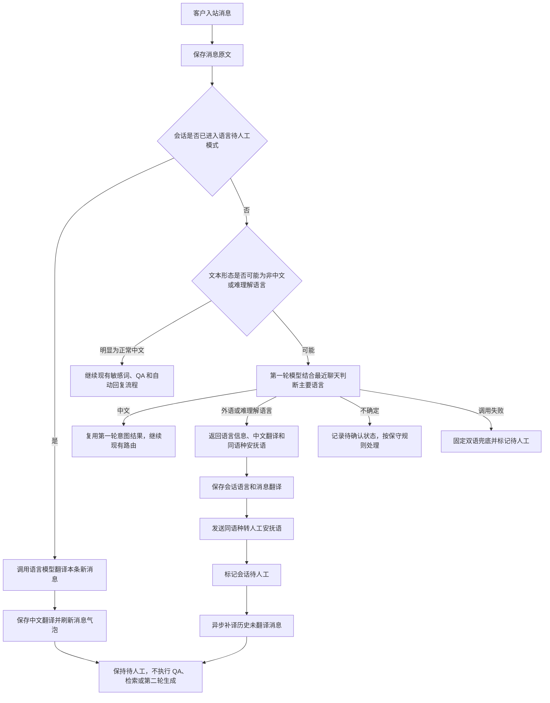

# 外语消息同语种人工回复方案

更新时间：2026-08-06

## 1. 背景与目标

当前自动回复流程主要面向中文客服场景。当客户持续使用英文、日文或普通中文客服难以理解的少数民族语言交流时，机器人不应继续自动回答产品、订单或售后问题，而应把会话交给人工处理，并为人工客服提供中文翻译和同语种回复工具。

本方案实现以下闭环：

1. 在第一轮模型调用中结合最近聊天上下文识别客户主要交流语言。
2. 对确认属于非中文或普通中文客服难以理解的语言会话，将客户消息翻译成中文。
3. 给客户发送一条同语种的转人工安抚回复，随后将会话标记为待人工处理。
4. 跳过 QA 匹配结果发送、产品文档检索和第二轮模型回复生成，避免机器人继续回答业务事实。
5. 消息中心同时展示消息原文和对应中文翻译，并在标题栏展示客户语言标识。
6. 人工客服可以点击“AI 翻译”，把中文草稿翻译成客户正在使用的语言，确认后再手动发送。

本方案中的“客户语言”仅表示当前会话的主要交流语言，不用于推断客户国籍、所在地或身份。界面应显示“客户语言：日语”，不应显示“日本客户”或“国外客户”。

## 2. 设计原则

### 2.1 每条客户消息必须得到回复

项目的平台规则要求每条客户入站消息都产生回复。首次识别为外语或语言异常时，第一轮模型需要同时生成一条客户可理解的转人工安抚语，系统直接发送该文本，不再调用第二轮模型。

安抚语只能表达以下内容：

- 已收到客户消息。
- 正在安排人工客服处理。
- 请客户稍候。

不得在安抚语中回答商品、价格、折扣、库存、物流、退款、赔偿等业务事实，也不得承诺具体处理时间或处理结果。

### 2.2 模型负责语言理解和翻译

程序不内置词典或机器翻译引擎。程序只负责：

- 对消息做低成本的文本形态初筛。
- 组织上下文并调用大模型。
- 校验模型返回的结构化数据。
- 保存语言和翻译结果。
- 执行待人工标记及消息发送。

语言识别、中文翻译和中文草稿到客户语言的翻译均由大模型完成。

### 2.3 原文不可覆盖

平台采集到的原始消息是审计依据，必须原样保留。中文翻译作为派生数据单独保存和展示，不得覆盖 `messages.content`，也不应写入平台原始载荷 `raw_payload`。

### 2.4 自动翻译不等于自动业务回复

外语会话进入待人工状态后，大模型只能继续执行语言识别、入站翻译和人工草稿翻译，不再自动生成业务答复，不检索产品知识库，也不自动解除待人工状态。

### 2.5 人工发送前必须确认

“AI 翻译”只修改输入框草稿，不能自动发送。人工客服必须看到中文原稿和翻译结果，并主动点击发送按钮。

## 3. 术语与状态

### 3.1 语言状态

建议使用以下语言状态：

| 状态 | 含义 | 后续动作 |
| --- | --- | --- |
| `chinese` | 主要使用正常中文交流 | 继续现有自动回复流程 |
| `foreign` | 主要使用明确的非中文语言 | 翻译、安抚、标记待人工 |
| `hard_to_understand` | 使用普通中文客服难以理解的地方性或少数民族语言 | 翻译、安抚、标记待人工 |
| `mixed` | 多种语言混用，当前主要语言可以确认 | 按主要语言处理 |
| `uncertain` | 文本太短或无法可靠识别 | 暂不永久标记，结合后续消息再次判断 |
| `failed` | 模型调用或结构化结果校验失败 | 使用异常兜底并标记待人工 |

`hard_to_understand` 是业务处理状态，不是对语言或客户的价值判断。界面仍应尽量显示模型识别出的标准语言名称。

### 3.2 待人工原因

建议增加独立原因，避免与敏感词、常规兜底混淆：

| 原因 | 含义 |
| --- | --- |
| `foreign_language` | 已确认主要交流语言不是中文 |
| `hard_to_understand_language` | 已确认普通中文客服难以理解 |
| `language_detection_failed` | 无法可靠完成识别或翻译 |

会话进入上述状态后，普通自动回复停止，但“入站翻译模式”继续生效。

## 4. 总体处理流程



## 5. 流程优先级调整

当前实现中，敏感词拦截发生在 AI 调用前，QA 命中也会在第一轮模型之前直接返回；会话已标记待人工时，后续消息同样会跳过正常模型流程。

为了满足外语识别和翻译需求，不能只修改第一轮模型提示词，还需要引入条件式语言入口。推荐优先级如下：

1. 保存客户入站消息原文并完成幂等检查。
2. 如果会话已经是语言类待人工状态，进入增量翻译模式。
3. 否则执行程序级语言初筛。
4. 明显为正常中文时，继续现有敏感词、QA、意图和检索流程。
5. 可能是非中文或难理解语言时，先进行第一轮语言识别。
6. 确认语言异常后，外语待人工流程优先于 QA、产品检索和普通敏感词固定回复。
7. 语言识别为中文时，继续现有业务路由，避免重复调用第一轮模型。

该方案保留了中文 QA 命中的零模型调用优势：程序初筛认为是明显中文时，无需为了语言检测额外调用模型。

## 6. 程序级语言初筛

程序初筛只决定“是否需要让模型判断语言”，不直接认定具体语言，也不负责翻译。

### 6.1 可直接按正常中文处理

- 中文字符占主要部分。
- 外语内容仅为品牌、型号、SKU、邮箱、网址或技术术语。
- 例如“iPhone 15 Pro 有货吗”“这个 SKU-A12 什么时候发货”。

### 6.2 应进入模型语言判断

- 消息主要由非中文字符组成，并形成完整句子。
- 使用日文假名、韩文、阿拉伯字母、西里尔字母等明显非中文文字。
- 使用普通中文客服难以直接理解的文字体系。
- 多种语言混用且中文不是明显主体。
- 历史消息已连续出现无法理解的非中文文本。

### 6.3 不应因单条短消息直接永久转人工

以下内容信息不足，应返回 `uncertain` 并结合上下文：

- `OK`
- `Hi`
- `Yes`
- 单个表情或标点
- 单个商品型号
- 无法区分语言的极短词

如果此前会话已经可靠识别出客户语言，则短消息沿用会话语言，不必重新判断。

## 7. 第一轮模型设计

### 7.1 输入

第一轮模型至少接收：

- 最新客户消息。
- 最近若干条按时间正序排列的客户与客服消息。
- 每条消息的唯一 ID 和发送方角色。
- 已有会话语言状态，如存在。
- 原有意图识别所需的机器人风格、平台和店铺信息。

判断主要语言时应重点关注最近连续的、有实际语义的客户消息，客服历史回复只能作为辅助上下文，不能用来决定客户语言。

### 7.2 输出协议

建议在现有第一轮结构化结果中增加：

```json
{
  "language_status": "foreign",
  "language_code": "ja",
  "language_name_zh": "日语",
  "language_confidence": 0.98,
  "language_reason": "最近三条客户消息主要使用日语完整句子",
  "should_mark_human": true,
  "translated_messages": [
    {
      "message_id": "message-id",
      "translated_text_zh": "请问这个商品什么时候发货？",
      "translation_confidence": 0.96
    }
  ],
  "customer_ack_text": "メッセージを受け取りました。担当スタッフが対応しますので、少々お待ちください。",
  "intent": "human_handoff",
  "reply_route": "human_handoff",
  "need_doc_search": false,
  "confidence": 0.98,
  "reason": "客户主要使用日语，交由人工处理"
}
```

约束如下：

- `language_code` 使用稳定的 BCP 47 或 ISO 语言代码，例如 `en`、`ja`、`ko`。
- `language_name_zh` 使用面向客服展示的中文名称。
- `translated_messages` 只返回请求中提供且尚未翻译的消息 ID，禁止编造 ID。
- `customer_ack_text` 必须使用客户主要语言。
- `customer_ack_text` 只能是转人工安抚语，不得包含业务答案。
- 语言异常时必须设置 `need_doc_search=false`，并禁止第二轮生成。
- 语言不确定时不得编造确定的语言名称。

### 7.3 中文分支复用

如果进入模型判断后确认客户主要使用中文，本次模型输出还应包含现有意图路由字段。程序应直接复用该结果继续后续流程，不能再调用一次第一轮意图模型。

## 8. 首次识别与历史消息补译

“统一翻译成中文”不应阻塞首次待人工标记和安抚回复。推荐分两阶段处理：

### 8.1 同步阶段

第一轮模型立即完成：

- 最新客户消息翻译。
- 最近上下文中尚未翻译的少量外语消息翻译。
- 语言识别。
- 同语种安抚语生成。

成功后立即保存结果、发送安抚语并标记待人工。

### 8.2 异步补译阶段

对当前会话历史中其余尚未翻译的文本消息创建补译任务：

- 优先翻译客户消息。
- 对已经使用外语发送的客服消息也补充中文对照。
- 图片、商品卡片、订单卡片等非纯文本内容首期不做 OCR 翻译。
- 每次分批处理，避免把整段超长历史一次提交给模型。
- 以 `message_id + target_language + translation_version` 保证幂等。
- 翻译结果通过实时事件逐步刷新消息中心。

历史补译失败不影响会话已经进入待人工状态，可在消息气泡上单条重试。

## 9. 待人工后的增量翻译

语言类待人工会话收到后续客户消息时，不应走当前通用的“待人工后完全跳过模型”逻辑，而应进入专用翻译模式：

1. 保存新消息原文。
2. 使用会话已确认的目标语言作为先验信息。
3. 调用模型翻译本条新消息为中文。
4. 保存翻译并刷新消息气泡。
5. 保持待人工状态。
6. 不执行 QA、知识库检索或第二轮业务回复生成。

是否每条后续消息都再次发送安抚语需要限频。建议：

- 首次识别时必须发送一次同语种安抚语。
- 人工尚未回复且客户继续发送消息时，不要逐条重复相同安抚语。
- 超过配置时间且人工仍未响应时，可复用专门的同语种超时安抚策略。
- 人工已经介入后，不再自动发送语言安抚语，只继续翻译客户新消息。

这样既满足首次入站必须回复，又避免客户连续发三条消息时收到三条相同提示。

## 10. 会话状态与语言切换

### 10.1 会话语言字段

建议会话保存：

- `language_status`
- `language_code`
- `language_name_zh`
- `language_confidence`
- `language_detected_at`
- `language_source_message_id`
- `translation_mode_enabled`

### 10.2 客户中途切换语言

- 单个 `OK`、品牌名或短词不触发语言切换。
- 最近连续多条有实际内容的消息改用另一种语言时，模型可以提出语言切换。
- 高置信度切换后更新会话语言标识，后续草稿翻译使用新语言。
- 已有历史翻译不需要重做。
- 语言从外语切换为中文后，不应自动解除待人工；由人工确认后清除标记，避免机器人突然重新接管。

## 11. 数据设计

### 11.1 独立消息翻译表

推荐新增独立的消息翻译记录，而不是直接扩展 `messages.raw_payload`：

| 字段 | 说明 |
| --- | --- |
| `id` | 翻译记录 ID |
| `user_id` | 租户/用户 ID |
| `conversation_id` | 会话 ID |
| `message_id` | 原消息 ID |
| `source_language_code` | 原文语言代码 |
| `source_language_name_zh` | 原文语言中文名称 |
| `target_language_code` | 首期固定为 `zh-CN` |
| `translated_text` | 中文翻译 |
| `confidence` | 翻译置信度 |
| `status` | `pending/succeeded/failed` |
| `provider` | 模型提供方 |
| `model` | 模型名称 |
| `translation_version` | 提示词/翻译版本 |
| `error_message` | 失败原因 |
| `created_at/updated_at` | 审计时间 |

建议对 `message_id + target_language_code + translation_version` 建立唯一约束。

### 11.2 人工草稿翻译

人工草稿尚未发送时不属于正式消息，不需要写入 `messages`。建议单独记录翻译调用审计：

- 会话 ID。
- 源语言和目标语言。
- 中文草稿摘要或加密内容。
- 译文摘要或加密内容。
- 模型、耗时、Token 和调用结果。
- 操作客服和调用时间。

是否长期保存完整草稿需结合隐私和审计要求决定；最低限度应保存调用元数据和内容哈希。

## 12. API 设计

### 12.1 会话与消息读取

现有会话响应增加语言信息；现有消息响应增加可选翻译对象：

```json
{
  "id": "message-id",
  "content": "この商品はいつ発送されますか？",
  "translation": {
    "target_language_code": "zh-CN",
    "translated_text": "这个商品什么时候发货？",
    "confidence": 0.96,
    "status": "succeeded"
  }
}
```

### 12.2 翻译中文草稿

建议新增：

```text
POST /api/v1/conversations/{conversation_id}/translate-draft
```

请求示例：

```json
{
  "text": "您好，这款商品预计明天发出，请您耐心等待。",
  "draft_revision": "local-revision-id"
}
```

响应示例：

```json
{
  "source_language_code": "zh-CN",
  "target_language_code": "ja",
  "target_language_name_zh": "日语",
  "translated_text": "こんにちは。この商品は明日発送予定です。しばらくお待ちください。",
  "draft_revision": "local-revision-id",
  "provider": "deepseek",
  "model": "deepseek-chat"
}
```

服务端从会话读取目标语言，不接受桌面端任意指定目标语言，避免界面状态与会话语言不一致。`draft_revision` 用于防止翻译过程中客服已经修改草稿，旧结果覆盖新内容。

### 12.3 单条翻译重试

建议新增：

```text
POST /api/v1/messages/{message_id}/retry-translation
```

仅允许重试属于当前用户的消息，且应复用幂等约束。

## 13. 消息中心交互

### 13.1 会话标题栏

当前标题栏展示客户名和平台标识。建议在其旁边增加语言标签：

- `客户语言：日语`
- `客户语言：英语`
- `疑似语言：维吾尔语`
- `语言识别不确定`

语言类待人工会话同时保留“待人工处理”状态，不用语言标签替代待人工标识。

### 13.2 消息气泡

外语文本消息采用上下结构：

```text
この商品はいつ発送されますか？

AI 中文翻译
这个商品什么时候发货？
```

交互要求：

- 原文始终显示在上方。
- 中文翻译使用分隔线、浅色背景或次级字号区分。
- 显示“AI 翻译，仅供参考”。
- 低置信度使用黄色提示。
- 翻译中显示加载状态。
- 翻译失败显示失败原因和“重试”入口。
- 正常中文消息不显示翻译区域。
- 客服经 AI 翻译发送的消息同时保留中文原稿，方便内部复核。

### 13.3 “AI 翻译”按钮

在输入框表情按钮旁增加“AI 翻译”按钮，推荐流程：

1. 客服输入中文草稿。
2. 点击“AI 翻译”。
3. 系统使用会话目标语言调用大模型。
4. 翻译结果替换输入框内容。
5. 界面保留中文原稿，并提供“查看原稿”和“撤销翻译”。
6. 客服检查译文后手动发送。

按钮状态：

- 草稿为空：禁用。
- 客户语言尚未确认：禁用并给出提示。
- 翻译中：显示加载状态，禁止重复点击。
- 翻译失败：保留中文草稿，不清空输入框。
- 翻译完成：显示“已翻译为日语”等状态。
- 翻译完成后客服再次编辑：标记为“译文已修改”。
- 切换会话：每个会话独立保存草稿和翻译状态，避免串话。

翻译操作绝不能触发发送。按 Enter 或点击发送时，实际发送输入框当前显示的译文。

## 14. 草稿翻译提示词约束

草稿翻译模型必须遵守：

- 忠实翻译，不增加、删除或改写业务事实。
- 不自行增加折扣、退款、赔偿、赠品、返现或发货承诺。
- 金额、币种、日期、时间、订单号、SKU、型号、链接和邮箱保持准确。
- 保留客服原文的礼貌程度和语气，但语义准确优先。
- 产品名和品牌名按上下文决定是否保留原文。
- 只输出目标语言译文，不输出解释、标题或 Markdown。
- 遇到含义不清、字段缺失或可能产生错误承诺的草稿时返回结构化风险提示，不生成猜测性译文。

译文发送前仍需经过现有出站违禁词和替换规则。模型翻译不能绕过出站安全策略。

## 15. 模型调用与监控

建议区分以下调用阶段：

| 阶段 | 用途 | 是否属于自动回复生成 |
| --- | --- | --- |
| `language_detection` | 识别会话语言并翻译最近消息 | 否，属于入站理解 |
| `inbound_translation` | 翻译待人工后的客户新消息 | 否 |
| `history_translation` | 异步补译历史消息 | 否 |
| `draft_translation` | 翻译人工中文草稿 | 否，属于人工辅助 |

监控面板应分别统计成功率、平均耗时、Token、失败原因和重试次数，避免全部混入现有“意图识别”或“回复生成”统计。

## 16. 异常与降级

### 16.1 首次语言识别失败

- 保存原始消息。
- 将会话标记为 `language_detection_failed` 待人工。
- 不进入产品检索或第二轮模型生成。
- 发送固定的中英双语安抚语，满足客户入站必须回复规则。
- 标题显示“语言识别失败”。
- 支持人工重新识别。

建议固定兜底语保持简单，不包含业务承诺，例如：

```text
已收到您的消息，正在安排人工客服处理，请稍候。
We have received your message. A support agent will assist you shortly.
```

### 16.2 单条翻译失败

- 原文正常展示。
- 中文翻译区域显示失败状态。
- 不覆盖此前成功翻译。
- 支持单条重试。
- 会话继续保持待人工。

### 16.3 草稿翻译失败

- 保留中文草稿。
- 不更新输入框为不完整译文。
- 不发送任何消息。
- 显示可理解的失败原因并允许重试。

### 16.4 模型输出非法

- 严格校验语言代码、消息 ID、置信度和译文非空。
- 模型返回请求范围外的消息 ID 时丢弃对应项并记录异常。
- `customer_ack_text` 为空或与目标语言明显不符时使用固定双语兜底。

## 17. 安全与权限

- 所有翻译接口必须校验当前用户对会话和消息的访问权限。
- 模型密钥只保存在服务端，桌面端不得直接请求模型提供方。
- 原文和译文都可能包含个人信息，应沿用消息数据的权限和保留策略。
- 日志中避免直接输出完整客户消息和完整草稿，优先记录消息 ID、长度、哈希和调用结果。
- 翻译内容不得用于推断或展示客户民族、国籍、宗教等敏感身份。

## 18. 与现有能力的关系

### 18.1 QA 与产品知识库

确认语言异常后，本次消息不再执行 QA 答案发送、产品文档检索或第二轮模型回复。人工客服可阅读中文翻译后自行查询知识库并组织中文草稿，再使用“AI 翻译”发送。

### 18.2 敏感词

对可能是外语的消息，应先完成语言识别，避免只按中文敏感词漏判或发送固定中文安抚语。首期不要求把外语全文翻译后重新执行中文敏感词匹配；如果后续需要风险识别，应作为独立策略设计，避免语言翻译与敏感词转人工重复触发。

### 18.3 待人工状态

外语会话复用现有 `human_required` 状态，但使用独立原因。清除待人工标记时建议同时询问是否关闭翻译模式：

- 仅清除待人工：人工状态解除，但继续显示翻译。
- 清除待人工并关闭翻译模式：恢复普通自动回复，适合已确认客户改用中文的情况。

默认推荐只清除待人工而保留翻译模式，避免后续外语消息无法理解。

### 18.4 超时安抚

普通中文固定超时话术不适用于外语会话。语言待人工模式应使用同语种超时安抚文本，或者在首次语言识别时一并生成可复用的安抚模板。

## 19. 分阶段实施建议

### 第一阶段：识别与人工接管

- 增加语言初筛和第一轮语言结构化结果。
- 保存会话语言状态。
- 首次识别后发送同语种安抚语。
- 标记语言类待人工并跳过第二轮模型。
- 消息中心标题展示语言标签。

### 第二阶段：入站消息中文翻译

- 建立消息翻译表。
- 在消息气泡展示原文与中文。
- 实现待人工后的增量翻译。
- 实现历史消息分批补译和单条重试。

### 第三阶段：人工草稿 AI 翻译

- 增加草稿翻译接口。
- 在表情按钮旁增加“AI 翻译”。
- 支持查看中文原稿、撤销翻译和并发草稿保护。
- 增加翻译调用审计及监控统计。

### 第四阶段：完善异常与语言切换

- 支持语言切换确认。
- 增加同语种超时安抚。
- 完善低置信度提示、人工纠正语言和重新翻译。

## 20. 验收标准

### 20.1 语言识别

- 连续英文、日文等完整消息可以识别出正确的主要语言。
- 中文夹杂品牌、型号或英文缩写不会被错误标记为外语会话。
- 单独 `OK`、`Hi` 等短消息不会直接永久标记客户语言。
- 界面只展示语言，不推断客户国籍。

### 20.2 自动流程

- 首次确认语言异常后发送同语种安抚语。
- 会话被标记为对应原因的待人工状态。
- 不发生 QA 答案直发、产品检索或第二轮模型调用。
- 待人工后的客户新消息仍可翻译，但不会恢复自动业务回复。
- 连续多条消息不会重复发送相同安抚语。

### 20.3 消息展示

- 原始消息内容保持不变。
- 外语消息气泡同时显示原文和中文翻译。
- 翻译中、失败和低置信度状态可识别。
- 历史消息补译后可以实时刷新，不需要重新进入会话。

### 20.4 草稿翻译

- 只有目标语言已确认且草稿非空时按钮可用。
- 点击翻译不会自动发送。
- 翻译失败不会丢失中文草稿。
- 翻译过程中修改草稿时，旧结果不会覆盖新草稿。
- 发送内容是客服最终确认的译文，消息内部保留中文原稿关联。

### 20.5 异常与审计

- 模型不可用时使用固定双语兜底并标记待人工。
- 翻译调用可以按阶段统计模型、耗时、Token 和错误。
- 重复处理同一消息不会创建重复翻译或重复发送安抚语。

## 21. 当前代码参考位置

- 第一轮意图和 QA 短路逻辑：`services/ai-reply/app/pipeline.py`
- 自动回复编排、敏感词和待人工处理：`services/business-api/app/services/automation_service.py`
- 会话与消息实体：`services/business-api/app/models/entities.py`
- 会话和消息接口：`services/business-api/app/api/routes/conversations.py`、`services/business-api/app/api/routes/messages.py`
- 消息中心消息映射与发送：`apps/desktop/src/message-center/state/useMessageCenterController.ts`
- 聊天气泡、标题栏和输入框：`apps/desktop/src/message-center/components/ChatWindow.tsx`
- 前端共享类型与接口客户端：`apps/desktop/src/shared/types.ts`、`apps/desktop/src/shared/api/client.ts`

本方案只定义外语消息同语种人工回复能力，不包含自动翻译后继续由机器人回答产品问题，也不包含对客户国籍或民族身份的判断。
