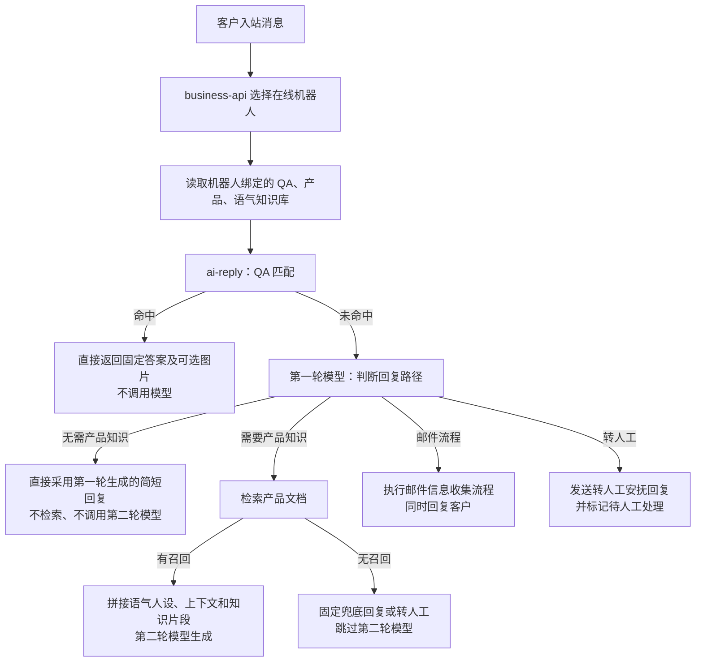

您的判断是对的。当前流程把“普通咨询”强制等同于“必须检索产品文档”，把“好、嗯、行、你好、谢谢”等无需产品知识的消息处理错了。

更准确的改法不是单纯增加一个“无需检索文档”开关，而是把第一轮从“纯意图识别”升级成“路由判断 + 简单回复生成”。

## “无需回复”当前是什么意思

当前 `no_reply_needed` 原本用于识别：

- 好的
- 知道了
- 谢谢
- 不用了
- 不需要了

设计意图是：把这类结束语或确认语视为“不需要机器人继续打扰”，直接返回空内容，避免客服机器人反复回复“好的”“不客气”。

当前本地规则也会在消息较短且命中相关词时，将其归为 `no_reply_needed`，见[本地意图规则 (line 294)](D:/project-electron/ai-customer-service/services/ai-reply/app/pipeline.py:294)。进入该意图后，程序直接返回 `decision=no_reply`，不发送任何内容，见[无需回复处理 (line 584)](D:/project-electron/ai-customer-service/services/ai-reply/app/pipeline.py:584)。

这个设计适用于普通聊天机器人，但不符合您描述的平台规则：

> 只要收到客户入站消息，就必须产生一条回复。

因此，在当前项目的客户入站链路中，`no_reply_needed` 应当取消。即使客户只发“好”“嗯”“行”，也应该回复一句简短确认。

## 建议的新流程



这样模型调用次数为：

| 场景                   | 模型调用    | 处理方式                       |
| ---------------------- | ----------- | ------------------------------ |
| QA 命中                | 0 次        | 固定答案                       |
| 你好、好、嗯、行、谢谢 | 1 次        | 第一轮直接生成简短回复         |
| 产品问题且检索命中     | 2 次        | 第一轮路由，第二轮结合知识生成 |
| 产品问题但检索无结果   | 1 次        | 固定兜底或转人工               |
| 邮件相关               | 1 次        | 第一轮识别流程并生成询问话术   |
| 转人工                 | 1 次或 0 次 | 固定安抚话术并标记转人工       |

## 第一轮意图需要调整

目前 `classify_intent()` 对 `normal_question` 会强制设置：

```
need_doc_search = true
```

即使模型认为不需要检索，也会被程序改回需要检索，见[当前强制检索逻辑 (line 371)](D:/project-electron/ai-customer-service/services/ai-reply/app/pipeline.py:371)。

因此现有 `need_doc_search` 字段实际上不能表达您提出的分支。

建议将第一轮结果改成更明确的回复路径，例如：

```
{
  "intent": "direct_reply",
  "reply_route": "direct",
  "need_doc_search": false,
  "direct_reply_text": "好的亲亲，有需要随时叫我哦～",
  "confidence": 0.96,
  "reason": "客户发送简短确认，不需要查询产品事实"
}
```

需要检索时：

```
{
  "intent": "product_question",
  "reply_route": "retrieve_product",
  "need_doc_search": true,
  "direct_reply_text": "",
  "confidence": 0.94,
  "reason": "客户询问键帽与键盘的适配规格"
}
```

重点是：

- `direct_reply`：第一轮既负责判断，也生成最终回复。
- `retrieve_product`：第一轮只路由，不生成事实性答案。
- `direct_reply_text` 只有在确定不需要产品知识时才能使用。
- 程序根据 `reply_route` 生成 Action Plan，不再把所有普通消息都强制送去检索。

## “无需检索”和“检索未命中”必须区分

这两个状态不能混为一谈：

| 状态                    | 含义                 | 正确处理                       |
| ----------------------- | -------------------- | ------------------------------ |
| `direct_reply`          | 本来就不需要产品知识 | 使用第一轮回复                 |
| `retrieval_hit`         | 需要产品知识且找到了 | 第二轮结合知识生成             |
| `retrieval_empty`       | 需要产品知识但没找到 | 固定兜底或转人工               |
| `retrieval_unavailable` | 知识库服务故障       | 故障兜底或转人工               |
| `no_product_base`       | 机器人没有绑定产品库 | 配置缺失兜底，不应假装无需检索 |

否则模型可能把“这个键帽支持我的键盘吗”错误判断成“无需检索”，然后凭模型自身知识回答，造成事实编造。

建议采用保守原则：

> 只有问候、致谢、简单确认、情绪回应和不涉及业务事实的寒暄，才允许进入首轮直接回复；判断不确定时默认走产品检索。

## “无需回复”应如何替换

建议删除客户入站链路中的 `no_reply_needed`，替换为 `direct_reply` 或更明确的 `social_reply`。

示例：

| 客户消息           | 新路径       | 回复示例                                 |
| ------------------ | ------------ | ---------------------------------------- |
| 你好               | 首轮直接回复 | 您好亲亲，请问想咨询键盘还是键帽呢？     |
| 好                 | 首轮直接回复 | 好的亲亲～                               |
| 嗯                 | 首轮直接回复 | 好的，有需要随时告诉我哦～               |
| 行                 | 首轮直接回复 | 好的亲亲，那就按这个来～                 |
| 谢谢               | 首轮直接回复 | 不客气亲亲，很高兴帮到您～               |
| 这个能装我的键盘吗 | 产品检索     | 检索适配条件后生成                       |
| 进水还能保修吗     | 产品检索     | 检索质保规则后生成                       |
| 转人工             | 转人工并回复 | 好的亲亲，正在为您转接人工客服，请稍等～ |

“好、嗯、行”还应结合最近上下文生成，避免回复生硬。例如客户上一句是在确认退货方案，“行”可以回复“好的亲亲，那就按刚才的退货方式处理”，而不是固定回复“好的”。

## 需要同步调整的概念

如果第一轮开始生成最终回复，它就不再是纯粹的“第一轮模型识别意图”，更准确的名称是：

> 第一轮模型：意图路由与轻量回复

对应规则：

- 轻量场景：第一轮直接产出回复。
- 知识场景：第一轮只产出路由，不允许回答产品事实。
- 邮件场景：第一轮产出工作流信息和客户提示语。
- 转人工场景：产出安抚语，程序执行转人工。
- 所有客户入站分支最终都必须产生文本回复。

整体上，这个调整合理，而且能同时解决两个问题：

1. 避免“你好、好、嗯、行”误走产品检索后触发固定兜底。
2. 避免 `no_reply_needed` 违反平台“每条客户消息必须回复”的规则。