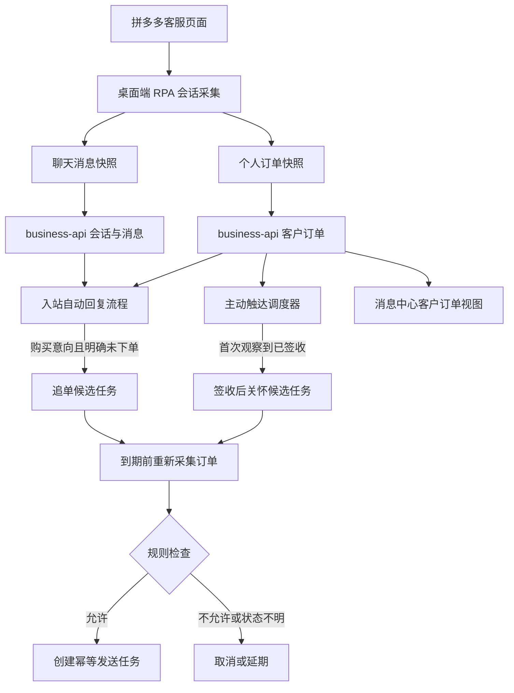
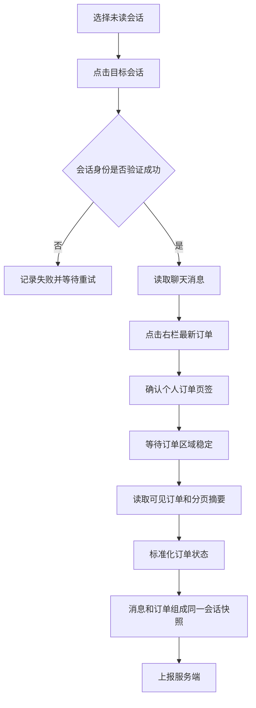
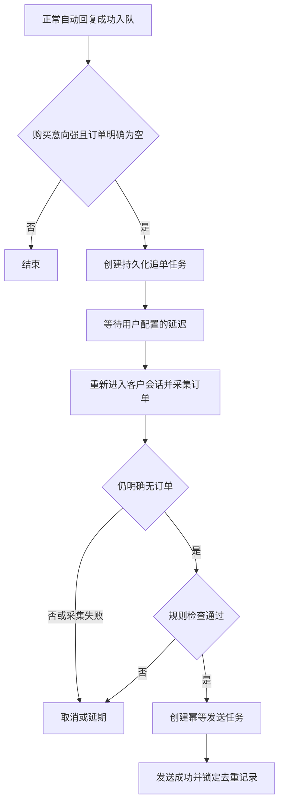
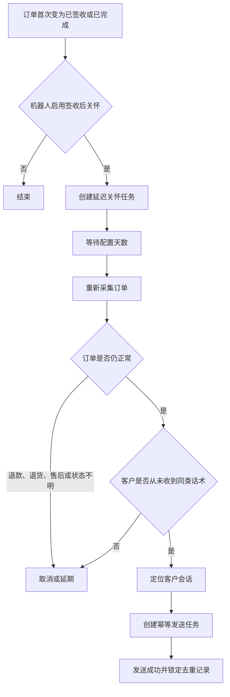

# 客户订单采集与主动话术策略方案

更新时间：2026-08-05

## 实施状态（2026-08-05）

本方案核心链路已完成实现：

- 拼多多未读会话与手动刷新均会采集“最新订单 / 个人订单”，并明确区分 `success`、`empty`、`unavailable`。
- 订单快照通过独立 RPA 事件上报，服务端持久化订单、采集摘要与主动触达任务。
- 消息中心右栏可切换“客户订单 / 运行状态”，展示订单、采集时间、主动话术状态并支持手动刷新。
- 机器人“知识库与策略”已支持追单和签收后关怀的开关、话术及延迟配置。
- AI 只建议购买意向和追单候选；订单事实、售后排除、发送前复查、延期和取消均由程序规则决定。
- 追单与签收后关怀均使用持久化调度、稳定幂等键，并按“店铺 + 客户 + 策略”严格去重。
- 开放订单会定期复查，卡死复查任务可自动恢复，发送回执会更新最终触达状态。

当前已知边界：拼多多页面结构可能随平台升级变化，正式上线前仍需在真实客服页面校准订单卡选择器、空状态文案和不同订单状态样本。

## 1. 背景与目标

拼多多客服接待页面右侧“最新订单”中可以查看当前客户的“个人订单”，包括订单状态、订单编号、下单时间、商品、数量和实付金额等信息。

当前项目处理未读会话时已经会切换到目标客户并读取聊天消息。本方案在同一次会话采集中追加客户订单采集，并将订单信息用于：

1. 在消息中心展示当前客户的订单信息，帮助人工客服判断客户所处交易阶段。
2. 将结构化订单上下文传给 AI，辅助判断客户是否存在购买意向。
3. 对明确有购买意向、但仍未下单的客户创建延迟追单任务。
4. 对订单首次变为已签收、且不处于退款或售后中的客户创建签收后关怀任务。
5. 确保同一店铺下的同一客户，每类主动话术最多成功发送一次。

本方案中的“主动话术”包括：

- 未下单追单话术。
- 签收后关怀话术，即用户提出的“好评返现话术”。产品界面建议使用更中性的“签收后关怀/评价邀请话术”名称，具体活动内容由商家自行配置。

## 2. 核心设计原则

### 2.1 订单事实由程序判断

AI 可以判断购买意向、话术适用性和回复语言，但不能决定订单是否存在、是否支付、是否签收。

以下条件必须使用结构化订单数据和程序规则判断：

- 是否明确没有订单。
- 是否已下单或已支付。
- 是否已签收。
- 是否退款、退货或售后中。
- 是否已经发送过同类话术。
- 是否达到发送时间和限频要求。

### 2.2 AI 只创建候选，不直接触发主动发送

入站回复模型可以返回“建议创建追单候选”，但程序需要再次检查订单状态、人工介入状态、防重复记录和延迟时间，满足全部条件后才能创建发送任务。

签收后关怀不依赖客户再次发送消息，应由订单状态变化触发，而不是由入站回复模型触发。

### 2.3 采集失败不能等同于没有订单

订单采集必须区分：

| 采集结果 | 含义 | 是否允许判断未下单 |
| --- | --- | --- |
| `success` | 成功读取到一条或多条订单 | 否 |
| `empty` | 面板明确显示当前客户没有订单 | 是 |
| `unavailable` | 面板未加载、切换失败或页面结构无法识别 | 否 |

订单采集失败不应阻塞正常客户回复，只跳过本次主动话术判断并记录诊断信息。

### 2.4 主动触达必须延迟并在发送前复查

正常客服回复和主动话术不应连续发送。追单或签收后关怀都先创建持久化延迟任务，到期后重新读取订单状态，再决定发送、取消或稍后重试。

### 2.5 同一客户每类话术最多成功发送一次

首期严格按以下范围防重复：

```text
平台店铺账号 + 客户稳定标识 + 话术类型
```

即同一客户最多收到一次追单话术和一次签收后关怀话术。话术编辑、服务重启、重复采集和订单状态反复变化都不能绕过去重限制。

如果未来需要支持周期性营销活动，应另行设计客户授权、活动周期和频控规则，不在本方案中通过“话术版本”自动重置发送资格。

## 3. 总体架构



模块职责：

| 模块 | 职责 |
| --- | --- |
| 拼多多页面适配器 | 切换会话、切换订单面板、读取并标准化页面数据 |
| 桌面端工作区管理器 | 对同一店铺的会话采集、订单刷新和消息发送进行串行调度 |
| business-api | 持久化订单、状态变化、主动触达任务和发送记录 |
| ai-reply | 判断购买意向和追单适用性，不直接判断订单事实 |
| 消息中心 | 展示订单、数据新鲜度、主动话术发送状态和手动刷新入口 |
| 机器人配置 | 保存追单和签收后关怀策略 |

## 4. 拼多多订单信息采集

### 4.1 采集时机

首期在以下场景采集订单：

1. 自动处理每个未读会话时，在确认已经切换到正确客户后采集。
2. 用户在消息中心点击“刷新订单”时采集。
3. 主动话术任务到期、准备发送前强制重新采集。
4. 对存在待支付、待发货或待签收订单的客户，由持久化调度任务定期复查。

普通页面扫描不应对所有客户反复打开订单面板，避免产生大量页面操作并影响人工使用。

### 4.2 单次未读会话采集顺序



订单采集必须位于当前店铺的串行任务中，不能和切换会话、人工发送、图片发送同时操作同一个客服页面。

### 4.3 页面操作与验证

截图中的主要层级为：

```text
最新订单
  -> 个人订单
    -> 全部 / 未完成 / 待发货 / 待签收 / 已签收 / 退款中
      -> 订单卡片
```

采集时建议优先进入“个人订单”的“全部”，从订单卡片自身读取状态，不依赖当前筛选页签推断订单状态。

每次切换后都应验证：

- 当前仍是目标客户会话。
- “最新订单”处于选中状态。
- “个人订单”处于选中状态。
- 订单列表已经完成加载，或出现明确的空状态。
- 读取到的订单区域属于当前客户，而不是上一个会话残留内容。

如果页面操作期间检测到用户手动活动，应暂停自动切换，避免与人工客服争抢页面焦点。

### 4.4 采集字段

单条订单至少采集：

```json
{
  "platform_order_id": "260805-...",
  "raw_status": "待支付",
  "status": "pending_payment",
  "ordered_at": "2026-08-05T10:46:00+08:00",
  "products": [
    {
      "title": "商品名称",
      "sku_text": "规格文本",
      "quantity": 1,
      "unit_price": 10.0
    }
  ],
  "order_amount": 10.0,
  "discount_amount": 0.0,
  "paid_amount": 10.0,
  "after_sale_text": "退货包运费 未赠送",
  "observed_at": "2026-08-05T15:30:00+08:00"
}
```

无法可靠解析的金额或时间保留为 `null`，同时保留页面原始文本，不能用 `0` 代替未知值。

### 4.5 状态标准化

统一订单状态：

| 标准状态 | 页面含义示例 | 允许追单 | 允许签收后关怀 |
| --- | --- | --- | --- |
| `pending_payment` | 待支付 | 否 | 否 |
| `paid_pending_shipment` | 已支付、待发货 | 否 | 否 |
| `shipped_pending_receipt` | 已发货、待签收 | 否 | 否 |
| `signed` | 已签收 | 否 | 候选 |
| `completed` | 交易完成 | 否 | 候选 |
| `refunding` | 退款中、退货中、售后中 | 否 | 否 |
| `refunded` | 已退款 | 否 | 否 |
| `cancelled` | 已取消、已关闭 | 视其他订单和业务规则决定 | 否 |
| `unknown` | 无法识别 | 否 | 否 |

“没有订单”是订单快照的 `collection_status=empty`，不是一条虚构的 `no_order` 订单记录。

### 4.6 分页范围

首期自动采集可以只读取第一页和页面给出的总数，但需要满足：

- 追单判断必须确认当前客户不存在有效订单；如果页面提示还有未读取分页，则不能仅凭第一页为空判断未下单。
- 签收后关怀可以跟踪此前已经入库的订单，无需每次遍历全部历史订单。
- 消息中心手动查看时可以按需请求更多历史订单。

## 5. RPA 事件协议

建议新增独立事件 `customer_orders_snapshot`，不要把完整订单数组混入每条消息事件。

```json
{
  "event_id": "本机生成的全局事件 ID",
  "event_type": "customer_orders_snapshot",
  "platform_code": "pinduoduo",
  "platform_account_id": "平台店铺账号 ID",
  "conversation_external_id": "客户会话 ID",
  "dedup_key": "订单快照幂等键",
  "received_at": "采集时间",
  "payload_json": {
    "customer_key": "平台客户稳定标识",
    "customer_name": "客户昵称",
    "collection_status": "success",
    "orders": [],
    "page_summary": {
      "visible_count": 0,
      "total_count": 0,
      "has_more": false
    }
  }
}
```

快照去重摘要应包含订单号、状态、关键金额和更新时间。订单状态变化后必须产生新事件；完全相同的重复快照可以在桌面端或服务端去重。

## 6. 数据模型

### 6.1 客户订单表

建议新增 `customer_orders`：

| 字段 | 说明 |
| --- | --- |
| `id` | 内部订单记录 ID |
| `user_id` | 所属系统用户 |
| `platform_account_id` | 所属拼多多店铺 |
| `conversation_id` | 当前关联会话 |
| `customer_key` | 客户稳定标识 |
| `platform_order_id` | 平台订单号 |
| `status` | 标准订单状态 |
| `raw_status` | 页面原始状态 |
| `products_json` | 商品、规格和数量 |
| `order_amount` | 订单金额 |
| `discount_amount` | 优惠金额 |
| `paid_amount` | 实付金额 |
| `ordered_at` | 下单时间 |
| `paid_at` | 支付时间，能采集时填写 |
| `signed_at` | 首次观察到签收的时间 |
| `after_sale_json` | 售后状态及原始文本 |
| `first_observed_at` | 首次采集时间 |
| `last_observed_at` | 最近采集时间 |
| `raw_payload` | 必要的原始采集数据 |

唯一约束：

```text
platform_account_id + platform_order_id
```

### 6.2 订单采集状态

会话需要保存最新订单采集摘要，用于列表查询和消息中心快速展示：

```json
{
  "collection_status": "success",
  "observed_at": "2026-08-05T15:30:00+08:00",
  "order_count": 1,
  "latest_order_id": "...",
  "latest_order_status": "pending_payment"
}
```

摘要可以位于会话元数据中，完整订单必须保存在独立表中。

### 6.3 主动触达任务表

建议新增 `customer_outreach_runs`：

| 字段 | 说明 |
| --- | --- |
| `id` | 触达记录 ID |
| `user_id` | 所属系统用户 |
| `robot_id` | 使用的机器人 |
| `platform_account_id` | 所属店铺 |
| `conversation_id` | 关联会话 |
| `customer_key` | 客户稳定标识 |
| `strategy_type` | `order_follow_up` 或 `post_receipt_care` |
| `order_id` | 签收后关怀关联订单；追单可为空 |
| `source_message_id` | 追单候选来源消息 |
| `status` | 任务状态 |
| `due_at` | 计划执行时间 |
| `decision_json` | AI 建议和规则判定依据 |
| `message_text` | 最终发送话术快照 |
| `message_id` | 生成的业务消息 ID |
| `send_task_id` | RPA 发送任务 ID |
| `idempotency_key` | 发送幂等键 |
| `cancel_reason` | 取消原因 |
| `completed_at` | 成功完成时间 |

任务状态：

```text
candidate
  -> scheduled
  -> rechecking
  -> queued
  -> completed
  -> cancelled | failed
```

同一客户同类话术的唯一约束：

```text
platform_account_id + customer_key + strategy_type
```

只有确认没有任何记录时才能创建候选。`failed` 记录可以按有限次数重试原任务，但不能创建新的同类任务绕过去重。

## 7. 未下单追单策略

### 7.1 候选条件

以下条件全部成立才创建追单候选：

1. 机器人启用了追单策略，且配置了非空追单话术。
2. 最新客户入站消息完成了正常回复。
3. AI 判断客户存在较强购买意向，置信度达到配置阈值。
4. 本次订单采集结果明确为 `empty`。
5. 客户没有待支付、待发货、待签收、已签收或完成订单。
6. 会话未处于待人工处理状态。
7. 该店铺下该客户从未成功接收或正在等待追单话术。

“待支付”表示已经下单，不能发送“您还未下单”的追单话术。以后如有需要，应设计独立的待支付提醒策略。

### 7.2 AI 输出

订单上下文拼接到第一轮模型 Prompt 后，建议增加：

```json
{
  "purchase_intent": "strong",
  "outreach_suggestion": "create_order_follow_up_candidate",
  "outreach_confidence": 0.91,
  "outreach_reason": "客户询问完规格并表示准备购买"
}
```

允许值：

```text
purchase_intent: none | weak | strong
outreach_suggestion: none | create_order_follow_up_candidate
```

模型只能返回建议，不能返回“订单不存在”，也不能直接调用发送动作。

### 7.3 调度与发送前复查



发送前至少检查：

- 订单仍明确为空。
- 客户没有发送新的待回复消息。
- 会话未转人工、未关闭、未进入投诉或售后流程。
- 当前时间位于允许发送时段。
- 店铺和 RPA 节点在线。
- 去重记录没有进入 `queued` 或 `completed`。

如果订单复查为 `unavailable`，任务可以按退避策略延期，不能发送。

## 8. 签收后关怀策略

### 8.1 触发来源

签收后关怀必须由订单状态变化触发：

```text
shipped_pending_receipt -> signed
paid_pending_shipment -> signed
unknown -> signed
```

系统首次观察到订单为 `signed` 或 `completed` 时记录 `signed_at`。即使缺少之前的状态，只要本次状态可信，也可以创建候选，但仍需防重复。

### 8.2 为什么不能只依赖未读消息

客户签收后可能不再发送消息，此时不会进入入站自动回复流程。因此需要对已记录的未完成订单进行持久化复查：

1. 对待支付订单进行低频复查，直到支付、取消或超过观察期限。
2. 对待发货、待签收订单定期复查。
3. 签收、完成、退款或取消后停止常规复查。

复查任务必须持久化。不能只使用业务进程内的 `sleep`，否则服务重启会丢失任务。

### 8.3 发送流程



建议默认在签收后 1 至 3 天发送，不建议状态刚变为签收就立即发送。

### 8.4 售后排除

出现以下任一情况不得发送：

- 订单退款中、已退款、退货中或售后中。
- 客户最近消息包含投诉、质量问题、少件、破损等风险信息，且尚未处理完成。
- 会话已标记待人工处理。
- 客户明确表示不希望接收活动或评价邀请。
- 无法确认订单仍属于当前客户。

### 8.5 合规边界

系统只发送商家明确配置的话术，不由模型编造返现金额、活动期限或领取条件。

界面建议使用“签收后关怀话术”或“评价邀请话术”。如果商家配置包含返现活动，应由商家确保活动符合平台规则，系统保留配置人、配置时间和实际发送文本以便审计。

## 9. 客户会话重新定位

追单和签收后关怀发生在未来，客户可能已经不在当前可见会话列表中。主动发送前需要增强目标定位：

1. 优先使用平台稳定会话 ID 打开会话。
2. 当前列表找不到时，使用拼多多客服页面的客户搜索功能。
3. 搜索后通过客户稳定标识、昵称和订单号进行二次验证。
4. 验证失败时不发送，并记录 `conversation_not_found` 或 `identity_mismatch`。

仅凭昵称匹配存在同名风险。首期如果拿不到稳定客户 ID，应使用“店铺账号 + 外部会话 ID”为主键，昵称只作为显示和最后兜底，兜底匹配不能自动发送。

## 10. Prompt 中的客户订单上下文

传给模型的是服务端标准化结构，不是页面 DOM 文本：

```json
{
  "collection_status": "success",
  "observed_at": "2026-08-05T15:30:00+08:00",
  "has_orders": true,
  "latest_order": {
    "platform_order_id": "260805-...",
    "status": "pending_payment",
    "ordered_at": "2026-08-05T10:46:00+08:00",
    "products": [
      {
        "title": "商品名称",
        "sku_text": "规格",
        "quantity": 1
      }
    ],
    "paid_amount": 10.0
  },
  "recent_orders": []
}
```

Prompt 应明确：

- 订单上下文是唯一可使用的订单事实来源。
- `empty` 才表示明确没有订单。
- `unavailable` 表示未知，不得推断未下单。
- 已存在待支付订单时不能建议未下单追单。
- 模型只输出购买意向和候选建议，不直接发送主动话术。
- 正常客户问题仍按 QA、产品检索和回复路由处理，订单上下文只作为附加业务上下文。

## 11. 消息中心客户订单视图

### 11.1 右栏切换

消息中心右栏顶部增加视图切换：

```text
[客户订单] [运行状态]
```

默认保留当前运行状态视图。切换到“客户订单”后展示当前选中会话的订单，不影响实际拼多多页面当前页签。

### 11.2 展示内容

客户订单视图建议包括：

- 最新订单状态标签。
- 平台订单号和下单时间。
- 商品名称、规格和数量。
- 订单金额、优惠和实付金额。
- 退款、退货或售后提示。
- 最近采集时间和数据新鲜度。
- 历史订单折叠列表。
- 追单话术状态：未创建、等待中、已取消、已发送。
- 签收后关怀状态：未创建、等待中、已取消、已发送。
- “刷新订单”按钮。

显示状态：

| 状态 | 页面提示 |
| --- | --- |
| 尚未采集 | 暂无客户订单信息，可手动刷新 |
| 正在采集 | 正在从拼多多读取客户订单 |
| 明确无订单 | 当前客户暂无个人订单 |
| 采集失败 | 订单读取失败，不能据此判断客户未下单 |
| 数据过期 | 显示最近结果，同时提示刷新 |

## 12. 机器人配置

在“知识库与策略”中追加“其他话术策略”。

### 12.1 未下单追单

建议配置项：

- 启用追单话术。
- 输入追单话术。
- 自动发送延迟，首期可限制为 30 分钟至 72 小时。
- 允许发送时段。
- AI 购买意向阈值。
- 是否允许模型按客户语言翻译话术。
- 话术预览和测试，但测试不写入正式防重复记录。

### 12.2 签收后关怀

建议配置项：

- 启用签收后关怀话术。
- 输入签收后关怀话术。
- 签收后延迟天数。
- 退款、售后和待人工会话固定排除，首期不提供关闭开关。
- 是否允许模型按客户语言翻译话术。
- 话术预览和测试，但测试不写入正式防重复记录。

### 12.3 话术快照

创建主动触达任务时，应保存当时配置的话术快照。任务等待期间用户修改机器人配置时：

- 已创建任务默认继续使用创建时的话术，保证审计一致性。
- 用户关闭整个策略时，所有尚未发送的同类任务取消。
- 用户可在管理界面选择取消单个等待任务。

## 13. 幂等、并发与恢复

### 13.1 三层幂等

1. 订单快照：使用店铺、客户、订单状态摘要生成 `dedup_key`。
2. 主动触达：数据库唯一约束保证同一客户同类策略只有一条记录。
3. RPA 发送：使用稳定的发送幂等键，例如：

```text
customer-outreach:<outreach_run_id>:text
```

### 13.2 发送状态边界

只有平台发送任务确认成功后，触达记录才进入 `completed`。任务超时但无法确认是否已经发送时，不应立即重发，应先检查聊天记录中是否已有对应消息。

### 13.3 服务重启恢复

business-api 启动后扫描：

- 已到期但仍为 `scheduled` 的任务。
- 长时间停留在 `rechecking` 或 `queued` 的任务。
- 需要继续复查的未完成订单。

调度状态必须保存在数据库中，不能只依赖进程内定时器。

### 13.4 店铺串行执行

同一拼多多店铺的以下动作必须进入同一个串行队列：

- 未读会话采集。
- 手动刷新订单。
- 后台订单复查。
- 自动回复发送。
- 主动话术发送。
- 图片发送。

主动话术和后台订单复查的优先级应低于实时未读消息处理，避免影响客服响应时间。

## 14. 失败处理与可观测性

建议记录以下诊断阶段：

```text
order_panel_open_started
order_panel_open_failed
personal_orders_selected
order_collection_empty
order_collection_succeeded
order_collection_unavailable
order_status_changed
outreach_candidate_created
outreach_recheck_started
outreach_cancelled
outreach_send_queued
outreach_send_completed
outreach_send_failed
```

主动触达取消原因至少包括：

```text
order_created
order_status_unknown
refund_or_after_sale
human_required
new_customer_message
outside_send_window
conversation_not_found
identity_mismatch
strategy_disabled
duplicate_customer_strategy
```

管理端或日志中应能看到：候选来源、订单证据、AI 建议、程序规则结果、最终话术、发送任务和取消原因。

## 15. 安全与隐私

- Prompt 只传递完成回复所需的订单字段，不传递收货地址、手机号等敏感信息。
- 消息中心根据用户权限展示订单金额和订单号。
- 日志中的订单号默认脱敏，页面诊断不记录完整 DOM。
- 原始订单数据设置保留期限，超过业务需要后清理或脱敏。
- 主动话术配置和发送记录需要保留操作人及时间。

## 16. 分阶段实施

### 第一阶段：订单上下文

目标：稳定取得订单信息，但不自动发送主动话术。

- 在未读会话采集中追加“最新订单 -> 个人订单”读取。
- 定义 `customer_orders_snapshot` 事件。
- 建立客户订单表和订单采集摘要。
- 消息中心右栏增加“客户订单/运行状态”切换。
- 提供手动刷新订单。
- 将结构化订单上下文拼接到自动回复请求。

### 第二阶段：未下单追单

目标：在明确未下单时安全地延迟追单。

- 机器人配置增加追单策略。
- AI 输出购买意向和追单候选建议。
- 建立持久化主动触达任务。
- 到期前重新采集订单。
- 完成同客户同策略防重复、发送时段和人工介入检查。

### 第三阶段：签收后关怀

目标：客户不再发消息时仍能观察订单签收并发送一次关怀话术。

- 建立未完成订单持久化复查任务。
- 识别首次签收状态变化。
- 机器人配置增加签收后关怀策略。
- 支持从非当前会话列表中重新定位客户。
- 完成售后排除、延迟发送和严格防重复。

### 第四阶段：运营与审计

- 主动触达任务列表和取消入口。
- 追单转化、签收后话术送达和失败原因统计。
- 话术配置审计和平台合规提示。
- 根据真实页面变化完善订单状态映射和选择器版本管理。

## 17. 验收标准

### 17.1 订单采集

- 处理未读会话时能读取当前客户而不是上一客户的订单。
- 能区分有订单、明确无订单和采集失败。
- 待支付、待发货、待签收、已签收和退款状态映射正确。
- 订单采集失败不阻塞正常自动回复。
- 消息中心能显示订单及最近采集时间。

### 17.2 追单

- 明确无订单且购买意向强时才创建候选。
- 待支付客户不发送未下单追单。
- 延迟期间下单后自动取消追单。
- 订单复查失败时不发送。
- 同一店铺下同一客户最多成功收到一次追单话术。

### 17.3 签收后关怀

- 没有新客户消息时，订单签收仍能触发候选。
- 退款、退货、售后或待人工客户不发送。
- 找不到客户会话或身份校验失败时不误发。
- 同一店铺下同一客户最多成功收到一次签收后关怀话术。

### 17.4 恢复与并发

- 服务重启后等待中的任务能够恢复。
- 重复订单快照不会创建重复触达任务。
- 发送回执超时不会直接导致重复发送。
- 后台订单复查不会打断实时未读消息处理和人工页面操作。

## 18. 暂不纳入首期的能力

- 待支付自动催付。
- 发货或物流节点主动通知。
- 按活动周期重复触达同一客户。
- 自动生成返现金额或活动规则。
- 遍历全部历史客户进行批量营销。
- 仅根据客户昵称自动发送主动话术。

这些能力可以复用订单上下文和主动触达框架，但需要独立的业务规则、平台合规评估和频控设计。
