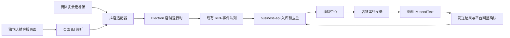

# 抖店平台接入方案

更新日期：2026-09-19。当前状态：工作区、消息收发、AI 自动回复、商品列表及商品详情上下文已接入；客户订单采集/展示和最小 AI 订单上下文已实现。手动转接首版已实现（第 17.11 节）；自动转接、追问及依据不足转人工已实现（第 17.14 节），无人在线只结束本次转接，后续新消息仍可自动回复。未知买家聊天消息核心 JSON 与图片占位触发已实现（第 18.6 节），未接入识图。真实自动转接及本轮消息策略待使用验证，转回恢复仍暂缓。前文保留各阶段设计及验证历史，以后续实施记录为准。

## 1. 目标与首期范围

抖店采用与拼多多一致的网页工作区交互：消息中心左侧增加“抖店”按钮；左键筛选抖店会话；右键菜单选择“打开原平台工作区”，在应用内管理多个店铺页面。新账号登录入口固定为：

<https://fxg.jinritemai.com/login/common>

先把“能登录、能看到客户文本消息、能人工回复文本”做成可验证的闭环，再接入已有 AI 自动回复。商品和订单作为后续增强，不作为首期阻塞条件。

| 阶段 | 内容 | 完成标准 |
| --- | --- | --- |
| M0：网页工作区 | 平台按钮、右键入口、添加/切换店铺、独立登录态、店铺身份与状态 | 两个店铺隔离登录；与拼多多同时使用；重新打开和重启后能恢复账号 |
| M1：核心文本收发 | 实时接收、待回复消息补偿、统一会话展示、人工文本发送、发送结果确认与去重 | 消息中心与原平台的测试消息对应；不串店、不重复入库、不把未确认发送报为成功 |
| M2：AI 文本回复 | 复用已有知识库、AI 回复和发送任务链路，按店铺显式开启 | 只对符合条件的新客户文本触发；人工接管、暂停和失败处理有效 |
| 后续增强 | 图片收发、咨询商品、订单摘要、商品知识库关联等 | 每项单独验证、逐项上线 |

**首期交付定义为 M0 + M1。** M0 可先独立交付；M2 紧随文本链路稳定后实施。首期收到图片、商品卡等消息时展示类型占位并保留可用标识，提示在原平台查看，避免静默丢失或误当文本自动回复。

首期暂不实现：完整历史聊天导入、批量学习全店商品、图片发送、商品卡发送、转接客服、售后/工单/绩效、自动切换客服在线状态、主动营销与催单。对应入口按能力隐藏或禁用。

## 2. 已核对的依据

### 2.1 当前项目

以下为设计时核对的实现基线，包含当时尚未提交的其他平台改动；本轮 M0 的落地结果见第 9 节。

| 位置 | 现状与接入含义 |
| --- | --- |
| `apps/desktop/src/message-center/components/PlatformRail.tsx` | 可见平台为 all、pinduoduo、qianniu；右键通过 `showPlatformContextMenu` 进入主进程 |
| `apps/desktop/src/message-center/types.ts` | 已有 `douyin` 展示占位，名称为“抖音”，但没有实际接入 |
| `apps/desktop/electron/main.js` | 右键菜单、用户绑定、退出清理、工作区 IPC 和手动发送分发入口；当前网页工作区绑定 `PddWorkspaceManager` |
| `apps/desktop/src/platform-workspace/App.tsx` | 已有多店铺标签、添加、重命名、暂停、移除/恢复及导航；文案和 bridge 仍是拼多多专用 |
| `apps/desktop/electron/platform-workspace/account-registry.js` | `PddAccountRegistry` 使用 `pinduoduo-accounts.json` 和 `persist:pdd-...`，不能让抖店直接共用同一存储 |
| `apps/desktop/electron/platform-workspace/workspace-manager.js` | 已有 BrowserWindow + 每店铺 WebContentsView、隐藏后继续运行、会话恢复等机制，但夹有大量 PDD 专有采集和发送逻辑 |
| `apps/desktop/electron/platform-workspace/store-actor.js` | 店铺串行调度和取消机制可复用 |
| `apps/desktop/electron/platform-workspace/pinduoduo/` | detector、preload、mapper、runtime 均有平台假设；不能只替换登录 URL 就用于抖店 |
| `services/business-api/app/schemas/platform.py` | 正式平台枚举目前只有 pinduoduo、wechat、qianniu，需补充抖店 |
| `services/business-api/app/services/rpa_service.py` | 已有账号、事件、消息去重及任务结果处理；`message_snapshot` 正式写入受 PDD 模式分支控制，其他平台不能直接照搬 |

平台代码统一使用 **`douyin`**，界面名称统一为 **“抖店”**。这是沿用项目现有占位和演示数据的设计选择，不代表项目已经支持抖店。新增目录、IPC 和能力配置也使用 `douyin`，避免再引入一套 `doudian` 业务代码；研究材料中的 doudian 命名维持原样。

### 2.2 快回研究与本机位置

- 研究根目录：`D:\software-analysis\kuaihui-ai-customer-service`。
- 主要说明：[抖店接口分析](D:/software-analysis/kuaihui-ai-customer-service/抖店接口分析.md)、[总分析记录](D:/software-analysis/kuaihui-ai-customer-service/分析记录.md)。
- 代码证据：`doudian/customer.constants.cjs`、`extracted/app/dist-electron/main.js`。
- 辅助证据：`evidence/doudian/endpoint-catalog.json`、`offline-verification.json`、`mock-http-requests.json`。其中请求记录来自模拟运行，不是真实抓包。
- 当前电脑安装目录：`D:\快回AI客服\kuaihui-customer-service-assistant`；实际程序名称为 `快茴AI客服.exe`。

研究文档中的 `D:\software-analysis\doudian\...`、`D:\software-analysis\extracted\...` 是旧电脑路径。当前查看时应补上 `kuaihui-ai-customer-service` 这一层；旧安装路径也不能直接使用。

研究对象为快茴 4.3.0。其结论属于“客户端静态调用证据 + 局部模拟验证”，尚不能证明当前商家网页的 SDK、返回字段、跨域行为及发送回执仍然相同。本项目运行时直接使用抖店页面，不依赖安装快回客户端。

本轮只读校验了本机 `resources/app.asar`，SHA-256 为 `ad7c458647b076cc36b99fd7d0a8959f7a4ced3047146ed153782bdbc692393a`，与研究目录 `evidence/sample-sha256.json` 一致。可复用该 ASAR 的静态分析位置；这不代表本机其他资源或线上网页也已验证。

## 3. 工作区与账号设计

### 3.1 用户流程

1. 点击左侧“抖店”筛选本系统已采集的抖店会话，“全部”继续聚合各平台。
2. 右键“抖店”→“打开原平台工作区”，打开或聚焦同一个抖店工作区窗口。
3. 添加店铺后，在独立页面打开上述登录地址，由用户完成扫码、密码或验证码登录。
4. 登录完成后点击平台右上角“飞鸽客服”耳机按钮，在**当前店铺页面内**进入客服工作台，识别真实店铺身份并等待 IM 就绪。商家后台自身的权限限制不由本应用处理。
5. 切换店铺只切换可见页面，其他已启用店铺继续监听；关闭工作区窗口按拼多多现有交互隐藏窗口。
6. 暂停店铺停止本系统采集/发送，不自动修改平台客服在线状态；退出本系统账号时终止所属监听和任务。

“登录成功后的后台首页”与“IM 客服工作台”是两个就绪条件。首次可由用户点击平台客服入口；自动进入客服页需要先验证实际跳转 URL、是否新开窗口以及 IM 所在 frame，不猜写工作台地址。新窗口或重定向必须继续使用原店铺 partition。

### 3.2 隔离与身份

```text
当前系统用户
  ├─ 拼多多工作区 → 原有 PDD 账号与 partition
  └─ 抖店工作区
       ├─ 本地账号 A → persist:douyin-<userHash>-<localAccountId> → WebContentsView A
       └─ 本地账号 B → persist:douyin-<userHash>-<localAccountId> → WebContentsView B
```

抖店账号清单使用独立 `douyin-accounts.json`。`localAccountId` 标识本机浏览器容器，`platformAccountId` 标识本系统账号记录，`externalAccountId` 保存抖店 `ShopId`。客服 `CustomerServiceInfo.id` 单独保存，不能拿客服 ID 当店铺 ID。

同一系统用户下，平台店铺绑定以 `(platform_code, ShopId)` 识别；首期同店铺只允许一个容器承担采集和发送，重复登录应提示并停用重复采集。已绑定账号若识别到不同 ShopId，暂停其任务并提示重新绑定，不能把原店铺排队消息发送到新店铺。

运行状态至少区分：未登录、已登录但 IM 未就绪、可收发、暂停、登录失效、异常。平台客服“在线/忙碌/离线”单独作为平台状态，不以网页加载完成推断可收发。新状态向现有 schema 映射时，可使用 `unknown/online/login_required/paused/error` 加 metadata 中的 IM 就绪详情，不要求一次改造全平台状态机。

### 3.3 复用方式

复用工作区页面布局、账号操作交互、会话持久化方式和 `StoreActor`；新增小型 `DouyinWorkspaceManager` 与独立抖店适配器。工作区 React 外壳通过平台名称与 bridge 参数复用，保留 PDD 现有入口兼容。

只抽取两者当下确实需要的窗口/视图基础逻辑，不在首期重构整个 PDD manager，也不复制其商品、订单、DOM 扫描、轮询和发送代码。PDD 的 anti-content、sync_key、选择器和会话轮询策略都不属于抖店配置。

## 4. 核心消息架构



### 4.1 页面桥接

在对应客服页面的主世界寻找 `window.__PLATFORM_VARIABLES_IN_BENCH__?.extra?.im`。研究中的 `window.IM` 是快回注入后建立的别名，不能假设抖店原生页面自带这个别名。

优先核验消息流是否提供可取消订阅；当前已知有静态证据的入口是 `_message$.next` 包装。若采用包装，必须保留原方法的 `this`、参数、返回值和异常语义，本系统异步处理不能阻塞原平台消息分发；昵称补全等查询移到监听回调之外。重复注入不得多次包装，页面刷新、IM 对象替换及账号关闭时要清理旧监听。

远程页面继续采用现有 `contextIsolation: true`、`nodeIntegration: false`、sandbox 配置。页面适配器只桥接固定消息和命令，由主进程按发送方 WebContents、frame/origin 与账号映射校验，不信任页面传来的系统账号 ID。登录 Cookie 留在店铺 session；fetch 在实际对应的页面/frame 中执行。快回关闭 webSecurity 的实现不能作为本项目跨域一定可行的依据。

### 4.2 归一化与去重

| 本项目字段/语义 | 抖店来源与规则 |
| --- | --- |
| `platform_code` | 固定 `douyin` |
| `externalAccountId` | `currentuser.data.ShopId`，保存字符串 |
| `conversation_external_id` | 首选 SDK 提供的完整 `conversationId`；其跨来源稳定性列为 M1 前置验证项 |
| 买家标识 | 分别保留 sender、买家 ID、`security_src_user_id`，经样本核对后建立映射，不按昵称合并 |
| `structured_payload` | 保留原始 conversationId、originConversationId、subConversationShortId、商品/订单 ID 等白名单字段 |
| `platform_message_id` | 使用实测确认的稳定平台消息 ID；保留 clientId 作为关联线索，不能先认定它等于服务端 ID |
| `sender_role` | 用实测 senderRole/业务角色映射 customer、agent、platform；未知角色保留原值且不触发自动回复 |
| `content` / `message_type` | 文本优先；卡片、图片、系统事件单独分类，非文本首期仅展示占位 |
| `platform_sent_at` | 由 createTime 等字段按确认的单位转换为 UTC；另记 observed_at，不能用接收时间覆盖发送时间 |

ID 全程按字符串处理，避免长整数精度丢失；若平台传来 Long 类值，应在序列化前转换。快回统一对象中的 `messageId` 经常实际指买家 ID，**不能用它作为本系统消息去重键**。`subConversationShortId` 也不能代替买家 ID 或完整 IM 会话 ID。

幂等范围为系统用户、平台、绑定店铺、会话和稳定消息 ID。实时监听、补偿查询、人工发送结果、平台回显及离线队列重放必须收敛到同一条消息。相同正文的两条真实消息不得合并；缺少稳定 ID 的事件只做保守的临时去重并禁止自动触发，待确认后补全。排序使用已验证的平台时间/序列，本地接收顺序只作兜底。

### 4.3 入库链路选择

首期使用已有 `conversation_snapshot`、`customer_message`、`agent_message` 事件表达会话与逐条消息，平台填写 `douyin`，通过现有 RPA 队列上报。先 upsert 会话，再写入消息；客服和平台消息按实际角色保留，用于统一展示和回复状态判断。

原因：抖店当前证据是增量消息和有限会话补偿；当前服务端 `message_snapshot` 只有在 PDD snapshot 模式下才正式写入，直接复制 PDD runtime 会造成“事件收到了但消息没入库”。首期不引入完整快照对齐，也不把单条增量伪装成完整历史。

复用逐条事件时仍需补充抖店角色过滤、稳定 ID 去重和自动化开关。当前 `_is_live_reply_source` 对部分过滤只处理千牛，不能只传 `automation_mode=ignore` 就认为抖店一定不会触发 AI；必须在服务端验证并落实抖店入口的过滤规则。

重复事件不得反复增加未读数，也不得用延迟到达的补偿消息覆盖更晚的会话摘要。当前通用事件链路会先更新会话再做消息去重，抖店接入时须覆盖这两个场景，不能仅验证消息表没有重复行。首期本系统的“未回复”与平台“已读”分开处理，不新增自动清平台未读的操作。

### 4.4 实时接收与补偿

实时监听是主链路，接收客户消息、人工客服消息和必要的平台提示，不复制快回的 `aiServerBuyers` 私有名单或“sender 必须非纯数字”等未经验证的条件。

登录就绪、重连后，以及低频兜底时查询 `get_current_conversation_list`。建议初始兜底间隔 30 秒、同店铺最多一个在途查询，遇到登录失效或平台限流停止/退避；最终频率以测试结果调整。

研究实现只取第 0 页、200 会话，并筛选 countdown 为 `"true"` 和 Buyer/attention 消息后取最近一条。该路径只证明“补偿部分待回复消息”，不能补齐所有历史，也可能遗漏断线期间连续的多条消息。首期界面不承诺完整历史；发现覆盖不足时明确提示去原平台核对。

首期启动/重连补采默认只展示，M2 也不自动批量回复启动前旧消息。接收窗口内的新消息依据稳定 ID 和启动水位判定。当前资料没有确认可直接用于指定会话完整分页历史的 SDK 方法；如果后续必须保证断线期间每条消息都补齐，应先专项核验这一能力。

### 4.5 人工文本发送与确认

1. 消息中心锁定系统用户、平台店铺和完整会话 ID，生成本地 taskId/clientMessageId，显示“发送中”。
2. 主进程核验店铺绑定、IM 就绪、未暂停及会话归属，将任务放入该店铺串行队列。
3. 在目标页面调用其 IM 实例 `sendText(conversationId, content)`。研究中的常见会话格式为 `买家ID:ShopId::2:1:pigeon`，首选平台原始 ID；只有验证格式和标识类型后才允许拼接。
4. 等待实测确认的 SDK 业务成功结果/平台确认事件，关联平台消息 ID与平台时间，更新本系统发送记录。
5. 后续采集到同一消息只补全记录；业务服务暂不可用时将确认结果留在持久队列重试入库，不再次调用发送。

发送状态需要支持“发送中、已确认成功、明确失败、结果待确认”。现有前端 deliveryStatus 只有 sending/sent/failed，接入时补充待确认表达及所需持久化字段，不能把 timeout 直接归类为可重发的失败。

`sendText` 被调用、Promise resolve 或本地乐观回显都不天然证明远端成功。研究里的 sendMessage 包装甚至在调用原方法前设置 success，这个标记不可照搬。M1 必须验证 SDK 返回值、平台消息 ID 和失败时序，确定可用的成功证据；若暂时无法证实则保留待确认状态并让用户在原平台核对。

超时不得盲目自动重发；先匹配后续平台确认消息。仅凭同正文不能确认重复发送。页面重载或应用重启前后的在途发送也保留原任务状态，恢复后先核对，不自动重放发送动作。

## 5. 接口与能力清单

以下均来自研究中的静态调用线索，参数默认值和响应字段须在本机当前平台再次核验。首期只实现表中标注的必要能力。

| 能力 | 已知入口 | 本期处理 |
| --- | --- | --- |
| 店铺身份 | GET `https://pigeon.jinritemai.com/backstage/currentuser`；query `_ts`、`biz_type=4`、`_pms=1`；code=0 后读 data.ShopId/ShopName/ShopLogo/CustomerServiceInfo | M0 必需 |
| 实时消息 | 页面 `__PLATFORM_VARIABLES_IN_BENCH__.extra.im._message$` | M1 必需；确认注入时机、frame、角色与消息 ID |
| 会话补偿 | GET `https://pigeon.jinritemai.com/chat/api/backstage/conversation/get_current_conversation_list`；query `_ts`、`biz_type=4`、`PIGEON_BIZ_TYPE=2`、`pageNo=0`、`pageSize=200`、`_pms=1`、`FUSION=true` | M1 有限补偿；不视为完整历史 |
| 买家昵称 | GET `https://pigeon.jinritemai.com/backstage/getuserinfo`，uids 为买家标识 | M1 可选；失败保留已有昵称或 ID，不阻塞消息 |
| 文本发送 | 页面 IM 实例 `sendText(conversationId, content)` | M1 必需；不猜造 HTTP 发送地址 |
| 图片发送 | POST `/backstage/uploadimg` → GET `/backstage/getURLForURI` → IM.sendImage | 后续；HTTP 主机为 pigeon.jinritemai.com |
| 咨询商品 | GET `https://pigeon.jinritemai.com/backstage/workstation/get_consulting_products`，user_id + conv_id | 后续；conv_id 来源为短会话 ID |
| 商品基础信息 | GET `https://pigeon.jinritemai.com/backstage/workstation/get_skuinfo_list`，product_id 等 | 后续优先做单商品名称、主图、规格 |
| 商品列表 | POST `https://pigeon.jinritemai.com/backstage/workstation/get_product_list` | 后续按需查询，首期不全店扫描 |
| 商品详情补充 | GET `https://fxg.jinritemai.com/product/tproduct/list`；POST `https://haohuo.jinritemai.com/aweme/v2/shop/promotion/pack/detail/` | 后续；三路结果独立降级，不因一路失败丢掉已有基础信息 |
| 客户订单 | POST `https://pigeon.jinritemai.com/backstage/cmpoent/order/query` | 后续；`cmpoent` 为研究原路径，金额单位及完整 SKU 列表另行核验 |
| 历史检索 | POST `https://pigeon.jinritemai.com/backstage/fuzzySearchConversation?_pms=1` | 后续研究；现有证据是质检历史搜索，不能直接等同实时历史补采 |

首期不复制快回自有业务服务、Cookie 同步、JS bundle 替换或 protobuf 解码支线。当前研究未证明后两者是活跃抖店消息主链路；先验证页面 IM 即可。

## 6. 计划改动位置

以下是各阶段的实施清单；M0 已落地的部分见第 9 节，消息适配和自动回复部分仍待后续实施。

| 范围 | 计划位置 | 最小改动 |
| --- | --- | --- |
| 平台栏和筛选 | `apps/desktop/src/message-center/components/PlatformRail.tsx`、`types.ts`、`state/useMessageCenterController.ts` | 显示 douyin/抖店；放开筛选与右键菜单；文本发送分发到抖店 bridge |
| 聊天窗口 | `apps/desktop/src/message-center/components/ChatWindow.tsx`、`apps/desktop/src/shared/types.ts` | 抖店文本发送、非文本占位、待确认发送状态；隐藏未实现的操作 |
| 工作区外壳 | `apps/desktop/src/platform-workspace/App.tsx`、`apps/desktop/src/main.tsx` | 复用布局，注入平台名称和 bridge；增加抖店工作区视图入口 |
| IPC 与生命周期 | `apps/desktop/electron/main.js`、`preload.cjs`、`apps/desktop/src/vite-env.d.ts` | 创建抖店 manager；右键路由；绑定/登出/退出时管理两个网页平台；抖店独立 IPC 命名空间 |
| 抖店容器 | 新增 `apps/desktop/electron/platform-workspace/douyin/workspace-manager.js`、`account-registry.js` | 独立账号文件、partition、窗口和页面生命周期；复用必要的基础工具 |
| 抖店页面适配 | 新增同目录 `preload.cjs`、`page-client.js`、`mapper.cjs`、`runtime.js` | 主世界 IM 桥接、身份探测、字段映射、补偿读取、文本发送及确认 |
| RPA 能力 | `apps/desktop/electron/rpa/process-manager.js`、`agents/rpa/agent.py` | 支持 douyin 账号与节点能力、事件队列；M2 再接自动发送任务分发 |
| 服务端平台定义 | `services/business-api/app/schemas/platform.py` 与引用的账号/RPA schema | 增加 douyin，统一展示名；检查既有演示数据的兼容 |
| 消息和自动化 | `services/business-api/app/services/rpa_service.py`、`message_service.py`、`automation_service.py` | 抖店逐条事件、角色过滤、幂等和发送确认；M0/M1 强制禁止抖店自动发送 |
| 后台与能力显示 | `apps/desktop/src/admin/views/AdminWorkspace.tsx` 及对应平台选项 | 支持账号展示；M2 才允许抖店店铺绑定机器人并启用自动回复 |

本轮看到的主要业务表使用字符串 platform_code，新增平台本身不预设需要重建表。实现时核对唯一约束、ID 长度、API 枚举与结果状态是否覆盖完整抖店 ID 和待确认状态；只有确需持久化结构变动时再补迁移。

不新增抖店专属 AI 服务或订单/商品数据库。平台适配负责获得数据与发送消息，业务服务继续负责统一会话、机器人配置和自动化决策。

## 7. 实施与验收顺序

### M0：先交付可用工作区

- 增加平台枚举、按钮和右键入口，完成抖店独立账号容器与复用工作区外壳。
- 实际验证登录后的跳转、新窗口/frame、currentuser 身份响应和 IM 就绪条件。
- 验证添加、切换、重命名、暂停、移除/恢复、隐藏重开和应用重启；拼多多 partition 与既有账号文件保持兼容。
- 使用两个测试店铺验证账号隔离；同店铺重复登录不会启动两条发送链路；账号切换后旧任务不可执行。

M0 成功只表示“工作区可用”，不会把 IM 尚未接通的账号标成可收发。

### M1：验证文本闭环

先收集最小脱敏样本：店铺身份、客户文本、客服文本、平台提示、会话补偿响应、一次文本发送成功结果与失败结果。用它们确认字段映射，再实现收发，不先猜测消息 ID 或回执语义。

| 场景 | 验收点 |
| --- | --- |
| 客户发送单条及连续文本 | 消息中心出现真实消息，角色与归属准确，顺序合理 |
| 客户连续发送两条相同文本 | 两条独立消息均保留，不按正文误去重 |
| 同一消息同时来自监听、补偿、队列重放 | 只产生一条消息；未回复/未读状态不反复累加 |
| 切到另一店铺或隐藏工作区 | 原店铺仍接收消息；两个店铺不会串会话 |
| 消息中心人工发送 | 原平台出现对应文本；成功确认、平台消息 ID 和本地气泡关联一致 |
| 原平台人工回复 | 本系统补入客服消息并更新未回复状态，不触发机器人自回复 |
| 网络中断、发送超时、应用重启 | 明确失败与待确认分开；不会自动重复发送 |
| 发送成功但业务 API 暂时离线 | 恢复后只补入库，平台只收到一次 |
| 页面刷新、退出平台登录、重新登录 | 旧钩子失效，新钩子只安装一次；失效期间不能继续发送 |
| 非文本和系统消息 | 有合理占位/提示，未知角色不作为客户文本触发 |
| 启动补偿和历史时间消息 | 展示覆盖范围清楚；不触发旧消息批量回复，不覆盖更新的摘要 |

自动化验证重点为 mapper 样本、身份隔离、监听生命周期、去重/未读更新、发送状态和重放；另做工作区 Electron 冒烟与现有 PDD 回归。真实发送验证只使用明确的测试会话。本次文档设计未执行这些联调。

### M2：复用 AI 自动回复

M1 的发送确认可用后，再按店铺开启现有机器人链路。默认关闭；复用知识库和文本回复策略，不依赖抖店商品/订单功能先完成。

自动化仅接受角色明确、稳定 ID 已确认、启动水位之后且尚未处理的新客户文本。补偿/旧消息、平台机器人消息、客服回显、非文本占位不得触发。人工已回复、店铺暂停、登录失效、会话已接管或发送结果待确认时，不继续执行该会话旧自动回复任务。

人工与 AI 共用同一个店铺发送队列及确认逻辑。接入既有连续消息合并和任务幂等，并在真正发送前复核最新会话状态，防止 AI 在人工回复后补发旧答案。

## 8. 进入消息实现前的最小验证项

| 待验证问题 | 为什么必要 | 未验证时的处理 |
| --- | --- | --- |
| 当前客服页实际 URL、IM 所在 frame 与对象可用时机 | 登录页可能只进入后台首页 | 先完成 M0，由用户在原页进入客服工作台 |
| 保持 webSecurity 时，currentuser 和会话查询能否在对应上下文执行 | 研究跨域配置与本项目不同 | 定位平台实际请求 frame/上下文，不全局关闭隔离 |
| 完整 conversationId、买家安全 ID 与店铺 ID 的关系 | 决定会话归属和发送目标 | 保留原始标识；无法确认归属时禁发 |
| 客户/客服/平台消息角色及跨来源稳定消息 ID | 决定去重、方向与 AI 触发 | 缺少可靠 ID/角色的消息仅展示，不自动回复 |
| sendText 返回值、平台回显、业务错误和断网时序 | 决定何时可宣称发送成功 | 显示待确认，不能启用无人值守发送 |
| 会话补偿的分页与 msgList 覆盖范围 | 决定能否弥补断线漏消息 | 首期明确有限补偿；完整历史另立后续任务 |

后续商品能力建议按“消息自带商品 ID → 查询当前咨询商品 → 单商品基础资料 → 商品知识库绑定”的顺序增加。订单先做单会话摘要，确认金额单位与多 SKU 表达后再扩展；无需为未来所有接口提前搭建复杂框架。

## 9. M0 实施记录（2026-09-11）

### 9.1 已实现

- 消息中心平台栏增加 `douyin`，显示名称为“抖店”；支持筛选和右键打开原平台工作区。
- 新增独立 `DouyinWorkspaceManager`、`DouyinAccountRegistry` 和抖店工作区 IPC；账号文件为 `douyin-accounts.json`，partition 为 `persist:douyin-...`，与 PDD 的 `pinduoduo-accounts.json`、`persist:pdd-...` 分开。
- 工作区支持添加/切换/重命名/暂停/移除/恢复店铺、隐藏重开、应用重启恢复 Cookie/localStorage；登录状态探测使用抖店 `currentuser` 页面上下文。
- 支持同店铺重复登录提示、不同 ShopId 账号不覆盖原绑定、同一店铺弹窗沿用原 partition；页面默认保持 `contextIsolation`、sandbox 和 `nodeIntegration: false`。
- M0 阶段曾关闭抖店消息链路；当前 M1 已打开只读消息接收和有限补偿，发送、图片、AI 自动回复仍关闭。消息中心收到抖店会话后仍提示在原平台回复。
- RPA 账号同步和服务端平台枚举已加入 `douyin`；账号 metadata 标记 `message_receive_enabled=true/message_send_enabled=false`。

### 9.2 验证结果

通过的检查（两个 pytest 命令在 `services/business-api` 下运行，共 29 项测试；RPA agent 为 5 项测试）：

```text
pnpm --dir apps/desktop lint
pnpm --dir apps/desktop build
pnpm --dir apps/desktop smoke:douyin-workspace
pnpm --dir apps/desktop smoke:pdd-workspace
.venv\Scripts\python.exe -m pytest tests/test_douyin_workspace.py tests/test_wechat_protocol.py tests/test_automation_idempotency.py -q
.venv\Scripts\python.exe -m pytest tests/test_rpa_service.py -q -p no:cacheprovider
python -m unittest discover -s agents/rpa -p test_agent.py
```

抖店工作区冒烟使用本地模拟页面覆盖账号隔离、Cookie/localStorage、重复店铺、登录失效、暂停恢复、弹窗、窗口隐藏/重开、PDD 共存和恢复加载；测试输出截图保存在 `.tmp/douyin-m0-qa/`。Electron 冒烟需要提升 Windows/Mojo 权限运行。

另外使用临时隔离会话只读打开了真实登录地址 `https://fxg.jinritemai.com/login/common`：页面标题为“抖店登录-抖店后台-抖音电商后台”，截图为 `.tmp/douyin-m0-qa/live-login.png`。没有输入账号、没有提交登录、没有发送消息。

### 9.3 M0 实测与剩余验证事项

- 用户已确认真实登录、店铺“元喵创造社YMiao”识别，以及点击“飞鸽客服”后在当前页面进入接待工作台。截图中的 IM 就绪状态已通过；截图不能证明具体消息字段或发送回执语义。
- `sendText` 返回语义与实时消息字段进入第 11 节的 M1 前置联调；消息中心接收与人工发送仍关闭。
- 两个真实店铺隔离、重新启动恢复和账号失效仍需实际账号回归，现有模拟测试不能代替此项。
- 当前自动化恢复测试覆盖管理器重建及存储重新读取；真实系统进程退出、重启后的商家登录态还需上述账号联调确认。

### 9.4 登录后脚本弹窗与客服入口修正

用户试用确认：登录后先进入商家后台，需要点击平台右上角耳机按钮跳转至客服工作台。后台展示的岗位/账号权限限制属于平台自身行为，不在本次接入中处理；不根据这些页面文案判断店铺登录失败，也不额外增加替代平台入口的按钮。

Windows Script Host 的 `empty_protocol.vbs` 弹窗已定位：研究样本 `extracted/app/dist-electron/main.js:46890` 附近的 `RegistryService` 会将 `bytedance`、`bitbrowser`、`about` 用户级协议处理程序指向 TEMP 下的空 VBS。本机只读核对发现三个协议仍指向此路径，而脚本不存在。本应用此前未阻止页面在当前 frame 唤起外部协议，因此可能调用到该遗留处理程序。

本次修正：

- 抖店 session 拒绝 `openExternal`；主 frame、子 frame 和重定向拦截外部协议。HTTPS 平台导航、新窗口及 `about:blank/srcdoc` 继续可用。未修改 Windows 注册表，也未重建遗留 VBS。
- 商家后台仅提示“点击平台右上角耳机按钮进入客服工作台”，不解析后台权限文案。
- 补充 `im.jinritemai.com` 上的 IM/店铺识别；`currentuser` 使用完整的 `https://pigeon.jinritemai.com/backstage/currentuser` 地址，维持页面 Cookie 与浏览器跨域限制。客服页域名与接口域名不能混为一谈。
- 新增导航策略测试；本地 Electron 模拟“后台耳机入口打开 im 域名客服窗口 → 跨域 currentuser → 同 partition 店铺识别”，并覆盖权限提示不影响入口、消息发送仍关闭。

已通过 `test:douyin-navigation`、`lint`、`smoke:douyin-workspace`。实际账号的客服页跨域响应、IM 对象与弹窗修复效果仍需重启后复测；模拟测试不代表真实客服页鉴权已通过。

### 9.5 飞鸽客服改为页面内跳转（2026-09-11）

用户试用确认平台后台右上角按钮会通过 `target=_blank` 打开飞鸽客服。之前的实现允许 Electron 创建子窗口，导致客服窗口覆盖在抖店工作区上方。现已改为：

- 抖店店铺页面收到 HTTPS `window.open`/`target=_blank` 后，直接用当前店铺的 WebContentsView 加载目标 URL，返回 `{ action: 'deny' }` 阻止创建新窗口。
- 目标页面继续使用原账号 partition，因此登录 Cookie、localStorage、前进/后退历史和店铺绑定保持一致。
- 外部协议仍被导航策略拦截；不会再调用系统 `bytedance://`、`bitbrowser://` 等协议处理程序。
- 表单型新窗口会保留 referrer、POST body 和 content type；无法确认的外部协议直接丢弃。

本地冒烟新增断言：飞鸽入口后窗口数量不增加、当前 WebContentsView 不变、后退/前进可返回、同店铺 Cookie 与 localStorage 保留。用户已复测确认真实飞鸽客服接待页在当前页面内正常打开。

## 10. 本次设计记录

- 已核对当前平台栏、工作区、账号隔离、人工发送和服务端事件写入入口。
- 已阅读快回抖店专项研究并抽查实际 IM 钩子代码，区分页面 SDK 主链路与保留的 protobuf/bundle 支线。
- 已确认本机 app.asar 与研究样本哈希一致，修正本文中的研究/安装路径约定。
- 已确定首期范围、douyin 命名、复用边界、消息入库方式和后续验收项。
- M0 已实施且用户确认真实客服接待页；M1 已开始只读字段联调，文本接收与人工发送待真实样本核对后继续。

## 11. M1 前置联调：只读消息观察（2026-09-11）

用户已确认当前页面就是飞鸽客服接待页面。为避免把页面私有 SDK 的调用结果误判成远端送达，先增加店铺账号菜单中的“开始消息观察（10 分钟）”。观察器仅在当前店铺已识别且 IM 就绪的 `im.jinritemai.com`/`pigeon.jinritemai.com` frame 中运行，做以下只读工作：

- 被动记录 `_message$.next` 的消息参数，不改变原函数的 `this`、参数、返回值或异常；
- 记录平台页面调用 `IM.sendText` 时的调用参数、同步返回值、Promise resolve/reject 时序，但不主动调用 `sendText`；
- 启动时最多读取一次第 0 页、200 条会话补偿接口，只保存响应状态、数量和脱敏字段结构；
- 重复启动不叠加 hook，IM 对象替换时恢复旧方法；页面导航、身份失效、暂停和关闭时停止观察。切换可见店铺标签或隐藏工作区时继续观察；观察最长 10 分钟，手动停止后仍可导出样本。

导出的 JSON 只保留字段结构、白名单枚举、平台时间、长度和每轮随机加盐的 HMAC 指纹，正文、昵称、买家/店铺 ID、会话 ID、Cookie、token、URL 查询凭据等原文不落盘。会话各段与消息 ID 使用同一轮指纹以供跨来源比对。每页最多暂存 100 条，主进程最多保留 300 条脱敏样本；超限和停止时未取完的条目计入 dropped。查询最多保留 20 个会话样本、每个数组最多 30 项，不能用样本数量推断完整历史覆盖。

导出文件用于确认当前页面真实的 `conversationId`、消息稳定 ID、senderRole、createTime、非文本类型及 `sendText` 回执语义；它不是消息发送成功凭证，也不自动写入业务库。开始新一轮会替换本店旧样本，请先导出；退出系统或移除店铺会清除内存样本。

当前 M1 联调验收顺序调整为：用户在测试会话发送/回复一条文本 → 停止观察 → 导出脱敏样本 → 核对字段映射与稳定性 → 实现实时入库和人工发送。观察期间不会发送真实消息，不会修改平台已读/在线状态，也不会触发 AI 自动回复。

使用步骤：重启桌面端进入客服接待页 → 店铺标签右侧三点菜单“开始消息观察（10 分钟）” → 在原平台完成测试会话的客户文本与人工文本回复（最好连续发两条相同正文）→ “停止消息观察” → “导出脱敏样本”。不必人为中断真实营业会话来制造失败；失败回执可以后续在专用测试环境核验。

已通过 `test:douyin-observer`（重复安装、原返回值/Promise/异常、IM 替换、容量限制、长整数、脱敏跨来源关联）、`test:douyin-navigation`、`lint` 和新增观察断言的 `smoke:douyin-workspace`（隔离模拟页面）。

## 12. M1 实时接收实现记录（2026-09-11）

用户导出的样本位于 `doudian-test/douyin-observation-1789112125509.json`，共 15 条记录、无丢弃项。样本确认：

- `im.jinritemai.com` 页面中的 `extra.im._message$.next` 能收到客户和客服消息；同一会话的 `securityConversationId` 稳定，常见格式为“买家标识:店铺标识::2:1:pigeon”。`subConversationShortId` 可作为辅助短会话标识。
- `ext.s:sender_biz_role` 的 `Buyer` 映射为客户，`CurrentServer` 映射为客服；其他角色保留为平台消息并不触发自动化。
- `serverId` 是当前样本中最优先的消息 ID；同时保留 `b_temp_track_message_id`、`s:client_message_id`、`message_logid` 作为关联字段。发送回显与后续 `_message$.next` 的消息对象能通过这些字段对应。
- 样本中的 3 次 `sendText` 都产生了 Promise resolve；这证明 SDK 调用完成，但仍不把 Promise resolve 单独当作远端送达凭证。当前实现只接收页面回显，不自动调用发送。
- 会话补偿接口返回 HTTP 200、`code=0`，本次返回 1 个会话；实现只补采 `attention=true` 且角色为 `Buyer` 的消息，不把第 0 页当作完整历史。

代码现在在店铺进入 IM 就绪后自动安装轻量接收器：实时事件和有限补偿都会转成 `customer_message`/`agent_message` RPA 事件，按“店铺 + 完整会话 ID + serverId”去重，主进程重启和断线期间由 RPA 本地队列暂存。接收器不改变原方法返回值、Promise 或异常，不安装在未验证店铺身份的页面上。

该阶段只接收消息。随后用户确认客户消息可正常出现在消息中心，并要求继续实现文本发送，实施结果见第 11 节。

## 11. M1 人工文本发送实施

### 11.1 已实现链路

消息中心抖店输入框支持人工纯文本发送（最多 4000 字符，支持换行）。点击发送后，复用 `/messages/send` 创建持久化消息和 `send_message` 任务；消息气泡展示发送状态，提交任务本身只提示“已提交”。图片、商品卡和引用回复仍未开放。

任务固定到店铺的 `last_rpa_node_id`。业务服务校验系统用户、抖店账号、完整会话 ID、账号启用与登录状态、IM 就绪和发送能力；Electron 再根据绑定的平台账号找到本机店铺，进入其 `StoreActor` 队列。发送前在目标 IM frame 重新读取 `currentuser` 核对 ShopId，然后调用该 frame 的 `im.sendText(securityConversationId, content)`，不拼接新会话、不依赖当前可见标签或当前选中的客户。

M1 阶段只接受 `source=desktop` 的纯文本任务。M2 在此基础上开放经校验的 `source=automation` 文本任务，见 11.5；全平台机器人不会因文本发送能力开放而自动覆盖抖店。

### 11.2 发送确认及持久化

- SDK 返回对象必须匹配本次完整会话 ID、文本和 `CurrentServer` 角色，并同时有有效服务端消息 ID、`serverStatus=0`、`s:send_response_status=0`、`s:send_response_check_code=0`，才记为平台确认成功。这表示 SDK 返回的服务端发送确认，不表示买家已读。
- 业务返回明确的非零发送/检查码记为失败。只 resolve、缺少关键字段、异常、网络超时、页面销毁等无法证明未发送的情况保留“发送结果待确认”，不自动重发。
- 该判据依据已有成功样本中的字段结构制定。旧脱敏样本的部分状态值只有指纹，尚未完成真实失败场景核验；当前严格要求上述全部判据，实际平台返回不满足时按待确认处理，不猜测成功。
- 单店铺普通发送在串行队列内等待最多 15 秒，后续只轮询已发任务的返回对象，最长 10 分钟；轮询不会再次调用 `sendText`。同店铺存在仍在轮询的待确认发送时拒绝新的发送任务。
- 调用前写入本地 `platform-workspaces/douyin-sends/<用户哈希>/<任务哈希>.json`，保存任务/店铺/会话与结果，不保存正文或 Cookie。应用重启后只补交日志中的结果；重放同一任务不会重发。
- 使用 `douyin_send_result` 事件，通过现有 RPA 持久队列回传结果。任务在 RPA 领取时即进入 `confirmation_pending`，避免领取后进程退出导致自动重放。重复结果幂等，成功或明确失败后不被迟到的待确认结果覆盖。
- 服务端按会话与平台消息 ID 合并发送记录和采集回显，兼容回显先到和确认先到。抖店不使用通用“同正文”出站匹配，连续相同文本仍是独立消息。
- 前端以请求 ID 防止接口响应丢失后的同次提交重复排队；有排队、执行中或待确认任务的会话暂不允许再次发送。待确认消息在原平台核对前不能按失败直接重试。

### 11.3 验证与试用

自动化验证覆盖：页面 SDK 返回确认、重复/并发任务、目标会话不匹配、空文本、明确业务拒绝、Promise resolve 无凭证、网络异常、迟到确认、Long 消息 ID、本地日志恢复、用户隔离、服务端能力与节点绑定、回显双向竞态、任务结果幂等。Electron 使用本地模拟平台页面验证实际 frame 执行、后台店铺发送和重启后不重发。

本轮桌面端类型检查、生产构建、抖店 sender/mapper/observer 和 Electron 工作区冒烟测试通过。业务服务发送、抖店工作区、RPA 与自动回复幂等相关 39 项测试通过。另运行的 `test_message_service` 存在一项原有失败：清空历史时预期中文错误文本、实现返回英文错误文本，与本次抖店发送无关。

真实试用步骤：

1. 重启业务服务和桌面端，打开对应抖店原平台工作区并进入飞鸽客服接待页，等待店铺状态显示“消息接收与人工文本发送已启用”。
2. 在消息中心选择已收到客户消息的抖店会话，输入一条测试文本并发送；确认原平台和买家侧收到、消息中心从发送中/待确认变为成功且只保留一条。
3. 再发送一次相同文本，确认是另一条独立消息；切到另一店铺标签或隐藏工作区再测试，确认不串店。
4. 暂停店铺或退出飞鸽登录后测试，确认不能向其他店铺发送。若出现“待确认”，先在原平台核对，勿重复发送；可导出新一轮脱敏观察样本进一步核对状态字段。

当前限制：无法在页面刷新/退出前取得关联结果的发送保持待确认，不依据正文或其他客服的回复自动结案；人工核销待确认任务入口与跨页面恢复后的 SDK 历史回执查询留待后续。

### 11.5 复用 AI 自动回复（M2 首个增量，2026-09-11）

抖店已接入现有“客户消息 → 知识库/模型 → 回复任务 → RPA → 页面 IM.sendText”链路。机器人配置的平台列表新增“抖店”，店铺范围按平台账号 ID 保存；选择抖店时必须明确勾选具体店铺或“全部店铺”。“全部平台”不会隐式扩展到抖店，避免新平台上线后意外产生自动发送。

抖店只对实时监听窗口内、稳定 ID 有效、角色为 Buyer、类型为文本且不超过 5 分钟的新客户消息触发。启动补采、历史补偿、客服回显、平台事件、图片和其他非文本消息只入库展示，不触发 AI。系统自动回复总开关、机器人在线/启用状态、店铺登录/IM 就绪、发送能力和节点绑定均在生成前及真正调用 `sendText` 前再次核验；人工客服已有新回复、会话已标记人工处理或存在待确认发送时，自动任务会被抑制。抖店自动回复暂只发送纯文本，不发送图片、商品卡、订单跟进和转接任务。

新增 `GET /automation/douyin-tasks/{task_id}/validate` 作为桌面端调用前的最终校验，校验失败不会触达平台。自动回复任务沿用抖店人工发送的持久日志、确认回显和去重机制，买家只收到一次时消息中心仍只保留一条。

沿用约 3 秒的入站防抖与回复任务幂等。AI 生成期间出现更新的客户消息或人工回复，旧答案不再发送；发送前的状态复核仍有很短的网络/页面执行间隔，不能承诺与原平台人工操作完全原子。已有发送结果待确认时暂停该会话自动发送，不排队补发、不自动重试。

支持现有问答知识库、文档检索、语气库、模型配置及敏感词/兜底文本策略。敏感词或兜底策略标记人工处理后，允许本次已生成的告知文本完成，后续自动回复暂停，人工在消息中心解除“需人工”标记后才能恢复。AI 总开关/机器人开关关闭或旧答案过期所导致的发送取消，不再额外标记为平台发送故障。抖店本轮不启用进店欢迎、超时追加话术、邮件工作流、商品推荐卡、订单跟进或平台转接。

真实试用步骤：

1. 重启业务服务和桌面端，打开抖店工作区并进入飞鸽客服接待页。旧桌面端没有 AI 能力标识，无法执行本轮自动任务。
2. 进入机器人配置，选择“抖店”及测试店铺，绑定知识库，保存配置；启用机器人并设为在线，开启机器人“允许自动发送”与系统 AI 自动回复总开关。
3. 由测试买家发送一条新文本，确认经过防抖和 AI 生成后，买家只收到一条回复、消息中心最终只有一个已发送气泡。旧历史消息不应批量触发。
4. 连续发送两条文本、切到其他店铺标签或隐藏工作区再测试；核对回复使用当前会话上下文且不串店。发送中/待确认期间到达的新问题不会自动补发，先在原平台核对。
5. 关闭机器人/AI 总开关、暂停店铺，或在 AI 生成期间人工回复，确认旧答案被抑制。若已调用 SDK，则继续跟踪原有结果，不能撤回已经送达的消息。

验证结果：13 项新增抖店自动回复测试和 66 项既有抖店收发/工作区、AI 幂等/策略、RPA 回显、机器人知识库回归通过。桌面端 `npm run lint`、`npm run build`、sender/observer/mapper 以及 `smoke:douyin-workspace` 通过。Electron 冒烟覆盖 AI 任务发送前复核、停用/断网不调用 SDK、自动任务重放不重发、旧消息和非文本不触发。本地自动测试使用模拟平台/AI，本轮未向真实买家发送测试消息。

### 11.6 实时消息时间偏差修复（2026-09-11）

真实测试中，买家“你好”的平台发送时间为北京时间 18:42:57.942，本机采集时间为 18:42:57.802，入库时间为 18:42:57.832。原校验要求平台发送时间不晚于业务服务当前时间，导致这约 110 毫秒的时钟偏差把消息在 AI 触发入口过滤。消息已正常入库，但没有 AI 回复记录；未绑定知识库不是此次原因。

修复后继续以实时来源、有效平台消息 ID、客户文本角色和入库去重作为触发依据，时间只作带容差的辅助检查。桌面端与服务端均允许平台时间相对启动水位/本机时间最多偏差 5 秒；本机采集时间必须不早于本次采集启动时间。服务端同时检查消息时间与本机采集时间距当前时间均不超过 5 分钟，避免使用时钟容差延长离线队列旧事件的触发窗口。补偿来源无论时间多新都不触发，明显超前、过旧、缺少必要时间字段的消息仍只展示。启动水位附近的实时消息允许落在前 5 秒的容差区间，不再承诺跨平台时钟的毫秒级先后判断。

已用本次真实时间样本验证入库阶段与 3 秒防抖后的触发判断，新增正负容差边界、启动边界及本地队列过期测试。24 项抖店自动回复/发送/工作区服务测试、mapper/sender 和 Electron 模拟工作区测试通过。本次未修改真实消息或机器人配置，也未补发旧“你好”；重启业务服务和桌面端后用新的买家文本验证。

### 11.7 自动生成后发送被待回复标记误拦截（2026-09-11）

19:07 的真实测试中，AI 在 19:07:14.129 创建发送任务，消息中心收到 `automation.reply.completed` 后于 19:07:14.193 清除了待回复标记。19:07:16 桌面端执行最终校验时，旧实现把 `awaiting_reply=false` 当成“人工已处理或无需回复”，主动取消发送；未调用平台 SDK。该字段还会在点击会话时清除，属于提醒状态，不能作为人工已回复的证据。

修复：抖店自动回复不再用 `awaiting_reply` 判断生成或发送资格，而是保留真实的新客户/客服消息、明确的需人工标记、系统与机器人开关、店铺状态、消息新鲜度和在途任务检查。消息中心在抖店 AI 仅生成完成时保留待回复标记，等待实际发送结果。新旧客户端点击会话清除提醒也不会再误拦截发送。

抖店任务的 `auto_send_suppressed=true` 在消息气泡中显示“已取消发送”，平台失败仍显示“发送失败”；刷新历史后也按持久化结果显示。任务存储继续沿用原有终态及取消原因，不重新提交发送。生成完成时移除抖店临时发送提示，由气泡显示实际发送中、待确认和最终状态，避免持续显示“发送中”。

回归验证通过：26 项抖店自动回复/发送/工作区服务测试，包括清除提醒后生成、生成后再清除提醒、独立数据库会话中的最终校验与成功确认，以及真实人工回复仍被拦截。前端消息状态测试覆盖生成与送达区分、取消/失败区分、历史刷新和其他平台行为保持；桌面类型检查与生产构建通过。本轮不修改真实任务或补发旧回复，重启业务服务和桌面端后用新客户消息验证。

### 11.4 发送气泡重复修复

真实试用发现买家只收到一条，但消息中心同时显示本地“待确认”气泡和平台回显气泡。数据库与本地日志确认：旧版本未获得最终确认，也没有持久化 SDK 返回的消息/客户端关联 ID，因此回显不能与待确认任务合并。旧日志缺少诊断字段，无法据此断言具体哪项 SDK 状态条件未满足。

现已调整为：发送 Promise 返回后立即保存 SDK 提供的 `serverId` 或 `s:client_message_id`，回显到达时只按该关联 ID、会话、客服角色和正文同时匹配；匹配成功后合并为一条，并将待确认任务结案。支持回显先到与 SDK 结果先到。结果事件携带内容摘要版本，后续取得关联 ID 的待确认事件不会被最初的待确认事件去重丢弃。缺少关联 ID 时仍保留待确认，不凭相同正文误合并；新增诊断只记录字段匹配结果和状态码，不记录正文与凭据。

截图中的旧任务已依据用户明确确认“买家收到且没有重复”，单独合并到其平台回显，保留人工确认审计字段。修复前数据库备份位于 `.tmp/douyin-before-confirmed-send-repair.db`；没有重新发送消息。本次新增 SDK 无最终状态码、迟到关联 ID、回显双向到达顺序及错误 ID 不误合并的测试，抖店/RPA 相关 17 项服务测试、sender/observer、类型检查与 Electron 模拟工作区验证通过。仍需重启业务服务与桌面端后，用新的真实消息核对 SDK 关联结果。

## 13. 非文本消息观察（2026-09-11）

用户已验证文本闭环并接入 AI，下一增量先完善商品、图片与系统提示的接收展示；商品知识库关联、图片识别和卡片发送暂不纳入本轮。

### 13.1 第一轮样本结论

样本：`doudian-test/douyin-observation-1789126587205.json`，观察时间为北京时间 19:33:04—19:36:45。共 25 条记录，`dropped=0`；其中 9 条实时消息、6 次文本发送调用及对应返回、1 条会话补偿记录和 3 条能力/HTTP/汇总记录。无丢弃仅表示本轮缓冲区没有丢弃记录，不代表字段完整或平台所有事件均被监听。

| 时间（北京时间） | 已确认字段 | 与测试内容的对应关系 |
| --- | --- | --- |
| 19:33:19 | Buyer、`type=1000`、包含 `ext.goods_id`，`ext.type` 原字符串长 13，正文长 4 | 结合用户测试，疑似商品消息；真实类型名和卡片字段未保留 |
| 19:34:04 | Buyer、`type=1000`、另一种 `ext.type` 原字符串长 10，正文长 4 | 结合用户测试，疑似图片消息；图片地址未保留 |
| 19:35:51 | CurrentServer，与上一行的类型及正文指纹相同 | 同类客服侧非文本消息，不能按正文相同认定是同一消息 |

其余 6 条实时消息为客服文本。补偿记录包含一条与第一类相同类型的买家消息。本轮没有可明确识别的系统提示样本，不能据此推定“关闭会话”等提示的协议类型或发送角色。

旧观察器仅保留文本链路所需的 `ext` 白名单，且未知 `ext.type` 会被指纹替换。静态研究中的 `ext.generic_search_keywords`（商品）、`ext.msg_render_model`（渲染结构）、`ext.static_data`（卡片数据）、`ext.imageUrl`（图片）均未采集。该文件不能恢复被过滤的字段，也不足以直接实现商品卡和图片展示。静态研究只用于选择观察字段，实际映射仍以新样本为准。

### 13.2 观察格式 v2

已增强店铺菜单原有“开始消息观察”功能，无需新增操作入口：

- 保留消息协议 `type`、`msgType`、`pigeonMsgType`、`displayType` 中符合限定格式的枚举标识；未知正文和身份字段继续脱敏。
- 增加 `diagnosticPayloads`，观察 `content`、`hintContent` 及上述四个扩展字段。对不超过 64 Ki 字符的 JSON 字符串，在普通字符串截断前尝试解析；导出仅保留对象键、数组结构、字段类型、长度和带盐指纹。URL 仅标记为 `http-url`，不导出地址或签名。解析失败和超限单独标记。
- 仅对明确列举的固定占位/系统文本保留 `marker`，包括 `[商品]`、`[图片]`、`[订单卡片]`、`[客服关闭会话]` 及用户截图中的两条会话提示。这是诊断标识，不据此启用系统消息或商品消息自动回复。
- 延续字段数、数组长度、深度、单条记录和缓冲区容量限制，因此结构仍为有界样本。getter 不执行，消息回调、原返回值和异常语义保持。诊断结构仅在手动观察模式采集，不进入常规业务消息采集或 AI 链路。

验证：`test:douyin-observer` 覆盖商品/图片的模拟 JSON 结构、超过 4096 字符的 JSON、字段脱敏及关联指纹、无效 JSON、超限、getter、原回调行为和常规采集隔离。测试中的非文本类型名为模拟值，不是平台类型证据。

### 13.3 下一轮操作与实施顺序

1. 重启桌面端，进入飞鸽客服接待页，开始新一轮消息观察。
2. 测试买家发送商品卡和图片；商品卡建议两个不同商品各一次。记录操作时间与顺序。若便于复现，可另采集“从历史会话发起会话”和超时关闭提示，不必为了系统提示阻塞商品/图片采集。
3. 停止观察，导出新的 JSON 到 `doudian-test`；检查新导出 `version=2`。旧文件不会自动补齐。
4. 核对新样本后实现：商品卡基础展示、图片预览、系统提示居中展示。字段不足时降级为明确类型提示，未知类型继续原平台查看。系统消息不触发 AI；商品和图片参与 AI 上下文另行验证后再开放。

手动观察会暂停该店铺常规采集；这期间不以消息中心实时收取或 AI 自动回复作为观察功能验收标准。停止观察后由工作区状态巡检恢复常规采集。

### 13.4 商品与图片接收展示实现（2026-09-11）

第二轮样本 `doudian-test/douyin-observation-1789127356137.json` 为 v2，共 14 条记录、无丢弃，其中 6 条实时消息包含买家/客服各一条商品和图片，以及两条客服文本。另有 1 条会话补偿记录（包含 5 条历史消息）。未确认系统提示协议。

已依据样本实现以下接收展示：

- `type=1000`、`ext.type=template_card`，结合 `[商品]` 标记或已识别的商品数组判断商品卡。解析 `ext.static_data` 中 `sale_goods[]` 和 `b_goods[]`，优先匹配 `ext.goods_id`；匹配失败不混用其他商品的图片/价格。标题按 `product_name`、`product_name_two_lines`、`product_name_one_line`、`ext.generic_search_keywords.content` 降级。
- 商品卡复用消息中心既有组件，显示标题、主图、商品 ID 和价格。价格使用 `current_price.prefix + price + suffix`，缺失时使用商品 `price` 字符串；不转换金额单位，不解释尚未确认的 `currency` 编码。图片使用 `img`，不执行原平台卡片按钮，也不保存完整布局或动作数据。
- `type=1000`、`ext.type=file_image` 从 `ext.imageUrl` 提取图片地址，复用缩略图和点击放大预览；买家消息显示左侧，客服消息显示右侧。仅有 `imageUrl` 的 `text` 消息仍按文本处理。图片 URL 只接受有界 HTTP(S) 地址，拒绝内嵌凭据及其他协议；加载平台图片不附带知识库认证信息。
- 缺失/非法图片地址显示“图片暂不可用，请在原平台查看”；加载失败显示明确提示。商品字段缺失时保留可用标题/ID，主图加载失败显示占位图标。未识别模板继续保留原非文本提示，不将所有模板当作商品。
- 常规采集新增有界读取 `static_data`、`generic_search_keywords`、`imageUrl`；卡片 JSON 在字符串截断之前解析。只把规范化展示字段写入既有 `structured_payload`，通过既有消息事件落库，无数据库迁移。原有消息 ID 去重和店铺隔离继续生效。

本次展示增量最初只开放接收展示，不开放消息中心图片/商品卡发送、图片识别或商品知识库查询。当时商品和图片消息的 `automation_mode=ignore`，服务端也按消息类型独立拒绝自动生成。**商品自动回复与上下文的后续开放见 13.5，当前行为以 13.5 为准。** 系统提示仍等待真实样本，不推测协议类型。

验证通过：27 项抖店服务测试（含非文本持久化刷新、重复消息去重、客户非文本不调用 AI、客服消息不能作为生成源）；mapper 覆盖两种商品结构、长商品 ID、标题降级、ID 不匹配、非法 URL、损坏卡片和补偿图片；observer 与 Electron 模拟工作区覆盖采集到消息事件的商品/图片链路及非文本不触发；桌面类型检查与生产构建通过，构建仅有既有 bundle 体积提示。自动测试使用模拟页面/消息，没有向真实买家发送测试消息。

真实验证步骤：

1. 重启桌面端并保持店铺正常运行，不要开启“消息观察”。本轮无需数据库迁移或修改机器人配置。
2. 测试买家发送新的商品卡、图片，检查商品标题/主图/价格，点击图片检查放大预览；从原平台客服侧也各发送一次，确认消息出现在右侧。
3. 切换会话再回来或重启消息中心，确认已接收卡片/图片仍可展示且没有重复；图片地址有效性与平台价格格式须以真实页面核对。
4. 图片本身不应触发 AI；商品的当前验收步骤见 13.5。再发送新文本，确认既有文本收发和自动回复正常。

不主动回填旧占位消息；旧记录没有保存商品/图片原始扩展字段，只有后续平台重新提供相同消息时才可能更新。若图片地址过期或要求平台会话认证，当前显示加载失败并由原平台查看，图片缓存或授权代理留待真实验证后按需增加。

### 13.5 商品消息复用自动回复与聊天上下文（2026-09-11）

按用户要求，抖店商品消息复用拼多多已有的商品卡自动回复规则和 AI 上下文通道：

- 实时收到的买家商品卡可以触发自动回复。Electron 与服务端统一允许 `text`、`product`；继续核验 Buyer 角色、稳定消息 ID、实时采集来源、启动水位、5 秒时钟容差和 5 分钟新鲜度。服务端公共校验函数更名为 `live_reply_source`，生成前及发送前均使用同一规则。
- 单独发商品卡，复用 `product-card-rule`，回复机器人配置的“客户单独发送商品卡时的回复”。默认“亲亲，关于这款商品有什么想要了解的吗”；这一分支不调用大模型，不要求绑定知识库。发送仍为纯文本，沿用 AI 总开关、机器人配置、发送前复核、任务幂等、SDK 确认和回显去重。
- 商品卡之后发文字问题，文字回复可拿到卡片上下文。复用现有约 3 秒防抖；若文字在商品回复开始前到达，最新文字成为回复源，卡片作为历史上下文。不为此新增商品查询接口或图片识别。
- 当前会话内的买家/客服商品卡，包括 `automation_mode=ignore` 的历史补采和上一版已保存卡片，均可在既有上下文窗口内作为背景。保留发送方区分；给模型的结构化商品字段仅为标题、商品 ID、展示价格，不包含图片签名 URL、买家身份或消息关联字段。正文中也保留商品标题供指代理解。商品卡描述仅为聊天背景，仍沿用既有知识库和事实回答约束。
- 补采/旧消息和客服商品卡不触发主动回复。图片、系统及未知消息仍不开放自动回复。后续客户消息或人工回复、人工接管、停用开关及待确认发送仍会阻止旧任务继续发送。

验证通过：47 项抖店自动回复/发送/工作区及既有自动回复幂等测试；新增覆盖商品卡配置话术、发送前放行和成功确认、重复事件不重复排队、后续文字收到商品上下文、历史/客服商品卡只作上下文、结构化上下文不包含签名与身份数据、过期/补采和新消息阻止旧发送。mapper 与 Electron 隔离工作区测试确认实时买家商品事件为 trigger，图片事件为 ignore。没有向真实买家发送测试消息。

真实验证：重启业务服务和桌面端，启用已绑定抖店的机器人及自动发送；单独发送一张新商品卡应收到配置话术且只有一个回复气泡。再测试先发商品卡、随即发“这个有货吗”，查看 AI 调用上下文中是否包含该商品，并按已绑定知识库回答。图片仍只展示。已采集旧卡片可作背景，但不会批量补发回复。

### 13.6 商品泛评价与事实咨询的共用路由（2026-09-11）

真实测试“你觉得这款怎么样”对应运行 `c886067877ee4d3298f5b1d8e1722e89`：意图模型调用成功、分类为 `normal_question`，机器人未绑定问答或商品知识库；程序把普通问题规范化为 `retrieve_product` 后，因无商品库跳过回答生成并发送配置的兜底。这是拼多多与抖店共用策略，不是商品卡接收或发送失败。按当次消息之前的持久化数据重建上下文，可得到该商品标题、ID 与价格；未保存当次模型完整输入，不将重建结果当作请求抓包。

已调整 AI 服务共用意图提示：不要求确认事实的泛评价、审美偏好和选购交流允许模型选择 `direct_reply/direct`，例如“你觉得这款怎么样”“这款键帽好看吗”。模型可依据明确商品主题自然交流、追问偏好；不能把宣传词当成品质证明，也不能从图片 URL 臆测外观。信息不足时询问客户关注点，不因缺少商品知识库就直接转兜底。

程序仍校验置信度和事实关键词。仅提到商品/键帽等名称不再阻止模型的 direct 判定；规格、价格、库存、适配、材质、性能、质量、手感、耐用性等事实诉求仍需检索，混合问题也保留完整事实咨询路线。没有把“怎么样”设为强制放行关键词；若模型选择检索、置信度不足或模型不可用，仍采用保守路径。QA 命中优先级、知识检索和兜底配置沿用既有逻辑。

抖店转移会话接口尚未接入；本次不实施转接、不修改用户配置的兜底话术。“发送转接告知文本”和“完成原平台转移会话”是两个独立动作，后者需后续接口能力验证。

验证：AI 服务 41 项测试通过，覆盖抖店/拼多多的商品泛评价直接回复、商品名称不过度拦截、混合事实问题和误判纠正、低置信度/模型故障保守回退，以及既有 QA、检索、话术限制和供应商测试。模型响应使用模拟数据，真实分类效果待试用。

本轮只需重启 AI 回复服务（ai-reply）使共用提示与规则生效。使用新消息分别测试泛评价与库存/适配问题；不重新执行旧失败或兜底任务。若另行启用了“兜底后标记需人工”，测试前需确认会话已恢复自动回复。

## 14. 店铺商品列表获取研究（2026-09-18）

### 14.1 本轮结论与证据边界

下一增量优先使用飞鸽工作台的 `POST /backstage/workstation/get_product_list`，在已登录店铺的页面环境中查询。先验证一页基础商品，再接入消息中心右侧“商品列表”和分页；不把详情聚合、SKU 库存、商品卡发送或批量知识库学习作为列表功能的前置条件。

研究阶段完成静态研究与项目接入点核对，尚未请求当前店铺的真实商品接口。本地三个消息观察 JSON 中没有该接口的请求/响应样本，已有商品聊天卡不能代替店铺列表接口样本。**随后实现的单页探测入口见 14.6；业务商品列表尚未接入。**

证据按强弱区分：

| 证据 | 已确认内容 | 限制 |
| --- | --- | --- |
| `D:/software-analysis/kuaihui-ai-customer-service/doudian/customer.constants.cjs:2531`、`:2566` | 实际 preload 中的列表请求、初始页与后续页参数 | 快茴 4.3.0 静态代码，不等于当前平台接口已验证 |
| 同文件 `:2553`、`:2604` | 响应顶层 `total`、`data[]` 与 `product_item.product_id` 的读取 | 未证明返回 ID 类型及所有业务成功码 |
| 同文件 `:2643`、`:2669` | 另一活跃调用读取 `product_base_info.title` 与 `new_category_detail_.first_cname` | 仅首条商品，不能据此推断全店主营类目 |
| `readable/dist/assets/customer-fE6VMFW4.cjs:2624`、`:2659`（上述研究目录内） | `product_base_info.main_img`、`skus` 的候选路径 | 属于注释掉的旧逻辑，只用于选择实测字段 |

### 14.2 首选接口与请求候选

```text
POST https://pigeon.jinritemai.com/backstage/workstation/get_product_list
     ?busy=1&_ts=<当前毫秒>&biz_type=4&_pms=1
Content-Type: application/json
credentials: include
```

静态调用 body：

```json
{
  "search_words": "",
  "biz_type": 4,
  "business_type": 4,
  "check_status": 3,
  "hot_style": 0,
  "is_channel": 0,
  "page_no": 0,
  "page_size": 20,
  "presale_biz_scene": "b_product_list",
  "status": 0,
  "user_id": ""
}
```

首轮按此候选验证，不任意添加其他接口的 `PIGEON_BIZ_TYPE` 或 `FUSION` 参数。这些数字筛选项目前只确认客户端取值；是否仅包含在售商品、是否包含审核中/下架商品，应与飞鸽同一筛选条件的列表核对。UI 在核验之前使用“抖店商品”，不宣称读取了店铺所有状态的商品。

同一接口另有 `presale_biz_scene="b_user_footprint"`、指定 `user_id` 的买家足迹请求。店铺列表使用 `b_product_list` 和空 `user_id`，不取当前聊天买家的浏览足迹作为全店商品。

快茴初始页仅排除 `code == -1`，后续页主要判断是否存在 `data`，错误检查不充分。本项目后续应同时验证 HTTP 状态、JSON 结构、经样本确认的业务成功码及 `data` 数组；登录 HTML、权限拒绝、非零错误码不能被归为“店铺无商品”。首次探测可保留业务码用于核验，但未经确认不把结果持久化为成功列表。

### 14.3 字段与分页

| 本项目字段 | 候选来源 | 首版处理 |
| --- | --- | --- |
| `product_id` / `platform_product_id` / `goods_id` | `data[].product_item.product_id` | 按字符串保存；商品 ID 与 SKU ID 分开 |
| `title` | `data[].product_item.product_base_info.title` | 有界纯文本，缺失时显示占位 |
| `image_url` | `product_item.product_base_info.main_img` | 待实测值类型，确认后只接收合法 HTTP(S) URL；加载失败显示占位 |
| `price_label` / `price` | 尚未确认 | 先允许为空；不能照搬聊天卡价格字段或猜测分/元单位 |
| `link_url`、库存、销量 | 尚未确认 | 可空，不用商品 ID 猜造链接或把缺失库存当作 0 |
| 平台总数 | 响应顶层 `total` | 与本次已读取数分开显示，不等于本地完整商品数 |

商品 ID 可能超过 JavaScript 安全整数。探测应检查原始 JSON 中 ID 的类型；若是超长数字，须在普通 `JSON.parse` / `response.json()` 之前使用保留精度的解析方式。已经变成不安全 Number 的 ID 不能通过 `String()` 恢复，不能静默写入。导出格式只保留字段结构、类型、长度与关联指纹，以及明确允许的业务码/分页计数；原始响应可在内存中检查，不输出凭据或完整签名 URL。

已知分页从 `page_no=0` 开始，每页 20；研究代码按 `ceil(total / 20)` 顺序请求。后续实现需要核对第 0/1 页的实际 ID 集合、末页/空页和 total 含义，不能仅凭第一页面就标记“全量同步完成”。

首个功能版本可先显示第一页，并提供明确的“加载更多”；现有前端“上一页/下一页”只切分内存数组，不会请求平台下一页，不能直接当作平台分页。每次人工请求只取一页，同一店铺最多一个在途商品查询。按商品 ID 去重，记录已读取页、平台总数和是否还有未取页；若重复页无新增、总数矛盾或结构异常，应提示停止继续加载，不循环请求。

重新刷新从第 0 页建立新的读取批次，成功后 UI 使用该批次已读取的商品集合，继续加载只合并同一批次；旧批次迟到响应不能覆盖新批次。单页失败保留已有列表并显示失败。部分页未读到的旧商品不判为下架、不删除；合法的第一页空结果也要区别于权限/结构失败和中途异常空页。完整性未证实时保留“部分读取”状态。

### 14.4 登录态和最小实测方式

请求由 `DouyinWorkspaceManager` 解析用户与平台账号，定位该店铺独立 session 的实际客服 frame。查询前复用 `currentuser` 校验 `ShopId` 与绑定店铺一致；退出用户、暂停/移除店铺、页面导航或身份改变后丢弃旧结果。使用短时、可取消的单页任务，避免长时间占用 `StoreActor` 阻塞文本发送。

优先在 `pigeon.jinritemai.com` frame 内执行同源 fetch；如果实际 IM 所在 frame 是 `im.jinritemai.com`，应实测它访问 pigeon 的跨域行为。现有 currentuser/会话查询可用不能证明商品接口也允许同样调用。保持现有网页安全设置，不照搬研究软件关闭 webSecurity 的做法，不导出 Cookie 到 Node 或业务服务。

**现有“开始消息观察”不适用于本次商品列表验证。** 它包装消息 SDK 并主动读取会话补偿接口，没有监听通用商品 HTTP 请求，而且观察期间会暂停该店铺常规采集。仅开启它再点击原平台商品面板，不会自动得到商品列表样本。

研究阶段提出独立、手动触发的“商品列表探测”小增量，首页面实施结果见 14.6：

1. 在店铺菜单选择探测，核验身份后只请求第 0 页，最多 20 条，不触发逐商品详情调用。
2. 显示 HTTP/业务码、解析结果、总数、本页条数和必要的基础字段预览；让用户与原平台同条件列表核对。诊断导出保留有界字段形状、ID 类型/指纹、分页计数和错误分类，不包含 Cookie、买家资料或完整请求头。
3. 首页面成功后，按需单独探测第 1 页；若店铺不足 20 条，可先完成单页验证，把多页能力标为待验。
4. 接收与发送继续沿用原链路；探测不进入手动“消息观察”模式，不安装新的消息包装，不入商品库、不触发 AI。

优先需要确认：成功码、真实商品字段、ID 精度、标题/主图是否足够、价格及单位、筛选范围、分页和登录/权限失败的结构。如果当前接口失败，先核对原平台商品面板实际发出的请求，再调整候选，避免根据旧参数反复试探。

### 14.5 与现有项目的接入点

| 接入点 | 可复用与必要调整 |
| --- | --- |
| `douyin/workspace-manager.js`、`page-client.js`、`StoreActor` | 复用账号隔离、frame 定位和身份校验；新增独立商品只读适配，不塞入消息 observer |
| `main.js`、`preload.cjs`、前端 bridge 类型 | 消息中心新增抖店读取入口，校验主应用 IPC 来源及当前用户；工作区菜单 IPC 与消息中心 IPC 来源不同，不能直接共用原菜单 sender 校验 |
| `store_products_snapshot` RPA 事件 | 已有按店铺入库通道，无需伪造客户消息或会话；增加抖店来源/店铺身份/页批次校验，持久化白名单商品字段 |
| `StoreProduct` / `product_service.py` | 复用商品表；公共 upsert 当前默认仅处理 100 条，读取响应又包含该店历史全部行，需显式处理分页批次和上限，不能直接视作完整同步 |
| `CustomerProductsResponse` | `method` 目前只允许 `api_recommend_goods`、`qianniu_onsale`，需新增抖店标识；区分平台总数、已读取数和未读取页，错误从正确的店铺采集状态返回 |
| `useMessageCenterController.ts` | 扩展平台分发与按系统用户/店铺缓存，处理有效空列表、追加页及刷新竞态；现有 `productShopCacheKey` 只对 PDD 返回 key |
| `StatusPanel.tsx` | 支持抖店列表、刷新、商品 ID、部分读取提示和加载更多；基础商品展示可复用，发送商品能力仍单独控制 |

列表第一版验收闭环为：**手动读取 → 商品基础字段展示 → 同店会话复用 → 重启后读取已保存结果 → 继续加载下一页**。通过真实样本后再落实具体字段映射与事件结构；首个探测增量不提前改造这些业务通道。

列表数据入库不自动等同于商品知识库导入，也不会自动改变当前 AI 检索策略。之后若需要“按咨询商品 ID 查店铺商品”“列表辅助 AI 推荐”或“抓取详细参数并学习”，分别按需求扩展；尤其列表标题/主图不够支撑材质、适配、库存等事实回答。

后续业务列表验证重点：长 ID 无精度损失、两个店铺不串数据、切会话不串结果、重复/迟到页、分页中途失败保留旧数据、合法空列表替换旧批次、刷新不触发自动回复，以及文本收发持续可用。上述研究阶段仅更新方案，未向真实平台发送请求。

### 14.6 单页商品探测实施（2026-09-18）

用户确认后，店铺菜单新增“探测商品列表（前 20 条）”与“导出商品列表探测样本”。这是一轮接口验证入口，尚不写入 `StoreProduct`、不刷新消息中心右侧商品列表、不调用详情接口或 AI。当前只请求第 0 页；第 1 页与商品入库在样本核验后继续实现。

实现位置：`douyin/product-probe.js` 负责页面内有界查询，`product-probe-report.js` 负责主进程解析与脱敏；`workspace-manager.js` / `ipc.js` 负责目标店铺、菜单、预览和文件导出。

- 复用已打开的店铺 session 与客服 frame，优先 pigeon frame；查询前后分别调用 `currentuser` 核验 ShopId。仅调用固定的店铺身份与商品列表读接口，保留 webSecurity，不复制 Cookie。商品请求携带研究中的固定第一页参数，禁止自动跟随重定向。
- 商品诊断采用独立的每店铺单在途请求，未占用文本发送的 `StoreActor`，也不停止 collector 或切换到消息观察模式。页面请求整体 12 秒超时，主进程单次页面执行另有 15 秒上限；页面导航、暂停/移除及退出会取消请求、清除样本并丢弃迟到结果。
- 商品响应最多读取 512 KiB，身份响应最多 128 KiB。主进程通过 `JSON.parse` reviver 的 `context.source` 保留不安全数字的原始字面量，不把四舍五入后的 Number 转成商品 ID；不支持该能力的运行环境会明确失败，科学计数法等尚未确认的 ID 格式也不静默使用。
- 当前按 HTTP 2xx、数值 `code=0`、有效 `data[]`/`total`、本页不超过 20 条及有效无重复 ID 标记“候选成功”。这只是用于人工核验的结构检查，不表示已确认筛选范围、价格单位或完成全店同步。合法的 `total=0,data=[]` 与 HTML 登录页、权限/业务错误、格式异常分别处理。
- 结果弹窗显示目标店铺、HTTP/业务码、条数/总数及前 5 条标题和完整商品 ID，供本地核对。主图与价格尚未映射，不猜测单位。标题/ID 预览不缓存到诊断报告。
- 导出名为 `douyin-products-probe-<时间>.json`，保留固定请求参数摘要、业务码、计数、字段结构/类型/长度和每次探测独立的带盐指纹。ID 若来自超长数字会标记 `precision=source-preserved`。字段结构有深度、节点及数组上限，达到限制时 `truncated=true`；凭据字段屏蔽，商品标题、价格原值和完整图片 URL 不导出。响应原文不落盘，不记入 RPA 事件。

试用步骤：

1. 重启桌面端，打开抖店原平台工作区，进入测试店铺的飞鸽客服接待页，等待店铺识别完成。本轮无需重启业务服务或 AI 服务。
2. 打开该店铺菜单，选择“探测商品列表（前 20 条）”。无需开启“开始消息观察”；若之前仍在消息观察模式，先停止观察以恢复正常消息采集。
3. 核对弹窗中的前几条商品名称/ID、平台总数与原平台商品列表是否对应。超过 20 件时只显示第一页面统计，不宣称全部读取。
4. 点击“导出脱敏样本”，保存至项目 `doudian-test` 目录。关闭弹窗后也可用“导出商品列表探测样本”导出最近结果；页面跳转/店铺关闭后需重新探测。失败结果如果已生成诊断报告，也可导出用于分析。

验证：9 项 Node 测试通过，覆盖长数字精度和字符串 ID、导出脱敏、非法/重复 ID、空列表与错误区分、固定单页请求、双重身份核对、单在途与取消、超时/大小上限、非平台页面拒绝。Electron 隔离工作区测试通过，覆盖真实 frame 执行、后台指定店铺读取、样本文件导出、重复请求拒绝、导航迟到结果丢弃、采集器持续运行及既有文本收发/AI 发送流程。全部使用本地模拟平台，真实店铺接口与字段仍待本轮样本确认。

### 14.7 首轮真实商品样本与诊断修正（2026-09-18）

用户确认探测成功，样本为 `doudian-test/douyin-products-probe-1789716932573.json`。记录时间为北京时间 2026-09-18 15:35:11.756，实际执行 frame 来源是 `https://im.jinritemai.com`；商品接口位于 pigeon 域。本次成功证明当前测试店铺可以在此 frame/session 环境下完成查询，不需更改 webSecurity，不推广为所有店铺或接口均允许同样跨域访问。

HTTP 200、数值 `code=0`；`total=16`、`receivedCount=16`、`validIdCount=16`、`duplicateIdCount=0`。本次第一页条数与平台返回的当前筛选总数一致。因为不足 20 条，仍未验证第二页；这些数据也不能证明包含店铺所有上下架/审核状态。

可见的前三条商品结构确认：

| 字段 | 样本证据 | 接入结论 |
| --- | --- | --- |
| `data[].product_item.product_id` | 非空、19 位字符串；与同条 `product_base_info.product_id` 指纹一致 | 作为主商品 ID，字符串保存；其余 13 条 ID 有效但具体类型摘要被旧导出器截断 |
| `data[].product_item.product_base_info.title` | 非空字符串，前三条长度分别为 31、33、24 | 作为商品标题 |
| `data[].product_item.product_base_info.main_img` | 非空 HTTP(S) 字符串，前三条均长 114 | 作为主图候选；需要 UI 试用确认图片可加载 |
| 外层 `data[].product_id/product_name/img` | 前三条全部为空字符串 | 不能因为字段名直观就优先读取外层 |
| 外层 `sku_min_price_str/sku_max_price_str/regular_price_str` | 前三条为空字符串 | 不能用它们作为当前样本的展示价格 |
| `product_item.marketing_info.price` | 存在 `effective_min_price`、`origin_price` 等数值字段 | 脱敏数据不保留值，不能据字段名或长度认定单位、促销语义 |
| `product_item.marketing_info.show_product_marketing_info.show_sku_info.show_price.show_price` | 第一条可见 `amount/show_amount/price_prefix/price_suffix/price_type/price_label` 键，但叶子值摘要被深度上限截断 | 后续优先核对展示价格结构；尚不能据此实施金额换算 |
| `product_base_info.product_center_url` | 非空 HTTP(S) 字符串 | 可能是商品管理入口，尚未确认用途，不当作买家商品链接发送 |

样本 `truncated=true`，文件约 543 KB。原因是商品响应包含大量规格、SKU 库存与营销结构，递归 shape 的 2500 节点预算在前三条记录中耗尽，第四条起变成 `type=limit`。旧导出器随后又用同一预算生成 `idSamples`，导致 16 条 ID 摘要全部成为 limit。这里的截断发生在**脱敏诊断构造**，不表示平台只返回三件商品，也不影响直接从解析对象计算的 16 条有效 ID 统计。原始响应没有落盘，无法从本文件恢复被省略的商品结构或金额值。

已将导出格式升级为 v2：`idSamples` 改用独立标量摘要；新增 `productSamples`，对最多 20 件商品分别提取固定路径的 ID、标题、主图、状态及价格候选字段的类型/长度/指纹。深层展示价格通过明确路径提取，不再与递归 shape 共用深度和节点预算。旧 `responseShape` 仍保留有界截断，`truncated=true` 可以与完整的基础字段摘要同时存在；缺失值显式标记 `missing`，异常对象只记录类型，继续不导出标题/ID/价格原值、图片签名 URL 或凭据。

验证：10 项商品探测测试通过，新增 16 件商品且每件包含大量 SKU 的场景，确保递归诊断超限后每件商品的 ID/标题/主图及深层价格摘要仍可导出，长数字精度和脱敏规则保持。本次未重放真实平台请求，未修改用户原样本。

下一步可依据已有证据实现基础商品列表：手动读取并展示 ID、标题、主图，复用店铺缓存/持久化；价格暂留空，不把外层占位字段当真实价格。无需为了这三个基础字段反复导出；若进一步确认价格或全部 16 件商品的字段覆盖，重启桌面端后重新探测即可生成 v2 样本。多页店铺、完整状态范围、图片加载和实际展示价格仍需后续实测。

### 14.8 消息中心基础商品列表实施（2026-09-18）

抖店会话右侧“商品列表”现已开放刷新，显示商品标题、主图和完整商品 ID。主图加载失败显示“图片暂不可用”，缺少主图使用占位。价格、库存、销量、商品链接均保持空值；不显示“发送商品”按钮，也不把后台商品管理链接发送给买家。

本增量先接入已经实测的 **第 0 页、最多 20 条**。当前测试店铺平台返回 16 件，可在一次刷新中读取本次筛选的全部 16 件。若平台总数超过 20，面板提示“已读取前 20 件，平台当前筛选共 N 件”，剩余商品暂在原平台查看。UI 原有分页只切分已读取的数组，不代表已实现平台下一页请求；14.3 中的“加载更多”仍是后续项。

链路为：主应用 IPC → 当前用户绑定的抖店账号 → 复用有界商品查询与双重 ShopId 校验 → `store_products_snapshot` → 业务服务校验及 `StoreProduct` 入库 → 会话商品读取接口 → 右侧列表。查询只使用目标店铺，即使原平台当前可见标签是其他店铺也不改变目标。菜单探测仍保留独立用途；正常刷新不弹出诊断窗口、不停止消息 collector、不调用详情接口。

桌面 mapper 使用 `product_item.product_id` 与 `product_base_info.title/main_img`，并核对可选的 base 商品 ID 是否一致。商品首页面条数须等于 `min(total, 20)`，不足且与 total 不符时拒绝更新。长数字使用既有原始字面量解析机制；图片仅接收有界 HTTP(S) URL，拒绝内嵌账号密码。未验证的价格、SKU 或整个响应不进入商品投影。

服务端增加抖店专用快照校验：平台店铺身份、来源版本、第一页参数、总数/条数、has_more、唯一字符串商品 ID、标题和图片字段。通过后只保存白名单字段；有效商品为空时写入空快照。RPA 事件审计也收敛为校验后的投影，不保留额外凭据、SKU、价格等字段。本次复用现有数据表，无数据库迁移。

账号 metadata 保存本次有效商品 ID 集合、平台总数、是否还有未读取页和采集开始时间。对外只展示最近一次成功刷新的 ID 集合；旧商品行保留，避免把未读到的商品误删或判为下架。旧时间快照和重复事件不能覆盖新结果；失败不写空快照、不清除成功列表。同店铺各会话共享保存结果，重启后从业务服务恢复。桌面缓存支持抖店，空结果可以替换旧缓存；迟到的旧读取不能回退较新的店铺列表，切到其他店铺不显示原店铺的刷新结果。刷新会等待保存确认；超时提示稍后重试，RPA 已排队的结果可能稍后到达。

商品入库不触发客户消息、未读数或 AI 任务。已有抖店 AI 推荐发送入口限制继续保留，通用 `match_store_products` 也显式排除抖店，避免将列表展示能力误当成商品卡推荐发送能力。买家商品卡的既有自动回复与聊天上下文照常工作；本轮没有自动把列表导入知识库。

验证通过：11 项 Node 商品查询/映射/诊断测试；33 项后端商品、抖店自动回复与既有千牛/PDD 商品回归；桌面 TypeScript 检查、生产构建和 Electron 隔离工作区测试。覆盖长 ID、非法图片、字段白名单、按店铺共享和重开数据库会话、合法空快照、失败/迟到刷新、部分页面标记、重复事件、跨用户/店铺隔离，以及真实 Electron frame 到商品 RPA 事件和原消息收发链路。构建只有既有 bundle 体积提示；未操作真实店铺商品或向买家发消息。

试用步骤：

1. 重启业务服务与桌面端，无需重启 AI 服务或迁移数据库。打开抖店原平台工作区，进入飞鸽接待页并等待店铺可用。
2. 在消息中心选择该抖店的客户会话，右侧切到“商品列表”，点击刷新，等待列表保存完成。
3. 核对标题、主图及 ID；当前测试店铺应显示平台本次返回的 16 件。图片加载失败可反馈具体表现，价格本轮不展示。
4. 切到同店另一会话，再切其他店铺，确认共享与隔离；重启后确认无需重新采集即可看到已保存商品。
5. 暂停店铺后刷新应提示不可用并保留原列表。正常接待期间仍应能接收文本并发送人工/AI 回复。

### 14.9 第二轮真实样本：列表价格分析（2026-09-18）

用户已验证基础商品列表可正常获取，随后导出 `doudian-test/douyin-products-probe-1789719157491.json`。该样本为 v2，时间为北京时间 16:12:28.263，HTTP 200、code=0、total=16、receivedCount=16，包含全部 16 条 `productSamples`。递归 `responseShape` 仍有截断，但独立基础字段和价格标量摘要已完整保留。16 条商品均有非空字符串 ID、标题和主图字段。

本轮结论：列表响应本身已提供可用于展示的价格字段，不必为了基础价格展示逐个查询商品详情。建议从以下对象读取平台提供的展示文本：

```text
product_item.marketing_info
  .show_product_marketing_info.show_sku_info.show_price.show_price
```

| 字段 | 全部 16 条的观察结果 | 使用建议 |
| --- | --- | --- |
| `show_amount` | 均为非空字符串；6 条长度 5、10 条长度 6，各组内指纹一致 | 优先保留平台展示文本，不自行做金额单位换算 |
| `price_prefix` | 均为长度 1 的相同字符串 | 使用实际返回前缀；脱敏样本无法证明具体字符是 ¥ 或其他内容 |
| `price_suffix` | 全部为空字符串 | 允许为空，不擅自补“起”等语义 |
| `amount` | 数值，分两组，与每条 `marketing_info.price.effective_min_price` 的指纹完全一致 | 说明这组展示对应同条 effective_min_price 数值；不足以证明所有 SKU 同价或最终成交价 |
| `price_type` | 全部为相同的一位数枚举 | 不猜测枚举含义 |
| `price_label` | 全部为对象 | 不能直接当作字符串使用，也不能写进本系统同名字符串字段 |

6 条商品（按样本顺序第 1、2、9、11、12、14 条）的 amount 与 origin_price 不同，另 10 条相同；regular_price 在 10 条中缺失。指纹仅用于同份样本中的值相等比较，不能据此断言折扣比例、价格高低或还原具体金额。上述差异进一步说明不能统一以原价字段替换平台当前展示价格。

拟实施的最小价格增量：将该对象的 `price_prefix + show_amount + price_suffix` 作为本系统 `price_label` 保存和展示，要求字段类型正确且长度有界，按纯文本渲染；`show_amount` 缺失/空值时保持价格不展示。数值 `price` 暂不填，不对 amount 做猜测性的除以 100 换算，不回退到原价。也不将另一个 `marketing_price_prefix` 或对象型 price_label 任意拼上去；它们可能是额外营销标签，语义尚未确认。

当前价格没有显示，是因为 `douyin/products.js` 只映射 ID/标题/图片，服务端 `douyin_product_service.py` 也只接受这些字段。前端商品列表已有渲染 `product.price_label` 的能力，落地时需同时扩展桌面映射和服务端白名单，并验证保存/刷新后显示；无需新增详情请求或数据库字段。

下一步可以直接实施上述展示文本映射，再用实际商品列表与飞鸽页面核对金额及前后缀；无需再进行相同字段的脱敏导出。此次仅分析样本并更新方案，没有修改价格业务逻辑、重启服务或请求真实平台。具体金额、币种字符、价格区间/促销标签及用户最终到手价，仍不由该脱敏样本推断。

### 14.10 商品列表价格展示实施（2026-09-18）

用户确认后，已扩展桌面商品 mapper 与服务端商品白名单，将 14.9 中对象的 `price_prefix + show_amount + price_suffix` 写入本系统字符串 `price_label`。前端复用已有商品价格文本组件，直接显示平台提供的内容。未新增逐商品详情查询，继续只读取首页面列表。

`show_amount` 必须为非空字符串，前后缀缺失/null 时视为空，其他非字符串类型不参与拼接；合并后最长 64 字符，控制字符及双向文本控制字符视为无效。字段无效时该商品仍正常展示标题/主图/ID，只是不展示价格。平台对象型 `price_label`、`marketing_price_prefix` 及原价字段均不任意追加，数值 `price` 保持为空，不推断币种、金额单位或最终成交价。价格按普通文本渲染。

服务端独立验证可选 `price_label` 的类型、长度及控制字符，保存到现有商品记录并通过商品读取接口返回；兼容旧客户端不带该字段的快照，无数据库迁移。一次有效的新刷新若不再包含价格，会清空该商品的旧展示价格；旧时间快照仍不能覆盖新价格。仅允许展示价格字符串进入商品投影与 RPA 审计，不保存完整营销/SKU 结构。

验证通过：12 项 Node 商品映射/探测测试、14 项后端抖店与既有商品回归、Electron 隔离工作区测试。新增覆盖展示文本优先于冲突的数值金额、平台提供的前后缀/区间文本、零价格、长度和类型边界、持久化后读取、同店会话共享、价格更新/缺失清除、旧快照不回退，以及实际 frame → RPA 商品事件携带价格。样本中的具体价格仍需用户核对，测试价格均为模拟值。本轮未改前端代码、未重启真实服务、未请求真实店铺或回填历史商品。

试用：重启桌面端与业务服务（AI 服务无需重启），进入抖店会话右侧商品列表，点击刷新。旧商品记录需要这次新采集后才有价格；核对至少两件商品的金额和前后缀与飞鸽页面一致，再切会话确认保存后的展示。若整套开发服务由 `pnpm dev` 启动，可在该终端 Ctrl+C 后沿用 `$env:QIANNIU_ENABLED = '1'; pnpm dev` 重启。

用户实测反馈（2026-09-18）：重新采集商品列表后已显示价格。下一轮转向商品卡关联详情及 AI 回复。

## 15. 商品卡关联规格、属性与 AI 回复设计（2026-09-18，待实施）

本轮仅分析代码、现有脱敏样本和快回静态研究，形成设计；未请求真实详情接口，未修改业务代码。目标是让客户发来的商品卡成为按 ID 查询商品资料的入口，有资料时生成针对该商品的回复，并供后续咨询使用。

### 15.1 与千牛现有策略的差异

当前抖店 mapper 已从商品消息保留字符串 `product_id`、标题和展示价格，业务服务也能把卡片放入聊天上下文。但 `automation_service.py` 的 `ensure_details / prompt_details` 仅用于千牛；纯商品卡且没有详情时，直接走 `product_card_ack`，不调用生成模型。因此只调整提示词不能解决目前固定话术的问题。

千牛现有实现：确定当前咨询商品 → 按店铺与商品 ID 读取详情缓存 → 无可用详情时排队采集并有界等待 → 传入 `product_details`。纯商品卡有详情时，由程序选择详情回复路线，AI 负责措辞；没有详情时才保留原商品卡应答。后续文本咨询继续关联最近商品，详情可独立于知识库提供事实依据。千牛已经实测过首次采集后生成包含尺寸、面料等资料的回复。

AI 服务还有两处平台限制：`has_details` 仅认可千牛，生成提示词也仅序列化千牛详情。抖店落地须同时接通采集、业务层和 AI 层。复用商品资料及回复机制，千牛专用的禁词、定制办理、图片转接等策略继续按平台隔离。

### 15.2 资料从哪里获取

依据 `D:/software-analysis/kuaihui-ai-customer-service/抖店接口分析.md` 第 4.1 节，存在以下候选接口。它们来自另一实现的静态代码与模拟请求，不能直接视为当前店铺已验证能力。

| 优先级 | 候选来源 | 预期资料 | 当前限制 |
| --- | --- | --- | --- |
| 先验证 | GET `https://pigeon.jinritemai.com/backstage/workstation/get_skuinfo_list` | `data.product_info` 的 product_id、product_name、img、spec_detail_info；用于名称和规格选项 | 候选 query：`PIGEON_BIZ_TYPE=2&product_id=<ID>&security_user_id=&_pms=1`；响应业务码、规格结构、归属字段待实测 |
| 同轮补充验证 | POST `https://haohuo.jinritemai.com/aweme/v2/shop/promotion/pack/detail/` | `detail_info.product_format[].format`，用于材质等商品属性 | 候选 query：`is_h5=1&origin_type=1337&_ts=<毫秒>`；表单 body：`promotion_id=<ID>&enter_from=&meta_param=&is_h5=1`；productId 能否直接作 promotion_id、返回身份及登录权限须核对 |
| 暂不作为前置 | GET `https://fxg.jinritemai.com/product/tproduct/list` | 类目；也可研究定向搜索的归属证明 | 旧实现按 `id_name_code` 查询并取首项，不能假定精准命中或对当前店铺有权限 |
| 可补充研究 | 已验证商品列表响应 | 样本已有 shop_id、SKU、库存及营销结构 | 当前诊断只保留部分结构/指纹，不足以证明规格名称、属性或金额语义；正式投影也尚未保存这些资料 |

第一路规格与第二路属性分别解析、分别标记成功/失败。属性请求失败时，已验证的规格仍可用于回复；不能复制旧实现 `Promise.all` 任一路失败就丢弃全部资料的行为。空规格、缺少属性、接口失败需要区分。旧实现只读取 `product_format[0]`，本项目应先核对实际分组，不能把首组当全部属性。

规格选项（如颜色、尺寸）与逐 SKU 组合是两类信息：只有各维度选项时，不能据此生成笛卡尔积并声称每个组合都在售。首期只引用确认存在的规格文本和属性，不推断库存、SKU 价格、优惠后到手价、运费或履约承诺。现有列表展示价格也不能变成每个 SKU 的价格。

### 15.3 最小采集与保存链路

1. 从当前待回复批次的结构化买家商品卡取完整 ID。后续文本续问才回看最近有效买家商品卡；建议沿用千牛的一天回看上限、清空消息边界和平台消息时间排序，避免迟到历史卡覆盖新商品。多商品指代不明时询问具体哪款，不任意混用资料。
2. 查询按“用户 + 抖店账号/店铺 + 商品 ID”隔离的详情缓存。同店同商品并发请求合并；读接口在绑定店铺的飞鸽 frame 中执行，不切换当前可见会话，不阻塞消息 collector 和发送队列。
3. 没有资料时，通过现有任务通道交给桌面执行只读查询，结果校验后回传业务服务。沿用查询前后 ShopId 校验、frame 代际、无损长 ID、固定端点和响应大小上限；不能根据卡片 URL 任意发请求。
4. 商品归属独立核对。首个可验证增量仅支持已在本店成功采集列表中的 ID，并保留这一限制。列表外 ID 标记为“归属未确认”，不标记“外店/不存在/下架”；后续核实定向店铺查询或返回 seller/shop 字段后，才能扩展。已登录某店铺以及公共详情查询成功，都不能单独证明商品归属；属性补充也须能核对返回商品身份，否则不合入。
5. 建议沿用 `StoreProduct` 存储白名单详情及来源、采集时间，使用独立 `douyin_detail` 字段命名空间；不存整份 HTTP 响应。列表刷新与详情刷新分别管理时间及内容：当前通用 upsert 仅为千牛保留详情，抖店接入时须补齐保留逻辑，否则刷新商品列表会清空详情。详情更新也不能改写列表完整性或把首页扩展成“全店列表”。

最小资料契约：商品 ID、标题、规格维度及选项、属性名称和值、来源与各来源采集时间、资料状态和截断标记；有证据时才增加 SKU ID 及其规格组合。把“成功但没有属性”和“属性接口失败”分开记录，部分刷新不能给旧属性冒用新的采集时间。大规格集合按问题选择有界子集，保留总数和截断状态。

缓存初值建议复用千牛：5 分钟内直接复用，较旧静态资料先用并后台刷新，超过 30 天不再用于回复；这些是应用策略初值，不是平台有效期保证。首期不注入动态价格/库存，属性冲突或商品身份变化时立即停用相关资料。首次无缓存有界等待，初始上限参考千牛 15 秒，实际值根据探测耗时及现有回复时限调整。失败时短暂退避，不因每条追问重复打满接口。

详情迟到只更新缓存，不作为客户新消息，不额外触发第二条回复。查询期间若客户又发文字或换了商品，生成/发送前按现有消息批次和发送保护重新核对；停止机器人、切换登录身份、人工接管后不能由旧查询恢复自动发送。

### 15.4 回复行为与知识库关系

| 客户场景 | 建议行为 |
| --- | --- |
| 只发商品卡，有已核对规格/属性 | 跳过固定商品卡话术，由程序进入资料生成路线，AI 选 1～2 个有用信息作简短引导或追问，不罗列全部介绍 |
| 商品卡后紧接文字提问 | 利用已有消息合并窗口，围绕文字问题生成一次回复，不先发固定应答再回答 |
| 后续问“有哪些尺寸/什么材质” | 关联当前咨询商品并使用详情；无需为了已有商品事实强制绑定知识库 |
| 有规格但属性请求失败 | 可回答已确认规格；不从规格或标题推测材质、性能等缺失属性 |
| 有详情但问题超出资料范围 | 同时检索已绑定知识库；若关键事实仍不足，澄清或采用现有兜底/需人工配置 |
| 归属未确认、详情无可用信息或首次查询超时 | 纯商品卡可保留现有固定应答作为异常兜底；具体问题不能仅因拿到标题就假装已获得完整详情 |
| 同批多件商品或“这款”指代冲突 | 保持每件商品资料独立；最小版本先澄清目标，不增加自动比较功能 |

示意（假设实际接口明确返回尺寸 40×120、50×150）：AI 可以回复“亲亲，这款有 40×120 和 50×150 两种尺寸，您想了解哪一种呢？”若尺寸集合不完整，应说“目前看到有……”，不能称“只有两种”。这里是行为示例，不是当前测试店铺真实商品资料。

资料只作为外部事实输入，不作为提示词指令。商品属性和知识库冲突时，不能把两者拼成新的结论；应保留来源、适用商品/规格与条件，关键冲突先核实。客户只发卡不代表已选规格或已下单。没有知识库不再等于必须兜底，但“有详情”也不等于所有问题都能回答。

是否查询、资料身份/有效性、纯商品卡路线、重复发送防护由程序决定；具体文字问题的意图和基于哪些已知资料组织措辞由 AI 判断。可复用千牛的结构化可回答性机制，但不能照搬“不可回答便执行千牛转接”的处理；抖店仍没有平台转接能力，不得声称已转接。

### 15.5 分阶段落地与验收

**下一步 D1：单商品只读详情探测。** 建议在右侧商品列表已有商品上增加“探测商品详情”入口，以明确的本店商品 ID 为目标。先验证规格接口，再独立验证属性接口；不扫描全店，不触发 AI 或发送消息。普通“开始消息观察”只观察 IM 消息，不适合这轮 HTTP 详情验证。

探测应同时提供两种用途：本地预览有界白名单规格/属性原文，便于与飞鸽/商品页面核对；导出结构、条数、来源、成功/失败与 ID 一致性等脱敏诊断，继续排除 Cookie、令牌、买家数据和签名 URL。仅靠长度和指纹不能确认“材质”等字段语义，需要本地预览核对。响应身份不匹配时不得把内容当作目标商品的详情展示。

挑选至少两件具有不同规格或属性的店内商品测试，记录业务码、字段路径、身份关联、耗时、缺失字段与权限失败。两个接口是否都可用仍是待验证项；规格已成功但属性不可用时可先交付规格回复，同时明确属性尚未接通，不把整个需求宣称完成。

**D2：缓存及 AI 接入。** 字段确认后实现白名单详情持久化、同商品查询合并、纯商品卡绕过固定应答、后续问题沿用详情，以及 AI 服务的抖店资料准入。保留机器人总开关、店铺绑定、敏感词和发送确认链路；无需批量知识库导入。

D2 验收重点：无知识库也能基于真实规格生成回复；属性问题有依据才回答；缓存命中、部分失败、首次超时/迟到不重复回复；商品 A 切 B 不串资料；跨店/长 ID/未知归属拒绝混用；刷新商品列表不丢详情；历史补采与详情刷新不触发新消息；拼多多和千牛现有行为回归通过。最后用测试买家验证卡片、紧接文字和后续追问三种场景。

后续再扩展列表外商品的定向归属验证、逐 SKU 价格库存和更完整详情；本轮不加入全店采集学习、详情图识别、商品卡发送或平台转接。

### 15.6 D1 单商品详情探测实施（2026-09-18）

已在抖店会话右侧商品列表的每件商品下新增“探测商品详情”。按钮通过主应用 IPC 传入绑定账号和商品 ID；主进程校验调用窗口、用户绑定、店铺状态及参数，复用目标店铺已有的飞鸽 frame 查询。

每次探测先重新读取本店第 0 页商品列表，核对目标商品 ID 唯一存在、可选 base ID 一致、存在的 shop_id 与绑定店铺一致，再执行规格与属性两路只读请求。两路独立捕获错误、分别限制为 7 秒，整个页面操作上限 20 秒，主进程上限 23 秒。列表和每路详情响应各限 512 KiB；查询前、中、后校验店铺身份，导航/关闭/暂停/身份变化时取消或丢弃旧结果。长数字 ID 保留原始字面量，查询不切换当前会话，不停止 collector，不占用发送队列。

本地弹窗预览已识别的规格 `spec_detail_info[].name/spec_details[].name`，以及全部属性分组 `product_format[].format[].name/message[].desc` 中的候选文本；每路显示最多 8 行、1200 字符，选项和单字段另有上限，省略或未识别字段会提示。只把已通过响应商品 ID 核对的资料展示为目标商品详情。规格采用 `data.product_info.product_id`；属性暂核对 `detail_info.product_id`、`detail_info.product_info.product_id`，存在的候选 ID 必须全部匹配。若实际接口只返回其他身份路径，本轮会提示“返回商品身份尚未确认”，保留脱敏结构供分析，不猜测 promotion_id 与商品 ID 的关系。

弹窗可直接“导出脱敏样本”，文件名 `douyin-product-detail-probe-<时间>.json`。店铺右键菜单也新增“导出商品详情探测样本”，导出该店最近一次结果；列表探测和详情探测样本独立保存。导出包含各路 HTTP/业务码、耗时、身份匹配结果、条目数、有界结构及截断标记，不含预览中的商品 ID、标题、规格、属性原文或签名 URL。原始响应和预览不持久化，不入商品库，不触发 AI、买家消息或商品发送。

验证：20 项商品查询/映射/详情诊断测试、TypeScript 检查、桌面构建以及 Electron 隔离工作区测试通过。覆盖长数字 ID、归属未确认时不查详情、不同商品/冲突 ID 不展示、属性各分组、部分请求失败、成功空集合、预览与导出边界、并发/取消、页面导航丢弃结果、预览导出链路，以及原文本收发和自动回复回归。构建仍有既有 bundle 体积提示。验证全部使用模拟平台响应，两个真实详情接口的可用性及字段含义待下面实测确认。

试用步骤：

1. 重启桌面端，进入该店飞鸽客服接待页面。本轮未修改业务 API 或 AI 服务，无需数据库迁移。
2. 消息中心选择抖店会话 → 右侧“商品列表” → 选择一件已有商品 → “探测商品详情”。如果提示本次首页未确认归属，先刷新商品列表，再选择当前显示商品。
3. 对照原平台核对弹窗中的规格和属性。即使只有规格成功或身份尚未确认，也导出样本，便于确定属性接口的实际结构。
4. 保存到 `doudian-test`，换另一件规格/属性不同的商品再探测并单独导出。每次先导出再进行下一件，避免最近样本被替换。

待真实样本确认后进入 D2；当前客户发商品卡时的 AI 回复策略尚未改变。

### 15.7 两份真实详情样本分析（2026-09-19，仅分析）

用户导出 `doudian-test/douyin-product-detail-probe-1789723784187.json` 与 `doudian-test/douyin-product-detail-probe-1789781162151.json`，并提供规格可见、属性提示“返回商品身份尚未确认”的截图。

| 项目 | 1789723784187 | 1789781162151 |
| --- | --- | --- |
| 实际采集时间（北京时间） | 2026-09-18 17:28:49 | 2026-09-19 09:25:34 |
| 店内商品归属 | 当前首页核验成功，16 件商品 | 当前首页核验成功，16 件商品 |
| 规格接口 | HTTP 200 / code=0，1250 ms | HTTP 200 / code=0，551 ms |
| 规格身份 | product_info.product_id 与请求 ID 匹配 | product_info.product_id 与请求 ID 匹配 |
| 规格选项 | 2 个维度，分别 3、5 项，共 8 项 | 2 个维度，分别 3、5 项，共 8 项 |
| 实际 SKU 行 | data.items 共 15 行，15 个不同 sku_id | data.items 共 15 行，15 个不同 sku_id |
| 属性接口 | HTTP 200 / status_code=0，1470 ms | HTTP 200 / status_code=0，730 ms |
| 属性数据 | 1 组 product_format，9 条属性 | 1 组 product_format，9 条属性 |
| 属性响应结构截断 | false | false |

**原因已确定：属性接口成功返回，当前探测器要求的响应身份字段不存在，导致本地预览被拦截。** 两份属性结构都没有 `detail_info.product_id` 或 `detail_info.product_info.product_id`，不是仅仅换了一个已能找到的嵌套路径。程序先核对身份再解析属性，因此 report 中 groupCount/entryCount 仍为 null，不能据此认为没有属性。直接检查 responseShape 可见每份的 9 条属性都有非空 `name`，各有一个非空 `message[].desc`，形状符合此前设计的解析路径。

实际 detail_info 包含 detail_imgs、product_format、detail_config、jump_url、detail_imgs_new、title_image、ai_question、tag_card。这里没有明确商品 ID 回显；property_id 是属性标识，不是商品身份。jump_url 在两份中均为 383 字符，原文没有导出，不能从指纹判断协议、参数或商品 ID。也不能用图片地址和外观相似代替商品关联校验。

规格资料已可作为 D2 的已验证来源。截图中的两个维度是“角色”和“搭配”，属于实际销售选项；每份 15 条 SKU 行的 product_id 指纹均与同份 product_info.product_id 一致，可供后续研究真实组合。规格诊断的 truncated=true 来自深层结构限制，不影响已完整保留的 2 个维度、8 个选项和 15 行上述 ID；不代表已完整核实全部库存/营销字段。正式回复应保留组合关系，不能仅靠维度做笛卡尔积，也不把“MOA”等规格词扩展为未经资料支持的适配/性能承诺。

还有一项应明确：同份规格响应中的 `product_info.marketing_info.makreting_label[0].promotion_id` 是 19 位非空字符串，其指纹与该份商品 ID 不同；`data.channel_params.promotion_id` 则为空。营销标签内的 promotion_id 语义尚未确认，不能拿它替换属性请求参数，也不能断言它就是该商品详情所需的推广 ID。

每个 source 的结构诊断使用独立随机盐，不同请求/文件间指纹不可比较。两份资料形状和字符串长度相近，不能据此推断两个商品内容相同，也不能由这两份导出自行还原属性名和值。当前截图能核对规格原文，但属性具体是否为材质、品牌或其他字段仍需本地预览确认。

#### 下一步建议：按接口实际返回调整 D1 的关联证据与预览

不再把“必须回显 product_id”视为这个接口唯一本地预览准入方式，也不将 HTTP 成功直接标记为“商品身份已核验”。区分三件事：商品已证明属于本店、请求已绑定目标商品、响应显式回显商品身份。

1. 对属性请求保留本次请求 token、目标商品 ID、固定请求参数、目标 frame 与代际，结果只交回其发起请求；继续保留双向店铺核验、禁止重定向、跨店/导航失效、独立超时。将这些请求关联事实作为明确的诊断状态，不能伪装成服务器 ID 回显。
2. 从 jump_url 的原始字符串本地提取有界结构摘要：协议/允许的平台 host、参数名称，以及已识别商品 ID 参数与目标 ID 的匹配布尔值；不导出完整链接，不访问该链接，不把任意名为 id 的参数或字符串包含关系当作证明。若含明确商品 ID，核对所有相关字段，冲突时拒绝预览；若只有 promotion_id，先核实其语义。
3. 若响应仍无明确商品身份，但店铺归属及请求关联均成立，可开放“本次商品请求返回的属性，待原平台核对”的候选预览，供用户核对；状态保留 response_identity=not_returned，不能记为 verified。该候选预览不入正式详情库、不自动送 AI。根据本地内容核对及接口语义，再决定 D2 是否接受该来源及其可信边界；规格可独立先接入。
4. 本次每份有 9 条属性，当前预览每路仅显示 8 行。调整时应让这 9 条能够完整查看，同时保留总字符上限与明确截断提示；导出保留完整条目数量，不把预览数量当全部属性数量。

这些属于拟议修正，本轮未改探测/回复业务代码、未重启服务、未请求平台。现有数据足以确认接口可达及属性结构，无需重复导出同版本相同诊断；下一次应使用上述关联诊断和候选预览后再核对原平台。

### 15.8 D1 属性候选预览与关联诊断 v2（2026-09-19，已实施）

用户确认后已调整探测。页面为每一路详情结果附带本次 token、目标商品 ID、店铺 ID 和来源名称，主进程在原有 frame/代际/账号校验后，将预期 token 交给诊断构造器逐项比对。请求关联不一致的资料不得预览；这些原始关联值不进入导出。继续保留本店首页归属证明及查询前、中、后的店铺核验。

导出版本升级为 2。各 source 分别记录 `requestAssociation`、`responseIdentity` 和 `reviewStatus`：

- 请求匹配为 matched；响应商品 ID 明确匹配为 explicit_id_matches；仅从完整解析的允许平台链接取得商品 ID 匹配为 jump_url_id_matches；没有明确回显为 not_returned；冲突为 conflict。
- 属性在请求匹配、店铺归属通过、业务成功且未发现显式商品身份冲突时，可展示候选文本。没有 ID 回显时 outcome 为 candidate_pending_review，预览标题为“属性（本次商品请求返回，待原平台核对；响应未回显商品 ID）”，不会冒充响应身份已核验。
- 规格仍要求明确的 product_info.product_id 匹配；任一路显式 ID 冲突继续拦截该路。所有详情预览仍为 unreviewed，未持久化到商品库、未传给 AI、未触发回复。

新增 jump_url 本地有界解析：只导出协议类别、允许名单内的平台 host、参数名称，以及 product_id/promotion_id 格式和匹配布尔值，不导出链接路径、参数值或凭据，也不请求链接。只将允许平台 HTTPS URL（无凭据及自定义端口）的明确 product_id 查询参数用于匹配；同名重复参数全部核对，任何冲突优先拦截。仅对明确的 url/target_url/web_url/schema 参数作有限层嵌套解析，支持从已知应用协议中观察嵌套网页链接；最多 2 层、8 个链接、单链接 4096 字符，诊断数组有上限。普通 id、promotion_id、非允许 host 或应用协议自身的 product_id 不被当作已验证商品 ID；promotion_id 保留 unverified 语义。解析不完整时不靠链接匹配提升身份状态。

属性预览上限从 8 行提高到 20 行，继续保留 1200 字符和单字段/值数量限制，省略时明确提示。本次已观察到的 9 条短属性可以完整查看；规格仍最多 8 行。导出的实际条目数独立于预览行数。

验证：23 项商品相关 Node 测试及 Electron 隔离工作区测试通过。覆盖缺少响应 ID 时的请求关联预览、9 条属性完整展示、错 token/商品/店铺/来源拒绝预览、链接嵌套/重复参数冲突/非平台链接/异常或超长链接、promotion_id 不升级身份、导出不含原始资料和请求 token，以及导航丢弃旧结果和无新增业务事件。未操作真实平台或重启用户开发服务，本次只改 Electron 探测及测试，无前端页面或后端服务变更。

复测：仅重启桌面端，按之前方式对两件商品分别“探测商品详情”。核对候选属性原文与原平台一致后，分别导出新的 `douyin-product-detail-probe-<时间>.json` 到 `doudian-test`。即使属性仍标“待原平台核对”，现在应能看到内容；若提示身份冲突则保留该结果导出分析。下一步依据 v2 关联诊断与人工核对结果决定正式详情及 AI 接入。

### 15.9 v2 真实样本结论与 D2 准入建议（2026-09-19，仅分析）

用户反馈本次已看到属性原文，导出 `douyin-product-detail-probe-1789782147998.json` 与 `douyin-product-detail-probe-1789782179952.json`。两份均为 v2，来自 im.jinritemai.com，当前本店首页 16 件商品归属核验通过。用户确认“拿到了属性内容”，不等于已经逐条确认与商品实际情况一致；脱敏文件也不提供属性原文，本次不替用户作内容正确性结论。

| 项目 | 1789782147998 | 1789782179952 |
| --- | --- | --- |
| 采集时间（北京时间） | 09:42:14.974 | 09:42:48.094 |
| 规格请求 | HTTP 200 / code=0，541 ms | HTTP 200 / code=0，537 ms |
| 规格关联 | matched / explicit_id_matches | matched / explicit_id_matches |
| 规格内容 | 2 个维度，3 + 5 个选项，预览无截断 | 2 个维度，3 + 5 个选项，预览无截断 |
| SKU 行 | 15 个不同 SKU，所有行 product_id 与同份商品 ID 一致 | 15 个不同 SKU，所有行 product_id 与同份商品 ID 一致 |
| 属性请求 | HTTP 200 / status_code=0，1114 ms | HTTP 200 / status_code=0，498 ms |
| 属性关联 | matched / not_returned，无 error | matched / not_returned，无 error |
| 属性内容 | 1 组、9 条，全部名称及值非空，预览和属性结构均无截断 | 1 组、9 条，全部名称及值非空，预览和属性结构均无截断 |

`candidate_pending_review` 不是失败，而是“请求与目标商品匹配，但响应没有明确回显商品 ID”的候选资料状态。本轮的显示调整已由真实样本验证。规格递归结构仍为 truncated=true，但规格预览没有截断；二者含义不同。上述毫秒数仅为各路详情请求，不包含店铺核验、列表查询、任务调度和 AI 生成，不能当成完整回复耗时。

jump_url 两份均解析出外层 sslocal 协议和 url 参数内的 HTTPS 链接。内层 host 不在当前四项允许名单中，因此导出为 null；其查询参数名列表为空，未获得可验证 product_id 或 promotion_id，诊断自身未截断。这不证明链接没有域名、不是平台地址或路径/fragment 中绝无标识，只能说明当前摘要没有提供可用于身份核验的证据。不建议为此盲目放开 host、抓取链接或继续反复导出相同样本；它不应成为核心回复功能的前置条件。

**建议结束本轮 D1 探测增量，进入 D2 正式详情与 AI 接入。** 新的正式来源准入策略可明确如下（尚未实施）：

1. 商品必须通过当前店铺归属验证。首期仍限已确认的首页商品；首次无详情可直接复用本次查询中的列表核验，不能信任买家卡片标题或传入 ID 本身。
2. 规格响应必须明确匹配目标商品 ID。属性只有在同一采集任务的店铺、商品、token、frame 代际一致、规格身份已匹配、属性业务成功且不存在显式身份冲突时，才作为“按商品请求关联的属性”保存。属性无回显不记为 explicit_id_matches；保留关联方式、来源及独立采集时间。若规格失败，本次属性只保留诊断用途，已确认的规格缓存可独立降级使用。
3. 正式数据契约区分身份关联证据与人工审核状态。建议允许通过上述规则的属性作为未人工审核的平台商品资料参与 AI 回答，不增加每个商品人工点击审核的前置流程；在首轮 D2 验收中对照原平台核对属性并检查生成内容。这是拟议的正式接入策略，不改变 D1 候选预览不入库/不送 AI 的现状，也不是宣称当前两份资料已人工审核。
4. 白名单只保留商品标题、规格维度/选项、实际 SKU 组合与属性名称/值。SKU 使用 data.items 的关联字段，不能用 3×5 直接合成组合；价格、库存、营销标签及详情图片不在本轮 AI 增量中。属性与规格/知识库冲突时，保留来源并澄清，不拼接成无依据结论。
5. 同店同商品共享缓存并合并并发采集；各来源更新与失败分别处理，属性失败不擦除有效规格、不给旧属性刷新时间。商品列表刷新保留详情，详情更新不伪造全店列表完整性。
6. 自动回复中，在纯商品卡固定应答之前准备详情；有可用资料则走 AI 简短引导，商品卡后紧接文字优先回答问题，后续追问沿用当前商品。无知识库也可回答详情已知事实；资料不足或首次采集超时才采用既有应答/兜底，不因详情迟到补发第二条。抖店平台转接仍未接入。

现有两份样本足以确认接口可达、响应结构、请求关联和完整预览能力，无需再为这些同一问题增加探测轮次。下一增量的验证应转向“采集 → 持久化 → AI 上下文 → 一次文本回复”，并实测角色/搭配引导、已知属性追问、缺失事实不猜测、切换商品不串资料及刷新列表不丢详情。本轮仅分析并更新文档，未实施 D2、重启服务或调用真实平台。

### 15.10 D2 商品详情缓存与 AI 回复接入（2026-09-19，已实施，用户确认已生效）

用户确认继续第 15.9 节方案后，已将商品详情接入现有自动回复链路。客户发送商品卡时，优先读取该店该商品的规格和属性；取得可用详情则由 AI 生成简短引导，后续文字追问继续使用该商品资料。纯商品卡首次采集失败或超时且无可用缓存时，仍使用机器人配置的商品卡应答。详情完成只写缓存，不追加客户消息、不触发第二轮回复。

用户随后反馈“已测试，已生效”，商品详情与 AI 的基础链路获得真实试用确认；该反馈不等于所有异常、边界用例均已在真实平台逐项复测。

**采集和关联规则**

- 业务 API 发出 `douyin / refresh_product_details` 只读任务，每个任务一个商品 ID。桌面端在对应已登录飞鸽页面复用 D1 的固定接口、三次店铺身份校验、首页商品归属验证、请求 token 和页面代际校验；后台店铺也可采集，不需要切换当前展示店铺。
- `product-details.js` 将响应投影为正式白名单数据，与脱敏诊断和候选预览分开。规格必须回显匹配的商品 ID；每个 `data.items` SKU 的商品 ID、SKU ID、规格选项 ID/名称必须与维度关联一致。保存实际返回组合，不通过维度自行组合 SKU。
- 属性只有在同次采集的规格核验成功、属性请求关联成立、业务成功且无身份冲突时才准入。无回显仍标记 `response_identity=not_returned`、`request_association=matched`；保留 `review_status=unreviewed`，不伪称已人工审核。属性失败/异常不阻断已核验规格；规格失败则本次详情不入库。
- 保留标题、规格维度和选项、实际 SKU 组合、属性名称及多值；本轮不保存详情价格、库存、营销标签、图片或原始响应。限制维度、SKU、属性条数、字段长度与总大小，拒绝身份冲突及过大结构。
- 详情任务使用独立读取队列，不占用文本发送队列。同一个任务的重复分发合并处理。正式读取不弹出探测窗口；原“探测商品详情”和“导出脱敏样本”仍只用于诊断，不写入正式缓存。

**持久化、缓存与任务状态**

- 新增 `douyin_product_detail_service.py`。任务完成接口核对任务用户、平台账号、目标商品，再校验白名单契约并写入 `StoreProduct.raw_payload.douyin_detail`。不新增数据库表或迁移；任务审计只保留商品 ID 和完成摘要，不保留完整详情。
- 无需先手动刷新商品列表：采集任务自身已重新验证当前首页归属，首次可据此创建该商品缓存行；不会伪造全店列表已采集或完整列表状态。
- 按用户、店铺、商品共享缓存，60 秒内相同商品的请求合并，失败也有冷却期。已保存来源在 5 分钟内直接使用；超出 5 分钟后台刷新，30 天内静态资料可降级使用。首次无可用资料最多等待 15 秒，超过后继续既有回复流程。桌面读取本身保持 D1 的各来源 7 秒、页面总计 20 秒、主进程 23 秒上限。
- 规格、属性各自保存采集时间。属性失败不擦除旧属性，也不把旧属性时间改为本次时间；迟到响应按各来源时间更新，不能覆盖更新的规格。超出静态有效期的属性不进入 AI 上下文。
- 刷新商品列表保留详情；如果更新的首页快照已不含该商品，则旧详情不再作为当前可用资料，需重新验证归属。不同用户、不同店铺不能复用详情。
- 抖店详情任务采用普通 `acknowledged/completed/failed` 状态，文本发送继续使用原确认机制。自动回复准入和手动文本发送的“有待确认任务”检查排除只读详情任务，避免详情等待或超时挡住正常回复。

**AI 使用方式**

- 在纯商品卡固定应答之前准备详情。只从清空边界之后、当前消息之前、最近一天的客户商品消息选取上下文，并按平台发送时间排序；迟到历史卡不替换更新商品，新商品卡形成边界。最多提供三个商品上下文。
- 纯商品卡有详情时走商品详情引导规则；卡片后紧接文字时优先回答本轮文字问题，后续追问继续沿用最近商品。没有绑定知识库时，详情中的已知事实也可作为回答依据。
- AI 上下文保留商品 ID、来源、采集时间、未人工审核状态及属性身份关联方式；SKU 最多选择 60 个，整个详情上下文最多 24000 字符，裁剪整条资料并标记省略，不切碎属性事实或猜测未提供的组合。
- 抖店详情生成使用独立的 `answerable/text` 结构化结果。缺失事实、生成异常或非法结构走既有兜底；不复用千牛专属转接、约稿或商品链接策略。提示词要求资料只作为数据、商品间不混用、冲突先澄清、未知性能/适配性不推断。
- 原 AI 总开关、机器人自动发送开关、敏感词、发送去重、人工接管和新消息淘汰校验继续生效。等待详情期间有新客户消息或人工回复，旧回复仍会在发送前被拦截。详情迟到只更新缓存，不补发一条回复。

**验证记录**

- Node 商品列表/详情测试 25 项通过，包含正式 SKU 映射、无 ID 回显属性准入、请求关联失败、SKU 冲突与部分失败。
- 对两份 v2 真实样本逐项比对同份文件的 SKU 规格 ID/名称指纹与维度选项，每份 15 个 SKU、30 组维度关联均匹配，支持本轮正式关联规则；此检查仍不替代属性原文与真实商品内容的人工核对。
- 业务 API 抖店详情/列表/自动回复/发送回归 44 项通过；随后补充列表移除与来源独立更新时间的测试，详情模块 9 项和自动回复幂等 23 项合计 32 项通过。千牛商品详情回归 13 项通过。
- AI 回复流水线 44 项通过，覆盖抖店纯商品卡、无知识库属性追问、缺失事实兜底及原有拼多多/千牛行为。
- Electron 隔离冒烟通过，新增正式详情任务、重复任务合并、错误店铺拒绝、采集不调用消息发送等断言，保留页面变化拒收和原文本发送回归。当前显示会话无法 `capturePage`，本次使用显式 `--skip-screenshots` 跑完全部功能断言，未进行截图验收。本轮没有前端布局变化。
- 使用模拟平台响应和隔离数据库验证，未连接真实商家采集、调用真实模型或发送买家消息；未重启正在运行的桌面端和开发服务。

**本轮实测步骤**

1. 重启桌面端及业务 API、AI 回复服务，使本轮代码生效；保持目标抖店的飞鸽接待页登录、AI 总开关和机器人自动发送开启，不必绑定知识库。
2. 用测试买家只发一张本店首页内的商品卡，检查回复是否根据该商品实际“角色/搭配”等规格作简短引导。首次需要等待详情采集，不再以点击“探测商品详情”作为正式采集入口。
3. 继续追问一项原平台明确列出的属性，并对照原平台检查答案；再问一项资料没有列出的性能/适配性，检查是否核实/兜底而非编造。
4. 更换另一件商品再追问，检查商品资料未混用；刷新右侧商品列表、重启后再问，检查缓存可以复用。首次采集失败时仍可导出详情探测样本协助排查。

当前范围仍限当前首页可确认的商品及文本回复。SKU 价格、库存、详情图、多页商品列表和抖店会话转接继续留待后续增量。

## 16. 客户订单信息接入（2026-09-19，O2 已实施，待正式展示实测）

### 16.1 本轮结论与依据

已找到按买家查询订单的候选接口，无需先获得商品 ID，也不以买家发送订单卡为前提。第一步建议做当前会话的订单探测，验证后接右侧客户订单展示，最后再向 AI 提供订单上下文。此顺序让订单归属、金额单位及多 SKU 映射先得到验证。

本轮依据：

- `D:/software-analysis/kuaihui-ai-customer-service/抖店接口分析.md` 第三节及第八节。
- 同目录 `readable/dist-electron/main.js:30386` 附近的金额处理、`parseDoudianOrder`、`doudianFetchLatestOrderByUid`、`doudianFetchOrderDetailByOrderId`。
- 同目录 `doudian/customer.constants.cjs:1920` 的原页面订单请求观察、`:2444` 的买家订单查询、`:2873` 的 `get-user-order` 分支。
- 本项目当前 `douyin/mapper.js`、消息脱敏样本、`order_service.py`、`qianniu_order_context.py` 与右侧订单面板。

原先给出的安装目录 `D:/快回AI客服/kuaihui-customer-service-assistant` 在当前文件系统中不存在；上述研究目录可读，足以完成此次静态研究。本轮没有运行快回程序、调用真实订单接口或修改订单业务代码，接口可用性仍待 O1 实测。

### 16.2 首选接口及最小请求

**POST** `https://pigeon.jinritemai.com/backstage/cmpoent/order/query`

路径中的 `cmpoent` 是源码实际拼写。查询参数：

```text
biz_type=4&PIGEON_BIZ_TYPE=2&_pms=1&FUSION=true&_ts=<毫秒时间戳>
```

候选 JSON body，先沿用按买家查询函数已确认的最小字段组合：

```json
{
  "security_user_id": "<目标会话买家安全标识>",
  "page_no": 0,
  "page_size": 5,
  "tab_type": 0,
  "search_words": "",
  "is_init_tab": 0,
  "biz_type": 2,
  "version": "1.0",
  "workstation_opt_version": "v2",
  "service_entity_id": "",
  "workstation_opt_gray": true
}
```

参考客户端在已登录页面内使用 `credentials:include`、JSON Content-Type、`mode:cors`。查询参数 `biz_type=4` 与 body `biz_type=2` 来自不同字段，不能擅自统一。另一个 preload 分支附带 `open_params:{}`；初次先不叠加多套变体，若服务器提示缺参数，再依据具体返回调整。

同一接口也存在 `order_id` 指定订单查询。首轮只按买家读取首页最多 5 单；后续按订单号查明细时仍应同时约束买家身份，不能把任何订单号都当成当前客户的订单。当前源码不足以证明服务端排序方式、总数及分页字段，因此第一条只称“本页首条”，不称“最新订单”；也不从返回不足 5 条直接推断已取完所有订单。

### 16.3 买家身份关联

当前完整 IM 会话格式为 `<买家标识>:<ShopId>::2:1:pigeon`。本项目消息映射已校验店铺后缀，并将首段保存为 `structured_payload.buyer_id`。此字段是候选 `security_user_id`，不是商品 ID、消息 ID 或短会话 ID。

本轮对已有脱敏消息做了同份文件内的指纹比对：

- `douyin-observation-1789112125509.json` 中 1 条同时具有相关字段的 Buyer 记录，会话首段与 `ext.security_src_user_id` 相同，和 `sender` 不同。
- `douyin-observation-1789126587205.json` 中 3 条相同条件记录也符合上述关系。
- 其他被检查记录缺少上述字段，不能补作等价结论。不同文件不比较指纹；这些记录也不代表已覆盖多个独立买家。

这支持优先研究“完整会话首段 → security_user_id”，也说明不能随意使用 `sender` 代替。现有业务 mapper 没有独立保留 `security_src_user_id` 的核验结果，O1 应从已采集会话身份或本次可验证的页面会话记录交叉核对，并记录证据来源；该字段缺失不等于字段冲突。

O1 请求必须固定到消息中心选中的会话及其绑定店铺，校验当前系统用户、平台账号、完整 IM 会话和买家标识。读取前后验证 ShopId，捕获请求 token、目标会话和 frame 代际；结果不能依靠返回时页面选中的昵称归属。切换会话后旧结果不得显示到新会话，换店、退出、重载造成的失效结果应丢弃。

订单响应如回显相同语义的买家安全 ID、店铺 ID，必须检查是否匹配；不要将明文 uid 与安全 ID 直接当成同一种标识。没有身份回显时保留 `request_association` 与 `response_identity=not_returned`，仅按本次请求关联展示候选预览，不宣称响应已独立核验买家身份。正式准入前，应对照原平台核对至少一个有订单买家，再用另一个买家验证结果切换；已知无订单买家可作为空结果对照，不需要为测试新建真实订单。

### 16.4 已有字段线索与待验证事项

| 字段/信息 | 已知代码线索 | 首轮处理 |
| --- | --- | --- |
| `data[].order_id` | 参考实现作为订单编号 | 保留精确字符串，检查重复及主/子单层级，不经浮点数转换 |
| `order_status_desc` | 主订单状态描述 | 原文预览，状态枚举映射待真实样本确认 |
| `aftersale_sum_status_desc` | 售后汇总描述 | 独立保留，不与订单状态无分隔拼接，也不当作已退款金额 |
| `sku_order_list[]` | 包含 `product_id`、`product_name`、`sku_space_text` 等 | 保留全部已返回条目及父订单关联，不能只取 `[0]`；数量、子单 ID、图片字段需观察 |
| `actual_pay_amount` | 参考实现映射成 orderAmount | 预览原始值并注明单位待核验，不能直接认定为订单总额或直接除以 100 |
| `pay_time_sec` | 旧页面观察代码乘 1000 转为日期 | 候选付款时间，核验秒单位；缺失/0 不显示为 1970 年。下单、发货、签收时间路径仍待确认 |
| `logistics_info.express_company/tracking_no` | 旧工单资料读取物流摘要 | 可观察结构；首轮不扩展完整物流轨迹能力 |
| `logistics_time_sec_text` | 参考实现作为 deliverTime | 先保留字段语义待核验，不能直接断言是发货时间 |
| 分页/总数/查询范围 | 旧实现固定首页 5 条，未核实总数和排序 | 导出条数、分页字段结构和截断标记；未知覆盖范围明确标注 |
| 收件人、手机、地址 | 旧工单分支有读取 | 不属于本轮订单摘要必需字段，不进入预览或 AI，上述字段原文不导出 |

参考实现金额函数按“整数且 ≥100 才除以 100”换算，`99 / 100 / 199 / 100.5` 会得到 `99.00 / 1.00 / 1.99 / 100.50`。这是旧代码行为，不是金额单位证据，不能照搬。应在本地预览中同时显示字段名和未换算值，由用户对照原平台实付/优惠/运费等标签；如果单位暂未核实，可以先交付订单号、状态和商品规格，金额留空。

旧实现还把失败/null 降级为“暂无订单”，并有将付款时间距今超过 30 天显示为“暂无订单”的分支；均不能作为本项目的业务规则。HTTP 200 不代表业务成功，`code!=0`、登录过期、权限不足、结构未知、身份冲突与真实空列表应分开处理。即使 `code=0,data=[]`，也只能表述为“本次查询范围内无订单”，不能推断买家从未购买。

### 16.5 分步实施建议

**O1：当前会话订单探测（已实施，见第 16.7 节）**

- 消息中心选中抖店会话，在右侧“客户订单”区域增加“探测客户订单”，无已绑定店铺或完整会话身份时不可发起。订单必须以客户会话为入口，店铺菜单如增加导出入口只负责导出已有样本。
- 使用绑定店铺已有飞鸽 frame 发出上述一个首页只读请求，采用有界响应、超时、取消和页面变化校验。初始建议单次总计 15 秒、响应最多 512 KiB、首页最多 5 单；每单 SKU 设独立上限并标记截断。
- 本地弹窗预览订单编号、订单状态、售后描述、商品及规格、可识别时间、金额原始字段与单位待核验提示。显式身份冲突时不展示该订单的候选内容。无身份回显时标注“本次客户请求返回，待原平台核对”。
- 导出 `douyin-orders-probe-<时间>.json`，保留 HTTP/业务码、耗时、身份关联布尔结果、条数、分页字段结构、金额类型/格式和有界字段形状；同轮采用同盐指纹便于核对请求与响应。订单号、买家 ID、商品标题、金额、地址、手机、Cookie/令牌原文不导出。金额单位靠本地预览对照平台确认，脱敏文件不能单独证明换算关系。
- 只预览和导出，不写正式订单表、不送 AI、不触发催付、签收关怀或发送消息。现有“开始消息观察”主要覆盖聊天协议，不能替代订单接口探测；以后研究买家订单卡格式时再使用它。

**O2：正式订单展示与缓存（O1 样本确认后）**

- 复用 `CustomerOrder`、`CustomerOrdersResponse` 和右侧订单卡片，新增抖店映射/归属校验，按用户、店铺、买家隔离。保留本次查询可见订单集合、独立的采集状态与采集时间，未知字段留空，失败不能清空已确认数据或伪装成空订单。
- 首期只展示最多 5 单和每单实际返回的 SKU，不先扩展全量订单同步、订单卡解析或完整物流轨迹。更新结果不得把同一订单迁移到另一个未经核验的买家。
- 现有通用订单入库会执行主动话术相关分支，仅千牛显式排除；抖店正式接入前必须明确走只读分支，连同签收关怀、订单跟进、旧订单后台复查等入口一起限制。读取能力本身不授权任何订单操作或主动触达。
- 抖店任务入口目前只区分详情读取与文本发送；增加订单读取时需单独路由，并让“待确认发送”校验排除已明确支持的只读订单任务，延续 D2 的做法。

**O3：订单事实进入 AI（展示实测通过后）**

- 复用现有 `customer_orders` 上下文，在客户询问“我的订单发货了吗/买的什么规格”等问题时刷新，普通商品卡和售前问题不被订单查询阻塞。
- 订单状态、付款、退款和物流都是动态事实，不能采用商品静态属性的 30 天有效期。可参考千牛的 10 分钟缓存、状态问题限时刷新、失败明确标记 `current_state_unverified`；具体等待时间依据 O1 耗时确认，避免详情与订单串行等待拖慢回复。
- 单独区分“当前咨询商品资料”和“实际订单商品/SKU”。未查到订单、只看见第一页或订单过期，均不能编造已付款、已发货、已退款结论。多单指代不清时应澄清目标订单。

### 16.6 O1 的最小验收样本

先使用已有测试买家或已有会话，无需为了采样新下单：

1. 一个原平台确实显示订单的买家，对照订单号、状态、规格和金额标签；优先选择已有多 SKU 或多单场景，缺少时标记尚未覆盖。
2. 另一个买家再探测，确认不同会话结果不串用；若确有无订单买家，同时验证“本次查询为空”。
3. 探测期间切换消息中心会话，或刷新原平台页，检查旧结果不显示到新客户。

拿到第一份成功样本后，优先确认响应结构、身份回显、金额单位和分页含义，再实现 O2。暂不为了未覆盖的所有状态或售后类型扩大探测范围。本节为研究与方案，不表示订单接口已在本机请求成功。

### 16.7 O1 客户订单探测（已实施，首份样本分析见 16.8）

用户确认“继续下一步探测客户订单”后，已接通消息中心当前抖店会话的只读订单探测、本地候选预览及脱敏导出。真实平台的响应结构、订单归属和金额含义仍需下面的实测核对；O2 正式订单缓存/展示、O3 AI 订单上下文尚未实施。

**入口与读取约束**

- 选择抖店会话 → 右侧“客户订单” →“探测客户订单”。请求固定到该会话绑定的平台账号及完整 IM 会话，主进程只接受主应用窗口发起的探测。
- 买家身份来自本次桌面运行期间主进程实际采集并完成店铺校验的客户消息；不能仅靠界面传入一个买家 ID 查询。存在 `ext.security_src_user_id` 时与会话买家标识交叉核对，冲突即拒绝；缺失时保留 `collected_conversation` 证据。如提示尚未采集身份，让该测试买家发送一条新消息后重试。
- 在已有飞鸽 frame 中使用第 16.2 节的固定请求，读取前后核验当前 ShopId。页面总计最多 15 秒，主进程单个 frame 等待上限 17 秒；订单响应最多 512 KiB。查询首页最多 5 单，每单最多 20 个实际 SKU，超限明确标记省略。
- 每个店铺同时只运行一个探测。切换消息中心会话或卸载面板时取消请求；平台页面导航、店铺关闭或系统退出时取消并清除身份/报告。返回结果再次检查用户、店铺、页面代际和请求 token，迟到结果不弹出到新的客户会话。

**候选预览与导出**

- 主应用弹窗展示目标客户标识、精确订单号、订单/售后状态、商品名称与规格、候选付款时间及金额原始字段。金额不换算，付款时间候选以 UTC 显示；未知总数与排序，不称“最新订单”。预览有长度上限并提示省略。
- 校验返回中相同语义的 `shop_id`、`security_user_id`、`buyer_info.security_user_id`。根级身份冲突拒绝全部候选，单条冲突拒绝对应订单；缺少或重复订单 ID 不准入。普通 `uid` 仅记录结构，不与买家安全标识直接比较。
- 无买家身份回显时保留 `responseIdentity=not_returned`，依靠本次请求关联提供待核对候选。即使身份字段匹配，也保留未人工审核状态。
- HTTP/业务失败、结构未知、身份冲突与 `code=0,data=[]` 分开显示；后者只说明“本次查询范围内无订单”。不使用订单年龄过滤，也不把查询失败显示为无订单。
- 弹窗可直接“导出脱敏样本”，店铺菜单也可“导出客户订单探测样本”。文件名为 `douyin-orders-probe-<时间戳>.json`。同份文件使用同盐指纹保留请求/响应关联、SKU 字段样本、类型和有界结构；不导出订单号、买家 ID、商品标题、金额、收件人、手机、地址或认证信息原文。
- 本轮结果不写正式订单表、不进入 AI、不触发消息发送。主进程只留存脱敏报告；原始响应与候选预览仅用于本次探测处理。

**验证记录**

- 新增订单测试 7 项通过：长订单号精度、多 SKU、原始金额、身份冲突、重复 ID、空列表与失败区分、有界响应、固定请求、超时/取消等。
- 商品列表/详情相关 Node 回归 25 项通过；桌面端 `npm run lint`、`npm run build` 通过，构建仅有现有大包体积提示。
- 隔离 Electron 冒烟通过：实际采集消息建立身份、拒绝未采集买家和错误 IPC 来源、固定订单请求、预览及脱敏导出、取消后丢弃响应、退出清理；同时保留工作区、商品详情和文本发送回归。断言探测不新增业务消息、不调用 SDK 发送。
- 当前显示环境不支持页面截图，本次使用 `--skip-screenshots` 完成功能断言，未完成视觉截图验收。上述检查使用模拟平台响应，未调用真实订单接口或发送真实买家消息；未重启正在运行的桌面端或开发服务。

**本轮实测步骤**

1. 重启桌面端使主进程和 preload 改动生效，保持目标抖店飞鸽客服接待页登录。本轮没有后端改动。
2. 选择一个原平台确实有订单的已有客户会话，在右侧“客户订单”点击“探测客户订单”。若提示缺少会话身份，让该测试买家发一条新消息，再点击探测。
3. 对照原平台核对订单号、订单/售后状态、商品规格，并记录预览金额字段的原始值对应原平台哪个金额标签、显示多少钱。脱敏文件不含金额原文，不能单靠它确定单位。
4. 在弹窗选择“导出脱敏样本”，保存到项目 `doudian-test` 目录。若方便，再对另一个已有买家探测以验证会话切换；可使用已知无订单买家，不需要为测试下真实订单。
5. 将导出文件路径及金额对照结果反馈后，分析真实返回并决定 O2 映射；如查询失败，同样导出失败样本供分析。

### 16.8 首份真实订单样本分析（2026-09-19，仅分析与设计）

样本：`doudian-test/douyin-orders-probe-1789787391449.json`，采集时间为北京时间 2026-09-19 11:09:36。已检查报告摘要、独立订单/SKU 样本及响应结构；本轮没有调用平台、修改业务代码或重启服务。

**结论：按客户读取订单的接口已经实测打通，足以开始设计 O2 最小订单展示。** 首份样本包含一个客户的两单、每单一个 SKU；金额含义、状态原文、第二个客户和多 SKU 订单仍有各自的验证边界，不能笼统视为全部验收通过。正式增量需同时修正下面发现的导出问题。

| 检查项 | 本份样本结果 | 结论 |
| --- | --- | --- |
| 请求结果 | HTTP 200、业务码 0，耗时 1868 ms | 固定接口与当前登录态可用；单次耗时不是延迟分布 |
| 会话证据 | `security_src_user_id_matches`、`requestAssociation=matched` | 主进程采集的会话身份与本次请求关联通过 |
| 返回身份 | 两单均回显匹配的 `shop_id` 和 `security_user_id` | 本次两单同时通过店铺、买家响应身份校验，非仅靠请求推定 |
| 订单 | 返回 2 单、预览 2 单，订单号为两个不同的 19 位字符串 | 无重复/精度丢失证据 |
| 商品 | 每单 1 个 SKU，产品 ID、SKU ID、标题、规格文本、数量、图片地址字段均存在 | 可形成基本订单商品卡；图片地址仅确认存在，尚未验证加载 |
| 规格 | 两单 `sku_specs` 均为 2 组 `{name,value}`，另有 `sku_space_text` | 可保留结构化已购规格；与售前商品全部可选规格分开 |
| 状态 | 两单状态码不同，状态描述均为非空 3 字字符串且彼此不同 | 可以原文展示；脱敏内容不足以确认具体中文状态和枚举对应 |
| 时间与售后 | 有 10 位 `order_time_sec`；两单付款/物流秒值均为 0，售后描述为空、SKU 售后数组为空 | 下单时间可按候选秒值核对；不得显示 1970 或推断已付款/已发货 |
| 截断 | `truncated=true`，`previewTruncated=false`，SKU 无截断 | 截断发生在诊断结构，不能解释成漏查了一单或预览不完整 |

同份文件内还确认两单的 `sku_order_id` 分别与所属 `order_id` 指纹相同。这只适用于当前单 SKU 样本，不能删除父/子单模型或假设多 SKU 时也相同。两单 `buy_num` 均为一位数字且相同，与各自 `total_buy_num` 匹配；脱敏文件不能据此直接写死数量为 1。

**金额与状态：还有两处不能直接按字段名映射**

1. 两单 `actual_pay_amount` 分别为 5 位、4 位整数。`actual_pay_amount_str` 与对应数字字段的文本指纹完全相同；`total_pay_amount`、该单 SKU 的 `price` 在本样本中也与之相同。因此 `_str` 在此处是数值字符串，不能当作已格式化的“元”。仍需一组“本地预览原始值 ↔ 飞鸽金额标签/金额”的人工对照，才可确认单位与含义；不能照搬旧客户端按大小除以 100 的规则。
2. 两单 `pay_time_sec=0` 是通过与本文件已知 `code=0` 的指纹比较确认的。即使 `actual_pay_amount` 有值，也不能直接映射为通用订单卡里的“实付”，更不能作为已付款事实。应同时核对原平台状态和金额标签；缺少语义证据时，O2 的 `paid_amount` 等金额字段先留空。状态先显示 `order_status_desc` 原文，内部未核实枚举使用 `unknown`，不猜测“待付款/已关闭”等具体值。

物流公司、运单号、物流状态文本均为空，这份样本没有证明有效物流摘要/轨迹可用。售后描述及售后数组为空也不应扩展成对退款历史的结论。

**分页与诊断结构的新增发现**

- 响应根级实际有 `page`、`size`、`total`、`current_tab`，并非只有当前探测器枚举的 `page_no/page_size`。`page` 与已知零值指纹相同，符合请求第一页；其余字段只保留指纹，暂不能证明 `total=2` 或 `size=5`。后续应记录这些有界分页元数据，并核对其查询筛选范围，仍不宣称全量或“最新订单”。
- 主订单和 SKU 的结构各保留了前 60 个字段；没有节点预算/深度 `limit`，也没有数组条目裁剪证据。通用结构不能覆盖所有尾部字段，但独立 `orders[].identity` 与 `skuSamples` 已保留核心证据，例如通用形状中未列出的买家安全标识仍完成核验。下一版应优先投影身份、状态、时间、分页与金额候选等白名单摘要，减少页面组件树带来的噪声。
- 发现实际导出缺陷：`componentized_data` 的部分对象字段名采用 `shop_order_<订单号>` 等动态形式。当前脱敏器允许包含数字的普通字段名原样保留，导致有 82 处包含长数字标识的字段名，暴露订单标识。此前第 16.7 节“不导出订单号原文”的描述是设计目标，当前 v1 文件在字段名位置未完全达到；值的指纹处理不代表键名也已脱敏。
- 后续实现需对动态键名按同份盐散列，或直接排除不参与订单映射的 `componentized_data`；并加入“订单 ID 嵌在对象键中”的回归用例。本文不复制这些标识。本轮保留用户原始样本用于复核，未改写文件或宣称问题已修复。

**建议下一增量：O2 最小展示，并修复导出**

1. 复用 O1 已成功的接口与会话身份校验，采用只读采集任务，按系统用户、店铺、买家隔离保存当前首页可见订单。当前成功样本支持优先要求每单回显店铺/买家匹配；遇到缺失或冲突的其他结构保留诊断，不自动降低正式归属校验。
2. 首批展示订单号、平台状态原文、下单时间、商品名称/图片、数量、已购规格与售后描述。订单号、商品/SKU ID 均保留字符串；全部实际 SKU 逐条映射。数量未知显示未知，不能默认 1。
3. 金额单位和含义确认后再映射；尚未确认不阻塞其他字段的展示。保留查询覆盖范围未知的标记，不能让现有 `total_count/has_more` 默认值把第一页伪装成完整订单集合。
4. 成功刷新保存当前可见集合和采集时间；失败保留旧数据并标记当前查询失败，空结果只表示本次查询范围为空。接入前明确排除通用订单入库关联的催付、签收关怀、主动跟进等发送分支。
5. 同增量修复动态字段名脱敏，补充状态/金额/分页的诊断摘要。原有成功样本已足够证明接口与身份关联，无需仅为此重复探测；第二个已有买家、真实多 SKU 和空结果可在正式展示验收时继续覆盖。

**原平台截图补充核对**

用户随后提供飞鸽订单截图，页面展示两单：待支付单“订单金额 ¥165.00（含运费 ¥0.00）”，已关闭单“订单金额 ¥99.00（含运费 ¥0.00）”；每单一件商品，均有两项已购规格。页面对应日期分别为 2026-09-19 11:09:02、2026-09-18 16:05:40，并显式标注“下单”。截图支持以下设计修正：

- 对这两个状态，金额应理解为页面展示的订单金额，不能显示为“实付”；页面外层栏目虽写“付款时间”，实际内容是“下单”时间，正式展示应使用 `order_time_sec` 对应的下单时间，不填充 `paid_at`。
- 真实状态标签已知为“待支付”和“已关闭”，可为后续状态文本映射提供样例；状态码仍为指纹，尚不能确定哪一个数字枚举对应哪个状态。不依赖返回顺序、字符串长度或组件树顺序匹配具体订单。
- 整数金额以分为单位是较强候选，待支付 ¥165.00 应对应 16500、已关闭 ¥99.00 应对应 9900。但截图未包含探测弹窗原始数值，文件只保留金额指纹；5 位/4 位长度相符不是数值对照的替代证据。确认任一弹窗原始值与该单平台金额后，才将候选换算记为已验证。

截图补充了状态文本、金额标签、每单数量和下单时间的展示依据；目前仍未获得探测弹窗金额原文，不能宣称换算已核实。O3 AI 订单上下文仍在 O2 展示验证后实施。

### 16.9 O2 正式订单展示与缓存（2026-09-19，已实施，待实测）

用户确认继续下一步后，已实现“当前抖店客户 → 右侧客户订单刷新 → 飞鸽读取 → 订单缓存 → 正式订单卡片”。金额单位与标签尚未完成原始值对照，本轮不换算或显示金额。订单 AI 上下文继续留在 O3。

**采集与正式契约**

- 右侧原有刷新按钮已支持抖店，调用 `POST /conversations/{id}/orders/refresh` 创建 `douyin / refresh_customer_orders` 任务。后端从当前用户拥有的会话和绑定店铺生成完整目标身份，不接受界面自填任意买家。30 秒内已有执行中任务优先复用。
- 桌面端新增独立的店铺订单读取队列，重复分发中的同一任务合并处理，不占用文本发送队列。复用 O1 的主进程消息身份、固定首页请求、前后 ShopId 校验、15 秒页面/17 秒 frame 上限及页面代际校验；正式读取不弹出候选窗口，也不覆盖已有诊断报告。
- `orders.js` 输出 `douyin_orders_v1` 白名单。每单必须明确回显匹配的店铺与买家安全标识，最多 5 单、每单最多 20 个 SKU；缺失/重复订单 ID、SKU 子单 ID、错误商品 ID、身份冲突或未知列表结构拒绝整批，不把部分错误静默变成空订单。
- 保存精确字符串订单号、商品/SKU/子单 ID、平台状态原文、下单时间、商品名称、数量、HTTPS 商品图地址、已购规格文本及售后描述。数量未知为 `null`；超长文本有界裁剪。图片地址校验不代表图片资源已实际加载成功。规格沿用本轮实测的 `sku_space_text`，不扩展售前可选规格或商品详情。
- 仅核对已知的响应 `page=0`；`size` 的语义尚未验证，不擅自要求等于请求的 5。实际列表长度仍严格限制为 5。所有订单结果保留 `first_page_only_unknown_total_and_sort` 覆盖标记。

**持久化与展示**

- 新增 `douyin_order_service.py`，任务完成时再次核验用户、账号、会话、每单店铺/买家、条数和采集时间，并以严格白名单拒绝意外金额/隐私字段。先验证整批，再写入现有 `CustomerOrder`，不新增数据表或迁移。
- 同店订单号若已属于其他客户/会话，直接拒绝，不迁移归属。查询视图同时检查当前店铺与完整买家会话；店铺或客户身份变更后不能显示之前身份的缓存。
- 成功保存本次可见订单 ID 集合，重新打开会话或重启可读取缓存。成功空结果隐藏旧列表但保留历史行；读取失败保留上次可见集合和原采集时间，同时记录本次失败，界面注明旧数据不代表当前状态。
- 记录任务开始顺序和最近尝试任务 ID，较早任务迟到的成功或失败都不覆盖更新的尝试；任务完成重复回执不重复入库。任务审计只保存写入数量和是否丢弃旧结果，不保存订单正文。
- 订单卡显示平台状态原文；目前仅将“待支付”“已关闭”分别映射为内部 `pending_payment/cancelled`，其他状态为 `unknown` 并显示原文，不猜数字枚举。展示下单时间；`paid_at/signed_at` 和全部金额字段保持空值。
- 界面明确首页范围和金额暂未提供；空结果为“本次查询范围内无订单”。刷新等待最多 30 秒，按目标任务完成标记判断结果；切换会话停止旧面板轮询，采集任务可继续保存到原客户缓存，不显示到新客户。与 O1 诊断切换时直接取消的行为有所区别。

**只读边界与诊断修复**

- 抖店正式订单仅通过绑定读取任务入库，拒绝通用未绑定订单快照；排除主动跟进、签收关怀、主动发送和旧订单后台复查入口。读取任务不参与“有待确认发送任务”的拦截，人工/AI 文本发送可继续工作。
- O2 的抖店订单不进入通用 `order_prompt_context`，避免只接展示就意外启用未经时效核验的 AI 订单事实；现有商品详情 AI 链路不变。
- 订单脱敏报告升级 v2：排除不参与业务映射的 `componentized_data`，其他带连续长数字的动态对象键使用同份盐指纹；新增订单 ID 嵌在键名的回归。原有用户 v1 文件没有被改写，修复适用于新探测导出。
- 在独立诊断摘要中补充状态/时间、实际金额候选字段及 `page/size/current_tab` 的脱敏结构；金额预览仍显示原始值供后续人工对照。该诊断内容不作为正式缓存或 AI 数据来源。

**验证记录**

- Node 订单测试最终 10 项通过，覆盖正式多 SKU 映射、长 ID、未知数量、身份缺失/冲突、分页、非法图地址、重复/超限 SKU、金额不外送，以及动态键名脱敏。
- 后端订单、抖店自动回复/发送、通用订单、千牛订单上下文及商品详情共 78 项回归通过。随后针对最终缓存身份隔离和读取任务不阻塞自动回复补充检查，抖店订单 9 项及新增自动回复 1 项通过；包含迟到成功/失败、失败保留缓存、空结果、身份变化和跨客户订单拒绝。
- Electron 隔离冒烟通过：真实 frame 中正式读取、重复任务合并、多 SKU 白名单、错误买家拒绝、无候选弹窗/SDK 发送/聊天事件，并保留 O1 导出取消与已有商品、消息收发回归。使用模拟平台，未向真实买家发送消息。
- 桌面端 `npm run lint`、`npm run build` 通过；构建保留现有大包提示。显示环境仍使用 `--skip-screenshots`，未做截图视觉验收。代码差异空白检查通过。
- 本轮未重启运行中的应用或开发服务，未修改用户原始探测样本。

**本轮实测步骤**

1. 重启桌面端和业务 API 使任务处理与新接口生效；保持目标抖店飞鸽接待页登录。
2. 选择刚才有两单的客户 → 右侧“客户订单” → 右上角刷新。正式读取不再弹出探测框，结果显示在面板中；核对“待支付/已关闭”、订单号、商品、数量、规格和下单时间。金额暂不显示属于本轮预期。
3. 若提示读取失败且本次重启尚未采集该客户身份，让测试买家发一条新消息后重试；仍失败可使用保留的“探测客户订单”导出 v2 样本。
4. 切换另一个已有买家再刷新，确认不串单；无订单客户应显示本次查询为空。切回或重启后检查缓存可读；平台离线刷新失败时，旧缓存仍在并有失败提示。
5. 若继续核实金额，请在探测弹窗查看待支付单原始金额是否 16500、已关闭单是否 9900，并与页面金额标签一起反馈。展示验收后再实施 O3 的订单事实与 AI 回复策略。

### 16.10 第二份订单样本分析（2026-09-19，v2 脱敏验证）

样本：`doudian-test/douyin-orders-probe-1789789126864.json`，采集时间为北京时间 2026-09-19 11:38:35。该文件用于确认 O1 诊断格式升级及同一订单场景的字段稳定性；报告仍只包含类型、长度和指纹，不包含订单号、金额、标题或规格原文。

**样本结论**

- HTTP 200、业务码 0，耗时 1778 ms；请求关联为 `matched`，买家证据为 `security_src_user_id_matches`。相比上一份 1868 ms，说明当前接口读取在约 1.8 秒完成，但两次不能代表完整延迟分布。
- 返回 2 单、预览 2 单，每单 1 个 SKU；两单均为 `explicit_buyer_matches`，订单 ID 均为 19 位十进制字符串，无重复或长数字精度丢失证据。按两份样本的结构，当前客户查询可以稳定形成两张基本订单卡。
- 每单均有 `order_status`、`order_status_desc`、`aftersale_sum_status`、`aftersale_sum_status_desc`；状态描述长度仍为 3，售后描述为空。脱敏报告无法判断这次两单是否仍对应截图里的“待支付/已关闭”，不能用长度或返回顺序代替页面核对。
- 每单 `order_time_sec` 是 10 位候选时间字段，`pay_time_sec` 和 `logistics_time_sec` 仍是 0；因此 O2 继续只显示下单时间，不能显示付款时间、已付款事实或物流时间。
- `actual_pay_amount`、`total_pay_amount`、`actual_pay_amount_str`、`total_pay_amount_str` 均存在，并且本份文件中数字/字符串长度分别一致；`total_post_amount`、`total_modify_amount`、`promotion_pay_amount`、`total_promotion_amount` 均为 1 位字段。SKU 的 `price` 也存在。字段存在只说明候选结构，不代表金额语义或单位已确认，正式卡片仍不显示金额。
- SKU 样本有 `product_id`、`sku_order_id`、商品标题、`sku_space_text`、`buy_num`、`price`；没有 `quantity`。正式映射继续使用 `buy_num`，数量缺失时显示未知，不能从一位数长度推断数量。
- 根级 `shop_id` 和 `security_user_id` 仍未回显，但每条订单均回显匹配身份；当前正式契约按订单级显式身份核验，不把根级缺失误判为冲突。
- `total`、`page`、`size`、`current_tab` 的结构均出现，`total_count`、`has_more`、`cursor` 等仍缺失。查询覆盖继续标记为 `first_page_only_unknown_total_and_sort`，不宣称“全部订单”或“最新订单”。

**v2 脱敏结果**

- 文件 `version=2`，全文未发现 `shop_order_<长数字>` 或其他包含 10 位以上连续数字的对象字段名；`componentized_data` 已被整体标记为 `redacted`。上一份 v1 中发现的动态订单号字段名泄露已在新导出中修复。
- `truncated=true` 仍表示通用响应形状受到每个对象最多 60 个字段的诊断边界影响；`previewTruncated=false` 且订单/ SKU 关键摘要完整，不应把它解释为订单列表被截断。
- 本文件仍然不适合独立核对金额数值。要完成金额确认，必须在同一轮探测弹窗或原平台截图中同时记录某单的原始 `actual_pay_amount`、页面“订单金额”标签及显示金额；仅凭长度、指纹或字段同值关系不能确认 100 倍换算。

这份样本支持继续进行 O2 的真实页面验收：重启后右侧刷新应展示两单的状态、订单号、商品、数量、规格和下单时间，金额留空；切换客户后不串单。O3 订单事实进入 AI 仍需等 O2 页面验收和金额/状态语义进一步确认。本轮仅更新分析文档，未修改业务代码、未重启服务。

## 17. 转移会话接口研究（2026-09-19，T1 已取得真实样本，T2 待实施）

### 17.1 当前能力与研究结论

用户询问 AI 订单上下文是否已接入，并提出接下来研究“转移会话”。当前实际状态为：O2 已实现订单展示与缓存；O3 尚未实现，`order_service.py::order_prompt_context` 对抖店显式返回未采集/空上下文，因此 AI 目前不能使用这些订单回答状态问题。商品详情 AI 上下文已经接入，与订单是不同能力。本轮先研究转接，不把用户的条件性询问记作 O3 已完成或订单展示已验收。

静态研究已找到可转接客服列表接口和页面 SDK 转接调用。最小路线建议为：T1 只读客服列表与 SDK 能力探测 → T2 观察用户在原平台手动转接的回执 → T3 本系统手动转接 → T4 复用机器人自动转接规则。第一轮仅做 T1；目前无需一开始扩展客服组、自动选人、轮询分配或强制转接。

依据来自以下本地研究文件（均为另一实现的静态代码，不能代替当前飞鸽实测）：

- `D:/software-analysis/kuaihui-ai-customer-service/抖店接口分析.md` 第 2.5 节。
- 同目录 `readable/dist/assets/customer-fE6VMFW4.cjs:1675` 附近的 `ai-transfer-human-sub` 和 `getSubAccountIdByName`；`doudian/customer.constants.cjs:1770` 有相同调用链。
- `readable/dist-electron/main.js:33753` 附近的 `setAiToHumanReply`，以及 `:34021` 附近旧版本转接包装暴露方式。
- `doudian/customer.constants.cjs:3275` 附近的 DOM 转接备选实现。

### 17.2 可转接客服列表

已找到的明确 HTTP 请求为：

```text
GET https://pigeon.jinritemai.com/backstage/getCanAssignStaffList
credentials: include
```

参考代码没有附加查询参数，首轮沿用这一个固定请求，不拼入未验证的店铺 ID、买家 ID 或业务参数。参考代码读取 `data[]`，只使用：

| 字段 | 已知用途 | 正式接入前需确认 |
| --- | --- | --- |
| `staffId` | 作为转接目标 `serviceId` | ID 类型/精度、同店稳定性，与当前客服身份字段是否同一命名空间 |
| `staffName` | 目标昵称精确匹配 | 重名、改名，缺失时的显示方式 |
| `staff_username` | 目标账号名精确匹配 | 与昵称区别，是否可区分同名客服 |
| 在线/接待能力/组信息 | 参考函数未读取 | 实际是否存在、枚举含义；不能凭接口名称断言全为在线或可立即转入 |

参考实现按昵称或账号名查找第一个匹配项，找不到就返回。新实现应使用用户选中的稳定客服 ID，并显示账号名帮助区分；不按模糊昵称选第一人。列表来自同一已校验店铺会话可形成请求关联证据，若响应另有店铺回显还要检查；不能宣称列表自身一定含店铺身份字段。

`currentuser` 已能返回当前 `CustomerServiceInfo.id/screen_name`，可作为本地预览中的“当前登录客服”候选。需要与列表验证同一标识体系后再做排除本人判断；字段名称相近不等于 ID 一定相同。空列表、登录失败、权限失败和未知结构必须分别报告。

### 17.3 转接执行线索与未知回执

参考代码实际调用：

```js
const conversationId = `${buyerId}:${shopId}::2:1:pigeon`;
window.__PLATFORM_VARIABLES_IN_BENCH__.extra.im.pigeonIM
  .transferConversation("2", conversationId, serviceId, null);
```

- `conversationId` 是完整买家会话，`serviceId` 取自客服列表的 `staffId`，不能替换成昵称、订单号或短会话 ID。沿用本系统已采集的完整会话身份，按用户、店铺和当前登录客服绑定。
- 第一参数 `"2"` 与第四参数 `null` 是已观察到的实参；它们的协议语义尚不清楚，不据此推断客服组或强制转接功能。底层 HTTP/WS 路径未在此调用链中确定，不能凭方法名编造转接 URL。
- 参考代码没有 `await`、返回值检查或独立转接确认。因此“未抛异常”“Promise resolved”“HTTP 200”均不能单独证明目标客服已接到该会话。
- 另有 `dyTransferByConversation(conversationId, serviceId)` 路线，其包装来自替换网页打包脚本、暴露内部 `w(...)`。这不是飞鸽默认全局 API；当前项目无需先引入这种脚本改写，优先验证上面的现有 SDK 方法。
- DOM 备选会打开 `[data-qa-id="qa-transfer-conversation"]`，搜索“请输入在线客服昵称”，点击首个 `[data-qa-id="qa-transfer-customer"]`，遇到“存在未完成待办”可能继续点击“仍要转接”。这提示平台可能有额外前置约束；本项目不把自动点击首项或跳过待办确认作为默认实现。
- 原研究中星标调用 `buyerMap.fetchSetStarTag(userId, 1)` 是标记，和实际转移会话不同；同样不能将本系统“需人工”标记当作转接成功。

需要通过当前飞鸽确定：方法是否存在、参数类型、同步返回/Promise 结构、业务错误字段、是否需要确认令牌、转出后的归属信息、目标侧接收回显，以及转接后当前账号是否仍会收到买家消息。一个“将会话转移给您”的文本片段或会话从列表消失只能作线索，不能孤立作为带目标身份的成功回执。

### 17.4 最小实施分步

**T1：只读客服列表与能力探测（已实施，样本结论见 17.7）**

1. 店铺菜单增加“探测转接客服”，因为客服列表首先是店铺能力，初次不必选中买家。复用已登录飞鸽 frame，前后核验 ShopId，绑定用户、店铺、当前客服、页面代际和探测 token；查不到身份就不接受结果。
2. 请求上述固定 GET；建议总计 15 秒、响应最多 512 KiB、本地预览最多 100 个客服，超出明确提示省略。检查 HTTP、业务码及 `data` 的实际结构，保留重复 ID、重名及数量诊断，不擅自解释在线状态。
3. 只检查 `extra.im.pigeonIM.transferConversation` 是否为函数，不调用它。预览当前客服及候选的名称、账号名、ID、已识别的状态；响应未确认的状态注明未知。
4. 导出 `douyin-transfer-probe-<时间>.json`：保留可用能力、耗时、业务码、字段结构、数量与同份指纹关联。客服 ID/账号名、买家 ID、Cookie 等原文不导出，动态键名同样脱敏。本地预览与持久化诊断分开。
5. T1 不转移会话、不改变上下线状态、不发送消息、不添加星标，也不创建机器人转接配置。首次样本确认后，才决定 T2 所需观察字段。

**T2：有界观察一次原平台手动转接**

- 在明确的测试会话及目标客服范围内安装临时观察器，由用户在飞鸽原页面完成一次手动转接。观察器自身不调用转接，只记录实际调用的参数关联、同步异常/异步结果和相应平台事件，保持原始 `this`、参数、返回值及 Promise 对象，结束时恢复方法。
- 当前“开始消息观察”主要封装 `_message$.next`、`sendText` 和会话列表，没有封装 `pigeonIM.transferConversation`，不能保证现有导出含转接调用或回执。需要独立转接观察扩展，避免只依赖聊天气泡。
- 若原页面走另一 SDK 包装，先记录能力缺失再补观察，不能盲目遍历/执行 SDK 方法。网络观察也只针对实际确认的相关请求，导出有界白名单和结构，不收集全部登录流量。
- 对照源客服、目标客服页面核对会话归属；在有字段证据后建立“同一店铺、同一完整会话、指定目标客服、成功业务结果”的验证契约。单次成功之外，优先利用自然出现的离线/权限失败样本，不为了覆盖制造真实客户转接。

**T3：本系统手动转接闭环**

- 在消息中心当前抖店会话选择已读取的同店目标客服并提交一次。执行前刷新目标可用性，校验当前登录客服和会话归属；未知状态、不属于当前客服、目标为自己或平台要求额外确认时，不自动绕过。
- 转接属于写操作，复用店铺串行执行约束与独立操作日志，和文本发送互斥处理，防止同一会话转接中继续提交自动回复。提交后超时/断线记录为待确认，不能当作确定失败后盲目重试。
- 在已验证的业务回执和归属证据满足前，只显示“转接中/待确认”；确认失败保留需人工状态，确认成功记录目标与时间。平台告知文本独立确认，不能以话术送达当作转接成功，也不能先宣称已完成转接。
- 成功后的本地停回复状态独立于界面“需人工”标记：解除提示、点击会话或继续收到源账号可见的消息均不能自动恢复机器人。恢复需新的归属证据或明确的人工恢复操作，防止转出后抢答。

**T4：机器人自动转接（手动闭环验收后）**

再复用现有敏感词/兜底等人工策略，按店铺配置固定客服目标。目标失效保留人工处理，不默认换到另一人；先不扩展客服组、负载均衡、排队及强制转接。是否需要客户同意沿用用户配置和现有策略，协议失败不会追加多条话术。

### 17.5 当前项目需要改动的边界

正式接入不能只在机器人平台列表里增加 `douyin`：

- `automation_service.py::_transfer_conversation_enabled` 目前仅支持拼多多/千牛，抖店仍禁用平台转接；接入时须配套目标、策略和回执。
- `DouyinWorkspaceManager` 当前只区分商品详情读取、订单读取、文本发送，其余任务会进入不支持的发送分支；需新增专门的转接处理器。
- `rpa_service.py::complete_task` 的抖店通用分支要求文本发送回执，不能让转接任务绕用文本 `text_sent/platform_message_id` 判据。
- 通用转接成功分支会清除 `human_required`。抖店若仅复用该分支而未增加转出后停回复状态，会有自动回复重新准入的风险；需同时调整生成前和最终发送前的校验。
- 当前订单只读队列、商品详情缓存与 AI 商品资料不承担转接状态。转接协议应独立，避免放宽已完成的文本发送、订单读取规则。

本轮只读取研究文件与当前实现并更新方案，没有调用真实客服列表、执行转接、发送消息或修改业务代码。下一项建议实施 T1“探测转接客服”，获取本机飞鸽样本后再确认协议。

### 17.6 T1 只读转接客服探测（2026-09-19，已实施）

用户确认继续下一步后，已在抖店原平台工作区的店铺菜单增加“探测转接客服”和“导出转接客服探测样本”。本次不需要选择买家；目标是验证店铺可分配客服列表和 SDK 方法是否存在，尚未实现 T2 回执观察或真正的转接操作。

**实现范围**

- `transfer-probe.js` 在已登录飞鸽 frame 内执行一个固定的 `GET /backstage/getCanAssignStaffList`。请求前后读取 `currentuser`，核对同一 ShopId 和当前客服 ID；客服身份缺失、切换账号或页面 IM 实例变化时丢弃原始列表。使用已有 Cookie，禁用重定向，页面总上限 15 秒，列表响应最多 512 KiB、身份响应最多 128 KiB。
- 只检查 `extra.im.pigeonIM.transferConversation` 是否为函数，不调用该方法或其他 SDK 写方法。没有转接 SDK 时仍可以得到列表探测结果，能力单独显示为“未发现”；方法存在也只代表入口可见，不代表调用协议或回执已经验证。
- 主进程控制器固定用户、平台账号、店铺、当前已识别客服和页面代际，每店最多一轮探测，单 frame 等待上限 17 秒。导航、关闭店铺、退出时取消并清除报告；异步旧结果不能弹出或导出。候选 frame 限前 4 个，仅对未就绪 frame 继续查找。
- 本地预览当前登录客服及最多 100 个候选的 ID、昵称、账号名；已知候选键 `status/online_status/onlineStatus/staffStatus/statusDesc` 只标明“状态原值，含义待核验”，缺失为未知。显示重复 ID、同名提示以及与当前客服 ID 同值提示；不自动选人，不宣称同值已证明标识体系相同。
- 返回中的 `shop_id/shopId` 如存在会进行匹配，显式冲突的候选不预览；未知/非法客服 ID 不预览。同店请求关联、列表自身无店铺回显、原平台人工核对是不同证据。成功空列表、HTTP/业务失败、登录身份失败和未知结构分别报告。
- 新增 `transfer-probe-report.js`。导出 `douyin-transfer-probe-<时间戳>.json`，保留 HTTP/业务码、耗时、能力、条数、身份同值结果、重复项和状态字段结构。标量使用每份文件独立盐指纹；敏感字段值完全隐藏，动态字段名散列。原始姓名/账号/ID 只用于本地预览，不写入保留的报告、业务事件或数据库。
- 通用结构最多 2500 节点、深度 6、每对象 50 字段/数组 20 项，候选摘要独立保留最多 100 项；裁剪标记与预览省略标记分别记录，避免将诊断截断当成平台只有这些客服。导出可从预览弹窗直接保存，也可从店铺菜单再次保存已有报告。

**验证记录**

- 新增 `npm run test:douyin-transfer`，6 项通过，覆盖长 ID 精度、当前客服同值/重名、敏感值和动态键名脱敏、失败与空列表区分、归属冲突、响应/预览上限、唯一固定 GET、方法不存在、店铺/客服变化、取消与并发。
- 隔离 Electron 冒烟通过：在实际 frame 中查询模拟客服列表、弹窗预览、导出后检查脱敏、重复探测拒绝、取消后拒收结果、退出清理；同时保留 O1/O2 订单、商品详情和人工/AI 文本发送回归。测试替身记录 `transferConversation` 调用次数始终为 0，且未新增业务消息事件。
- 变更的主进程 JavaScript 语法检查通过。此次没有前端打包代码或后端改动；未重复执行无关构建或数据库测试。Electron 验证仍采用 `--skip-screenshots`，未做截图视觉验收。
- 使用模拟平台响应验证，没有调用真实客服列表、执行真实转接、发送买家消息或重启正在运行的服务。

**本轮实测步骤**

1. 重启桌面端使主进程改动生效，保持目标抖店已登录飞鸽接待页；本轮无需为代码变更重启后端。
2. 打开抖店原平台工作区，在目标店铺菜单选择“探测转接客服”。检查当前客服、候选昵称/账号与飞鸽可转接列表是否相符，并查看“转接 SDK 方法”显示存在还是未发现。
3. 点击“导出脱敏样本”，保存到项目 `doudian-test`。即使返回空列表或失败，也可导出帮助确认实际结构；无需为了 T1 真的转移一个会话。
4. 反馈文件路径及候选列表是否符合原平台。取得样本后再确定 T2 的转接回执观察方式；当前已有“开始消息观察”还没有增加转接 SDK 调用观察。

AI 订单上下文仍处于 O3 待实施状态；本轮不改变之前的订单展示与缓存范围。

### 17.7 首份转接客服样本与在线目标规则（2026-09-19，仅分析）

样本：`doudian-test/douyin-transfer-probe-1789796063925.json`，采集时间为北京时间 2026-09-19 13:34:02。用户同时提供探测预览截图、飞鸽“转接到客服”列表截图，并明确当前登录客服处于“小休”，不是离线；转接目标应是除自己以外的在线客服。以下数值/名称对照来自截图及用户说明，文件指纹只用于同份关联检查。

**T1 结论**

- HTTP 200、业务码 0、请求关联 `matched`，完整探测耗时 4660 ms。该耗时包含前后身份读取，不等于单独客服列表接口的耗时。
- `pigeonIM` 和 `transferConversation` 方法均存在；这证明本机网页 SDK 入口可用，尚未验证调用后的业务回执和会话归属变化。
- 接口返回并预览 3 项，客服 ID 均为 19 位字符串，没有重复 ID、同名、结构截断或预览省略。
- 当前登录客服 ID 与第三项 `staffId` 指纹一致，当前昵称与第三项昵称也一致；结合预览确认是王刚。此样本支持使用 `currentuser.CustomerServiceInfo.id` 与 `staffId` 作本人排除，正式读取每次都重新核验，不能写死名称或 ID。
- 三项没有回显店铺 ID。店铺关联来自同一次飞鸽会话前后 ShopId/登录客服身份校验及请求绑定，不能写成“响应自身已独立证明所属店铺”。

| 客服 | 预览中的状态原值 | 原平台/用户核对 | 转接候选 |
| --- | --- | --- | --- |
| 盼盼 | `status=1` | 原平台绿色在线标记，出现在转接列表 | 可列为在线候选 |
| 隐居 | `status=1` | 原平台绿色在线标记，出现在转接列表 | 可列为在线候选 |
| 王刚（当前登录） | `status=0` | 用户确认“小休”，仍登录，原平台转接列表不显示本人 | 排除本人，无论是否在线 |

该对照证明 `getCanAssignStaffList` 原始返回不是已经过滤好的“其他在线客服”：它还包含当前小休客服。因此 T1 为观察保留 3 项是预期行为，后续真正的目标选择列表应只保留符合条件的 2 项。

**在线与本人排除是两条独立规则**

首期目标筛选采用以下规则：

```text
目标来自本次已核验店铺的客服列表
且 staffId 有效且唯一
且 staffId != 当前登录客服 ID
且 status 为已核验的数值 1
```

- `status=1` 与本样本两个在线客服对应，可作为首期明确允许的在线值。当前返回类型是 number，不使用真假值判断或未经验证的宽松类型转换；未知值、缺失状态、重复 ID 均不自动转入。
- `status=0` 在当前王刚样本中对应小休，不能统一标记为“离线”，也不能推断它只表示小休。小休、离线及其他不可接待状态如何细分，仍需更多枚举依据；首期可以统一显示“非本轮确认的在线状态”，不需要为细分所有状态继续重复采样。
- 本人即使以后切回在线，也必须按 ID 排除；不能只过滤 `status=0`，不能按昵称排除，更不能通过自动切换当前账号状态来满足条件。
- 提交转接前重新查询候选并核对登录客服/店铺，确认选中的稳定 ID 仍存在且在线；若离线、身份变更、候选消失或查询失败，停止本次提交并提示。无在线目标时保留需人工处理，不静默换成另一个客服。
- “在线候选”仍不是转接成功保证。实际权限、会话归属、容量及待办确认以平台提交结果为准；超时或未知回执不能当作失败后重复提交。

**接待量与其他新增字段**

响应还返回 `currServiceNum`、`maxServiceNum`、`saturation`、`saturation_float`、`disPatch`、`personalAvatarUri` 和 `tags`。截图中两名在线客服均显示 `0/200`；同份指纹确认这两项 `currServiceNum` 为零，最大接待数字段相同。可在后续目标列表显示“当前接待数/上限”作为辅助信息，但本份样本没有满额场景，不将满额能否手动转接自行写成协议规则。

三项 `disPatch` 均为布尔 false，而两名客服依然可在原平台转接面板选择。因此不能把 `disPatch=false` 当作禁止手动转接的条件，也不能把它直接命名为“在线状态”；本轮不解释其分配策略语义。昵称与账号名在本份样本相同，只能确认当前展示关系，正式目标仍以 ID 为准。

**下一步：T2 转接回执观察**

不必再为客服列表和本人识别重复探测，下一项应新增独立的“开始转接观察/停止并导出”能力。在一个测试客户会话中，由用户通过原平台选择盼盼或隐居之一手动转接一次，观察器记录该次 `transferConversation` 实际参数、同步/异步返回、关联平台事件及可能的归属变化；记录与店铺、完整会话、源/目标客服绑定，导出继续脱敏。

T2 观察本身不主动执行转接，也不自动选择目标。实际捕获到成功或失败样本后，再决定 T3 的成功判据和正式目标选择界面。当前“探测转接客服”只读列表和现有“开始消息观察”都不能代替这一 SDK 回执观察。

本轮仅分析样本、截图并更新方案，没有修改业务代码、改变账号状态或执行转接。用户要求的“排除自己、只选在线客服”已作为后续实现约束记录；当前 T1 预览继续保留全部返回项以便诊断。

### 17.8 T2 转接回执观察（2026-09-19，已实施，待真实样本）

用户确认继续后，已新增独立的“开始转接观察（10 分钟）”及“停止转接观察并导出”店铺菜单。本阶段由用户在飞鸽原页面手动操作，观察器不选择客服、不调用转接方法、不发送消息、不改变客服在线状态；尚未接入系统手动转接或机器人自动转接。

**观察范围与实现**

- `transfer-observer.js` 在已登录飞鸽 frame 中包装现有 `pigeonIM.transferConversation`，保留原始 `this`、参数、同步返回值、Promise 对象及抛出的异常。记录 `transfer_call/transfer_returned/transfer_resolved/transfer_rejected/transfer_throw`，同步返回和 Promise 正常完成均不自动认定转接成功。不会主动执行未知 thenable，也不会运行结果对象的 getter/toJSON。
- 本轮按已研究的参数位置识别 `args[1]` 完整会话 ID，要求形如 `<买家>:<当前店铺>::2:1:pigeon`，绑定首次符合条件的会话。后续其他会话、不同店铺或未知参数形式只记录 `scope_skipped` 原因，不混入已绑定会话回执。每次被观察的调用带独立序号，关联参数、源客服 ID、目标客服 ID 及返回结果。若原页面实际使用另一方法，导出为 `no_transfer_call_observed`，不能据此宣称原平台没有转接。
- 同会话平台消息通过现有 `observer.js` 的 `_message$.next` 入口旁路记录为 `conversation_event`，不叠加第二层消息包装，不改变原消息采集与业务分发。仅保留含相同完整会话 ID 的事件；只含短会话号或无可关联标识的事件暂不采集。导出 `messageTap` 标识是否观察到现有消息入口可用；没有关联事件不等于没有转接成功。
- `transfer-observation-controller.js` 固定当前系统用户、平台账号、店铺、登录客服、view/frame 和页面代际。页面开始前、轮询达到 15 秒身份间隔时、最终停止时读取 `currentuser`，校验店铺和源客服；每次身份请求 8 秒上限、128 KiB 响应上限，主进程单次执行 10 秒上限。页面身份校验距今超过 20 秒时不采集新转接调用，标记 `identity_stale`。这些是会话关联证据，不是原子性的转接提交身份保证。
- 页面最长观察 10 分钟；停止、到期时恢复原转接方法，迟到的 Promise 回执不继续入样本。平台替换了方法时不覆盖平台新方法。导航、暂停/移除店铺、退出登录会清理观察；身份变化或无法核验时丢弃样本。支持启动中取消、重复启动拒绝、停止后重复导出。
- 页面待取记录最多 100 条/约 512 KB，单条最多 48 KB，结构限制为深度 7、800 节点、每对象或数组 50 项，单个字符串超过 4096 字符只保留限制标记；结构裁剪记录 `truncated`。主进程最多保留 300 条/约 4 MiB 脱敏记录，溢出计入 `dropped`。原始参数/结果仅短暂驻留页面与取样过程，最终停止后移除页面观察状态。
- `transfer-observation-buffer.js` 为每轮生成独立盐，姓名、账号、买家/店铺/客服 ID、完整会话号、错误文案和消息内容均导出结构/指纹，敏感凭据字段完全隐藏，动态数字键等进行散列。同轮 ID 指纹可用于参数、回执和事件的同值关联。仅顶层白名单的短数值业务码/状态与布尔成功字段保留原值；`knownScalars` 提供 0/1/2/true/false 的同轮指纹以辅助核对未知层级字段。

**当前尚不能得出的结论**

T2 不抓取通用网络流量，不主动调用会话归属查询接口，也没有创建正式转接任务或成功回执。`conversation_event` 是匹配会话的事件结构，并不默认代表归属已经改变。需结合真实返回业务码、目标客服关联字段以及原平台双方界面核对后，再确定 T3 成功判据；不能仅凭无异常、Promise resolve、HTTP 200 或源列表中会话消失认定成功。

本轮仍不实现 O3 AI 订单上下文，亦不改变转出后的机器人停回复策略；后者须随正式转接任务和回执一并接入。目标选择的正式实现继续遵守第 17.7 节：按 ID 排除本人，仅选择已核验的数值 `status=1` 客服，提交前刷新核验，不静默替换目标。

**验证记录**

- `npm run test:douyin-transfer` 共 12 项通过（T1 6 项、T2 6 项）。覆盖被动启动、参数/this/Promise/异常保持、首次会话绑定、不同会话排除、迟到回执、身份变化丢弃、令牌隔离、到期恢复、消息采集共存、getter/thenable 不执行、脱敏关联及记录上限。
- `npm run test:douyin-observer` 原有消息观察回归通过。
- `npm run smoke:douyin-workspace -- --skip-screenshots` 隔离 Electron 冒烟通过，新增真实 frame 中的模拟原平台调用、回执与同会话事件导出、SDK 方法恢复、结束时身份失效丢弃、启动中取消及重复导出检查。观察启动自身调用转接次数为 0；只有测试显式模拟原页面调用时才增加次数，没有新增业务消息事件。
- 测试使用本地模拟平台响应，没有操作真实客户会话，没有重启桌面端或开发服务。未进行截图视觉验收；本次没有后端或 React 功能改动。

**本轮实测步骤**

1. 手动重启桌面端加载主进程变更，进入已登录的抖店飞鸽客服接待页；本次代码变更不要求重启后端。
2. 店铺菜单选择“开始转接观察（10 分钟）”，等待出现“转接观察已开始”的提示。
3. 在飞鸽原页面打开一个测试买家会话，向除自己以外的在线客服（如盼盼或隐居）手动转接一次。若平台提示待办或要求确认，按实际测试意图手动处理，观察器不会自动点击或绕过。
4. 核对原平台提示及目标客服是否收到会话，等待几秒让回执/相关事件到达，再选择“停止转接观察并导出”，保存到 `doudian-test/douyin-transfer-observation-<时间戳>.json`。导出取消后仍可再次导出；重新开始一轮会替换上一轮缓存样本。
5. 反馈文件路径、选择的目标客服、原平台显示成功还是失败，以及目标端实际接收情况。即使没有捕获调用也请导出，先判断原页面是否经过此 SDK 方法，再决定补充哪个观察入口，不盲目主动调用转接接口。

### 17.9 首份转出与转回观察样本（2026-09-19，仅分析）

样本：`doudian-test/douyin-transfer-observation-1789798477156.json`。用户确认手动转给盼盼，并让盼盼再转回；所附候选预览显示盼盼 `status=1`。这构成一次原平台转出、转回的人工验证，不等于系统正式转接已经实现。文件使用独立盐，不能将本文件客服指纹与上一份 T1 文件指纹直接比较，也不能从指纹还原截图中的客服 ID；目标昵称的对应来自用户操作说明。

**实际时间线（北京时间）**

| 时间 | 样本记录 | 可确认内容 |
| --- | --- | --- |
| 14:11:40.159 | `observation_started` | 观察已建立，绑定当前店铺和源客服 |
| 14:12:00.454 | `transfer_call`，call=1 | 捕获原平台调用，目标客服 ID 与源客服不同 |
| 14:12:02.001 | `transfer_resolved`，call=1 | 1547 ms 后 Promise 正常完成，返回值为 `null` |
| 14:12:02.075 | 第一条 `conversation_event` | 调用后 1621 ms、Promise 完成后 74 ms 收到同会话事件，带匹配的源/目标客服 |
| 14:14:16.053 | 第二条 `conversation_event` | 约 134 秒后收到同会话分配事件，接收关联字段指向最初登录客服，与用户所述转回对应 |

文件共 5 条记录：开始 1 条、调用 1 条、正常完成 1 条、会话事件 2 条；`messageTap=true`、`dropped=0`，没有 throw/rejected 或 scope_skipped 记录。盼盼在另一端发起的转回不经过本机 SDK，因此本机 `calls=1` 合理，不应要求转回也出现第二条本机 `transfer_call`。

**原页面实际调用协议**

```js
pigeonIM.transferConversation("2", fullConversationId, targetStaffId)
// 本次返回原生 Promise，最终 resolve(null)
```

- 实际 `args.length=3`，第一项为字符串 `"2"`，第二项为完整会话号，第三项为 19 位字符串客服 ID。引用实现里的第四项 `null` 并没有出现在这次原页面调用中；未来首期执行应优先遵循本机已观察到的三参数形式，不把第四参数当作必要条件。
- 完整会话号为 110 字符，保持原值用于 SDK 调用；不能由买家展示 ID 自行拼接替代。它已通过当前观察器的店铺及会话格式检查，且与两条事件的 `securityConversationId` 指纹完全一致。
- 正常完成结果确实是 `null`，不是观察器的 undefined 标记，也没有可读业务码。正式实现不能要求结果对象存在 `code=0` 才认为执行正常；同样不能仅靠 `resolve(null)` 直接标记转接成功。本次的成功事实由用户实际操作反馈与关联事件共同支持。

**转出事件的关联证据**

第一条事件中，`securityConversationId`、`ext.security_biz_conversation_id` 均匹配调用的完整会话号，`ext.shop_id` 匹配绑定店铺。`ext.to_trans_uid` 与调用的目标客服 ID 完全同值；`ext.src_user_id`、`ext.o_sender`、`ext.security_src_user_id` 以及 `originSender` 与源客服同值。因此它不是仅仅“时间相近的一条消息”，而是具备完整会话、源客服、目标客服三方关联的转出事件候选。

同时存在 `ext.transfer_type`、`ext.type`、顶层 `type` 和服务端消息 ID。这些事件类型字段目前只有指纹，无法从当前文件读出具体枚举值，也不能仅凭字符串长度猜测事件名称。`serverStatus` 对应数值 0，但其含义是消息字段层面的状态，不能替代转接业务成功码。`content` 为 6 字符的脱敏文案，原文未知，不据此猜测“转接成功”等固定话术。

**转回事件与后续恢复策略**

第二条事件仍是相同完整会话号、相同 `conversationShortId` 和相同 `subConversationShortId`，但服务端消息 ID、事件类型指纹和子会话版本指纹不同。`ext.is_allocated_event`、`ext.from_event_center` 为字符串 `"1"`，`ext.attention` 为字符串 `"true"`；`ext.pigeon_cid`、`ext.s:incr_unread_user`、`ext.s:security_incr_unread_user` 均与最初登录客服 ID 相同。结合用户确认的转回操作，可作为该客服重新收到会话分配的候选证据。

此事件没有保留可直接核验的“转回发起方=盼盼”字段，不能说文件自身独立证明了另一端由谁操作。`pigeon_cid` 在第一条事件中也等于源客服，因此不能仅靠该字段认定当前会话归属；需结合已确认的分配事件类型、接收客服和新事件时序。

这次同一子会话 ID 经历了转出及转回，提示后续机器人策略不能仅凭会话 ID 永久停回复，也不能仅凭任意新消息解除转出状态。正式转接成功后应抑制该源客服自动回复；确认收到更新的、分配回自己的事件后，再评估是否恢复，同时继续遵守 AI 开关、人工接管等既有条件。旧事件、重复服务端消息或历史补偿不能触发恢复；版本具体比较方式仍待协议核验。

**样本裁剪及下一步**

调用和 Promise 结果没有截断；两条会话事件均 `truncated=true`。当前可见裁剪/循环省略标记集中在 SDK 的 `__internal_ctx`（事件总线、日志器、options 等内部结构），消息顶层和上述 ext 关联字段仍可核验。因此无需否定这份样本，但也不能把 `dropped=0` 写成“全部事件内容无截断”。`createdAt` 的 Date 对象被通用复制器转成空结构，当前时间线使用的是观察器 `observedAt`，不是平台消息创建时间。

建议下一步为 T2.1 定向补齐事件协议，不必重新探测客服列表，也无需转向全面抓包：

1. 事件采集改为明确的消息字段白名单，跳过 `__internal_ctx`，正确保留合法消息时间；优先留存完整/短会话号、服务端消息 ID、版本、源/目标客服及分配字段，避免内部对象占用预算。
2. 仅对已定位的顶层 `type`、`ext.type`、`ext.transfer_type` 和相关状态字段保留受限协议枚举原值；客服、店铺、买家 ID 仍使用同轮指纹。对当前 254/79 字符的 `ext.flow_extra` 可尝试在页面内按严格长度界限解析 JSON，只导出脱敏结构和明确需要的关联字段，不输出整段原文。
3. 使用补齐后的观察器再做一次测试会话转出/转回，确认具体事件枚举与两种方向；若自然出现失败提示可一并记录，不人为干扰客服在线状态制造失败。
4. 据此落实 T3：SDK 提交一次，结合已确认的转出事件类型、同店完整会话、源/目标客服和新事件时间/标识确认结果；无匹配事件或超时进入待核验，不盲目重试。若事件语义仍不足以证明归属，再补只读归属查询，不能为了套用旧判据要求 SDK 返回并不存在的业务码对象。

本轮仅分析文件、核对现有采集代码并更新方案，没有修改业务代码、执行转接或重启服务。当前结论是“调用入口和双向关联事件已观察到，成功判据还需补齐具体事件枚举”，不是继续盲测原有 SDK 是否可用。

### 17.10 T2.1 定向事件协议观察（2026-09-19，已实施，待新版实测）

按第 17.9 节的样本结论完善了观察器，菜单仍为“开始转接观察（10 分钟）”和“停止转接观察并导出”，文件名仍是 `douyin-transfer-observation-<时间戳>.json`，导出 `version` 升为 **2**。旧样本文件不修改，也无法从旧指纹补回协议原值。

**本轮变更**

- `transfer-observer.js` 对会话事件使用固定消息字段和 ext 字段白名单，保留完整/短会话号、服务端消息 ID、版本、消息时间、类型、状态、源/目标客服及分配关联字段。不再遍历 `__internal_ctx`、日志器、事件总线和其他无关 SDK 属性；被白名单主动排除的字段不算截断。仅读取自身数据属性，不执行 getter 或对象自定义 `toJSON`。
- 会话匹配限定为当前消息的 `conversationId`、`securityConversationId` 或 `ext.security_biz_conversation_id` 与首次转接会话完全相同，不再递归搜索任意字段。SDK 一次推送消息数组时逐条过滤、逐条记录，其他会话不会随匹配项混入；消息正文里偶然出现相同会话号也不会被当作关联证据。数组每层最多 20 项、最多访问 40 节点及两层嵌套，超限计入 `dropped`。
- Date 使用内建 Date 方法读取并转成 ISO 时间，不调用实例上覆盖的方法；非法日期保留标记。导出在 `eventProtocol[].times` 中保留严格校验的 ISO 时间及合理范围内的 10 位秒/13 位毫秒时间值，保持数值或字符串原类型。其他版本号、消息 ID 不因为是数字而公开原值，平台消息时间与 `observedAt` 仍分开。
- `transfer-observation-buffer.js` 新增每条会话事件的 `eventProtocol`。`fields` 仅对明确路径开放协议值：顶层 type/status 等限定为短整数、布尔或对应短数字字符串；`ext.type`、`ext.s:sender_biz_role`、`ext.s:base_scene` 允许最多 64 字符的受限 ASCII 协议名称；`ext.transfer_type`、分配标记、attention、子会话状态等仅保留受限数值/布尔形式。保持原始类型，例如 `"1"` 不转换成 `1`。URL、长 ID、任意文案及不符合格式的值仍仅保留结构/指纹。
- `flow_extra` 在页面内处理：最多 8192 字符，区分 `json/invalid-json/size-limit/not-string`，解析后的结构单独保留在 `shape` 中，解析状态及原长度在 `eventProtocol[].flowExtra` 中可读。解析 JSON 的不安全整数在运行时支持 reviver 原始文本时保存带标记的精确数字词元，否则明确标记精度不可用，绝不将舍入数字作为身份关联。其余结构仍受深度/节点/单条记录上限约束。
- `flow_extra` 中的姓名、ID、文案和未知字段值均继续脱敏；里面即使有 `type/status` 字段，也不会被提升成可公开协议值。只有本轮明确白名单路径的事件枚举公开，店铺、客服、买家、服务端消息 ID 和版本仍用同一轮指纹关联，凭据字段完全隐藏。
- 保持原 SDK 调用行为、被动观察、身份校验、最长 10 分钟和清理边界；不新增网络接口、不主动转接、不改变转出/转回的机器人策略。新版仍导出 `requires_review`，不会在尚未确认真实事件枚举时擅自标记成功。

**验证记录**

- `npm run test:douyin-transfer` 共 **16 项通过**，新增 4 项覆盖三参数调用及 `resolve(null)`、事件白名单跳过内部 getter、Date 内建转换、协议原类型、源/目标 ID 与解析字段同轮关联、批次逐消息隔离、只匹配明确身份字段、flow JSON 非法/超限/长整数、非法时间及嵌套字段脱敏。
- `npm run test:douyin-observer` 原有观察回归通过；变更模块 JavaScript 语法检查通过。
- `npm run smoke:douyin-workspace -- --skip-screenshots` 隔离 Electron 冒烟通过。在真实 frame 中模拟三参数调用与 `null` 回执，确认导出 v2、事件未因内部结构被截断、协议名称和 ISO 时间可读、flow 解析状态可读且私有值不泄露，保留退出/身份失效/启动中取消及既有消息、商品、订单回归。测试中的事件名称仅是 fixture，不代表已确认抖店枚举。
- 本轮未操作真实平台会话，未重启用户应用或开发服务，未做截图视觉验收。没有后端或 React 功能改动。

**下一次实测**

1. 手动重启桌面端以加载新版主进程，进入飞鸽客服接待页。
2. 店铺菜单选择“开始转接观察（10 分钟）”，等开始提示后，将一个测试客户会话转给盼盼或另一位非本人的在线客服，再请对方转回。
3. 确认双方实际接收情况，等几秒后选择“停止转接观察并导出”，保存到 `doudian-test`。新版文件应为 `version: 2`。
4. 反馈文件路径及原平台是否正常转出、转回。下一轮用真实 `eventProtocol` 枚举与同会话、源/目标客服、消息时间/标识共同确定 T3 判据，不需要再次重复客服列表探测。

### 17.11 T3 最小手动转接闭环（2026-09-19，已实施）

用户将范围明确收敛为“能转移、知道转移成功即可，先不考虑转回”。据此不再将 T2.1 重复实测作为前置条件，直接使用第 17.9 节已取得的三参数调用和源/目标客服关联事件实现首版。T2.1 观察功能保留作后续诊断，本轮不要求再导出样本。

**入口与行为**

- 消息中心选择抖店客户会话，点击已有“转移会话”。沿用现有转接弹窗，显示在线客服并支持搜索；按稳定客服 ID 排除本人，只保留数值 `status=1`、ID 有效且唯一、无店铺归属冲突的候选，最多 100 项。同名客服不合并，名单没有在线目标时不自动选人。
- 点击目标后显示客户、店铺和目标客服确认，用户确认后再提交。候选选择在主进程使用短期令牌绑定当前系统用户、平台账号、店铺、完整客户会话、当前客服及页面代际；有效期两分钟。提交前刷新名单，并在平台 SDK 调用前再次通过 `currentuser → 客服列表 → currentuser` 校验身份与目标在线情况。不自动替换离线或消失的目标。
- 正式调用遵循本机样本：`pigeonIM.transferConversation("2", fullConversationId, targetStaffId)`。转接原因首版仅保存在本系统记录中，不自行添加到未知的第四个 SDK 参数，也不额外给买家发送转接话术。
- 一个店铺同时执行一个转接；同一操作 ID 的重复提交和轮询复用页面记录，不重复调用 SDK。暂停、导航、换客服或退出后不继续冒用旧页面结果。

**首版成功判据**

`transfer-client.js` 通过已有消息采集入口接收原始 live 事件，不依赖脱敏观察器、不要求先手动“开始观察”，也不遍历消息补偿结果。以下条件同时成立才返回 `transferred`：

1. SDK Promise 正常完成，允许本机实测的 `null` 返回；单独完成仍是待确认。
2. 调用后收到消息，其完整 `securityConversationId`（或 conversationId）与 `ext.security_biz_conversation_id` 均匹配目标会话，`ext.shop_id` 匹配店铺。
3. `ext.to_trans_uid` 匹配所选目标客服；`ext.src_user_id` 与 `originSender` 均匹配源客服。
4. 具备有效服务端消息 ID、`serverStatus=0`、`isOffline=false`、`pullSource=1`；消息创建时间不得早于提交前 5 秒，也不得超过当前时间 5 秒，事件在提交后 20 秒内收到。

这是基于已由用户验证成功的转出样本所制定的保守关联判据，没有把未知事件枚举猜成固定值，也不把 SDK 正常返回当作充分条件。首次实现不处理只出现短会话号、缺少时间/源目标字段等其他事件变体；匹配不到时保持待核对，避免误报成功。没有扩展独立会话归属查询、网络抓包或转回识别。

**状态保存及停止发送**

- 新增 `douyin_transfer_service.py` 以及会话 context/begin/finish API，使用独立且幂等键唯一的 `douyin_manual_transfer` 数据库记录保存 `transferring/transferred/confirmation_pending/failed` 状态；聊天 metadata 仅作展示副本，被并发更新覆盖也不会解除转出状态。使用现有任务表，无新表或数据库迁移。
- 提交前确认该会话没有排队、发送中或待确认的文本任务；本机转接执行期间暂停该店铺新发送，后端状态持续阻止目标会话的 AI 生成、人工发送、待发送任务分发及最终发送校验。转出成功后清除“待回复”提醒；不通过清除/设置 `human_required` 来表示平台转接，用户清除人工标记也不能意外恢复已转出的自动回复。
- 主进程真正执行 SDK 前先保存操作；成功回执经后端再次核对会话、源/目标客服、消息标识和时间关联，保存后界面显示“已转移给 XX”。SDK 抛错、拒绝、超时或页面变化均不证明平台未执行，提交后无法确认时保存为 `confirmation_pending`，提示去飞鸽核对，不自动重试。明确在 SDK 调用前被拦截的操作才记 `failed`，允许刷新名单再选。
- 进程关闭或结果保存失败时可能保留“转接中/待核对”，继续暂停发送，不能重复提交。首版不做后台迟到回执补录或自动恢复；后续可以单独补齐。保存失败但已收到平台成功证据时会明确提示“平台已确认转出，但结果保存未完成”。
- 未接入机器人自动选择客服、敏感词/兜底自动转接或转回自动恢复。转出后即使原平台又将会话转回，本系统首版仍保持转出状态，接待可在飞鸽原页面继续；该限制符合本轮暂不研究转回的范围。AI 订单上下文依旧待实现。

**验证与使用**

- 桌面端 `npm run test:douyin-transfer` **22 项通过**，包含正式在线候选筛选、三参数/null 回执、同会话源目标事件确认、历史/离线/不同目标事件排除、提交前身份或在线变化、重复请求只调用一次、调用异常及页面丢失待核对。
- 后端 `python -m unittest tests.test_douyin_transfer tests.test_douyin_send tests.test_douyin_automation tests.test_qianniu_transfer` **48 项通过**。验证权限/平台/身份、本人排除、独立状态跨会话 metadata 覆盖仍生效、AI 与人工发送拦截、任务分发/确认拦截、成功证据核验、失败与待核对重试差异，以及已有抖店发送/AI、千牛转接回归。
- TypeScript 检查及 Vite 构建通过。隔离 Electron 冒烟通过，使用真实主进程控制器与嵌入页面、模拟业务 API 和平台 SDK，验证 IPC 调用来源、在线列表、中途离线拦截、SDK 三参数提交、成功事件保存、重复转接拦截及消息/商品/订单原有链路。采用 `--skip-screenshots`，未做真实平台操作或截图验收。
- 代码已完成，未重启正在运行的应用或服务。下次加载新版桌面端及 business-api 后可直接在消息中心使用“转移会话”；不需要再运行诊断观察或为了进入下一阶段重复采样。真实店铺端到端行为仍以实际使用为准，自动化测试不等同于已经替用户转移真实客户。

### 17.12 抖店转接按钮显示修复（2026-09-19）

用户重启后未看到抖店会话的“转移会话”按钮。检查确认此前只扩展了 `canTransferConversation` 的可用条件，却遗漏聊天标题栏按钮外层的渲染条件，后者仍仅允许拼多多和千牛，导致抖店按钮根本不渲染。该问题与用户是否重启、店铺登录权限无关。

已在 `ChatWindow.tsx` 统一使用 `supportsTransfer` 平台条件，同时控制入口显示与可用性。TypeScript 检查通过；直接渲染实际聊天组件的 HTML 验证抖店、拼多多和千牛在会话参数齐备时按钮存在且可用，微信仍不显示。本次为前端显示修复，不改变转接执行或后端判据；此前接口和 Electron 工作区测试未覆盖消息中心标题栏渲染，因此没有发现此遗漏。

### 17.13 T4 自动转接与上下文回复策略（2026-09-19，设计讨论；实施见 17.14）

本节根据用户最新需求提出首版设计：机器人选择“转移会话给其他客服”后，尽可能依据聊天记录、当前商品资料、绑定知识库和客户订单回答；意思不明时追问；明确需要人工办理或缺少可靠回答依据时，先告知“为您转接中”，再执行平台转接。本轮只更新方案，不修改业务代码、不操作真实客户会话。

**现状与千牛可复用部分**

- 抖店已有聊天历史、商品卡关联详情和知识检索，手动转接已具备在线名单、本人排除、三参数 SDK 调用及成功事件确认能力。尚未获得用户对本系统手动转接成功的反馈，不能将原平台转接成功或模拟测试当作本系统真实验收。
- `automation_service.py::_transfer_conversation_enabled` 当前仅允许拼多多、千牛；抖店不能靠机器人勾选现有配置直接自动转接。抖店商品详情生成的 `answerable=false` 当前仍会回到既有兜底，并非自动执行人工转移。
- `order_service.py::order_prompt_context` 对抖店显式返回空上下文；订单展示不等于 AI 已拿到订单。本轮目标需要一起补齐最小 O3，不能在提示词中声称已经提供订单而不传真实资料。
- 千牛已有上下文意图判断、`needs_clarification` 追问、`answerable` 依据判断，以及“准备目标 → 告知 → 转接”的持久任务流程。其告知失败/结果待确认时仍可进入转接；实际成功依赖转接回执。借鉴这些原则，不照搬千牛的邮件看图、约稿专用规则、禁词或商品链接策略。
- 机器人设置页的支持平台与“客户确认后调用拼多多”说明需要在实施时更新，明确抖店和千牛按策略直接告知后转接，拼多多继续沿用原行为。

**一、启用条件与职责**

沿用 `human_handoff_strategy=transfer_conversation`，不再增加一个抖店专用开关。同时要求 AI 总开关、机器人及自动发送开启，机器人绑定当前店铺，店铺和飞鸽登录身份有效，会话没有人工接管、转接中或已转出等阻断状态。设置为“仅标记待人工处理”时只标记，不调用平台接口；关闭自动发送时不得偷偷发送告知语或转接。

意图、上下文指代和资料是否足以回答主要由模型判断；程序负责明确人工操作的保守规则、结构化结果校验、配置检查、目标选择及执行。不能只用“退款”“定制”等单词匹配直接决定转接，也不能让模型直接指定客服 ID 或声称已经执行某项操作。

选择转接策略后，“明确需要人工”和“已理解问题但关键依据不足”均进入转接，不再额外依赖“兜底后标记需人工”开关；无知识库、检索未命中或消息过短本身不是转接理由。没有知识库但商品资料/订单能支持回答，仍正常回答。

**二、三种决策与处理优先级**

| 客户场景 | 建议决策 | 行为及边界 |
| --- | --- | --- |
| 问候、致谢，或资料能支持的普通咨询 | 回复 | 自然回复；只陈述能由资料确认的事实 |
| 只发商品卡 | 回复或追问 | 根据该商品已有规格、属性简短引导；缺少详情也可询问关注点，不因卡片本身转人工 |
| “这个呢”“1”等结合前文仍无法确定指代 | 追问 | 一次问清最关键的信息；前文已有编号则直接承接，不机械追问 |
| “支持定制吗”“退货规则是什么”“能改地址吗” | 有依据则回复，否则核实后转人工 | 属于能力/规则咨询，不等同于要求已经办理；规则还须符合对应商品及订单条件 |
| “按这张图帮我定制”“帮我申请退款”“把地址改成……” | 转人工 | 明确办理请求，不因知识库命中通用介绍而覆盖转接 |
| 商品破损、漏发、退换货争议、要求补偿等具体售后处理 | 转人工 | 不等待 AI 收集完全部材料，不承诺补发/退款/赔偿已完成 |
| “我的订单发货了吗”“我买的是哪种规格” | 查询后回复，必要时追问或转人工 | 有唯一对应订单及可靠事实才回答；多单不明确先确认是哪单；具体售后办理优先转人工 |
| 客户明确要求人工 | 转人工 | 直接安排，不先要求客户解释问题，也不反问是否同意转接 |
| 问题已明确，相关资料仍缺失、矛盾或无法确认关键事实 | 转人工 | 不用泛泛追问掩盖不知道，不把模型常识当商品或订单事实 |
| 模型不可用、协议无效，无法生成可靠回复 | 转人工或标记待人工 | 按配置处理；不默认发送可能虚构业务承诺的兜底文本 |

先识别明确人工办理/人工请求，再走普通 QA、知识检索与生成；必要的意图判断必须位于 QA 直接回复之前。已有 QA 命中也不得覆盖“帮我退款”等操作请求。客户否定办理、只是咨询，或上下文中的引用不能误当成当前办理意愿。

普通咨询先使用相关资料；客户意思不清和回答证据不足分开表示。追问后根据补充重新判断，不重复同一问题；首版不增加复杂追问次数配置。涉及缺失性能、适配性、库存、退款到账时间等事实时，不能靠追问客户补出商家自己没有的答案。

建议复用现有 `intent/reply_route`、`answerable`、`needs_clarification`、`text`、`reason` 表达结果，在抖店全部回复路径统一校验，而非仅商品详情生成启用。人工结果不携带自由生成的转接话术，告知由程序统一发送；追问必须有非空问题文本，不能覆盖明确人工操作。只记录简短决策依据、使用的资料来源和缺失项，不要求模型输出长篇推理。

**三、上下文准备与最小 O3**

1. **聊天记录**：沿用当前消息合并和最近历史，排除未实际发送的草稿、失败或取消消息，保留真实已发送回复。最新消息确定当前诉求，历史用于解释指代；客户消息、商品描述和检索文档只作为数据，不作为可改变执行权限的指令。
2. **商品资料**：沿用当前会话商品 ID 和详情缓存，提供标题、已核验规格、属性、来源和采集时间。客户换商品后不混用；商品卡不代表选定 SKU 或已经购买，具体订单规格以对应订单为依据。
3. **知识库**：只用机器人已绑定的 QA/文档，检索和当前问题有关的材料。不能因没有绑定知识库跳过已有商品或订单事实；通用规则与具体商品/订单条件冲突时不强行拼接结论。
4. **客户订单**：新增抖店专用上下文适配，复用 O2 刷新任务、归属校验和缓存，不重新研究接口。核对用户、店铺、买家、会话，只纳入当前快照 `visible_order_ids` 对应的订单，并带采集时间、采集状态和查询范围。

订单首版只提供已采集的订单标识、平台状态原文、下单时间、商品、SKU、数量和售后描述。金额单位/含义未完成验证，继续不提供金额；不扩展物流轨迹、收货地址、退款执行或改地址接口。当前仅“待支付”“已关闭”已有确定状态映射，其他平台状态只能按明确原文描述，不能自行推导到账、签收或操作成功。

O2 当前覆盖首屏最多 5 单，顺序和总数不保证；即使缓存 `has_more=false`，AI 仍须以 `query_coverage=first_page_only_unknown_total_and_sort` 为准，不声称完整订单历史或默认第一项就是客户所问订单。成功空列表只表示本次查询未返回，失败/未采集表示未知，不能推断“您没有下单”。

建议沿用千牛的有限等待思路：有效缓存可直接提供；订单相关咨询且缺少/过期时按需刷新，涉及“刚付款、现在发货了吗”等实时状态时尝试刷新，即使缓存尚未过期也不直接当实时结论。首版可用 10 分钟缓存、60 秒刷新冷却、最多等待 6 秒作为初始参数，共享同会话在途任务。普通问候/售前问题不等待订单采集；已明确需人工办理时不为凑齐订单而延迟转接。

刷新失败、超时或冷却导致无法确认当前状态时，标明动态字段未核实；旧资料最多用于说明历史事实，不能回答为当前状态。多单关联不明可先追问，订单已明确但当前关键状态无法核实时转人工。迟到采集只更新缓存，不给同一客户消息追加第二条回复。

**四、自动选人与执行顺序**

首版建议不增加必填的固定客服配置：沿用千牛的简易轮选思路，在同店铺、排除本人、数值 `status=1`、身份唯一且归属无冲突的候选中选一人。以稳定客服 ID 排序，进程内记录上次选择即可；重启后重新开始，不承诺严格公平或按忙闲分配。不把 `status=0` 一概解释为离线，但首版仍不将其列为可接收目标。

这是对第 17.4 节 T4 早期“固定客服目标”设想的调整建议，按本次“类似千牛”目标收敛；后续如需要定向人员再增加配置。一次操作选定后保存目标，真正提交前刷新验证；目标离线则标记人工处理，本轮不暗中换人或轮番重试。

顺序为：`决定人工处理 → 保存操作并暂停普通自动回复 → 获取并保存在线目标 → 发送一次“为您转接中” → 校验目标并提交转接 → 保存结果`。

- **先找人再告知**：没有其他在线客服时只记录本次未转接及原因，不发送“为您转接中”，不设置阻断后续回复的人工标记；后续新问题重新判断，需要人工时可以再次查询在线目标。登录失效等执行故障与无人在线分开处理。不后台无限查人，首版不额外叠加一套无人在线话术。此项按用户后续反馈修正，实施见 17.14。
- **告知与转接分开记录**：告知成功后提交；告知明确失败或有限等待后结果待确认，也继续尝试转接，不反复补发，不让告知故障阻断人工接待。这与当前千牛行为一致，但不能把待确认的告知记成发送成功。
- **转接成功独立确认**：复用 T3 的 SDK 完成加同会话、同店铺、源/目标客服匹配事件判据；“为您转接中”发出、SDK `resolve(null)` 均不单独代表转接成功。不再额外向客户发送“已转接成功”。
- **失败与未知**：提交前失败标记待人工；已调用 SDK 后无确定回执，保存待核对，暂停自动回复，不再次提交。成功后显示目标客服并停止本系统继续自动回复。
- **避免重入**：按来源消息和转接操作去重，重复消息、任务重投或买家接着发消息不重复告知/转接。取消尚未发送的旧普通 AI 回复；普通消息已经在发或结果不明时，不能立即与转接并发执行，首版标记人工处理并停止新回复。
- **发送例外必须精确**：当前 T3 会拒绝存在待发消息的转接，且转接状态阻止所有发送。因此不能简单添加“告知任务后调用手动接口”；需增加自动准备阶段，仅放行该操作绑定的一条告知任务，其余发送继续拦截。告知结果不明时的转接例外只允许该任务，不允许绕过其他未决发送。
- **配置变化**：告知/提交前检查机器人、自动发送、店铺绑定及当前客服身份；关闭策略或身份变化时取消尚未提交的动作。已经提交的转接仍保存真实结果，不把关闭开关当作撤销成功。

**五、实施范围与验证建议**

建议下一轮按一个最小可用闭环实施，内部依次完成：O3 订单上下文适配 → 抖店三类决策及 QA 优先级调整 → 自动转接持久任务和桌面执行 → 配置说明、状态展示与回归验证。复用现有机器人设置、订单缓存、转接名单/SDK 和 T3 回执，不另建复杂工作流引擎。

关键验证覆盖：无知识库但有商品事实可回答；纯商品卡能引导；歧义能追问且不重复；定制/售后咨询与办理区分；QA 命中不压过人工办理；多订单不串单、空查询不当无订单、过期状态不当实时；无人在线不虚假告知；告知失败仍可转接；重复事件仅调用一次；SDK 返回而缺事件不误判成功；策略关闭及转出后不再发送。保持拼多多、千牛原有行为。

不扩展转回事件、转回恢复、客服组、负载均衡、离线排队、强制转接或自动重试。沿用 T3 已知限制：即使原平台把会话转回来，本系统也暂不恢复自动回复，可在飞鸽接待。真实使用时确认告知及接收客服即可，不再以重复导出探测文件作为前置条件。

### 17.14 T4 自动转接与 O3 最小订单上下文（2026-09-19，已实施）

用户同意实施，并明确修正“没有在线客服”的处理：本次转不出去不等于整段会话必须人工接管，客户后续问其他问题仍应正常自动回复。本轮按此语义接入，未增加转回处理。

**回复策略**

- 新增抖店专用 `douyin_policy.py`。明确人工请求、办理退款/退货、改地址、定制等肯定操作请求采用保守规则，其余由模型结合聊天历史判断；含否定、引用、咨询、规则/流程等表达不直接按关键词转接。模型同样区分通用政策咨询与具体售后处理、上下文办理确认。
- 抖店先判断人工/追问意图，再处理 QA。QA 命中作为回答依据与商品、订单等上下文一起进入生成，不再直接绕过人工判断发出固定答案。普通轻量交流沿用直接回复；生成统一使用 `answerable/needs_clarification/text/reason`，不是只对有商品详情的消息判断依据。
- 意思不明则简短追问；意思明确但关键资料缺失/矛盾、模型不可用或返回无效时返回人工处理结果，不自行生成“已转接”等承诺。无知识库但商品或订单能支持回答时正常生成。纯商品卡缺少详情时仍可使用原有简短引导。
- 修正抖店聊天历史：`automation_mode=ignore` 只表示不触发回复，不应排除已经实际发生的文本对话。原平台客户/客服文本仍可进入上下文；草稿、取消、失败、发送待确认及系统提示不作为已发送对话。
- 选择“转移会话给其他客服”且 AI 总开关、机器人、自动发送、店铺绑定/登录均有效时，人工结果及兜底进入自动转接，不再依赖“兜底后标记需人工”。选择“仅标记”时保持人工标记，不调用平台接口。转接决策保留意图、资料和模型调用记录便于诊断。

**订单资料进入 AI**

- 新增 `douyin_order_context.py`，复用 O2 正式缓存和采集任务。上下文核验用户、店铺、买家、完整会话及数据来源，只读取当前快照可见订单，提供订单标识、平台状态原文、下单时间、商品/SKU/数量及售后描述，不提供未验证金额。
- 显式注明首屏、最多 5 单、顺序/总数未知、并非完整订单历史，不生成默认“最新订单”。空查询不代表客户没下单；采集失败保留历史资料，但标记当前动态状态未核实。
- 订单相关问题按需刷新；普通售前和问候不等待采集，明确办理请求不等待订单。缓存有效期 10 分钟，刷新冷却 60 秒，同会话复用在途任务，最多等待 6 秒。涉及当前状态时尝试刷新，超时/失败/冷却阻止刷新则明确 `current_state_unverified`。短追问结合最近客户订单问题判断是否需要刷新。迟到数据只更新缓存，不追加第二次回复。
- 当前确定状态映射仍只有已验证的“待支付”“已关闭”；其他状态保留原文，金额/物流轨迹/收货地址及订单写操作不在本轮范围。

**持久自动转接**

- 新增 `douyin_auto_transfer.py`，沿用 T3 独立操作记录，扩展 `preparing → ack_queued → ready → transferring → transferred/confirmation_pending`。准备和执行分别为节点绑定的桌面任务；消息发送仍通过既有发送任务和平台回执链路。
- 桌面端按用户/店铺隔离，在已验证在线且非本人的目标中按稳定 ID 简单轮选。保存目标，提交前刷新核验，不静默替换已离线的目标；同店铺自动任务串行，同一在途任务共享执行，后端任务/操作幂等保护避免重放。
- 先得到在线目标，再创建唯一告知任务“为您转接中”。准备期间禁止普通发送，仅放行绑定当前操作、内容和幂等键均匹配的告知任务；真正发送前再次核验配置和客服身份。告知成功或明确失败后推进转接，告知待确认最多等待 20 秒后继续尝试，不重复发送告知。发送 SDK 前就会记录待确认，因此不在首次收到待确认记录时立即抢先转接。
- T3 begin 接口新增内部自动任务关联校验，只允许已准备好的操作和原定目标；仅可豁免本次告知任务的未决发送，不绕过其他发送任务。转接成功仍必须满足 T3 平台关联事件判据，单独 SDK 正常返回不足以成功。
- SDK 已提交但结果不明时保持待核对，不自动重试；平台成功后停止本系统自动回复。未提交的执行故障和策略变化转为失败/待人工；准备过程过期后不长期保留可执行旧任务。

**无人在线的特殊语义**

- 名单成功查询但没有其他在线客服时，保存 `unavailable`，不设置 `human_required`，不发送转接告知，聊天区提示“暂无其他在线客服，本次未转接；新消息仍会自动处理”。本次来源消息不会重复尝试，客户的新消息重新执行正常回复判断。
- 新消息是普通问题就回答/追问，新消息仍需人工则可以创建新的转接操作重新查询。不会自动清除用户自己设置的人工接管标记，也不会解除已转出或转接结果未知的屏障。
- 告知后、真正提交前再次查询发现全部客服离线，也记录本次未转接，不因为无人在线新增永久人工标记；若告知本身仍有未决发送，其原有发送确认保护仍有效，不能把未决消息当作未发。目标单独离线而其他人在线时，本轮不擅自换人，显示执行失败供人工处理。
- 查询异常/登录失效不冒充“无人在线”；与平台转接已提交但未知的状态严格区分。

**验证及加载**

- AI 服务全量 **89 项通过**，包含抖店办理优先于 QA、歧义追问、有商品/订单但无知识库的回答、资料不足/无效输出转人工、泛评价及原有千牛/拼多多行为。
- 后端抖店订单上下文、采集、自动转接、手动转接、发送、自动回复及千牛手动转接共 **71 项通过**；千牛自动转接专项 **19 项通过**。最终补充身份校验后，抖店自动转接与订单上下文 **14 项通过**。覆盖无人在线后下一条实际 AI 生成/发送、新人工请求重新尝试、告知失败/待确认继续转接、重复回执、目标/身份变化和配置关闭。
- 桌面转接 **27 项通过**；TypeScript 检查和 Vite 构建通过（仅现有大文件体积提示）。隔离 Electron 冒烟通过，实际嵌入模拟页面验证自动名单查询、无人在线不调用 SDK、固定目标提交及匹配事件成功，保留已有登录/消息/商品/订单/手动转接回归。
- 本轮没有真实平台操作、未重启应用或服务，模拟回归不代表真实店铺自动转接已验收。加载新版需要重启桌面端、business-api 和 ai-reply；可按现有方式整体重启开发环境。
- 直接使用现有机器人“转移会话给其他客服”配置即可。真实使用可依次确认普通商品咨询、含糊追问和明确转人工的行为，以及无人在线后新问题仍能回答；不要求重复导出探测文件。转回恢复仍未接入，已转出的会话转回后暂在飞鸽接待。

## 18. 未知买家消息的核心 JSON 上下文与回复策略（2026-09-19，设计及实施）

### 18.1 现状核对与目标

当前已识别文本、商品卡和图片的接收展示，但不是三者都已接入 AI：

| 消息 | 接收与展示 | 当前抖店 AI 行为 |
| --- | --- | --- |
| 文本 | 已支持 | 符合实时买家消息条件时触发，实际对话可进入历史 |
| 已识别商品卡 | 已支持标题、商品 ID、主图、价格 | 可触发回复，结合商品规格、属性及相关上下文 |
| 图片 | 已支持缩略图和预览 | 不触发自动回复，未接入图片识别 |
| 未识别卡片/其他消息 | 统一非文本占位 | 不触发，未提供核心正文 JSON 给 AI |

`mapper.js` 的未知分支目前只生成占位与空 `data`，最终结构保留消息身份和类型等基础字段，卡片核心正文会丢失。正式 `observer.js` 已有限采集 `static_data/generic_search_keywords`，但不等同于完整保留未知消息；只在 mapper 改占位或只放开服务端类型限制不能完成此能力。桌面 `isDouyinLiveReply` 与服务端 `live_reply_source` 当前均只允许 `text/product`。

建议保留原有明确类型的解析，增加“未识别买家消息 → 有界核心 JSON → AI 回答/追问/转人工”的通用降级路径。未知表示本系统没有专用解析器，不等于客户需求一定不能处理。无需先逐个做完订单卡、退款卡、地址卡的展示适配。

### 18.2 保留什么，以及如何提供给 AI

建议在现有 `structured_payload` 内增加版本化的未知消息数据，不新增原始消息数据库或完整抓包系统：

- 保留协议类型、子类型、`content/hintContent` 中有意义的正文，以及限定范围的卡片正文 JSON。优先可见标题、说明、商品名称、规格、订单/商品候选 ID、状态原文、申请原因等；保持字段来源路径，不将候选字段改写成已核验事实。
- 首批入口以已有 `static_data/generic_search_keywords` 等为基础；渲染结构只保留能提取的文字，不整包保留布局、样式、脚本、动作参数和跳转链接。JSON 字符串只做有界解析，不执行模板、函数、getter 或按钮动作。
- 建议核心数据每条最多约 4 KB、嵌套最多 5 层、数组最多 12 项；优先保留业务正文，明确 `truncated/omitted_fields/parse_status`。源数据已在采集层截断也必须传递标记，不能把残缺结构冒充完整内容。具体阈值实施时复用现有有界裁剪能力。
- 不保留 Cookie、令牌、鉴权信息等；电话、完整收货地址等不纳入首版模型上下文。改地址场景可保留“请求修改收货信息”的语义，无需让 AI 复述完整地址。订单/商品 ID 保持字符串，先作为关联线索，再与同买家、同店铺的正式资料核对。
- 未知数值状态和金额不自行翻译、换算；卡片内“申请退款”“修改地址”可能只是所有订单都有的按钮。应标明文字来自正文、标题还是按钮，不能把按钮名称直接认定为客户已提出办理请求。

持久化核心结构，AI 通过现有 `platform_context` 接收有界副本，并携带消息 ID、角色、时间、来源、`untrusted=true` 和 `semantic_verified=false`。它是客户消息所携带的数据，不是平台已核验订单快照，也不是可修改系统规则的指令。客户发来的“已退款”不能据此断言实际退款成功。

同条消息在聊天历史中只放简短摘要或“未识别卡片”提示，核心 JSON 在结构化上下文中提供一次；最新卡片和相关历史卡片均可参与后续理解，总量受限。不把原始 JSON 直接拼成客户自然语言后交给“帮我退款”等快速规则，以免模板按钮误触发人工办理。意图判断与最终生成都应收到这一结构，而不是仅最后生成时才看到。

千牛已有 `_unsupported_qianniu_context` 和有界上下文裁剪机制，可复用其思路；抖店另设适配，不复用千牛消息身份或业务规则。诊断导出继续脱敏，业务所需内容与对外诊断样本分开处理。

### 18.3 哪些消息可以触发

只扩展明确归属当前店铺、会话和买家的实时聊天消息，沿用稳定消息 ID、Buyer 角色、接收窗口、新鲜度、去重、机器人配置和发送前复核。未知消息即使没有可用正文，也可用“收到一条暂无法读取的卡片”作为本轮输入，允许提出针对性的简短追问，不静默丢弃。

买家关联事件不一定是买家发言：已识别的系统通知、转接事件、已读/状态同步、客服和平台机器人消息不触发；身份不明的记录不冒充买家消息。历史补采最多提供明确角色的上下文，不因为保留 JSON 重新触发旧消息。要检查采集事件来源和消息语义，不能只凭字段中有买家 ID 或退款字样放行。

同一批卡片加文字沿用现有消息合并与去重，结合最新明确问题一次决策，避免先对卡片追问、又对紧接的文字重复回复。新消息覆盖旧生成、人工已回复、已转出或发送结果待确认时，沿用现有阻断规则。

初始设计未开放图片触发；用户随后明确要求图片占位也可触发简短追问，实施以 18.6 为准。不把图片改成未知类型，也不新增 OCR/视觉模型。

### 18.4 转接是兜底，不是未知类型的默认动作

复用当前“回答、追问、人工处理”三类决策，不新增复杂工作流或以模型自报置信度分数作为唯一门槛：

| 情况 | 建议处理 |
| --- | --- |
| 卡片格式未识别，但正文和已有资料足以理解普通咨询 | 正常回答，不因类型未知转接 |
| 只发订单卡，没有明确问题 | 结合前文承接；仍不明确则问“您想了解这笔订单的哪方面呢？” |
| 问“这单发货了吗”，能关联已核验订单且当前状态可用 | 使用正式订单资料回答；动态状态按现有 O3 策略刷新 |
| 卡片带“申请退款”按钮，但没有办理意图 | 不凭按钮转接，结合前文和正文判断，必要时追问 |
| 明确要求退款、改地址、安排定制、人工客服，或真实售后问题需处理 | 直接走既有自动转接，不要求先追问一次 |
| 意思不明，补充一个关键信息即可判断 | 简短追问一个关键点，不一次索要大量信息 |
| 问题已明确，但资料不足/冲突或能力不支持 | 转接，不通过无意义追问拖延，也不编造答案 |
| 已针对同一问题追问，客户补充后仍无法解决，或持续只能发送无法读取的同类卡片 | 转接，避免重复问“想咨询什么” |
| 客户只说“谢谢/好的”或转而问可回答的新问题 | 正常承接，不因之前有未知卡片强制转接 |

“最后的底牌”表示已经有可靠回答就回答，有价值的澄清就问；并不意味着所有人工办理都必须先尝试回答。转接理由应明确到“客户要求人工办理”“关键订单状态无法确认”“本问题澄清后仍无法识别”等，不使用“未知消息类型”作为独立充分理由。

首版建议对同一个未解决问题只进行一次主要澄清，依据最近实际发送的追问和客户补充判断是否仍为同一问题；记录简短 `reason` 与澄清目标，避免仅按整段会话累计次数。客户已补充出可回答的问题应正常回答，新话题可以重新判断。无需新建追问次数配置或多轮状态机。

涉及订单的语义和候选 ID 也要进入按需刷新判断，不能因为聊天气泡仍是非文本占位就跳过订单上下文；候选 ID 不能绕过现有买家/店铺归属校验。已经明确需要人工办理的，不等待订单刷新才转接。

实际转接继续遵循机器人“转移会话给其他客服”的配置：先找到其他在线客服，再发送一次“为您转接中”并执行已接入接口。无人在线只结束本次尝试，后续新问题仍可正常自动回复；已提交待确认或已转出仍遵循现有暂停规则，不因为未知消息开放而解除。没有开启自动转接时遵循现有人工处理配置，不擅自调用平台接口。

### 18.5 建议下一增量

一次实施最小闭环：正式采集与 mapper 保留有界核心结构 → 服务端校验、持久化与上下文适配 → 桌面/服务端一致放行合格未知买家消息 → 意图及生成统一三类决策 → 复用现有转接执行。聊天区先保留明确的未识别卡片提示和可靠文字摘要，不把 JSON 暴露给买家，也不急于制作各种卡片 UI。

验证重点：未知卡片加文字能回答；纯订单卡合理追问；退款按钮不误转接；真实办理能转接；无正文能追问；同问题不无限追问；客户补充后可以恢复正常回答；卡片指令不能改变回复规则；系统事件和历史不触发；重复消息只有一次回复/转接；无人在线后新问题仍可回复。文本、商品、图片展示和其他平台行为保持回归。

不用把重新手动探测每一种卡片作为通用降级实现的前置条件。后续遇到真实订单/退款/地址卡再用样本核对核心字段，提升专用解析；尚无样本的具体类型不宣称已识别，也不承诺这条通用路径可覆盖全部平台消息。本节仅为设计讨论，本轮未修改业务代码或重启服务。

### 18.6 未知消息核心上下文与图片占位触发（2026-09-19，已实施）

用户同意实施，并补充：客户只发图片时，即使尚未识图，也应允许简短追问；补充后仍无法理解或处理，再自动转接。以下取代 18.1 的历史能力表及 18.3 原先不开放图片触发的设想。

**采集和持久化**

- 新增桌面 `message-core.js`。在 collector 通用裁剪之前，从未知消息正文、提示、`static_data/generic_search_keywords/msg_render_model` 提取有来源路径的核心字段；使用 `message_core` 版本 1 的 `fields` 列表，保留正文、标题、说明、候选 ID、规格、状态原值等。已知文本、商品卡继续用原解析，图片继续正常预览。
- 最多约 4 KB、32 项、5 层，遍历/数组也有界；JSON 字符串最多 64 KB 才尝试解析，超限、解析失败、字段省略和裁剪均带标记。不执行 getter、toJSON、脚本、按钮或动作。过滤布局、动作、鉴权字段、链接及可识别的收货地址/联系方式；订单 ID 保留字符串。它是有限字段投影，并非任意格式的完整原始 JSON 或通用个人信息识别器。
- 服务端 `douyin_message_context.py` 再次验证路径、字段类型、长度和过滤规则，入库前归一化；未知气泡仍显示原非文本占位。结构化正文与气泡文字分离，不让卡片按钮和 JSON 直接进入文本办理关键词规则。诊断导出保持脱敏。

**触发与 AI 上下文**

- 桌面和后端一致开放明确 Buyer 的图片/未知聊天消息。当前仅放行已有聊天协议 `type=1000`、非空子类型，排除已识别系统/转接/通知/回执/控制等类型及已知系统标记。不能保证识别所有未知事件；其他协议、身份不明、客服回显和历史补采仍不自动触发。
- 沿用稳定消息 ID、店铺归属、实时采集窗口、时间容差、总开关、机器人绑定、去重、新消息覆盖和最终发送校验。图片/未知消息进入既有短延迟合并链路，不增加第二套回复任务。
- 未知消息以 `douyin_unknown_message` 提供有界核心数据、消息 ID、时间、来源和未核验标记；图片以 `douyin_unread_image` 提供占位和 `vision_available=false`，不把图片 URL 发给模型，也不下载图片做识别。两者均可参与当前意图、回复生成及后续上下文；符合条件的补采仅作背景。
- 未知卡片有订单语义/候选 ID 时使用现有按买家/店铺校验的订单查询，短订单追问可承接最近卡片；候选 ID 不直接用于越权查询或当作订单事实。动态状态无法及时核实沿用 O3 降级。未知占位发起知识检索时，可用有意义的核心正文补充查询；不改变原始客户消息、不把搜索文本当成已确认办理意图。

**回复与转接**

- 扩展抖店专用意图和生成规则：类型未知、收到图片本身不构成转接理由。图片只能知道“客户发了图片”，不能描述画面、识别文字或暗示已经看懂。
- 有依据则回答；意思不明则简短追问一个关键点；真实退款/改地址/定制等办理、证据不足或澄清后仍无法处理则返回人工结果，复用现有自动转接。未知状态不推断、未知金额不换算，卡片功能标题不等于客户要求执行。
- 同问题是否已澄清由模型结合最近实际发送的对话判断，提示同一未解决问题只进行一次主要澄清；不是整个会话的硬次数限制，也未新增复杂状态机。客户补充后能回答就回答，新话题重新判断。提示与模拟测试不保证真实模型每次完全遵循，后续可按实际回复调整。
- 无人在线只结束本次转接，后续新问题仍可回复；已提交待确认和已转出沿用现有暂停规则。转接仍取决于机器人配置，不因图片或未知消息绕过开关。

**验证和加载**

- AI 服务全量 94 项通过，新增图片占位追问、澄清后人工结果、卡片正文不走文本办理规则、文字补充可正常回答及核心正文知识检索测试；模型调用使用模拟结果，并校验实际提示和上下文。
- 后端抖店消息核心、自动回复、发送、转接、订单及千牛消息回归 69 项通过；千牛商品回复 5 项通过。覆盖核心数据持久化与过滤、图片不外送 URL、生成和最终发送校验、重复消息、历史不触发、订单归属查询，以及图片追问后转接无人在线、下一条文本仍能回复。
- Node mapper/核心结构/observer 测试通过；隔离 Electron 冒烟通过，覆盖真实嵌入模拟页面到 collector、未知卡片核心投影、图片触发与既有文本/商品/订单/转接链路。未操作真实店铺、未重启用户应用或开发服务。
- 加载需要重启桌面端、business-api、ai-reply。可先测试“只发图片 → 文字补充普通问题”及“追问后仍发无法读取的图片 → 自动转接”；未知卡片按实际出现的消息核对，不要求先把所有类型逐个探测完。首版不新增识图、卡片发送或各种未知卡片 UI。

### 18.7 千牛策略对齐记录（2026-09-19）

按用户后续要求，千牛已补齐图片占位进入 AI、先合理澄清，以及成功查询无在线目标只结束本次转接、后续新消息仍可回复。详情见 `docs/千牛接入方案.md` 的“2026-09-19：买家图片先澄清，无人在线不阻断后续咨询”。拼多多图片/未知消息仍采用既有人工处理分支，本轮未调整；各平台继续独立识别消息和执行转接。
