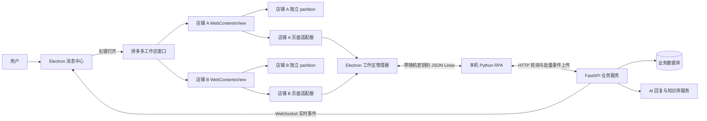

# 拼多多 RPA 与多账号工作区方案

## 1. 文档信息

- 编写日期：2026-07-28
- 最近更新：2026-07-31
- 项目目录：`D:\project-electron\ai-customer-service`
- 目标平台：拼多多商家后台网页版
- 当前阶段：阶段 A 至阶段 E 已完成；下一阶段为阶段 F“稳定性和打包”
- 当前实现基线：多店铺隔离、会话采集、自动回复、文本与图片发送闭环和店铺 Actor 调度已经接通
- 实现记录：[拼多多多账号工作区 MVP 实现记录](./拼多多多账号工作区MVP实现记录.md)
- 阶段 B 记录：[拼多多平台账号与 RPA 节点实现记录](./拼多多平台账号与RPA节点实现记录.md)
- 阶段 C 记录：[拼多多会话与消息采集实现记录](./拼多多会话与消息采集实现记录.md)
- 调研参考：本机安装的 Qchrome 1.13.0

---

## 2. 背景与目标

桌面端消息中心中的会话和消息，最终应来源于本机自动化程序对第三方客服平台的采集，而不是由桌面端自行生成。

第一期只接入拼多多。拼多多商家后台网页版默认不能在同一个普通浏览器会话中稳定登录多个店铺，因此需要为每个店铺建立独立的浏览器存储环境，使以下数据互相隔离：

- Cookie
- LocalStorage
- SessionStorage
- IndexedDB
- CacheStorage
- Service Worker
- HTTP 缓存

本方案需要完成两条闭环：

1. 用户可从消息中心打开独立的拼多多原平台工作区，并在其中登录多个店铺。
2. 本机 RPA 可从各店铺页面采集会话和消息，也可执行服务端下发的消息发送任务。

---

## 3. 本期范围

### 3.1 本期包含

- 拼多多按钮右键菜单
- 独立、非模态的拼多多工作区窗口
- 多店铺浏览器会话隔离
- 店铺添加、切换、重命名、暂停和删除
- 手动登录及登录态持久化
- 平台账号与当前业务用户绑定
- 本机 Python RPA 节点注册、心跳和离线缓存
- 拼多多会话与消息采集
- 采集事件上报及桌面端实时刷新
- 服务端消息发送任务的执行与结果回传
- QA 知识库命中后的自动回复
- 客户源消息绑定、回复运行唯一幂等和发送任务幂等
- 文本后跟随图片的会话内回复任务包
- 店铺维度的发送任务队列和图片剪贴板临界区
- 日志、异常状态和基本诊断能力

### 3.2 本期不包含

- 其他电商或社交平台
- 自动识别或绕过验证码
- 绕过拼多多风控
- 浏览器指纹伪造
- 自动保存拼多多账号密码
- 大规模店铺容量优化和正式容量上限
- 同一店铺内所有采集、导航和发送动作的统一 Actor 调度
- 平台侧已送达回执或平台消息 ID 级的强发送确认

平台出现二维码、短信、验证码或风险确认时，由用户在原平台工作区中手动处理。

---

## 4. Qchrome 调研结论

本次只读调研确认 Qchrome 本身也是 Electron 应用，核心实现可以归纳为以下几层。

### 4.1 账号级浏览器隔离

Qchrome 为每个账号分配稳定的账号 ID，并使用独立持久化浏览器会话。Electron 模式下采用类似下面的分区：

```text
persist:<accountId>
```

同一个账号下的标签页共享该分区，不同账号之间不共享 Cookie 和缓存。

Qchrome 还存在独立 Chromium Profile 模式，每个账号对应单独的用户数据目录，通过 CDP 控制浏览器，并使用 Windows 原生能力将浏览器界面嵌入应用窗口。该模式隔离更彻底，但进程、窗口和资源管理复杂度明显更高。

### 4.2 平台插件拆分

拼多多平台逻辑按职责拆分为：

- `detector`：识别平台页面、登录状态、未读会话和页面变化
- `reader`：读取会话、消息、客户和商品上下文
- `sender`：定位输入框、填写内容、触发发送并验证结果
- `runtime`：调度扫描、去重、重试和生命周期

页面采集主要依赖 DOM 选择器，同时保留 CDP 点击和输入作为补偿手段。

### 4.3 可借鉴部分

- 账号 ID 与浏览器存储分区一一对应
- 账号元数据与浏览器资料分开保存
- 平台适配器按检测、读取、发送和运行时拆分
- 消息发送前检查人工输入和会话是否发生变化
- DOM 实时观察与周期性全量校验并存
- 原始事件先进入可靠队列，再同步业务服务端
- 平台适配器与通用任务协议分离

### 4.4 不直接复用部分

- 不复制 Qchrome 的业务源码和选择器实现
- 不继续采用 Electron 已废弃的 `BrowserView`
- 不在第一阶段引入独立 Chromium 嵌入和 Win32 窗口控制
- 不默认启用浏览器指纹修改和反检测逻辑
- 不把平台密码、业务 JWT 或 RPA 节点令牌暴露给第三方网页
- 不构建单个超大型浏览器管理模块

---

## 5. 总体架构



核心边界：

- Electron 主进程负责窗口、浏览器会话、权限控制和 RPA 子进程生命周期。
- 拼多多页面适配器运行在隔离的页面环境中，只处理拼多多 DOM。
- Python RPA 负责节点身份、任务轮询、事件队列、离线补偿和云端 HTTP 通信。
- FastAPI 是平台账号、会话、消息和任务的业务事实源。
- AI 回复服务执行 QA 优先匹配和后续决策，业务服务负责把结果绑定到客户源消息并创建幂等发送任务。
- Cookie、缓存和平台登录态只保存在用户本机。

### 5.1 当前并发边界

每个店铺对应独立 `WebContentsView`、持久化 partition 和 `StoreActor`。不同店铺可以同时加载页面、扫描 DOM 和执行发送任务；同一店铺的未读读取、会话切换、主动发送、回复任务包和任务后重扫都按邮箱顺序串行。

preload 只读扫描页面并向主进程请求处理未读，不能自主点击会话。主进程 Actor 忙碌时合并后续重扫请求，任务结束后再基于最新 DOM 选择下一项；第 9.6 节记录具体状态机和实现边界。

---

## 6. 桌面端工作区设计

### 6.1 入口交互

消息中心左侧平台栏保留当前行为：

- 左键拼多多按钮：筛选拼多多会话
- 右键拼多多按钮：弹出原生菜单

第一期菜单内容：

```text
打开原平台工作区
```

右键事件从 React 渲染进程通过安全 preload 发送到 Electron 主进程。主进程使用原生 `Menu.popup()` 展示菜单，并负责创建或聚焦工作区窗口。

### 6.2 窗口行为

- 工作区是独立 `BrowserWindow`，不是模态窗口。
- 工作区打开时，消息中心仍可正常点击、最小化和切换。
- 同一业务用户只保留一个拼多多工作区窗口。
- 再次点击“打开原平台工作区”时聚焦已有窗口。
- 工作区窗口关闭时默认隐藏，不清除店铺登录态。
- 应用完全退出时停止浏览器视图和本机 RPA。
- 后续可增加“关闭窗口后继续采集”设置。

### 6.3 工作区布局

工作区由应用自身的可信工具栏和拼多多网页视图组成：

```text
┌────────────────────────────────────────────────────────────┐
│ 拼多多工作区   [店铺 A ●] [店铺 B ○] [+ 添加店铺] [⋯]   │
├────────────────────────────────────────────────────────────┤
│                                                            │
│                当前店铺的拼多多商家后台网页                │
│                                                            │
└────────────────────────────────────────────────────────────┘
```

店铺状态至少包含：

- 未登录
- 登录中
- 在线
- 登录失效
- 页面异常
- 已暂停

### 6.4 浏览器承载方式

当前桌面端使用 Electron 37，第一阶段采用 `WebContentsView`：

- 一个工作区窗口承载可信的工作区外壳页面
- 每个店铺创建一个 `WebContentsView`
- 激活店铺时显示对应视图
- 非激活店铺仍保留 `webContents` 和浏览器会话
- 后台视图保持运行并设置 `backgroundThrottling = false`，以持续采集消息；资源节流属于阶段 F

不采用 `<webview>` 标签，也不让普通 React 页面直接访问 Node.js 或 Electron 主进程。

---

## 7. 多账号隔离设计

### 7.1 本地账号标识

用户点击“添加店铺”时先生成本地工作区账号 ID。此时账号可以处于“未登录”状态，不需要提前知道拼多多店铺 ID。

当前分区名：

```text
persist:pdd-<business-user-hash>-<local-account-id>
```

不直接把用户名写入分区名，避免路径泄露和特殊字符问题。

### 7.2 本地保存内容

本地账号注册表只保存：

- 本地账号 ID
- 当前业务用户 ID 的摘要
- 服务端平台账号 ID，可为空
- 店铺别名
- 浏览器分区名
- 当前状态
- 创建时间和最后打开时间

当前使用主进程管理的 JSON 注册表：

```text
<Electron userData>/platform-workspaces/pinduoduo-accounts.json
```

注册表损坏时会备份原文件再以空注册表恢复。实际 Cookie 和浏览器缓存继续由 Electron 的持久化 partition 管理。

### 7.3 云端保存内容

登录成功并识别到店铺身份后，创建或更新服务端 `platform_accounts`：

- 所属业务用户
- `platform_code = pinduoduo`
- 拼多多外部账号或店铺 ID
- 店铺名称和用户别名
- 登录状态
- 最近在线时间
- RPA 节点 ID
- 非敏感平台元数据

以下内容禁止同步到云端：

- Cookie
- LocalStorage 原始内容
- 拼多多密码
- 验证码
- 完整浏览器 Profile

### 7.4 删除语义

删除店铺需要二次确认，并明确区分：

1. 从列表移除但保留本机登录资料。
2. 删除账号并清空 Cookie、缓存和其他浏览器存储。

清理浏览器资料前必须先销毁对应 `WebContentsView`，再调用 Electron session 清理接口。避免在 Windows 文件句柄仍占用时直接删除分区目录。

---

## 8. Electron 安全边界

工作区会加载第三方网页，必须按不可信内容处理。

### 8.1 WebPreferences

所有拼多多视图必须设置：

```text
contextIsolation: true
nodeIntegration: false
sandbox: true
```

使用拼多多专用 preload，但不向网页暴露通用 `ipcRenderer`、文件系统、Shell、任意网络请求或任意 JavaScript 执行能力。

### 8.2 导航和窗口限制

- 主页面只允许导航到经过白名单校验的拼多多域名。
- 登录过程需要的官方拼多多域名应维护为显式白名单。
- 非白名单地址通过系统浏览器打开或直接拒绝。
- `window.open` 创建的新页面继续使用当前店铺 partition。
- 默认拒绝网页请求摄像头、麦克风、地理位置和文件系统权限。
- 下载行为默认拒绝，后续按业务需求单独开放。

域名判断必须使用 `URL` 解析和 hostname 后缀匹配，不能使用简单字符串包含判断。

### 8.3 凭据保护

- 业务 JWT 不注入拼多多网页。
- RPA 节点令牌不注入拼多多网页。
- 本地桥接使用每次启动生成的随机密钥。
- 长期令牌后续迁移到 Electron `safeStorage`。
- 日志不得记录 Cookie、Authorization 请求头或完整页面存储内容。

---

## 9. 拼多多页面适配器

### 9.1 模块边界

当前目录：

```text
apps/desktop/electron/
  platform-workspace/
    workspace-manager.js
    account-registry.js
    security-policy.js
    pinduoduo/
      preload.cjs
      detector.js
      reader.js
      runtime.js
      selectors.js
```

发送实现目前集中在受限 `preload.cjs` 与主进程 `workspace-manager.js` 中，尚未单独拆出 `sender.js`。当前继续使用 JavaScript；后续如迁移 Electron 主进程到 TypeScript，可同步拆分发送适配层。

### 9.2 Detector

负责：

- 判断是否进入拼多多官方页面
- 判断登录成功、登录失效和风控页面
- 识别当前店铺名称和外部账号 ID
- 定位会话列表和未读标识
- 使用 `MutationObserver` 监听会话列表变化
- 每 1.5 秒执行周期扫描，并使用 250 ms MutationObserver 防抖补充页面变化检测

### 9.3 Reader

负责从当前页面读取并标准化：

- 外部会话 ID
- 客户名称和头像
- 未读状态
- 平台消息 ID
- 发送方角色
- 文本、图片、商品卡片等消息类型
- 消息时间
- 当前店铺和商品上下文

读取失败时保留经过脱敏的诊断信息，不把完整页面 HTML 上报云端。

### 9.4 Sender

负责：

- 定位目标会话
- 校验当前会话与任务目标一致
- 检测可信人工操作并暂停自动导航
- 写入文本并触发网页框架需要的输入事件
- 优先点击发送按钮，必要时以单目标 Enter 兜底
- 校验文本输入框清空后再进入图片阶段
- QA 绑定图片使用“下载 -> 写入系统剪贴板 -> 当前输入框粘贴 -> 识别‘是否发送图片’弹窗 -> 单次点击‘发送’ -> 校验弹窗关闭”的流程
- 返回文本和图片各自的结果及可诊断失败原因

禁止向页面提供“执行任意 JavaScript”的通用任务类型。

### 9.5 Runtime

负责：

- 页面加载和路由变化后的重新初始化
- 扫描频率控制
- 店铺身份补全和结构化事件生成
- 消息去重
- 适配器错误隔离和重启
- 向 Electron 主进程发送结构化事件

当前消息降级幂等指纹不再包含易变的 `snapshot_sequence`。同一快照内重复无 ID DOM 候选会先归一化；服务端再负责绑定后续出现的 `platform_message_id`，并区分历史消息与实时新消息，防止历史 DOM 重扫触发自动回复。

### 9.6 店铺 Actor/队列调度设计

#### 设计结论

采用“店铺 Actor/队列 + 店铺间并发 + 店铺内串行”：

```text
全局任务入口
  ├─ 店铺 A Actor：读取会话 1 -> 回复会话 1（文本+图片）-> 读取会话 2
  ├─ 店铺 B Actor：读取会话 3 -> 回复会话 3
  └─ 店铺 C Actor：空闲/扫描
```

- **店铺间并发**：不同店铺拥有独立页面、DOM 和登录态，可以并发读取或回复。
- **店铺内串行**：同一店铺共享一个“当前会话”，凡是点击会话、切换会话、写输入框或发送消息的操作都必须串行。
- **回复任务包不可拆分**：`定位会话 -> 校验目标 -> 发文本 -> 确认文本成功 -> 发图片 -> 确认图片成功 -> 释放执行权` 必须在同一次店铺占用中完成。
- **新未读只排队**：任务包执行期间出现其他未读会话，只设置 `rescan_required` 或加入邮箱，不得立即切换页面。
- **结束后重新扫描**：任务完成后重新读取该店铺页面状态，不直接信任任务入队时的未读数或 DOM 引用。

#### Actor 邮箱中的任务类型

```text
scan_current_page       只读取当前页面，不切会话
collect_unread          选择并读取一个未读会话
send_reply_bundle       文本及其跟随图片的完整回复包
send_message            主动文本发送
send_image              独立图片发送（兼容任务）
rescan                  前一任务结束后的状态校验
```

同一店铺任一时刻只执行一个会改变页面状态的任务。纯计算和网络工作，如 QA 匹配、AI 推理和图片预下载，不占用页面 Actor，可在店铺间并发并在进入页面临界区前完成。

#### 共享资源

系统剪贴板是跨店铺的全局资源。即使店铺 Actor 并行，图片粘贴仍需短期全局互斥：

```text
获取 clipboard lock
  -> 写入图片
  -> 对指定店铺页面发送 Ctrl+V
  -> 页面确认已接收并出现发送弹窗
  -> 释放 clipboard lock
```

全局锁不应覆盖文本发送、弹窗确认后的等待或整个回复任务包，否则会无谓阻塞其他店铺。

#### 状态机

```text
idle
  -> scanning
  -> switching_conversation
  -> sending_text
  -> waiting_text_confirmation
  -> sending_image
  -> waiting_image_confirmation
  -> completed | failed
  -> rescan
  -> idle
```

Actor 处于非 `idle` 状态时，页面 MutationObserver 只记录变化并请求后续重扫，不直接发起会话切换。

#### 当前实现

当前已实现：

- `workspace-manager.js` 为每个本地店铺页面建立显式 `StoreActor`；不同 Actor 独立运行，同一 Actor 的页面任务严格串行。
- preload 的周期扫描和 MutationObserver 只读 DOM；发现未读后上报 `collect_unread_request`，只有主进程 Actor 下发 `collect-next-unread` 才允许点击会话。
- 未读读取、历史会话导入、主动文本、独立图片、QA 文本+图片回复包和任务后重扫均进入同一店铺邮箱，不再存在 preload 自主导航路径。
- Actor 忙碌期间的 DOM 变化只合并为 `rescan_required`；当前任务结束后执行带回执的最新 DOM 重扫，再处理下一项任务。
- 文本和跟随图片在同一个 `send_reply_bundle` 中执行，图片沿用文本发送后的当前会话，并在每一步校验目标会话。
- 系统剪贴板使用全局 `SerialTaskQueue`，锁范围已缩小到“写入图片、向指定页面粘贴、确认页面出现图片发送弹窗”；弹窗发送确认在锁外执行。
- 店铺暂停、页面销毁、登录失效或风控状态会取消对应 Actor，拒绝排队任务和未决页面请求。
- 自动化测试覆盖跨店并发、同店串行、忙碌期重扫合并、未读请求合并、页面销毁取消和剪贴板临界区隔离。

---

## 10. 本机 Python RPA 设计

### 10.1 职责

Python RPA 是本机自动化代理，负责：

- 使用当前业务用户身份注册 RPA 节点
- 保存节点令牌
- 定时上报心跳和活动平台
- 接收 Electron 页面适配器产生的结构化事件
- 将事件先写入本地 SQLite 队列
- 批量上传未同步事件
- 拉取服务端待执行任务
- 将服务端任务通过 JSON Lines 下发给 Electron，由工作区管理器路由到指定店铺适配器
- 上报任务完成或失败结果
- 断网重连和失败重试

Electron 只负责浏览器宿主和受限 DOM 操作，不负责业务消息持久化。

### 10.2 本地通信

当前 Electron 与 Python RPA 使用子进程标准输入/输出上的 JSON Lines：

```text
Electron Main <-> stdin/stdout JSON Lines <-> Python RPA 子进程
```

约束：

- 不监听本机端口
- 每次启动生成 256 位随机桥接密钥，所有命令和消息都必须携带该密钥
- 协议只允许预定义事件和任务
- 校验消息大小、字段和账号归属
- 业务访问令牌只通过标准输入传入，不放进进程命令行或日志
- RPA 异常退出后由 Electron 延迟重启，并重放尚未收到 `event_queued` 确认的内存事件

当前受管子进程场景不需要本地 WebSocket；如果未来改造成独立 Windows 服务，再评估受鉴权的 loopback 通信。

### 10.3 生命周期

第一阶段由 Electron 主进程启动和管理 Python RPA：

1. 桌面端登录成功。
2. Electron 启动 RPA 子进程。
3. RPA 使用业务用户授权注册节点。
4. RPA 通过标准输出返回节点注册和启动状态。
5. Electron 通过标准输入同步当前店铺列表。
6. 用户退出登录时停止 RPA，清理内存令牌，但不删除店铺浏览器资料。

后续如需应用关闭后继续采集，再升级为 Windows 后台服务。

### 10.4 离线队列

事件处理流程：

```text
页面采集事件
  -> RPA 本地 SQLite
  -> 上传 FastAPI
  -> 服务端幂等确认
  -> 本地标记已同步
```

当前消息事件幂等键：

```text
pinduoduo:<platform_account_id>:<conversation_external_id>:message:v3:<platform_message_id 或降级摘要>
```

平台没有稳定消息 ID 时，使用账号、会话、发送方、内容摘要和时间窗口生成降级幂等键。

---

## 11. 服务端改造

### 11.1 平台账号接口

已实现：

```text
GET    /api/v1/platform-accounts
POST   /api/v1/platform-accounts
GET    /api/v1/platform-accounts/{account_id}
PATCH  /api/v1/platform-accounts/{account_id}
DELETE /api/v1/platform-accounts/{account_id}
```

所有接口必须按当前登录用户隔离。

### 11.2 数据模型调整

`platform_accounts` 已补充：

- `external_account_id`
- `login_status`
- `last_seen_at`
- `last_rpa_node_id`

已建立唯一约束：

```text
user_id + platform_code + external_account_id
```

`rpa_events` 已补充：

- `platform_account_id`

`rpa_tasks` 已补充：

- `platform_account_id`

`conversations` 的查找和唯一性必须包含：

```text
user_id + platform_account_id + external_conversation_id
```

不能只按用户、平台和客户会话 ID 查找，否则不同店铺的同名客户或相同外部 ID 可能串会话。

`messages` 已按下面的组合建立唯一索引：

```text
conversation_id + platform_message_id
```

自动回复另外使用三层幂等：

1. 每次回复请求必须绑定 `source_message_id`，不能仅凭会话最新文本发起。
2. `automation_reply_runs` 对 `robot_id + source_message_id` 建立唯一约束，一条客户消息对同一机器人最多创建一个回复运行。
3. 自动发送任务使用 `auto-reply:<robot_id>:<source_message_id>:text` 作为 `rpa_tasks.idempotency_key`，重复创建时复用原消息和任务。

服务端对无平台消息 ID 的采集结果按同会话、发送方、正文、快照、平台时间和短观察窗口归一化；后续快照获得平台消息 ID 时绑定到既有记录，而不是新建回复来源。平台时间明显早于观察时间的历史消息可以入库，但不触发实时自动回复。

### 11.3 RPA 事件协议

当前主要支持：

- `conversation_snapshot`
- `message_received`
- `agent_message`
- `message_sent`

统一事件基础字段：

```json
{
  "event_id": "本机生成的全局事件ID",
  "event_type": "message_received",
  "platform_code": "pinduoduo",
  "platform_account_id": "服务端平台账号ID",
  "conversation_external_id": "拼多多会话ID",
  "platform_message_id": "拼多多消息ID",
  "dedup_key": "稳定幂等键",
  "received_at": "采集观察时间",
  "payload_json": {}
}
```

### 11.4 发送任务协议

发送任务必须包含：

- 业务消息 ID
- 平台账号 ID
- 外部会话 ID
- 消息内容
- 可选的 `follow_up` 图片
- 请求时间
- 幂等键

状态流转：

```text
queued
  -> dispatched
  -> acknowledged
  -> completed | failed
```

RPA 执行前再次校验账号和目标会话。自动回复的文本和首张 QA 图片放在同一个 `send_message` 任务中执行，不再默认创建独立图片任务；文本成功后保持当前会话，再粘贴并确认图片。兼容性 `send_image` 任务仍保留。

### 11.5 自动回复链路

```text
实时 customer message 幂等入库
  -> 绑定 source_message_id
  -> 创建唯一 AutomationReplyRun
  -> QA 优先匹配 / AI 决策
  -> 创建带 idempotency_key 的 send_message 任务
  -> 店铺队列执行文本
  -> 文本确认成功
  -> 同一会话执行跟随图片
  -> 回传 text_sent / image_sent / image_method
```

QA 图片在知识库服务上传时统一解码并转为真实 PNG，桌面端下载后使用 Electron `nativeImage` 校验，避免文件扩展名与实际格式不一致造成剪贴板发送失败。

---

## 12. 关键业务流程

### 12.1 打开工作区

```text
右键拼多多按钮
  -> Electron 原生菜单
  -> 点击“打开原平台工作区”
  -> 主进程创建或聚焦工作区窗口
  -> 工作区加载当前用户的本地店铺注册表
```

### 12.2 添加店铺

```text
点击“添加店铺”
  -> 生成本地账号 ID 和独立 partition
  -> 创建 WebContentsView
  -> 打开拼多多官方登录页
  -> 用户手动登录
  -> 适配器识别店铺身份
  -> 创建或绑定服务端 PlatformAccount
  -> RPA 上报账号在线状态
```

### 12.3 接收消息

```text
拼多多页面出现新消息
  -> Detector 发现变化
  -> Reader 读取并标准化
  -> Electron 转发给 Python RPA
  -> RPA 写入本地离线队列
  -> 上传 FastAPI
  -> 服务端幂等入库
  -> WebSocket 推送桌面端
  -> 消息中心刷新会话和消息
```

### 12.4 发送消息

```text
消息中心发送消息
  -> FastAPI 创建 RPA 任务
  -> Python RPA 拉取并确认任务
  -> 路由到对应店铺 Sender
  -> Sender 校验会话和人工输入状态
  -> 在拼多多页面执行发送
  -> RPA 回传结果
  -> FastAPI 更新消息状态
  -> WebSocket 推送桌面端
```

### 12.5 QA 文本与图片回复

```text
客户新消息入库
  -> 服务端以 source_message_id 启动唯一回复运行
  -> QA 命中答案和绑定图片
  -> 创建一个 send_message 回复任务包
  -> 对应店铺队列取得页面执行权
  -> 切换并校验目标会话
  -> 发送文本并确认输入框清空
  -> 保持当前会话，写入剪贴板并粘贴图片
  -> 识别“是否发送图片”弹窗并单次点击“发送”
  -> 弹窗关闭后回传文本和图片结果
  -> 释放导航锁并重新扫描该店铺
```

回复任务包执行期间，该店铺的新未读会话不会触发即时切换；其他店铺的页面和任务不受影响。

---

## 13. 分阶段实施计划

### 阶段 A：多账号工作区 MVP

状态：已于 2026-07-28 实现并通过自动化冒烟测试。详细记录见[拼多多多账号工作区 MVP 实现记录](./拼多多多账号工作区MVP实现记录.md)。

实现：

- Electron preload 和受控 IPC
- 拼多多按钮右键菜单
- 独立工作区窗口
- 店铺标签和添加入口
- 每店铺独立持久化 partition
- 手动登录、切换、暂停和删除
- 登录态重启恢复

验收：

1. 可添加至少两个拼多多店铺。
2. 两个店铺可同时保持不同登录态。
3. 店铺间 Cookie、LocalStorage 和缓存不串用。
4. 重启桌面应用后登录态仍能恢复。
5. 工作区窗口不阻塞消息中心。
6. 重复打开只聚焦一个工作区窗口。
7. 删除店铺时可选择是否清除浏览器资料。

### 阶段 B：平台账号与 RPA 节点

状态：已于 2026-07-28 实现并通过自动化端到端测试。详细记录见[拼多多平台账号与 RPA 节点实现记录](./拼多多平台账号与RPA节点实现记录.md)。

实现：

- 平台账号 REST API
- 数据库迁移
- 本地 Python RPA 工程
- Electron 管理 RPA 子进程
- 节点注册、心跳和断开
- 本地通信鉴权
- 本地 SQLite 事件队列

验收：

1. 登录桌面端后 RPA 节点显示在线。
2. 不同业务用户看不到彼此的店铺账号。
3. 店铺登录或失效状态可同步到服务端。
4. 网络断开时事件保留在本地，恢复后自动补传。

### 阶段 C：会话和消息采集

状态：已于 2026-07-28 实现并通过真实 DOM 调研、沙箱 preload 冒烟和服务端双店隔离测试。详细记录见[拼多多会话与消息采集实现记录](./拼多多会话与消息采集实现记录.md)。

实现：

- 拼多多 Detector、Reader 和 Runtime
- 店铺身份识别
- 会话与消息标准化
- 幂等上报
- 服务端按平台账号创建会话和消息
- 消息中心使用真实店铺列表

验收：

1. 拼多多收到新客户消息后，消息中心出现对应会话。
2. 会话历史可正常读取和持久化。
3. 两个店铺的同一客户不会被错误合并。
4. 重复扫描不会生成重复消息。
5. 桌面端重启并重新登录后可以恢复消息数据。

### 阶段 D：消息发送闭环

状态：已于 2026-07-31 完成当前闭环，并通过真实拼多多页面验证、业务服务测试、采集器测试、TypeScript 检查和桌面生产构建。

实现：

- 拼多多页面发送适配
- RPA 任务拉取、确认、执行和回传
- 按店铺账号串行的发送任务队列，不同店铺可并行
- 自动导航锁和可信人工操作暂停
- 客户 `source_message_id` 绑定、回复运行唯一约束和发送任务幂等键
- QA 文本与图片回复包：文本成功后在当前会话继续发送图片
- 拼多多“是否发送图片”弹窗识别、单次确认和关闭校验
- 重复 DOM 消息归一化、历史消息不触发实时回复和后续平台消息 ID 补绑
- 文本成功但图片失败时保留文本已发送状态和图片错误原因

验收：

1. 消息中心发送的文本出现在正确店铺、正确客户会话中。
2. 发送成功后业务消息状态变为 `sent`。
3. 页面不可用或登录失效时消息状态变为 `failed`，并保留原因。
4. 任务重试不会重复发送同一条消息。
5. 人工正在输入或会话已变化时自动发送会暂停或失败退出。
6. QA 图片严格在文本成功后发送，图片确认动作只执行一次。
7. 同一客户源消息不会创建多个自动回复运行或发送任务。

### 阶段 E：店铺 Actor/队列调度

状态：已完成。详细设计与实际实现见第 9.6 节。

计划：

- 按 `platform_account_id` 建立显式店铺 Actor 和独立任务邮箱
- 将未读读取、会话切换、主动发送、回复任务包和重扫统一纳入店铺邮箱
- 不同店铺 Actor 并发执行，同一店铺内所有页面状态变更严格串行
- 文本与跟随图片作为不可拆分的 `send_reply_bundle` 执行
- Actor 非空闲期间，MutationObserver 只设置 `rescan_required`，不直接切换会话
- 当前任务完成或失败后强制重新扫描店铺页面，再选择下一项任务
- 用明确状态机替代分散的导航锁和扫描时序判断
- 将系统剪贴板锁缩小到写入图片、指定页面粘贴及确认页面已接收的临界区
- 店铺暂停、页面销毁和登录失效时取消或失败结束对应待执行任务

实现结果：

- 新增独立 `StoreActor`，按本地店铺账号持有邮箱、状态、重扫标记和取消状态
- preload 未读扫描改为请求 Actor，只有 `collect-next-unread` 命令能够触发自动切会话
- 主动发送、自动回复、独立图片、历史会话读取和未读采集共用同一 Actor
- 回复包内部直接调用 Actor 页面原语，避免子任务重复入队和队列自等待
- 图片粘贴增加页面接收回执，系统剪贴板锁不再覆盖弹窗确认和后续等待
- 新增 `test:store-actor`，覆盖六个调度和共享资源场景

验收：

1. 两个不同店铺可以同时扫描、切换会话和回复，互不阻塞。
2. 同一店铺存在多个未读会话时，严格逐个读取和处理，不并发切换页面。
3. 同店回复文本和图片期间出现新未读时，不切走当前会话；任务包结束后再处理。
4. 同一店铺的主动发送、自动回复和未读采集不会形成两套独立导航路径。
5. 两个店铺同时发送图片时，剪贴板内容不会粘贴到错误页面。
6. 任一任务结束后都会基于最新 DOM 重扫，不复用过期会话节点或未读状态。
7. 自动化测试覆盖双店并发、同店串行、发送期间新未读和页面销毁场景。

### 阶段 F：稳定性和打包

状态：待实施；阶段 E 已完成。

计划：

- DOM 选择器版本管理
- 页面异常自恢复
- RPA 和浏览器视图健康检查
- 日志脱敏和诊断导出
- CPU、内存和后台节流策略
- Python RPA 打包及 electron-builder 集成
- 应用退出和升级时的数据保护

验收：

1. 连续运行 24 小时无明显内存持续增长。
2. 页面刷新、崩溃或网络切换后能够恢复采集。
3. 安装包在干净 Windows 环境可完成完整闭环。
4. 日志中不包含 Cookie、密码和业务令牌。

---

## 14. 测试矩阵

### 14.1 多账号

- 两个店铺同时登录
- 一个店铺退出不影响另一个店铺
- 重启应用后分别恢复登录态
- 删除一个店铺不影响其他分区
- 相同店铺重复绑定时给出明确提示

### 14.2 页面状态

- 首次登录
- 二维码登录
- 登录过期
- 风控确认页
- 页面刷新和内部路由切换
- 拼多多打开新窗口
- DOM 关键节点暂时不存在

### 14.3 消息采集

- 文本消息
- 图片消息
- 商品和订单卡片
- 系统消息
- 撤回消息
- 连续快速消息
- 历史消息与新消息重复扫描

### 14.4 消息发送

- 正常文本发送
- 会话不存在
- 店铺离线
- 登录过期
- 人工正在输入
- 发送期间客户又发来新消息
- 服务端重复下发同一个任务
- QA 命中文本后再发送绑定图片
- 图片粘贴出现“是否发送图片”弹窗并只确认一次
- 文本成功、图片失败时保留部分成功状态
- 同一 `source_message_id` 重复触发自动回复

### 14.5 调度与并发

- 两个不同店铺同时扫描未读会话
- 两个不同店铺同时发送文本
- 两个不同店铺同时发送带图片回复，验证剪贴板临界区不串店
- 同一店铺存在多个未读会话时逐个读取和回复
- 同一店铺发送文本与图片期间出现新未读，不切换当前会话
- 当前任务结束后强制重扫，并处理排队的新未读
- 店铺暂停、页面销毁或登录失效时取消该店铺待执行任务

### 14.6 网络和进程

- FastAPI 不可用
- 本机 RPA 崩溃并自动重启
- Electron 工作区渲染进程崩溃
- 网络断开后恢复
- 应用退出时仍有未同步事件

---

## 15. 风险与应对

### 15.1 DOM 结构变化

风险：拼多多前端更新后，硬编码选择器可能失效。

应对：

- 选择器集中配置并带版本号
- 优先使用稳定属性和语义组合
- 同一目标提供主选择器和降级选择器
- 采集数量异常时自动进入降级状态
- 保留脱敏截图和节点摘要用于诊断

### 15.2 Electron 页面兼容性

风险：拼多多可能对 Electron Chromium、登录流程或部分浏览器能力存在限制。

应对：

- 先用 `WebContentsView + persist partition` 完成兼容性验证
- 不在验证前投入独立 Chromium 嵌入
- 如果确认 Electron 无法稳定运行，再切换到独立 Chromium Profile + CDP
- 工作区、账号模型和 RPA 协议保持不变，只替换浏览器引擎

### 15.3 资源占用

风险：每个店铺都是独立 Chromium 渲染环境，多店铺会增加内存和 CPU。

应对：

- 当前后台视图为持续采集禁用了 Chromium 后台节流，阶段 F 需通过容量测试决定是否改为自适应扫描
- 空闲店铺进入暂停状态
- 对同时活跃店铺数设置可配置上限
- 记录每个视图的内存、崩溃和恢复次数
- 容量测试后再确定正式上限

### 15.4 消息串店铺

风险：仅使用平台会话 ID 去重，可能把不同店铺的消息合并。

应对：所有会话、消息事件和发送任务必须显式携带 `platform_account_id`，唯一键和查询也必须包含账号维度。

### 15.5 自动发送冲突

风险：人工客服正在处理时，RPA 同时发送导致重复或答非所问。

应对：

- 检测输入框占用和可信人工操作
- 任务执行前重新读取最新消息
- 同一店铺的会话导航与发送串行，不同店铺并发
- 文本与跟随图片组成不可拆分任务包，期间不响应同店铺其他会话切换
- 新客户消息先排队，当前任务结束后重新扫描并决定下一步
- 无法确认发送结果时进入人工复核，不盲目重试

### 15.6 重复自动回复

风险：同一平台消息在 DOM 中被多个候选节点读取，或先无平台 ID、后补平台 ID，可能形成多个业务 Message 和多个自动回复任务。

应对：

- 采集端使用不含 `snapshot_sequence` 的稳定降级指纹归一化同快照候选
- 服务端补绑后续出现的 `platform_message_id`
- 历史消息只入库，不作为实时回复来源
- 回复运行唯一约束绑定 `robot_id + source_message_id`
- 发送任务使用源消息维度的 `idempotency_key`

### 15.7 店铺内调度竞争

风险：同一店铺的未读扫描、主动发送和图片确认如果各自切换会话，会打断当前任务并造成错发。

应对：

- 所有改变页面状态的动作统一进入店铺 Actor 邮箱
- Actor 非空闲期间，MutationObserver 只设置 `rescan_required`
- 任务完成后重新读取页面，不复用陈旧 DOM 节点
- 系统剪贴板单独使用短期全局锁，不扩大为全局页面锁

---

## 16. 推荐开发顺序

后续按以下顺序推进：

1. 阶段 A 至 D 已完成，保持现有多账号、采集、自动回复和文本图片发送闭环稳定。
2. 对阶段 E 执行真实双店联调，核对双店同时回复、同店多未读和图片剪贴板隔离日志。
3. 实施阶段 F：完成 24 小时稳定性、资源治理、Python 运行时打包和干净 Windows 安装验收。

Electron 内嵌 Chromium 的多店铺登录、实际消息闭环和同店铺页面状态统一调度已经实现。独立 Chromium + CDP 继续作为兼容性降级路线，不作为当前主线；当前优先事项是阶段 E 真实双店联调、长期运行和安装交付。

---

## 17. 已确认的基础决策

以下事项已经在阶段 A 至 D 中落地，继续作为后续实现约束：

- 仅支持拼多多。
- 使用 `WebContentsView`，不使用 `BrowserView` 和 `<webview>`。
- 每个店铺使用独立持久化 partition。
- 用户手动完成平台登录和验证码。
- 不保存拼多多密码。
- 工作区窗口非模态且单实例。
- Cookie 和缓存只保存在本机。
- 第三方网页使用最小权限 preload。
- 页面采集和发送必须通过预定义受限协议，不提供任意脚本执行能力。
- 自动回复必须绑定客户 `source_message_id`，并同时依赖数据库唯一幂等。
- 不同店铺可以并发；同一店铺内所有改变页面状态的动作必须串行。
- 独立 Chromium + CDP 作为兼容性降级路线，不作为首选实现。
