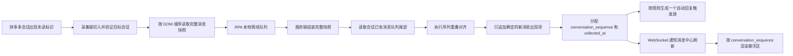

# 拼多多会话消息队列与聊天顺序同步方案

## 1. 文档信息

- 文档状态：讨论稿
- 编写日期：2026-08-06
- 适用范围：拼多多客服接待页、桌面端 RPA、业务服务端、消息中心聊天区
- 参考实现：`D:\ai-customer-service\python\service\truth_store.py` 中的可见消息序列重叠逻辑
- 本文只描述方案，不代表相关代码已经实现

---

## 2. 背景

当前拼多多消息采集链路会在会话列表发现未读标识后自动切入目标会话，读取聊天区域已经加载到 DOM 的消息，再将页面快照拆成独立消息事件上报服务端。

现有实现已经能提取双方文本、图片、发送方向和单次页面快照中的 DOM 顺序，但消息身份和增量识别仍然较依赖平台消息 ID、消息内容摘要及平台时间信息，存在以下问题：

1. 拼多多平台消息 ID 可能缺失、变化或重复，不能作为唯一消息身份。
2. 没有平台消息 ID 时，若连续出现相同发送方、相同类型和相同内容的消息，逐条摘要去重可能误合并。
3. `snapshot_sequence` 只能表达单次页面快照内的顺序，不能表达整个会话的永久顺序。
4. 拼多多时间标签不一定覆盖每条消息，解析、继承时间标签会增加复杂度，但不能提高本项目最关心的内容和顺序一致性。
5. 首次采集会同时读到历史消息和当前未回复消息。如果全部按实时入站消息处理，可能对历史消息重复触发自动回复。

因此，本方案将采集和去重单位从“单条消息”调整为“会话有序消息快照”，并为每个会话建立持久化的消息队列。

---

## 3. 目标与非目标

### 3.1 目标

本方案需要保证：

1. 消息中心保存拼多多聊天 DOM 中已经成功采集的双方文本和图片。
2. 消息中心的聊天顺序与采集时拼多多页面中的 DOM 顺序一致。
3. 重复扫描同一页面不会重复入库。
4. 平台消息 ID 变化、缺失或重复时，仍能通过有序消息序列识别增量。
5. 连续相同文本、连续相同图片按页面中实际出现的次数保留，不因内容相同而合并。
6. 每条消息显示本机首次采集时间，不还原拼多多平台发送时间。
7. 打开或采集会话不会清除消息中心的待回复状态；只有出现已确认发送的客服消息才结束待回复。
8. 首次历史基线和后续实时增量分开处理，避免历史消息误触发自动回复。
9. 多个拼多多店铺之间的会话队列严格隔离。

### 3.2 非目标

本方案暂不保证：

1. 自动点击“加载更多”并同步完整历史记录。
2. 还原拼多多原始发送时间和时间分组样式。
3. 完整复刻商品卡、订单卡、系统通知、语音、视频和文件等富媒体样式。
4. 在页面不给出消息 ID、时间、稳定图片特征且可见窗口完全无重叠时，无证据地区分两个内容完全相同的消息窗口。
5. 使用拼多多未读标识推导真实未读消息条数。

---

## 4. 核心定义

### 4.1 会话消息队列

每个业务会话维护一条只追加的有序消息队列：

```text
会话队列键 = 业务用户 + 拼多多店铺 + 拼多多会话 ID
```

队列中的每条消息都有永久递增的 `conversation_sequence`。消息中心只能使用该字段确定显示顺序，不使用采集时间、平台时间或数据库主键推断顺序。

### 4.2 页面消息快照

一次成功切入并验证目标会话后，从当前聊天 DOM 自上而下读取的完整有序消息数组称为页面消息快照。

页面消息快照是增量判断的最小单位。采集端不得在快照上报前按平台消息 ID或内容摘要删除重复项，否则会丢失连续相同消息的出现次数。

### 4.3 消息出现项

队列保存的是“消息在会话序列中的一次出现”，而不是“某段内容的唯一值”。

例如客户连续发送三次“在吗”，队列中必须存在三个不同的消息出现项，即使三条消息的文本和平台消息 ID完全相同。

### 4.4 首次采集时间

`collected_at` 表示服务端首次确认该消息出现项并追加到会话队列的本机时间。

- 同一页面快照中新增的多条消息可以拥有相同的 `collected_at`。
- 后续重复采集不得覆盖已有消息的 `collected_at`。
- 页面采集不再提取或依赖 `platform_sent_at`、`time_label`、`time_group_index` 和 `has_explicit_time`。
- 消息排序不得使用 `collected_at`，因为同一批消息的采集时间可能完全相同。

### 4.5 平台消息 ID

平台消息 ID降级为辅助证据：

- ID稳定时用于加速队列对齐和补充诊断信息。
- ID变化时不能阻止内容序列对齐。
- ID重复时不能直接删除排在队列后面的新消息。
- ID缺失时不影响消息入队。
- 数据库不得再把 `conversation_id + platform_message_id` 作为消息出现项的唯一约束。

---

## 5. 总体链路



链路中的账号身份校验、目标会话切换验证、店铺级串行执行、RPA SQLite 离线队列和服务端用户隔离继续沿用现有机制。

---

## 6. 页面快照协议

### 6.1 快照结构

建议新增会话级 `message_snapshot` 事件，保留完整有序数组，不在 Electron Runtime 中提前展开成彼此独立的消息事件。

示例：

```json
{
  "event_type": "message_snapshot",
  "observation_id": "pdd-observation-uuid",
  "platform_code": "pinduoduo",
  "platform_account_id": "platform-account-id",
  "conversation_external_id": "conversation-id",
  "customer_name": "客户名称",
  "unread": true,
  "collected_at": "2026-08-06T14:20:05.123Z",
  "messages": [
    {
      "dom_sequence": 0,
      "sender_role": "customer",
      "message_type": "text",
      "content": "你好",
      "image_url": null,
      "image_sha256": null,
      "platform_message_id": "optional-id"
    },
    {
      "dom_sequence": 1,
      "sender_role": "agent",
      "message_type": "image",
      "content": "[image]",
      "image_url": "https://example.invalid/image.png",
      "image_sha256": null,
      "platform_message_id": null
    }
  ]
}
```

### 6.2 协议要求

1. `messages` 必须严格按聊天 DOM 自上而下排序。
2. `dom_sequence` 必须在快照内连续递增，服务端收到后仍需校验并按该字段排序。
3. 空快照不能删除已有消息，也不能把已有消息标记为已读。
4. 快照必须携带唯一 `observation_id`，同一快照网络重试时保持不变。
5. 服务端按 `observation_id` 幂等接收整张快照，而不是按单条平台消息 ID幂等。
6. 如果负载大小要求拆包，每个包必须同时携带：

```text
observation_id
batch_index
batch_count
message_offset
payload_hash
```

服务端必须在所有批次到齐并通过哈希校验后再做队列对齐。不得逐包对齐，否则批次边界可能被误判成新消息边界。

### 6.3 采集端过滤边界

采集端只过滤明确不属于双方聊天记录的内容，例如：

- 时间分隔标签
- 当前用户来源提示
- 平台配置提示
- 撤回通知
- 纯系统通知

采集端保留：

- 客户文本
- 客服文本
- 客户图片
- 客服图片
- 每条消息的发送方向
- 每条消息在当前 DOM 中的位置

对无法确认类型的内容应记录诊断并保守保留原始摘要，避免静默丢失真实聊天消息。

---

## 7. 消息指纹

### 7.1 文本指纹

文本消息的序列对齐指纹建议为：

```text
sender_role + message_type + normalized_content
```

正文只做最小归一化：

- 去除首尾空白。
- 将连续页面布局空白归一为一个空格。
- 不改变大小写、标点、表情、换行语义和语言内容。

示例：

```text
customer|text|你好
agent|text|您好，请问需要什么帮助
```

### 7.2 图片指纹

图片消息按以下优先级生成对齐指纹：

1. 图片二进制内容的 SHA-256。
2. 已确认稳定的媒体资源 ID。
3. 去除临时签名参数后的规范化图片 URL。
4. 原始图片 URL。
5. 无任何稳定特征时使用 `sender_role|image|unknown`，并依靠队列上下文和出现次数对齐。

图片内容哈希是补强证据，不应阻塞首轮消息入库。后续成功下载图片后可以补充 `image_sha256`，但不能改变已经分配的 `conversation_sequence`。

### 7.3 平台消息 ID证据

平台消息 ID不进入基础内容指纹，但作为额外锚点参与无内容重叠时的二级对齐。平台 ID命中只能证明页面中的某个位置可能对应已有消息，不能证明同 ID的后续出现一定是重复消息。

---

## 8. 会话队列对齐算法

### 8.1 基本算法

服务端读取当前会话队列尾部，生成历史指纹序列 `H`；对当前页面快照生成候选指纹序列 `C`。

计算满足以下条件的最大 `k`：

```text
H 的最后 k 项 == C 的最前 k 项
```

若 `k > 0`，只追加 `C[k:]`。

伪代码：

```python
def longest_tail_overlap(history, current):
    max_length = min(len(history), len(current))
    for size in range(max_length, 0, -1):
        if history[-size:] == current[:size]:
            return size
    return 0
```

### 8.2 示例：普通增量

已有队列：

```text
A 客户：你好
B 客服：您好
C 客户：有黑色吗
```

当前页面：

```text
B 客服：您好
C 客户：有黑色吗
D 客服：有的
E 客户：发什么快递
```

重叠为 `B、C`，只追加 `D、E`。

### 8.3 示例：平台消息 ID全部变化

已有队列：

```text
old-1 客户：我去
old-2 客户：我没注意到
old-3 客服：来两把
```

当前页面：

```text
new-1 客户：我去
new-2 客户：我没注意到
new-3 客服：来两把
new-4 客户：行
```

基础内容序列仍然重叠，因此只追加“客户：行”。平台消息 ID变化不会破坏队列。

### 8.4 示例：连续相同文本

三次页面快照依次为：

```text
[客户：在吗]
[客户：在吗, 客户：在吗]
[客户：在吗, 客户：在吗, 客户：在吗]
```

每次最长重叠分别为 `0、1、2`，最终队列正确保留三条独立消息。

### 8.5 示例：连续相同图片和重复 ID

已有队列：

```text
[客户图片 weak-id]
```

当前页面：

```text
[客户图片 weak-id, 客户图片 weak-id]
```

即使平台两次返回相同 ID，页面序列相对已有队列多出一次图片出现，仍需追加第二张图片。

### 8.6 多级对齐顺序

建议按以下顺序执行：

1. 使用发送方向、类型和内容/图片证据执行最长序列重叠。
2. 无内容重叠时，尝试使用稳定平台消息 ID寻找最后一个可信锚点。
3. 平台 ID锚点前后还需校验相邻消息上下文，避免重复 ID定位到错误位置。
4. 仍无法对齐时进入 `unaligned` 状态，不直接把整页消息追加到已有队列。

### 8.7 无法对齐时的保守策略

已有队列非空而当前页面与历史尾部完全无重叠，可能代表：

- 页面虚拟列表窗口发生跳跃。
- 页面只加载了另一段历史。
- DOM 选择器错读了其他区域。
- 会话切换校验失效。
- 历史队列或当前快照缺少足够上下文。

此时直接追加整页会制造大量重复消息。建议：

1. 保存原始快照和诊断信息。
2. 标记本次对齐结果为 `unaligned`。
3. 不追加消息、不触发自动回复。
4. 请求页面重新稳定扫描或扩大可见尾部后重试。
5. 多次无法对齐时提示人工检查，不以猜测方式修复队列。

内容与顺序正确性优先于“尽量多入库”。

---

## 9. 数据模型建议

### 9.1 `messages` 关键字段

建议在现有消息表中增加或明确以下字段：

| 字段 | 含义 |
| --- | --- |
| `conversation_id` | 所属业务会话 |
| `conversation_sequence` | 会话内永久递增顺序 |
| `sender_role` | `customer` 或 `agent` |
| `message_type` | `text` 或 `image`，后续可扩展 |
| `content` | 文本正文或图片占位内容 |
| `image_url` | 图片资源地址，可为空 |
| `image_sha256` | 图片内容哈希，可后补 |
| `collected_at` | 本机首次采集时间 |
| `first_observation_id` | 首次发现该消息的快照 ID |
| `first_dom_sequence` | 首次快照中的 DOM 顺序 |
| `platform_message_id` | 平台辅助证据，可空、可重复 |
| `collection_kind` | `bootstrap`、`incremental`、`outbound` 或 `manual` |
| `automation_eligible` | 是否允许成为自动回复触发源 |
| `raw_payload` | 原始采集证据和诊断字段 |

建议约束：

```text
UNIQUE(conversation_id, conversation_sequence)
UNIQUE(first_observation_id, first_dom_sequence)
INDEX(conversation_id, platform_message_id)
```

不再使用：

```text
UNIQUE(conversation_id, platform_message_id)
```

### 9.2 `message_observations` 快照表

建议增加快照接收表，用于整张快照幂等、拆包组装、问题诊断和失败重放：

| 字段 | 含义 |
| --- | --- |
| `observation_id` | 快照唯一 ID |
| `conversation_id` | 对应业务会话 |
| `collected_at` | 本机采集时间 |
| `unread` | 采集时是否存在平台未读标识 |
| `payload_hash` | 完整快照哈希 |
| `message_count` | 页面消息数量 |
| `alignment_status` | `pending`、`bootstrap`、`aligned`、`duplicate`、`unaligned`、`failed` |
| `overlap_size` | 与历史队列重叠数量 |
| `appended_count` | 实际追加数量 |
| `raw_payload` | 原始或压缩后的快照数据 |
| `processed_at` | 处理完成时间 |

`observation_id` 唯一。相同 ID和相同哈希的重试直接返回已有结果；相同 ID但哈希不同应拒绝并记录协议错误。

### 9.3 会话队列尾号

可以在 `conversations` 增加 `last_message_sequence`，在同一数据库事务中分配新序号：

```text
新消息序号 = last_message_sequence + 1 ... + appended_count
```

分配序号、插入消息、更新会话摘要和更新待回复状态必须在同一事务完成，避免并发快照产生重复序号。

---

## 10. 首次采集与实时增量

### 10.1 首次基线

当会话不存在任何消息时：

1. 将当前页面已经加载的全部双方文本和图片按 DOM 顺序写入队列。
2. `collection_kind` 标记为 `bootstrap`。
3. 所有消息使用本次快照的 `collected_at`。
4. 建立队列基线不等于所有历史客户消息都需要逐条自动回复。

### 10.2 后续增量

当会话已有队列时：

1. 使用历史队列尾部和当前完整快照执行序列重叠。
2. 只将确定的新尾部追加为 `incremental`。
3. 新增消息使用当前快照的 `collected_at`。
4. 重叠部分已有消息的内容、顺序和采集时间保持不变。

### 10.3 基线大小

首次基线数量应与页面实际已加载消息一致，并受安全上限限制。建议上限暂定 200 条，与当前采集和消息中心读取上限保持一致。

如果页面未来支持主动加载更多历史，应使用独立的“历史前插”协议，不能把更早历史当成实时尾部追加。本方案第一阶段不处理历史前插。

---

## 11. 自动回复与待回复状态

### 11.1 拼多多未读语义

拼多多只有未读标识，没有可靠未读消息数，并且切换会话不会清除标识，只有回复对方后标识才消失。

因此服务端统一使用布尔语义：

```text
platform_unread = true / false
```

即使现有接口继续保留 `unread_count`，对拼多多也只能解释为：

```text
0 = 无未读标识
1 = 有未读标识
```

不得把它显示或统计为真实未读消息数。

### 11.2 消息中心待回复状态

消息中心的 `awaiting_reply` 由会话队列尾部决定：

```text
队列最后一条已确认消息来自客户 -> awaiting_reply = true
队列最后一条已确认消息来自客服 -> awaiting_reply = false
```

打开消息中心会话、切入拼多多会话和完成页面采集均不改变该状态。

### 11.3 首次基线触发规则

首次基线中的历史消息默认 `automation_eligible = false`，避免一次性为几十条历史客户消息分别生成回复。

如果首次基线同时满足：

1. 采集时存在拼多多未读标识；
2. 队列最后一条消息来自客户；
3. 会话当前没有已经排队或正在执行的回复任务；

则可以为队列尾部最后一组连续客户消息生成一次自动回复任务，以最后一条客户消息作为幂等锚点，并将同组消息作为上下文。不能为该组中的每条消息分别生成回复任务。

### 11.4 增量触发规则

一次增量快照可能追加多条消息。建议在快照事务完成后统一判断：

- 新尾部最终来自客服：不触发自动回复，`awaiting_reply = false`。
- 新尾部最终来自客户：将尾部连续客户消息合并为一次处理输入，生成一个自动回复任务。
- 已有相同会话队列尾号的回复任务：不重复生成。

自动回复幂等键建议使用：

```text
robot_id + conversation_id + trigger_sequence
```

其中 `trigger_sequence` 为本轮尾部最后一条客户消息的 `conversation_sequence`。

### 11.5 客服发送消息

从消息中心或自动回复流程发送消息时：

1. 必须先在拼多多真实页面完成发送确认。
2. 确认成功后立即向会话队列追加一条 `outbound` 客服消息。
3. 分配新的 `conversation_sequence` 和当前 `collected_at`。
4. 将 `awaiting_reply` 设为 `false`。
5. 后续页面快照再次读到该发送回显时，应把平台证据补充到已有队列项，不得再追加一条重复客服消息。

发送回显匹配可以使用：

```text
发送方向 + 消息类型 + 内容/图片证据 + 最近已确认 outbound 队列项 + 合理短时间窗口
```

平台消息 ID只作为补强证据。

---

## 12. 消息中心展示规则

消息中心查询必须改为：

```text
ORDER BY conversation_sequence ASC
```

不再使用以下字段决定顺序：

- `platform_sent_at`
- `observed_at`
- `sent_at`
- `snapshot_sequence`
- 数据库主键

展示规则：

1. `customer` 消息显示在左侧。
2. `agent` 消息显示在右侧。
3. 文本原样显示。
4. 图片显示缩略图并支持预览。
5. 时间显示 `collected_at` 对应的本机时间。
6. 同一批采集的多条消息显示相同时间是允许且预期的。
7. 消息中心选择会话不修改未读和待回复状态。

会话摘要的 `latest_message_text` 和排序时间应来自队列最后一项及其 `collected_at`，而不是来自未完成对齐的页面快照。

---

## 13. 幂等与并发

### 13.1 三层幂等

建议保留三层幂等：

1. RPA 本地离线队列按 `observation_id` 防止同一快照重复排队。
2. 服务端快照表按 `observation_id` 防止网络重试重复处理。
3. 会话队列事务按 `conversation_sequence` 唯一约束防止并发追加冲突。

平台消息 ID不再承担主幂等职责。

### 13.2 同会话串行

同一会话的以下操作必须串行：

- 页面快照对齐
- 客服发送成功后的队列追加
- 自动回复任务触发
- 会话摘要和 `awaiting_reply` 更新

不同店铺、不同会话可以并行处理。

服务端可以使用数据库行锁、会话级应用锁或带版本号的乐观重试实现。同一事务冲突时重新读取最新队列尾部后再次对齐，不能沿用旧的重叠结果。

---

## 14. 迁移方案

### 14.1 数据库迁移

建议按以下顺序迁移：

1. 新增 `conversation_sequence`、`collected_at`、`first_observation_id`、`first_dom_sequence`、`collection_kind` 和 `automation_eligible`。
2. 为现有消息按当前服务端的历史排序规则生成一次性 `conversation_sequence`。
3. 现有 `observed_at` 优先作为历史消息的 `collected_at`，为空时使用 `sent_at/created_at`。
4. 建立 `conversation_id + conversation_sequence` 唯一约束。
5. 将 `conversation_id + platform_message_id` 唯一索引降级为普通索引。
6. 新增快照接收表。
7. 回填每个会话的 `last_message_sequence`。

迁移只固定现有数据的当前显示顺序，不尝试重新推断真实平台时间。

### 14.2 链路迁移

建议分阶段实施：

#### 阶段 A：数据模型和只读兼容

- 增加队列字段和快照表。
- 为旧消息回填会话序号。
- 消息中心优先按会话序号读取。
- 旧消息事件链路继续运行。

#### 阶段 B：双轨观察

- 采集端同时生成旧消息事件和新有序快照。
- 新快照只执行模拟对齐，不写正式消息表。
- 比较旧链路与新链路的消息数量、顺序和重复率。
- 重点采集连续相同文本、连续图片、平台 ID变化等真实样本。

#### 阶段 C：切换拼多多入库

- 拼多多消息正式由快照对齐后追加。
- 停止 Runtime 在上报前按平台消息 ID或摘要删除消息。
- 旧独立消息事件保留短期诊断开关，不再写正式消息表。

#### 阶段 D：清理旧字段依赖

- 删除拼多多平台时间解析和时间组继承逻辑。
- 删除拼多多消息排序对 `snapshot_sequence` 的依赖。
- 更新实现记录、数据库设计和运维诊断说明。

---

## 15. 诊断与可观测性

每次快照对齐至少记录：

```text
observation_id
platform_account_id
conversation_external_id
snapshot_message_count
history_tail_count
overlap_size
append_count
alignment_status
alignment_method
first_new_dom_sequence
last_assigned_conversation_sequence
platform_id_anchor_count
image_count
retry_count
```

日志默认只记录消息数量、类型、方向和内容哈希，不记录完整正文和访问令牌。需要人工诊断正文时应通过受控诊断开关启用，并明确数据保存期限。

建议监控指标：

- 快照处理成功率
- `unaligned` 快照数量和比例
- 每个会话平均重叠长度
- 每次快照平均新增消息数
- 重复快照拦截数
- 发送回显合并成功率
- 连续相同消息保留测试失败数
- 队列序号冲突重试数

---

## 16. 测试与验收

### 16.1 单元测试

必须覆盖：

1. 空会话首次采集完整建立基线。
2. 历史尾部与当前页面头部完全重叠，不产生新增消息。
3. 部分重叠时只追加新尾部。
4. 平台消息 ID全部变化但内容序列一致时只追加真正的新消息。
5. 平台消息 ID缺失时仍能正确对齐。
6. 连续两条、三条相同客户文本按出现次数保留。
7. 连续相同客服文本按出现次数保留。
8. 连续图片使用相同平台 ID时仍保留多个出现项。
9. 图片 URL变化但内容哈希一致时不重复追加。
10. 同一 `observation_id` 重试不重复处理。
11. 同一 `observation_id` 携带不同哈希时拒绝处理。
12. 拆包乱序、重复和缺包时不提前对齐。
13. 完全无重叠时进入 `unaligned`，不盲目追加。
14. 两个店铺使用相同会话 ID和消息内容时保持隔离。
15. 并发快照不会分配重复 `conversation_sequence`。

### 16.2 自动回复测试

必须覆盖：

1. 首次基线无未读标识时不触发自动回复。
2. 首次基线有未读标识且尾部为客户时只触发一次回复。
3. 首次基线中的多条历史客户消息不会分别触发回复。
4. 一次增量追加多条连续客户消息时只生成一个回复任务。
5. 增量尾部为客服消息时不触发回复。
6. 相同 `trigger_sequence` 不重复创建回复任务。
7. 消息中心发送成功后 `awaiting_reply` 变为 `false`。
8. 页面再次采集到发送回显时不会生成重复客服消息。

### 16.3 消息中心验收

人工验收时选择一组包含以下内容的真实会话：

```text
客户文本
客服文本
连续客户文本
连续相同文本
客户图片
客服图片
连续图片
消息中心发送的客服回复
```

逐项核对：

1. 消息中心消息总数与拼多多当前已加载聊天 DOM 一致。
2. 每条消息的发送方向一致。
3. 文本正文一致。
4. 图片出现位置和次数一致。
5. 消息顺序一致。
6. 重复扫描后消息数量不增加。
7. 新增客户消息后只在队列尾部增加对应消息。
8. 所有时间均表示首次本机采集时间。
9. 切换会话不清除待回复标识。
10. 回复成功后待回复标识消失，后续回显不重复。

验收标准以“双方内容、类型、方向、出现次数和顺序一致”为主，不以拼多多时间标签一致为标准。

---

## 17. 已知边界与处理原则

### 17.1 信息不足时无法严格区分

如果数据库尾部为：

```text
客户：在吗
```

当前页面也只显示：

```text
客户：在吗
```

同时平台消息 ID不可信、没有时间、没有 DOM新增证据，则无法判断它是原消息仍然可见，还是客户又发送了一条内容相同的新消息。

这是输入信息不足造成的客观歧义，不能通过更复杂的摘要算法完全消除。

降低风险的方式包括：

- 尽量读取更长的页面尾部作为上下文。
- 页面存活期间监听真实 DOM新增节点。
- 将平台消息 ID作为辅助证据。
- 保留会话列表预览变化和未读版本变化。
- 图片尽量补充内容哈希。
- 无法确认时进入 `unaligned` 或等待更多上下文，不猜测追加。

### 17.2 正确性优先级

本方案的优先级为：

```text
不串会话
  > 不打乱顺序
  > 不重复消息
  > 不丢失确定的新消息
  > 尽可能采集更多历史
```

无法同时满足时，优先暂停本次增量并保留诊断快照，不能用不可靠的推断污染正式会话队列。

---

## 18. 方案结论

拼多多聊天同步采用以下统一模型：

```text
平台消息 ID       -> 辅助证据
有序页面快照       -> 采集和对齐单位
会话消息队列       -> 正式数据模型
序列重叠           -> 增量识别方式
conversation_sequence -> 唯一显示顺序
collected_at       -> 唯一展示时间
```

最终对外语义为：

> 对每个拼多多会话，消息中心保存当前聊天 DOM 中双方文本和图片的有序消息队列。重复扫描不会重复追加，平台消息 ID变化不会破坏队列，连续相同内容按页面出现次数保留。消息时间统一表示本机首次采集时刻，不代表拼多多平台发送时间。

该模型与拼多多“只有未读标识、切换不消除、回复后才消除”的平台特点相容：未读标识只负责触发采集，消息队列尾部方向负责决定消息中心是否待回复，已确认的客服回复负责结束待回复状态。

---

## 19. 实施批次计划

### 19.1 实施原则

实施采用“先兼容、再影子运行、最后切换”的方式，不能直接用新快照链路替换现有单消息链路。

主要原因：

1. 现有 `messages` 表以 `conversation_id + platform_message_id` 作为唯一约束，新方案允许平台消息 ID缺失、变化或重复。
2. 现有聊天排序、自动回复上下文和待回复计算仍然依赖平台时间、采集时间或 `snapshot_sequence`。
3. 现有自动回复以 `source_message_id` 幂等，仍需在过渡期保留稳定的普通消息行。
4. 人工发送、AI 回复、回复图片和 RPA 入站消息共用同一消息表，`conversation_sequence` 上线后所有消息写入口都必须分配序号。
5. 桌面采集、RPA 离线队列、服务端入库和消息中心展示同时切换时，出现问题将难以定位和回退。

实施批次概览：

| 批次 | 内容 | 正式数据来源 | 是否改变线上行为 |
| --- | --- | --- | --- |
| 批次 1 | 队列数据模型、迁移和统一序号分配 | 旧单消息链路 | 基本不变 |
| 批次 2 | 服务端序列重叠算法和快照表 | 旧单消息链路 | 不变，影子处理 |
| 批次 3 | 桌面端双轨上报完整有序快照 | 旧单消息链路 | 不变，影子比对 |
| 批次 4 | 拼多多正式切换为快照队列入库 | 新快照链路 | 改变拼多多入库逻辑 |
| 批次 5 | 自动回复、发送回显和待回复闭环 | 新快照链路 | 改变触发和回显逻辑 |
| 批次 6 | 删除旧时间和单消息去重依赖 | 新快照链路 | 清理旧逻辑 |

---

### 19.2 批次 1：队列数据模型与统一序号

#### 目标

在不改变现有拼多多采集协议的前提下，为所有消息建立永久会话顺序和统一采集时间，为后续快照对齐提供兼容数据基础。

#### 数据库改造

`conversations` 增加：

```text
last_message_sequence INTEGER NOT NULL DEFAULT 0
```

`messages` 增加：

```text
conversation_sequence INTEGER
collected_at DATETIME
first_observation_id VARCHAR(128)
first_dom_sequence INTEGER
collection_kind VARCHAR(32) NOT NULL DEFAULT 'legacy'
automation_eligible BOOLEAN NOT NULL DEFAULT 1
```

索引和约束调整：

1. 增加 `UNIQUE(conversation_id, conversation_sequence)`。
2. 增加 `UNIQUE(first_observation_id, first_dom_sequence)`，其中空值遵循数据库现有兼容行为。
3. 将 `conversation_id + platform_message_id` 从唯一索引降级为普通索引。
4. 增加 `conversation_id + conversation_sequence` 查询索引。

#### 历史回填

1. 按现有服务端消息显示顺序为每个会话生成 `1..N` 的 `conversation_sequence`。
2. `collected_at` 优先使用 `observed_at`，为空时依次使用 `sent_at` 和 `created_at`。
3. 将每个会话的最大序号回填到 `last_message_sequence`。
4. 历史回填只固定当前已有显示顺序，不重新推断拼多多平台时间。
5. 迁移必须可重复执行，第二次运行不能重新编号或覆盖已有 `collected_at`。

#### 统一序号分配器

服务端增加统一的会话消息追加能力，在同一事务中完成：

```text
读取并锁定会话尾号
  -> 分配连续 conversation_sequence
  -> 写入消息
  -> 更新 last_message_sequence
  -> 更新会话摘要和 awaiting_reply
```

所有消息写入口必须使用同一分配能力，不能只修改拼多多采集入口。覆盖范围包括：

- RPA 客户消息和客服回显
- 消息中心创建的发送任务消息
- 拼多多人工发送成功后的消息记录
- AI 自动回复文本
- AI 回复附带图片
- 主动触达消息
- 演示数据和测试数据构造入口

#### 查询和前端

1. 消息列表改为按 `conversation_sequence` 分页和排序。
2. API 返回 `conversation_sequence`、`collected_at` 和 `collection_kind`。
3. 消息中心使用 `collected_at` 显示时间。
4. 消息中心不再依赖 `observed_at` 决定显示时间。
5. 旧时间字段暂时保留，供旧链路、分析和回退使用。

#### 主要文件范围

```text
services/business-api/app/models/entities.py
services/business-api/app/models/__init__.py
services/business-api/app/db/migrations.py
services/business-api/app/schemas/message.py
services/business-api/app/services/message_service.py
services/business-api/app/services/rpa_service.py
services/business-api/app/services/demo_data.py
apps/desktop/src/shared/api/client.ts
apps/desktop/src/message-center/state/useMessageCenterController.ts
```

#### 测试要求

1. 新数据库创建后字段和索引正确。
2. 旧数据库迁移后每个会话的历史序号连续且顺序不变。
3. 重复执行兼容迁移不会重新编号。
4. RPA、人工发送、AI 回复和图片消息均能获得序号。
5. 同一会话并发追加不会产生重复序号。
6. 不同会话并行追加互不影响。
7. 消息分页始终按会话序号恢复聊天顺序。
8. 现有消息去重、发送和自动回复测试继续通过。

#### 完成标准

- 旧采集事件仍能正常入库。
- 所有新消息都有唯一且递增的 `conversation_sequence`。
- 历史消息迁移前后显示顺序一致。
- 消息中心显示本机采集时间。
- 不改变现有自动回复触发数量。
- 全部服务端消息测试、自动回复测试、桌面类型检查和构建通过。

#### 回退点

该批次不删除旧字段。若新排序出现问题，可以临时恢复旧查询排序；已分配的序号保留，不执行反向回填。

---

### 19.3 批次 2：服务端快照表与序列对齐算法

#### 目标

实现独立、可测试的会话快照对齐能力，但暂不让对齐结果写入正式消息表。

#### 实现内容

1. 新增 `message_observations` 模型、迁移和查询索引。
2. 校验 `observation_id`、快照哈希、店铺、会话和消息数组。
3. 实现文本和图片消息指纹。
4. 实现最长尾部/头部序列重叠算法。
5. 实现首次基线判断。
6. 实现平台消息 ID辅助锚点。
7. 实现 `duplicate`、`bootstrap`、`aligned`、`unaligned` 和 `failed` 结果。
8. 实现快照拆包组装；所有批次到齐后才能执行对齐。
9. 保存影子对齐结果、数量和诊断元数据，不追加正式消息。

#### 代码组织建议

序列指纹和重叠算法应实现为无数据库依赖的纯函数；数据库服务只负责读取历史队列、调用算法和保存结果。建议新增独立服务文件，避免继续扩大现有 `rpa_service.py`。

建议文件：

```text
services/business-api/app/services/message_sequence_service.py
services/business-api/tests/test_message_sequence_service.py
```

#### 测试要求

必须覆盖方案第 16.1 节的全部序列场景，重点包括：

- 平台消息 ID全部变化
- 平台消息 ID缺失
- 连续相同客户文本
- 连续相同客服文本
- 连续相同图片
- 图片平台 ID重复
- 快照完全重复
- 快照拆包乱序、重复和缺失
- 完全无重叠进入 `unaligned`
- 多店铺、同会话 ID隔离

#### 完成标准

- 纯算法测试稳定通过。
- 快照重复上报不重复处理。
- 无法确认的新消息不会被猜测追加。
- 影子处理不改变任何正式会话、消息和自动回复数据。

#### 回退点

关闭影子处理开关即可。快照诊断表可以保留，不影响旧链路。

---

### 19.4 批次 3：桌面端双轨快照上报

#### 目标

保留旧 `message_received/agent_message` 正式链路，同时让桌面端额外上报未经单消息去重的完整有序快照，供服务端影子比对。

#### preload 改造

1. 继续验证目标会话已经切换成功且消息区稳定。
2. 自上而下读取当前已加载 DOM 中的双方文本和图片。
3. 不再为新快照提取平台时间和时间分组。
4. 不在快照生成过程中按平台消息 ID或内容摘要删除消息。
5. 保留快照内连续相同消息的完整出现次数。
6. 为每条消息提供 `dom_sequence`。
7. 明确过滤时间标签和系统提示，不过滤真实双方消息。

#### Runtime 改造

1. 旧事件生成逻辑暂时保留。
2. 额外生成 `message_snapshot` 事件。
3. `observation_id` 在同一快照重试期间保持不变。
4. 事件幂等键按整张快照生成，不按单条消息生成。
5. 超过负载上限时按协议拆包，并携带批次元数据和完整快照哈希。

#### RPA 队列改造

Python RPA SQLite 队列继续按事件保存和重试。新快照事件只有在服务端确认接收后才标记同步完成，子进程重启后仍能重放。

#### 主要文件范围

```text
apps/desktop/electron/platform-workspace/pinduoduo/preload.cjs
apps/desktop/electron/platform-workspace/pinduoduo/reader.js
apps/desktop/electron/platform-workspace/pinduoduo/runtime.js
apps/desktop/scripts/smoke-pdd-adapter.mjs
apps/desktop/scripts/test-pdd-collector.mjs
agents/rpa/agent.py
services/business-api/app/schemas/rpa.py
services/business-api/app/api/routes/rpa.py
```

#### 影子比对指标

每张快照至少比较：

- 旧链路预计写入消息数
- 新算法预计追加消息数
- 双方消息方向是否一致
- 文本和图片出现次数是否一致
- 页面顺序是否一致
- 平台 ID变化或重复数量
- `unaligned` 快照比例
- 重复快照拦截数量

#### 完成标准

- 旧链路业务行为完全不变。
- 新快照能通过离线队列可靠上报。
- 连续相同文本和图片在新快照中不被删除。
- 服务端影子结果可查询、可诊断。
- 两个真实店铺连续运行后没有跨店串会话。

#### 回退点

关闭桌面端快照双轨开关；旧消息事件继续提供正式数据。

---

### 19.5 批次 4：拼多多切换为快照队列正式入库

#### 切换前置条件

满足以下条件后才能切换：

1. 影子运行覆盖至少两个真实店铺。
2. 已覆盖文本、图片、连续相同文本和连续图片场景。
3. 已人工核对消息方向、内容、出现次数和页面顺序。
4. `unaligned` 比例达到可接受阈值，并能解释主要原因。
5. 旧链路和新链路的差异有诊断记录。
6. 功能开关可以按用户或店铺灰度启用。

#### 正式切换内容

1. `message_snapshot` 对齐结果正式追加到 `messages`。
2. 一次快照新增多条消息时，在同一事务中分配连续会话序号。
3. 拼多多旧 `message_received/agent_message` 停止写正式消息表。
4. 旧事件短期保留为诊断事件，不能再触发自动回复。
5. 会话摘要只由正式队列尾部更新。
6. `unaligned`、缺包或校验失败的快照不更新会话摘要和待回复状态。
7. 快照处理完成后通过 WebSocket 通知消息中心重新读取。

#### 功能开关

至少需要：

```text
pdd_message_snapshot_shadow_enabled
pdd_message_snapshot_write_enabled
pdd_legacy_message_write_enabled
```

正式写入开关和旧写入开关不能在无保护条件下同时打开，否则会形成双写重复。切换逻辑应明确优先级并记录当前模式。

#### 完成标准

- 拼多多正式消息只由快照队列产生。
- 重复扫描不重复追加。
- 平台消息 ID变化不产生重复消息。
- 连续相同消息按实际出现次数保留。
- 消息中心刷新后顺序与拼多多当前已加载聊天区一致。
- 关闭新写入开关后可恢复旧链路。

#### 回退点

关闭新快照正式写入，恢复旧单消息写入。已经成功分配的队列序号保留，不删除、不重排；回退后旧链路继续从当前尾号追加。

---

### 19.6 批次 5：自动回复、发送回显与待回复闭环

#### 过渡期幂等策略

该批次初期继续保留现有 `AutomationReplyRun` 的 `robot_id + source_message_id` 唯一语义。

新队列中最后一条新增客户消息拥有稳定普通消息 ID和永久 `conversation_sequence`，因此可以继续作为 `source_message_id`。同时将 `conversation_sequence` 写入任务和运行诊断，作为后续升级到 `trigger_sequence` 幂等的依据。

#### 自动回复触发

1. 首次基线历史消息默认不触发自动回复。
2. 首次基线有拼多多未读标识且队列尾部为客户时，最多触发一次。
3. 一次增量追加多条连续客户消息时，只对最后一条客户消息创建一个回复运行。
4. 同批连续客户消息全部作为上下文，不分别创建回复。
5. 增量尾部为客服消息时不触发回复。
6. 旧诊断消息事件不得再次触发自动回复。
7. 自动回复历史上下文改为按 `conversation_sequence` 截取。

#### 发送成功与页面回显

1. 消息中心或自动回复必须先在拼多多页面确认发送成功。
2. 确认成功后立即追加一条 `outbound` 客服队列消息。
3. 页面随后采集到发送回显时，匹配最近的待确认 outbound 队列项。
4. 匹配成功只补充平台消息 ID、图片证据和原始负载，不追加新消息。
5. 匹配失败且序列对齐确认是新客服消息时，才正常追加。

#### 待回复状态

`awaiting_reply` 只由正式队列尾部计算：

```text
customer -> true
agent -> false
```

以下操作不改变 `awaiting_reply`：

- 打开消息中心会话
- 自动切入拼多多会话
- 重复扫描同一页面
- 收到无法对齐的快照

#### 后续幂等升级

队列稳定后，可以为 `AutomationReplyRun` 增加 `trigger_sequence`，并将唯一语义逐步升级为：

```text
robot_id + conversation_id + trigger_sequence
```

升级期间保留 `source_message_id` 外键，便于现有回复详情、日志和超时任务继续关联具体消息。

#### 完成标准

- 首次基线不会对历史消息逐条回复。
- 一批连续客户消息只触发一次。
- 自动回复上下文严格遵循会话队列顺序。
- 人工和 AI 发送成功后 `awaiting_reply` 变为 `false`。
- 页面发送回显不会生成重复客服消息。
- 超时安抚、敏感词和转人工流程继续使用正确的触发消息。

#### 回退点

自动回复仍基于稳定消息 ID，因此可以独立关闭新批次聚合触发逻辑，恢复每条新增客户消息的旧触发入口；正式消息队列不需要回退。

---

### 19.7 批次 6：清理旧时间和单消息去重依赖

#### 清理内容

确认新链路稳定后，删除拼多多路径中的：

- 平台时间标签解析
- 时间组继承
- `platform_sent_at` 实时性判断
- 拼多多排序对 `snapshot_sequence` 的依赖
- Runtime 单次快照内的平台 ID/内容摘要去重
- 服务端拼多多消息的时间窗口去重
- 拼多多正式入库对旧单消息事件的依赖
- 过时测试、诊断字段和实现记录

#### 暂不删除的数据库字段

`platform_sent_at`、`snapshot_sequence`、`time_group_index`、`has_explicit_time` 和 `time_label` 可以先保留在数据库中，避免 SQLite破坏性表重建和其他平台兼容风险。拼多多新链路不再读写或依赖这些字段。

#### 完成标准

- 拼多多聊天显示、自动回复和分析逻辑不再依赖平台时间。
- 拼多多正式数据来源只有有序快照队列。
- 旧链路功能开关经过观察期后移除。
- 实现记录、数据库设计和测试说明与当前行为一致。

---

## 20. 跨批次回退与数据安全

### 20.1 回退原则

1. 回退只切换数据写入模式，不删除已经成功入库的正式消息。
2. 已分配的 `conversation_sequence` 永不回收、重排或复用。
3. 回退到旧链路后，新消息继续从现有 `last_message_sequence` 追加。
4. 影子快照和 `unaligned` 快照可以保留供诊断，但不能进入正式聊天队列。
5. 不执行自动删除重复消息；若灰度期间发现污染，先停止写入并用诊断数据制定单独的数据修复方案。

### 20.2 切换保护

每次从旧链路切到新链路前必须记录：

```text
用户 ID
店铺 ID
切换模式
切换时间
最后会话序号
旧链路最后事件 ID
新链路最后 observation_id
```

切换后首张正式快照必须与已有队列成功对齐；如果首张快照为 `unaligned`，该店铺保持旧链路，不自动强制切换。

### 20.3 数据一致性检查

灰度期间每天或每次验收后检查：

- 同会话序号是否重复
- 同会话序号是否存在空洞
- 会话尾号是否等于最大消息序号
- 会话摘要是否对应队列最后一条消息
- `awaiting_reply` 是否对应队列尾部方向
- 同一快照是否产生重复正式消息
- 不同店铺是否出现相同业务会话主键或交叉消息

---

## 21. 推荐开发顺序

### 21.1 首个开发批次

首先只实施批次 1，范围严格限定为：

1. 数据库字段、索引迁移和历史回填。
2. 统一会话序号分配器。
3. 覆盖所有现有消息写入口。
4. API和消息中心按队列序号读取。
5. 补齐迁移、排序、并发和回归测试。

首批不做：

- 新快照协议
- 序列重叠正式入库
- 拼多多 preload时间解析清理
- 自动回复触发语义调整
- 旧链路删除

这样可以先证明永久会话顺序能够覆盖所有消息来源，同时保持现有采集和自动回复行为不变。

### 21.2 首批建议执行顺序

```text
模型字段和兼容迁移
  -> 历史回填测试
  -> 统一序号分配器
  -> 改造 RPA/人工/AI/图片写入口
  -> API按序号读取
  -> 前端显示 collected_at
  -> 全量服务端回归
  -> 桌面 lint/build
```

### 21.3 首批完成后评审点

批次 1完成后，在进入快照协议开发前单独评审：

1. 历史数据回填结果是否满足现有显示顺序。
2. 所有消息写入口是否已经统一分配序号。
3. 并发控制是否适合 SQLite 当前运行模式。
4. `collected_at` 的本机时间语义是否在 API和界面上统一。
5. 自动回复上下文暂时使用新序号排序后是否存在行为变化。
6. 是否需要为批次 2增加独立功能开关和诊断页面。

---

## 22. 实施记录

### 22.1 批次 1实施记录

实施日期：2026-08-06

实施状态：已完成，保留原拼多多单消息采集链路和现有自动回复触发语义。

#### 已完成内容

1. `conversations` 增加 `last_message_sequence`。
2. `messages` 增加 `conversation_sequence`、`collected_at`、`first_observation_id`、`first_dom_sequence`、`collection_kind` 和 `automation_eligible`。
3. `conversation_id + platform_message_id` 从唯一索引降级为普通辅助索引。
4. 增加会话序号唯一约束和首次观察位置唯一约束。
5. 兼容迁移按照原聊天显示顺序回填历史消息序号，回填可重复执行且不重新编号已有序号。
6. 实现原子会话尾号预留、单条追加和同会话批量连续追加能力。
7. RPA 入站消息、人工发送、AI 回复文本、AI 回复图片、主动触达和演示数据均接入统一序号分配。
8. 增加 ORM 直接插入兜底，避免测试、内部脚本或遗漏入口写入无序号消息。
9. 消息列表、自动回复上下文和 `awaiting_reply` 尾部判断改为按 `conversation_sequence`。
10. API 返回队列元数据，消息中心按 `conversation_sequence` 渲染并使用 `collected_at` 展示时间。

#### 实际实现补充

- SQLite 并发追加采用原子 `UPDATE ... RETURNING` 预留序号；遇到短暂表锁时进行有限重试。
- 已分配的序号永久保留，事务回退或发送失败不会重用历史序号。
- 旧时间字段和旧采集事件继续保留，供现有链路、分析和后续回退使用。
- 平台消息 ID唯一约束已取消，但批次 1的旧 RPA 单消息链路仍会将其用于现有消息匹配；内容序列对齐在批次 2以后独立处理。

#### 验证结果

- 服务端批次 1完成时共有 81项测试通过。
- Python 编译检查、桌面 TypeScript检查和桌面生产构建通过。
- 使用正式旧库副本连续执行两次兼容迁移：缺失队列元数据为 0、重复会话序号为 0、会话尾号不一致为 0。
- 迁移副本中旧平台消息 ID唯一索引已移除，普通辅助索引和新队列唯一索引均正确建立。
- 正式数据库未在开发验证过程中被迁移或改写；迁移由应用启动流程执行。

#### 未进入本批次的内容

- 未新增页面快照上报。
- 未用序列重叠结果写入正式消息。
- 未改变自动回复聚合触发规则。
- 未删除平台时间解析和旧单消息去重逻辑。

### 22.2 批次 2实施记录

实施日期：2026-08-06

实施状态：已完成服务端影子能力，尚未实施桌面端双轨快照上报。

#### 已完成内容

1. 新增 `message_observations` 快照观察表及兼容迁移，保存快照范围、哈希、拆包进度、对齐状态和诊断信息。
2. 新增 `message_snapshot` 负载模型，校验消息类型、发送方向、DOM 连续顺序、消息上限、拆包数量和偏移。
3. 实现文本最小归一化以及发送方向、消息类型和内容组成的基础指纹。
4. 实现图片 SHA-256、媒体资源 ID、规范化 URL和未知图片的分级指纹。
5. 实现最长“历史尾部/快照头部”序列重叠算法，平台消息 ID不进入基础指纹。
6. 内容无重叠时增加保守平台 ID锚点：ID必须在两侧唯一、锚点必须映射到历史尾部，并至少有两项内容上下文印证。
7. 支持 `pending`、`bootstrap`、`aligned`、`duplicate`、`unaligned` 和 `failed` 状态。
8. 支持拆包乱序到达、相同包重试、完整组装后哈希校验；缺包时保持 `pending`，不提前对齐。
9. 同一 `observation_id` 和相同哈希直接复用原结果；同 ID不同哈希拒绝本次事件并保留原观察结果。
10. RPA `create_event` 入口可接收 `message_snapshot`，并由 `PDD_MESSAGE_SNAPSHOT_SHADOW_ENABLED` 控制影子处理。

#### 影子安全边界

- 只匹配已经存在且同时满足用户、店铺、平台和外部会话 ID的正式会话。
- 找不到匹配会话时记录事件失败，不创建或更新正式会话。
- 只读取正式消息队列尾部，不新增、修改或删除 `messages`。
- `projected_append_count` 表示正式切换后预计追加数量，批次 2的 `appended_count` 始终为 0。
- 不改变 `last_message_sequence`、会话摘要、未读状态、`awaiting_reply` 和人工状态。
- 不返回自动回复触发源，不创建 `AutomationReplyRun`。
- `unaligned` 和校验失败快照只保存诊断证据，不猜测追加。

#### 覆盖场景

- 空队列首次基线和完整重复快照。
- 普通部分重叠、平台 ID全部变化和平台 ID缺失。
- 连续相同客户文本、客服文本和图片。
- 重复图片平台 ID、图片 URL变化但内容哈希一致、临时签名参数变化。
- 可信平台 ID辅助锚点、孤立 ID和重复 ID拒绝。
- 相同 observation重试、不同哈希冲突、错误完整哈希。
- 拆包乱序、重复包、变更包和缺包等待。
- 完全无重叠进入 `unaligned`。
- 两个店铺使用相同外部会话 ID时保持隔离。
- RPA 正式入口不产生消息、会话更新或自动回复触发源。

#### 验证结果

- 批次 1和批次 2合并后共有 105项服务端测试通过。
- Python 编译检查、桌面 TypeScript检查和桌面生产构建通过。
- 使用正式旧库副本连续执行两次兼容迁移，`message_observations` 表、字段和索引均正确建立。
- 旧库副本迁移前后正式消息数量保持 346，观察记录数量为 0。
- `git diff --check` 通过。

#### 未进入本批次的内容

- 拼多多 preload和 Runtime尚未产生 `message_snapshot` 事件。
- Python RPA离线队列尚未开始传输真实快照。
- 影子结果尚无诊断页面或指标看板，仅保存在数据库和 RPA事件状态中。
- 快照对齐结果尚未写入正式消息、触发自动回复或通知消息中心刷新。
- 未清理旧平台时间解析、Runtime 单消息去重和旧服务端去重逻辑。

### 22.3 下一实施边界

下一步进入批次 3时，只增加桌面端完整有序快照的双轨生成和可靠上报。旧 `message_received/agent_message` 继续作为正式数据来源，服务端新快照继续仅做影子比对；在真实店铺影子数据达到切换条件前，不启用快照正式写入。
