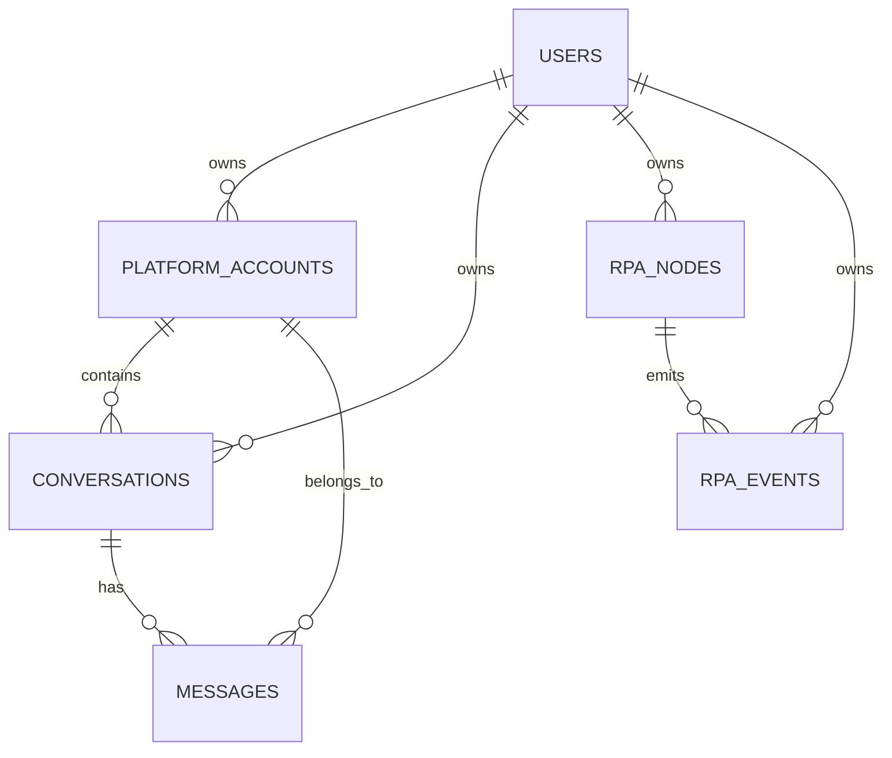

# AI 智能客服项目数据库设计

## 1. 设计目标

本项目数据库的目标不是单纯存聊天记录，而是支撑以下能力：

- 用户登录与数据隔离
- 平台账号与店铺账号管理
- 客户会话管理
- 聊天消息持久化
- RPA 采集结果落库
- RPA 发送结果回写
- 桌面端重启后的数据恢复

当前阶段先聚焦以下核心数据：

- 用户基础信息
- 平台账号 / 店铺账号信息
- 消息中心会话信息
- 消息中心聊天消息信息

其他功能后续再扩展。

---

## 2. 设计原则

### 2.1 多用户隔离

每个用户只能访问自己的数据。

所有核心业务表都应包含 `user_id`，后续如升级为团队/组织模式，再引入 `tenant_id`。

### 2.2 统一事实源

消息、会话、账号状态等最终以服务端数据库为准。

桌面端只负责展示，RPA 只负责采集与执行，不作为最终数据源。

### 2.3 保留原始数据

平台原始数据格式可能变化，RPA 解析规则也可能变化，因此建议保留：

- 标准化字段
- 原始 payload
- 来源标记

### 2.4 支持人工修正

RPA 不一定能稳定获取所有平台的店铺账号名，因此数据库必须支持：

- 自动识别值
- 人工补全值
- 人工值优先

---

## 3. 核心实体

当前阶段建议至少包含以下 6 张核心表：

1. `users`
2. `platform_accounts`
3. `conversations`
4. `messages`
5. `rpa_nodes`
6. `rpa_events`

---

## 4. users：用户表

存储系统登录用户的基础信息。

### 4.1 用途

- 登录认证
- 权限隔离
- 数据归属

### 4.2 建议字段

| 字段名 | 类型 | 说明 |
|---|---|---|
| `id` | bigint / uuid | 主键 |
| `username` | varchar | 登录名 |
| `password_hash` | varchar | 密码哈希 |
| `display_name` | varchar | 显示名称 |
| `phone` | varchar | 手机号 |
| `email` | varchar | 邮箱 |
| `status` | tinyint / varchar | 状态 |
| `created_at` | datetime | 创建时间 |
| `updated_at` | datetime | 更新时间 |

### 4.3 说明

如果后续支持组织或租户，可增加：

- `tenant_id`
- `role`

---

## 5. platform_accounts：平台账号 / 店铺账号表

这张表不是平台本身，而是平台上的具体店铺账号、客服账号或登录账号。

同一个平台下可能有多个店铺账号，因此不能只存平台名。

### 5.1 用途

- 绑定消息来源平台
- 绑定店铺账号
- 处理 RPA 识别不到账号名的情况
- 作为会话和消息的归属锚点

### 5.2 建议字段

| 字段名 | 类型 | 说明 |
|---|---|---|
| `id` | bigint / uuid | 主键 |
| `user_id` | bigint / uuid | 所属用户 |
| `platform_name` | varchar | 平台名，如千牛、拼多多、微信等 |
| `account_name` | varchar | 店铺账号名 / 客服账号名 |
| `account_external_id` | varchar | 平台侧账号唯一标识 |
| `display_name` | varchar | 展示名称 |
| `name_source` | varchar | 名称来源：`auto` / `manual` / `mixed` |
| `source_confidence` | decimal / int | 自动识别可信度，可选 |
| `is_verified` | boolean | 是否已确认 |
| `is_active` | boolean | 是否启用 |
| `last_seen_at` | datetime | 最近一次活跃时间 |
| `created_at` | datetime | 创建时间 |
| `updated_at` | datetime | 更新时间 |

### 5.3 说明

RPA 可能只能稳定识别平台，不能稳定识别店铺账号名，因此建议：

- 能自动识别的，写入 `account_name`
- 不能识别的，允许用户在界面上手工补全
- 人工补全后，`name_source` 置为 `manual`

如果后续 RPA 再次识别到结果，也不建议直接覆盖人工值，除非业务明确允许。

---

## 6. conversations：会话表

一条会话对应一个客户聊天线程。

### 6.1 用途

- 作为消息中心的会话列表基础
- 存储会话归属关系
- 记录会话最新状态
- 支撑重启后的会话恢复

### 6.2 建议字段

| 字段名 | 类型 | 说明 |
|---|---|---|
| `id` | bigint / uuid | 主键 |
| `user_id` | bigint / uuid | 所属用户 |
| `platform_account_id` | bigint / uuid | 所属平台账号 |
| `platform_name` | varchar | 平台名 |
| `client_name` | varchar | 客户名 |
| `client_external_id` | varchar | 客户平台侧唯一标识 |
| `conversation_external_id` | varchar | 平台侧会话 ID |
| `title` | varchar | 会话标题 |
| `last_message_at` | datetime | 最近消息时间 |
| `last_message_preview` | varchar | 最近消息摘要 |
| `unread_count` | int | 未读数 |
| `status` | varchar | 会话状态 |
| `created_at` | datetime | 创建时间 |
| `updated_at` | datetime | 更新时间 |

### 6.3 说明

建议保留多个外部标识字段：

- 客户平台 ID
- 会话平台 ID
- 平台账号 ID

原因是不同平台的标识粒度不同，不能假设所有平台都能提供同一种唯一键。

---

## 7. messages：消息表

消息表是整个系统最关键的表，负责存储所有聊天消息。

### 7.1 用途

- 聊天记录持久化
- 消息中心展示
- 历史消息恢复
- RPA 发送结果回写
- AI 回复链路上下文输入

### 7.2 建议字段

| 字段名 | 类型 | 说明 |
|---|---|---|
| `id` | bigint / uuid | 主键 |
| `user_id` | bigint / uuid | 所属用户 |
| `conversation_id` | bigint / uuid | 所属会话 |
| `platform_account_id` | bigint / uuid | 所属平台账号 |
| `platform_name` | varchar | 平台名 |
| `sender_role` | varchar | `customer` / `service` |
| `sender_name` | varchar | 发送方名称 |
| `content` | text | 标准化消息内容 |
| `content_type` | varchar | `text` / `image` / `file` / `voice` / `system` |
| `message_external_id` | varchar | 平台消息唯一标识 |
| `source_type` | varchar | `platform` / `rpa` / `manual` |
| `send_origin` | varchar | `platform_native` / `rpa_sent` |
| `send_status` | varchar | `pending` / `sent` / `failed` / `delivered` |
| `sent_at` | datetime | 发送时间 |
| `received_at` | datetime | 接收时间 |
| `raw_payload` | json / text | 平台原始数据 |
| `created_at` | datetime | 创建时间 |
| `updated_at` | datetime | 更新时间 |

### 7.3 关键区分

需要特别区分以下几组概念：

#### 7.3.1 客户消息 / 客服消息

- `sender_role = customer`：客户发出的消息
- `sender_role = service`：客服发出的消息

#### 7.3.2 平台原生消息 / RPA 发出的消息

- `source_type = platform`：平台原始存在的消息
- `source_type = rpa`：RPA 补录或回写的消息
- `source_type = manual`：人工补录或修正消息

#### 7.3.3 发送来源

- `send_origin = platform_native`：平台本身已有的客服消息
- `send_origin = rpa_sent`：由 RPA 代发的客服消息

这三个维度不能合并成一个字段，否则后续无法准确区分消息来源。

### 7.4 说明

建议保留 `raw_payload`，原因是：

- 平台格式可能变化
- RPA 解析规则可能变化
- 后期排查问题需要回放原始数据

---

## 8. 关系设计

推荐的核心关系如下：

关系含义：

- 一个用户拥有多个平台账号
- 一个用户拥有多个会话
- 一个用户拥有一个或多个本机 RPA 节点
- 一个平台账号下有多个会话
- 一个会话下有多条消息
- 一条消息必须能归属到一个用户、一个会话和一个平台账号
- 一个本机 RPA 节点可以产生多条原始事件

---

## 9. rpa_nodes：本机 RPA 节点表

每个用户本机运行一个 RPA 服务。该表用于记录用户本机 RPA 的注册、在线状态和版本信息。

### 9.1 用途

- 识别用户本机 RPA
- 判断 RPA 是否在线
- 记录 RPA 支持的平台
- 支撑云端向指定用户本机 RPA 下发任务
- 支撑问题排查和版本升级

### 9.2 建议字段

| 字段名 | 类型 | 说明 |
|---|---|---|
| `id` | bigint / uuid | 主键 |
| `user_id` | bigint / uuid | 所属用户 |
| `device_id` | varchar | 本机设备 ID |
| `machine_name` | varchar | Windows 机器名 |
| `rpa_version` | varchar | RPA 版本 |
| `app_version` | varchar | 桌面端版本 |
| `supported_platforms` | json / text | 支持的平台列表 |
| `status` | varchar | `online` / `offline` / `degraded` |
| `last_heartbeat_at` | datetime | 最近心跳时间 |
| `last_connected_at` | datetime | 最近连接时间 |
| `last_disconnected_at` | datetime | 最近断开时间 |
| `created_at` | datetime | 创建时间 |
| `updated_at` | datetime | 更新时间 |

### 9.3 说明

本项目采用“每个用户自己本机跑 RPA”的方式，因此 `rpa_nodes` 不代表集中式 RPA 机器，而是用户本机的本地采集代理。

同一用户后续可能更换电脑，或者在多台电脑上登录，因此不建议假设一个用户永远只有一个 RPA 节点。

---

## 10. rpa_events：RPA 原始事件表

该表用于保存本机 RPA 上报的原始事件。

业务表 `conversations` 和 `messages` 保存的是处理后的业务事实，`rpa_events` 保存的是 RPA 观察到的原始事件日志。

### 10.1 用途

- RPA 事件幂等去重
- 事件回放
- 问题排查
- 原始 payload 留存
- 失败重试
- 后续重新解析事件

### 10.2 建议字段

| 字段名 | 类型 | 说明 |
|---|---|---|
| `id` | bigint / uuid | 主键 |
| `user_id` | bigint / uuid | 所属用户 |
| `rpa_node_id` | bigint / uuid | 来源 RPA 节点 |
| `event_id` | varchar | RPA 事件 ID |
| `event_type` | varchar | 事件类型 |
| `platform_name` | varchar | 平台名 |
| `platform_account_id` | bigint / uuid | 平台账号 ID，可为空 |
| `rpa_account_id` | varchar | RPA 侧账号标识 |
| `conversation_key` | varchar | RPA 侧会话键 |
| `platform_msg_id` | varchar | 平台消息 ID，可为空 |
| `payload` | json / text | RPA 原始事件 payload |
| `occurred_at` | datetime | RPA 观察到事件的时间 |
| `received_at` | datetime | 服务端接收时间 |
| `processed_status` | varchar | `pending` / `processed` / `failed` / `ignored` |
| `processed_at` | datetime | 处理时间 |
| `error_reason` | varchar | 处理失败原因 |
| `created_at` | datetime | 创建时间 |

### 10.3 事件类型

结合现有 RPA 代码，第一阶段至少支持：

- `account_health_changed`
- `conversation_observed`
- `message_observed`
- `message_sent`
- `send_result_observed`

### 10.4 说明

`rpa_events` 不直接替代 `messages`。

推荐流程是：

1. 服务端接收 RPA 事件。
2. 写入 `rpa_events`。
3. 根据事件类型转换或更新业务表。
4. 成功后标记 `processed_status = processed`。

这样做可以保证 RPA 解析或业务落库逻辑出问题时，仍然保留原始事件，后续可以重新处理。

---

## 11. 数据隔离策略

### 11.1 当前阶段

所有表都带 `user_id`。

所有查询都默认按 `user_id` 过滤。

### 11.2 后续扩展

如果后续变成团队协作模式，可增加：

- `tenant_id`
- `organization_id`
- `role`

届时可以从“用户隔离”升级为“组织隔离”。

---

## 12. 索引建议

考虑到消息量会持续增长，建议提前设计索引。

### 12.1 users

- `username` 唯一索引

### 12.2 platform_accounts

- `user_id, platform_name`
- `account_external_id`

### 12.3 conversations

- `user_id, platform_account_id`
- `conversation_external_id`
- `last_message_at`

### 12.4 messages

- `conversation_id, created_at`
- `user_id, sent_at`
- `message_external_id`
- `platform_name, created_at`

### 12.5 rpa_nodes

- `user_id, device_id`
- `status, last_heartbeat_at`

### 12.6 rpa_events

- `event_id` 唯一索引
- `user_id, event_type, received_at`
- `rpa_node_id, received_at`
- `platform_name, conversation_key`
- `platform_msg_id`

---

## 13. 数据保留策略

建议至少保留：

- 会话历史消息
- 原始 payload
- 发送结果
- 失败原因

这样后续可以支持：

- 重试
- 审计
- 问题排查
- AI 回复上下文重建

---

## 14. 当前最小可行数据库范围

如果先只覆盖当前已明确需求，最小数据库范围就是：

1. `users`
2. `platform_accounts`
3. `conversations`
4. `messages`
5. `rpa_nodes`
6. `rpa_events`

这六张表足以支撑：

- 登录
- 平台账号管理
- 消息中心会话展示
- 聊天消息展示
- RPA 消息同步
- 本机 RPA 节点注册和在线状态
- RPA 原始事件留存与幂等处理
- 桌面端重启恢复

---

## 15. 后续扩展方向

后续可再补充以下表：

- 知识库元数据表
- 知识条目表
- 向量索引映射表
- AI 回复策略表
- RPA 任务表
- 操作日志表
- 审计日志表

这些内容可以在后续文档中继续展开。
