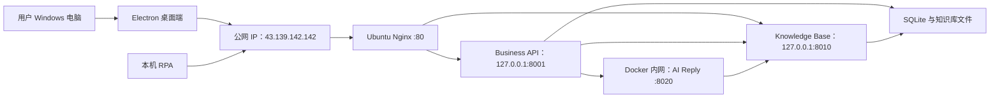

# 第一版打包与部署方案

## 1. 文档目的

本文记录当前项目第一版对外试用的打包与部署讨论，并作为后续实施、验收和迁移的基础。

第一版只交付当前已经重点实现的拼多多多账号能力。微信及其他平台、仍标记为“开发中”的入口，以及尚未完成端到端验收的能力，不纳入第一版正式承诺范围。

本文讨论日期为 2026-08-11。

## 2. 第一版目标

第一版采用“小范围试用”方式交付，而不是直接作为大规模生产版本发布。

- 桌面前端安装在其他用户的 Windows 电脑上。
- 本机 RPA 随桌面应用一并交付，并由 Electron 负责启动、停止和状态管理。
- 业务后端、知识库服务和 AI 回复服务直接部署到现有 Ubuntu 22.04 云服务器。
- 业务数据库和知识库数据保存在云服务器的持久化数据卷中。
- 首版直接使用公网 IP `43.139.142.142`，暂不将域名、备案和 HTTPS 作为上线前置条件。
- 后续补充域名和 HTTPS，或迁移到其他 Linux 服务器时，桌面端与 RPA 的职责边界保持不变。

首批用户规模建议控制在 3 至 5 个低并发试用用户。完成真实运行观察、数据隔离和故障恢复验证后，再决定是否扩大范围。

## 3. 部署边界



### 3.1 用户电脑

用户电脑只负责运行以下组件：

- Electron 桌面应用；
- 拼多多多账号工作区；
- 本机 RPA 采集和执行代理；
- RPA 离线事件缓存、诊断日志和平台登录状态。

用户不应单独安装 Node.js、pnpm、Python 或项目源代码。最终交付物应尽量只有一个 Windows 安装包。

### 3.2 Ubuntu 云服务器

现有 Ubuntu 22.04 云服务器配置为 4 核 CPU、4 GB 内存、40 GB SSD、3 Mbps 带宽和 300 GB/月流量。该配置足以承载第一版 3 至 5 个低并发试用用户，不在服务器本地运行大模型。

云服务器承担以下角色：

- Business API：用户鉴权、业务数据、会话消息、机器人配置和 RPA 任务编排；
- Knowledge Base：QA、产品文档、语气知识及相关资源；
- AI Reply：意图、检索和回复决策；
- SQLite 数据库、知识库文件和服务日志；
- Docker Compose 服务编排和进程重启。

首版中，桌面端直接访问经过鉴权的 Knowledge Base，但统一通过 Nginx 的公网 `80` 端口进入。Business API 和 Knowledge Base 分别只映射到服务器回环地址 `127.0.0.1:8001` 和 `127.0.0.1:8010`；AI Reply 只允许 Docker 内网访问，不映射主机或公网 `8020` 端口。

服务器建议配置 2 至 4 GB Swap，并限制 Docker 日志大小。40 GB 磁盘当前约使用 15 GB，首版可用，但数据库、知识库资源、镜像和日志需要设置容量告警及异机备份。

### 3.3 后续演进

后续申请域名并配置 HTTPS 后，用户电脑上的 Electron 和 RPA 结构不变，只替换服务地址。为避免长期固化公网 IP，桌面端应尽量从受控的运行时配置读取服务地址。

## 4. 当前代码基础

项目已经具备以下基础：

- `apps/desktop/package.json` 已配置 `electron-builder` 和 Windows NSIS 目标；
- `pnpm dist` 可作为桌面安装包构建入口；
- Electron 已负责启动和停止本机 Python RPA 子进程；
- RPA 会主动向 Business API 注册、心跳、同步店铺、上传事件和拉取任务；
- RPA 使用本地 SQLite 缓存待上传事件，具备基础断线补传能力；
- Business API 已按登录用户隔离大部分核心业务数据；
- 三个 Python 服务均提供 `/healthz` 健康检查。

这些基础与目标部署形态一致。阶段一至阶段三已完成代码、打包和 Ubuntu 部署，是否向外部用户发布仍取决于阶段四的干净电脑与真实店铺验收。

## 5. 对外试用前的阻塞项

### 5.1 桌面端仍默认访问本机地址

阶段二改造前，桌面渲染进程在正式构建下默认访问：

- Business API：`http://127.0.0.1:8001/api/v1`；
- Knowledge Base：`http://127.0.0.1:8010/api/v1`；
- WebSocket 根据 Business API 地址推导或读取构建变量。

Electron 主进程启动 RPA 时也默认传入本机 Business API 地址。因此，当前安装包安装到其他电脑后会错误访问用户自己的 `127.0.0.1`。

阶段二现已增加安装包内的 `runtime-config.json`，桌面渲染进程、WebSocket、Electron
主进程和 RPA 共用 `apps/desktop/config/release.json` 生成的同一组地址。发布校验会拒绝
`127.0.0.1`、`localhost` 和 `::1`，避免正式安装包误连用户电脑本机。

### 5.2 RPA 没有真正做到免 Python 安装

阶段二改造前，NSIS 配置只将 `agents/rpa/agent.py` 和 README 放入安装包，Electron
默认通过命令 `python` 启动该脚本，所以目标电脑仍需预装兼容版本的 Python。

阶段二现已使用固定版本的 PyInstaller 将 RPA 构建为独立的 `rpa-agent.exe`。Electron
在开发环境继续通过 Python 启动脚本，在打包环境只启动安装包资源目录内的可执行文件。
实际构建产物已通过独立启动、SQLite 队列初始化和正常退出冒烟测试。

### 5.3 知识库缺少用户鉴权和数据隔离

阶段一改造前，桌面端直接访问的 Knowledge Base 没有登录鉴权，其数据表也没有 `user_id`。阶段一现已完成 JWT 鉴权和用户隔离改造。

这是多用户试用前的硬性阻塞项。第一版保留桌面端直连 Knowledge Base，不经过 Business API 转发，但必须完成以下改造：

1. 桌面端访问 Knowledge Base 时携带 Business API 登录后签发的 Bearer access token；
2. Knowledge Base 使用与 Business API 一致的 JWT 验签参数，校验令牌签名、有效期、`typ=access` 和 `sub` 用户标识；
3. `knowledge_bases` 增加 `user_id`，所有列表、详情、创建、修改和删除均强制使用令牌中的 `sub` 作为归属条件；
4. QA 分类、QA 条目、文档、文档分块和图片资源必须通过所属知识库继承并校验用户归属，不能只按资源 ID 查询；
5. 接口不得信任桌面端提交的 `user_id`，资源归属只能来自已验证令牌；
6. Business API 在机器人绑定知识库时校验知识库属于当前用户；
7. AI Reply 访问知识库时必须携带可信的用户上下文和内部服务凭据，不能通过公网接受可伪造的用户 ID；
8. 跨用户访问统一返回 `404` 或无权限结果，避免泄露资源是否存在。

Knowledge Base 的 CORS 配置需要允许打包后的 Electron `file://` 页面发起请求和携带 `Authorization` 请求头，但 CORS 不能代替鉴权；真正的数据边界必须由服务端 JWT 校验和 SQL 查询条件保证。

Business API 与 Knowledge Base 暂时共享 JWT 验签密钥可以减少首版改造量，但该密钥只能作为服务器环境变量保存，不能进入桌面安装包。后续可升级为非对称签名或令牌校验接口。

第一版可先按“一套系统账号对应一个客户或团队”运行。当前尚未形成完整租户和组织模型，不适合直接支持同一企业下多个操作员共享数据和权限。

### 5.4 注册和默认配置仍属于开发环境

公开注册接口和桌面端注册入口已在阶段一关闭。账号暂由服务端管理员维护，不引入邀请码。

发布环境至少需要：

- 设置 `ENVIRONMENT=production`；
- 使用不可提交到仓库的强随机 `JWT_SECRET_KEY`；
- 修改默认管理员用户名和密码；
- 设置 `SEED_DEMO_DATA=false`；
- 保持公开注册关闭，账号由服务端管理员维护；
- 配置登录限流和连续失败日志；
- 按实际桌面来源收紧 CORS；
- 禁止将 AI API Key、SMTP 授权码等秘密写入安装包。

### 5.5 云服务器需要生产运行保障

Ubuntu 云服务器需要处理以下运行问题：

- Docker 服务和业务容器开机自动启动；
- 服务异常退出后自动重启；
- 对 Business API、Knowledge Base 和 AI Reply 执行持续健康检查；
- 记录并轮转服务日志；
- 定期执行异机备份；
- 对公网入口、数据库增长和磁盘空间进行监控。

阶段三已完成前三项，并配置 Docker JSON 日志轮转、每日本机备份、恢复脚本、2 GB Swap 和 UFW。当前备份仍位于云服务器同一块系统盘，异地备份和正式监控告警尚待补充；恢复脚本已完成静态检查，但为避免破坏现有生产数据，尚未执行覆盖式恢复演练。

## 6. 首版公网 IP 网络方案

桌面端和 RPA 均应主动连接服务端，不需要服务端反向访问用户电脑。这种模式可以适应用户电脑处于 NAT、动态 IP 或防火墙之后的情况。

第一版直接使用公网 IP，不等待域名、备案和证书：

```text
Business API：http://43.139.142.142/api/v1
WebSocket：ws://43.139.142.142/ws/events
Knowledge Base：http://43.139.142.142/kb-api/api/v1
```

云服务器安全组和系统防火墙首版只开放：

- `22`：SSH 管理，优先使用密钥登录并限制来源 IP；
- `80`：Nginx 统一承载 Business API、WebSocket 和经过 JWT 鉴权的 Knowledge Base；
- `8001`、`8010`：只绑定服务器回环地址，不对公网开放；
- `8020`：无主机端口映射，只允许 Docker 内网访问。

Business API 和 Knowledge Base 均监听容器内的 `0.0.0.0`，由 Docker 映射到服务器回环地址，再由 Nginx 按路径反向代理。Nginx 使用独立的 `43.139.142.142` 虚拟主机，服务器原有 `iwg.wang` 个人站点保持不变。数据库文件、上传目录和服务环境文件不通过静态目录或其他端口公开。

使用公网 IP 和 HTTP 可以满足“先部署并可用”的目标，但登录密码、Token、聊天内容和知识库数据会以未加密方式经过网络。这是首版主动接受的临时风险，只适合少量可信试用用户。域名和 HTTPS 应列为部署成功后的优先改进项，不阻塞本轮上线。

## 7. 桌面端和 RPA 打包方案

### 7.1 交付物

首版建议只提供一个带版本号的 NSIS 安装包，例如：

```text
AI智能客服-拼多多试用版-1.0.0-Setup.exe
```

安装包至少包含：

- Electron 主进程和渲染资源；
- 拼多多工作区及 preload 脚本；
- 独立 RPA 可执行文件；
- 应用图标和卸载入口；
- 必要的默认配置，但不包含服务端秘密。

### 7.2 环境配置

发布地址不应依赖开发者在命令行临时设置环境变量。建议维护明确的发布配置和构建脚本，统一设置：

- Business API URL；
- Knowledge Base URL；
- WebSocket URL；
- 应用版本和渠道；
- RPA 可执行文件路径；
- 是否启用诊断日志；
- 第一版允许展示的平台和功能。

当前实现没有把地址散落固化在 Vite 代码中，而是由 Electron 主进程读取安装包内受控的
`runtime-config.json`，再安全地传给渲染进程和 RPA。切换服务器或域名时修改
`apps/desktop/config/release.json` 后重新构建即可；运行配置不得包含任何服务端秘密。

2026-08-13 完成最新功能优化和服务端更新后，已按上述公网路径重新构建安装包：

```text
apps/desktop/release-windows/20260813-113840/AI智能客服-拼多多试用版-1.0.0-Setup.exe
SHA-256: 4CE67017FC31C0CD317E73215C0E9ACD0726200ABCC4AFD10C1ADACBA98D9B3B
```

安装包大小为 `110492303` 字节，已通过包内容校验，以及包含中文店铺名称的 RPA 独立运行和服务同步冒烟测试。

### 7.3 版本升级

第一版可以先采用人工下载新安装包覆盖安装，不必立即建设自动更新服务，但必须验证：

- 覆盖升级不会删除 Electron `userData`；
- 拼多多账号分区和登录状态能够保留；
- RPA 离线队列和诊断日志能够保留；
- 新旧版本的数据格式兼容或有明确迁移逻辑；
- 回退版本不会破坏现有数据。

## 8. 数据和备份

Ubuntu 云服务器至少需要备份以下内容：

- Business API SQLite 数据库；
- Knowledge Base SQLite 数据库；
- 知识库上传资源；
- 必要的服务端环境配置；
- 用于排障的关键运行日志。

备份不能只保存在云服务器的同一块系统盘，应每天复制到另一台机器、NAS、对象存储或可信云存储，并定期验证能够恢复。

当前已启用 `ai-customer-service-backup.timer` 每日自动备份，归档权限为 `0600`，备份脚本会先停止 SQLite 写入服务，完成归档后重新启动并等待三个容器恢复健康。2026-08-11 的人工触发备份已成功；异地备份目的地尚未配置，恢复脚本尚未对现有生产数据执行破坏性演练。

SQLite 可以暂时支持少量低并发试用用户，但需要遵守以下限制：

- 不运行多个共同写入同一 SQLite 文件的 Uvicorn worker；
- 避免在服务运行时直接复制一个正在高频写入的数据库文件；
- 观察数据库锁、写入延迟、磁盘容量和备份耗时；
- 扩大用户规模前迁移到 PostgreSQL。

## 9. 第一版产品范围与风险提示

第一版产品名称和说明中应明确“仅支持拼多多多账号”。微信和其他未完成平台入口应隐藏，而不是展示后标记为不可用。

AI 自动发送建议默认关闭，并同时保留以下保护：

- 管理后台自动回复总开关；
- 单个机器人自动发送开关；
- 敏感词和违禁词处理；
- 超时安抚和人工接管；
- RPA 节点离线状态提示；
- 真实发送前的店铺级验收。

拼多多页面结构、登录风控及平台规则可能变化，RPA 采集和发送不能承诺永久完全无人值守。首版应向试用用户明确这一限制，并提供诊断日志和人工处理路径。

## 10. 推荐实施顺序

### 阶段一：发布安全和数据隔离

状态：已完成代码实施、自动化验证和生产环境配置；生产库检查确认没有待迁移的无归属知识库记录。

1. [x] 增加生产环境配置校验，生产环境拒绝开发 JWT、默认管理员密码和演示数据；
2. [x] 直接关闭公开注册，不引入邀请码；
3. [x] 完成知识库 JWT 鉴权、用户归属和全资源接口隔离；
4. [x] 保证机器人与知识库的绑定不能跨用户；
5. [x] 消息中心和机器人配置仅展示拼多多，并隐藏明确未完成的交互入口；
6. [x] Ubuntu 生产库检查确认无 `user_id` 为空的历史知识库；当前无需设置 `KB_LEGACY_OWNER_USER_ID` 迁移旧数据。

### 阶段二：客户端发布工程

状态：已完成发布工程和本机构建验证；干净 Windows 电脑安装、真实店铺验收和覆盖升级验证归入阶段四。

1. [x] 使用单一 `runtime-config.json` 统一桌面端、WebSocket、Electron 和 RPA 的远程服务地址；
2. [x] 使用 PyInstaller 将 RPA 打包为独立的 `rpa-agent.exe`；
3. [x] Electron 在开发环境启动 Python 脚本，在打包环境只启动 RPA 可执行文件；
4. [x] 完成 NSIS 产品名、版本化安装包名、按用户安装、可选目录、快捷方式和数据保留配置；
5. [x] 复用现有客服耳麦资产，生成包含 16 至 256 像素图层的 Windows 应用图标；
6. [x] 产出可重复执行的 `pnpm dist` 发布命令和 `apps/desktop/RELEASE.md` 构建说明；
7. [x] 本机实际生成 `AI智能客服-拼多多试用版-1.0.0-Setup.exe`，并验证安装包包含远程配置和独立 RPA，不再包含 `agent.py`。

当前安装包尚未配置 Authenticode 代码签名证书，Windows 可能显示“未知发布者”或
SmartScreen 提示。小范围试用可通过可信渠道分发并同时提供 SHA-256，扩大分发前应补充
正式代码签名；这不影响阶段二工程完成状态，但属于对外分发风险。

### 阶段三：Ubuntu 服务端部署

状态：核心部署已完成并通过公网与故障恢复验证；异地备份和覆盖式恢复演练作为上线后运维待办保留。

1. [x] 为三个 Python 服务补充 Dockerfile 和 Docker Compose；
2. [x] 使用 Nginx 公网 `80` 端口按路径代理 Business API、WebSocket 和 Knowledge Base，`8001/8010` 仅绑定回环地址；
3. [x] AI Reply 仅加入 Docker 内网，不映射主机或公网端口；
4. [x] 配置持久化数据目录、2 GB Swap、自动重启、健康检查和容器内存限制；
5. [x] 配置 Docker 日志轮转、本机每日备份、恢复脚本和 systemd 定时器；
6. [x] 配置 UFW 只放行 OpenSSH 和公网 `80`，同时保留原有个人网站；
7. [x] 验证公网健康检查、登录、WebSocket、知识库鉴权、CORS、容器异常退出和自动恢复；
8. [x] 配置 AI Reply 的知识库公网资源基址，避免向桌面端返回 Docker 内网图片 URL；
9. [x] 将 AI 服务商密钥统一保存在服务器环境变量中，Business API 可同步共享模型目录，机器人按目录选择具体模型；
10. [x] 知识库增加公开/私有可见性，公开库支持跨用户只读查看和机器人绑定，编辑删除仍只允许创建者；
11. [ ] 将每日备份复制到异机或对象存储，并执行一次隔离环境恢复演练。

2026-08-13 最新发布记录：

- Ubuntu 三个容器已重建并全部通过健康检查；
- 部署前备份：`/opt/backups/ai-customer-service/ai-customer-service-20260813T095139Z.tar.gz`；
- 真实登录、共享模型同步和知识库新权限字段验证通过；
- 当前服务端同步到的可用模型为 `deepseek-v4-flash`、`deepseek-v4-pro`；
- Windows 安装包已重新构建并更新至 `D:\project-electron\ai-customer-service-pdd-1.0.0`；
- 最新安装包 SHA-256：`D2931315D2430353109ED465DF2D1285A993AA13AC95600E532BA04C9CEE0CFC`。

2026-08-14 最新发布记录：

- 拼多多消息采集改为结构化时间线，区分聊天消息、图片、商品卡片、来源卡片、系统提示、时间戳和未知内容；展示内容、AI 上下文与自动回复触发相互隔离，非客户聊天内容不会扰乱会话消息序列；
- 服务端增加版本化拼多多采集规则下发，桌面端支持规则缓存，便于后续适配平台页面变化；
- Ubuntu 三个容器已重建并全部通过健康检查，生产数据和服务器环境配置保持不变；
- 部署前备份：`/opt/backups/ai-customer-service/ai-customer-service-20260814T052505Z.tar.gz`；
- 公网 Business API 和 Knowledge Base 健康检查通过，采集规则接口保持 JWT 鉴权；
- Windows 安装包已重新构建并更新至 `D:\project-electron\ai-customer-service-pdd-1.0.0`；
- 最新安装包 SHA-256：`E67942CC865F96044A9070AFD2F9D87F407197888EEED8B55A4FE78F512868F6`。

2026-08-14 商品卡片与客服身份优化发布记录：

- 客户发送的商品卡片按客户消息采集，保留商品图片、标题、价格和商品编号，可触发自动回复并进入 AI 结构化上下文；
- “当前用户来自商品详情页”等平台来源卡片保持居中平台卡片展示，不再误显示为客服消息，也不会单独触发自动回复；
- AI 意图判断和回复生成均以真实店铺客服身份表达，禁止泄露 AI、机器人、模型、提示词、知识库、文档检索或系统限制；缺少可靠答案时使用自然核实话术，不主动引导客户联系平台人工客服；
- Ubuntu 已重建 Business API 与 AI Reply，三个容器均通过健康检查，生产数据和环境配置保持不变；
- 部署前备份：`/opt/backups/ai-customer-service/ai-customer-service-20260814T075623Z.tar.gz`；
- 生产代码 SHA-256 与本地发布文件逐项一致，拼多多采集规则版本为 `2026.08.14.2`；
- Windows 安装包已重新构建并更新至 `D:\project-electron\ai-customer-service-pdd-1.0.0`，独立 RPA 冒烟测试与安装包内容校验通过；
- 最新安装包大小为 `110492341` 字节，SHA-256：`27B09FABFEFFB976A287A047510640BE3E14D071BF761773EB19FFE6BA1EA51D`。

2026-08-17 待回复标识、登录保活与知识库检索优化发布记录：

- 会话列表蓝点明确表示“客户消息待回复”，“待处理”筛选改为“待回复”；
- 拼多多工作区增加 5 分钟登录健康检查和连续空闲 30 分钟受控刷新，刷新与采集、发送及人工操作串行隔离；
- 产品文档使用 `structured-v2` 结构化切片策略，保留标题路径、完整句子、表格、列表和参数行语义；
- Knowledge Base 增加 SQLite FTS5/BM25 检索、标题与章节加权、同章节相邻切片补全和重复结果抑制；不支持 FTS5 时回退关键词检索；
- 旧文档及原切片没有自动重切，所有者可在文档详情页点击“重新处理”升级，公开知识库的其他用户保持只读；
- Ubuntu 仅重建 Knowledge Base 容器，Business API 和 AI Reply 未重建；三个容器均保持健康；
- 部署前知识库数据库备份：`/opt/backups/ai-customer-service/knowledge-base-before-20260817T101423.db`；
- 线上迁移保留 4 份文档和 27 个原切片，FTS5 已索引 27 条，生产只读检索返回 `fts5_bm25`；
- Windows 安装包已重新构建并更新至 `D:\project-electron\ai-customer-service-pdd-1.0.0`，包内配置校验与独立 RPA 冒烟测试通过；
- 最新安装包大小为 `110497428` 字节，SHA-256：`D64C6203CE9C5287FCC9E1FC4AC4679C2AE3F8620D2B7FC5A292DA7FF933157D`。

2026-08-17 模型目录与交互细节优化发布记录：

- 新建机器人会自动加载模型目录并默认使用 `deepseek-v4-flash`，模型选择改为自定义下拉框；AI 模型配置页改为“查看模型数据”；
- 服务端模型目录仅保留 `deepseek-v4-flash` 和 `deepseek-v4-pro`，3 份用户模型配置和 2 个旧机器人配置已从 `deepseek-chat` 迁移至 `deepseek-v4-flash`；
- 修复导入消息弹窗重复打开状态、三类话术开关样式、自动回复成功后待回复蓝点，以及“3年内无订单”等明确空状态触发追单的逻辑；
- Ubuntu 已重建 Business API 与 AI Reply，Knowledge Base 未重建；三个容器均通过健康检查，公网 Business API 和 Knowledge Base 健康检查均返回 HTTP 200；
- 部署前完整生产备份：`/opt/backups/ai-customer-service/ai-customer-service-20260817T053115Z.tar.gz`；
- 生产数据核验保留 5 个用户、6 个会话、6 个知识库，其中 3 个公开知识库；
- Windows 安装包已重新构建并更新至 `D:\project-electron\ai-customer-service-pdd-1.0.0`，包内配置校验与独立 RPA 冒烟测试通过；
- 最新安装包大小为 `110498992` 字节，SHA-256：`C73924B555D5D147A677471F8D9DE07082772FB011AB3CEA34263E877B5CB97E`。

2026-08-17 会话快照对齐恢复发布记录：

- 修复商品卡片等结构化消息的历史指纹计算，避免服务端已存消息与新采集快照因消息类型不一致而持续无法对齐；
- “清空聊天记录”和“删除会话”改为同步清理消息、快照、RPA 采集事件、自动回复任务和去重状态，使会话能够从下一次平台快照重新建立采集基线；
- 增加按会话隔离的消息快照对齐故障状态；检测到未读消息但无法对齐时，聊天区显示告警，会话列表显示橙色图标，不阻塞其他会话的采集和处理；
- 告警支持查看服务端保存的采集快照、暂时忽略和二次确认重建；重建仅作用于当前会话，按快照顺序追加消息，并禁止恢复消息触发自动回复；后续快照正常对齐时自动解除告警；
- Ubuntu 已重建 Business API；Knowledge Base 与 AI Reply 未重建镜像，但因 Compose 依赖关系在部署期间短暂重启；三个容器最终均为 healthy，公网健康检查返回 HTTP 200；
- 部署前完整生产备份：`/opt/backups/ai-customer-service/ai-customer-service-20260817T071951Z.tar.gz`；
- 生产数据核验保留 5 个用户、8 个会话、6 个知识库，其中 3 个公开知识库；新增会话重建接口保持 JWT 鉴权，未登录请求返回 HTTP 401；
- Business API 自动化测试共 176 项通过；桌面 TypeScript 检查、生产构建、告警与重建浏览器交互验证均通过；
- Windows 安装包已重新构建并更新至 `D:\project-electron\ai-customer-service-pdd-1.0.0`，包内生产配置和独立 `rpa-agent.exe` 校验通过；
- 最新安装包大小为 `110499184` 字节，SHA-256：`0F7D342D1E921A019D0EE901FE2483DB62817B941495D2E7E0EBAAF957B38EAF`。

### 阶段四：真实验收和试用发布

1. 在没有 Python、Node.js 和 pnpm 的干净 Windows 10/11 电脑上安装；
2. 使用真实拼多多店铺验证多账号登录和恢复；
3. 验证消息采集、人工发送、图片发送和 AI 回复；
4. 验证断网、服务重启、客户端重启和覆盖升级；
5. 先发布给少量可直接联系的试用用户；
6. 根据运行日志和反馈决定是否扩大范围。

## 11. 第一版发布验收清单

只有以下项目全部通过后，才建议向外部用户发送安装包：

- [ ] 安装包可在干净 Windows 10/11 环境独立安装；
- [x] 安装包结构和 RPA 可执行文件冒烟测试确认运行时不依赖 Python、Node.js 或 pnpm；
- [x] 发布配置校验确认桌面端和 RPA 使用 `43.139.142.142`，并拒绝用户电脑的回环地址；
- [x] Business API 的 HTTP 和 WebSocket 通过 Nginx 公网 `80` 可用；
- [x] Knowledge Base 通过 `/kb-api` 公网路径可用，所有业务接口均要求有效 access token；
- [x] AI Reply 的 `8020` 没有主机监听或公网映射；
- [x] 自动化测试验证不同用户的知识库、QA 和文档互相隔离；
- [x] 自动化测试确认 QA、文档、分块和图片资源不能通过资源 ID 跨用户访问；
- [x] 自动化测试确认公开知识库可跨用户只读访问和绑定，非创建者不能编辑或删除；
- [x] AI 模型页面仅展示服务端共享模型目录，不向桌面端返回 API Key 或 Base URL；
- [x] 公开注册接口和桌面端注册入口已关闭；
- [x] 生产 JWT 密钥和管理员密码仅保存在服务器 `0600` 环境文件中，未进入仓库或安装包；
- [x] 演示数据在生产环境关闭；
- [ ] 拼多多多账号添加、切换、暂停、移除和恢复通过验证；
- [ ] 客户消息采集、人工文本和图片发送通过验证；
- [ ] AI 回复测试、正式回复开关和人工接管通过验证；
- [ ] 网络中断后 RPA 事件能够补传且不会重复写入；
- [ ] 服务端重启后客户端能够自动恢复连接；
- [x] 容器进程异常退出后能够自动重启并恢复健康；
- [ ] 覆盖升级不会清除用户本地账号和 RPA 数据；
- [ ] 数据备份能够在另一目录或另一台机器恢复；
- [ ] 已准备试用说明、已知限制和问题反馈方式。

## 12. 上线后的服务端演进

当前第一版已经直接部署到 Linux 云服务器。试用运行稳定后建议继续完成：

- SQLite 数据迁移到 PostgreSQL；
- 知识库资源迁移到服务器文件存储或对象存储；
- 申请域名，并在现有 Nginx 网关上配置 HTTPS/WSS；
- 获得证书后将公网 HTTP 流量从 `80` 跳转到 `443`；
- 增加正式监控、告警、日志和备份策略。

接口契约应保持稳定。桌面端已经统一使用运行时配置；当前切换服务器或域名仍需更新安装包中的 `runtime-config.json` 并重新构建，后续若增加受信任的远程配置下发机制，才可以不重新发布安装包。

## 13. 结论

“用户电脑运行 Electron + 本机 RPA，Ubuntu 云服务器承载业务后端、知识库和 AI 服务”符合现有架构方向，也适合作为拼多多多账号第一版的小范围试用方案。现有 4 核、4 GB 内存、40 GB SSD 和 3 Mbps 带宽配置足以支撑首批少量用户。

第一版可以直接使用公网 IP 和 HTTP，暂不处理域名、备案和 HTTPS。桌面端可直接访问 Knowledge Base，无需经过 Business API 转发，但 Knowledge Base 自身的 JWT 鉴权、完整用户数据隔离和机器人绑定归属校验必须在发布前完成。除此之外，还必须解决远程地址、RPA 免 Python 打包、注册控制、生产密钥、Docker 持久化和服务守护问题。完成这些工作并通过干净电脑与真实店铺验收后，再交付首批用户。
