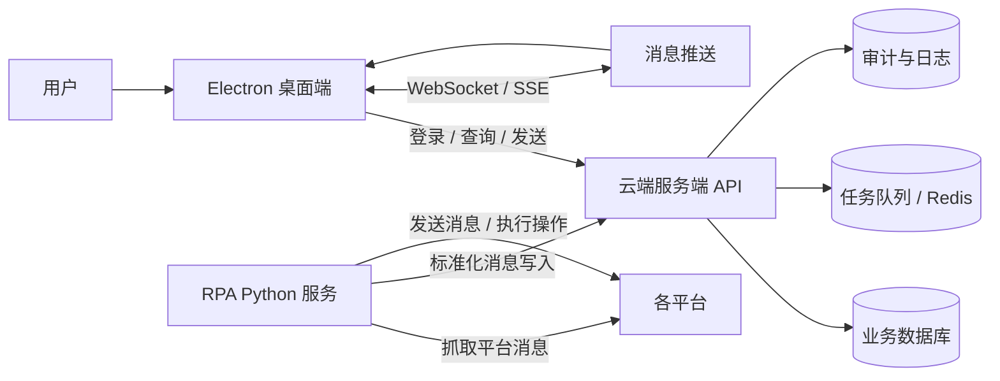

# AI 智能客服桌面应用项目架构设计

## 1. 背景

本项目是一个面向约 100 名用户使用的 AI 智能客服桌面应用。

当前仓库中的代码主要包含：

- Electron 桌面壳
- 消息中心前端页面及部分交互逻辑
- AI 客服管理后台前端页面及部分交互逻辑

但完整业务能力还缺少后端支撑，尤其是：

- 登录与权限控制
- 消息、会话、账号等数据持久化
- 桌面端与云端的数据同步
- 多平台消息采集
- RPA 采集与发送逻辑

本项目的特殊性在于：RPA 逻辑不能全部放进服务端，也不适合放进桌面端，而是应作为独立 Python 服务运行。

---

## 2. 架构目标

1. 桌面端负责展示和交互，不承载核心业务状态。
2. 服务端作为统一事实源，负责权限、数据和同步。
3. RPA 作为独立采集/执行层，按平台拆分实现，不强行共用一套逻辑。
4. 支持桌面应用重启后自动恢复历史消息与会话状态。
5. 支持多用户、多账号、多平台隔离，避免数据串用。

---

## 3. 总体架构



推荐的边界是：

- Electron：界面层
- 服务端：业务层、数据层、权限层
- RPA：平台适配层、自动化执行层

---

## 4. 各组件职责

### 4.1 Electron 桌面端

职责：

- 登录界面
- 消息中心界面
- AI 客服管理后台界面
- 本地会话状态管理
- 实时接收服务端推送
- 触发消息发送、账号切换、后台管理等操作

不承担：

- 消息持久化
- 平台抓取
- 平台账号登录态维护
- 核心业务规则判定

### 4.2 云端服务端

职责：

- 用户认证与授权
- 租户隔离与数据权限控制
- 会话、消息、平台账号等数据持久化
- 消息入库与查询
- 向桌面端推送消息增量
- 接收 RPA 标准化后的消息事件
- 接收桌面端发起的发送/操作请求，再分发给 RPA

建议采用“模块化单体”起步，而不是一开始拆成很多微服务。

### 4.3 Python RPA 服务

职责：

- 按平台独立实现采集逻辑
- 按平台独立实现发送逻辑
- 将平台原始数据转换成统一消息模型
- 持续上报消息变更、会话变化、状态变化
- 执行服务端下发的自动化任务

重要原则：

- 千牛、拼多多、微信、QQ、抖音、快手、小红书等平台不要共用一套抓取实现
- 可共用的是“统一消息协议”和“任务协议”，不是平台适配代码

---

## 5. 核心业务流

### 5.1 登录流程

1. 用户打开桌面端。
2. 桌面端请求服务端登录接口。
3. 服务端校验账号、返回 token 和用户权限信息。
4. 桌面端进入消息中心，并拉取首屏数据。

### 5.2 消息采集流程

1. RPA 持续从各平台采集新消息。
2. RPA 将消息标准化后提交给服务端。
3. 服务端入库，并更新会话最后消息、未读数、同步游标。
4. 服务端向在线桌面端推送增量。
5. 桌面端刷新消息列表和聊天窗口。

### 5.3 消息发送流程

1. 桌面端发起发送操作。
2. 服务端校验权限、会话状态和平台状态。
3. 服务端下发发送任务给对应 RPA。
4. RPA 在对应平台完成发送。
5. 服务端记录发送结果并回写数据库。
6. 桌面端更新发送状态。

### 5.4 重启恢复流程

1. 桌面端重启。
2. 重新登录或自动恢复 token。
3. 拉取服务端上的会话、消息、未读数、任务状态。
4. 直接恢复到上次中断前的展示状态。

---

## 6. 数据与持久化设计

服务端数据库应作为唯一持久化来源，至少包含以下实体：

- 用户（User）
- 租户 / 组织（Tenant）
- 平台账号（PlatformAccount）
- 会话（Conversation）
- 消息（Message）
- 同步游标（SyncCursor）
- RPA 任务（RpaJob）
- 审计日志（AuditLog）

建议的归属关系：

- 一个用户属于一个租户或组织
- 一个租户下可以有多个平台账号
- 一个平台账号下可以有多个会话
- 一个会话下有多条消息
- 每条消息必须能追溯到来源平台、来源账号、所属用户/租户

关键约束：

- 所有查询默认按租户隔离
- 所有写入都要记录操作者、来源服务、时间戳
- 所有同步任务都要可重试、可幂等

---

## 7. 接口边界建议

### 7.1 桌面端 -> 服务端

建议最少包含：

- 登录 / 刷新 token
- 获取会话列表
- 获取消息历史
- 发送消息
- 获取平台状态
- 获取后台配置

### 7.2 服务端 -> RPA

建议最少包含：

- 下发采集任务
- 下发发送任务
- 下发重连任务
- 查询任务执行结果

### 7.3 RPA -> 服务端

建议最少包含：

- 消息上报
- 会话状态上报
- 平台在线状态上报
- 任务执行结果回传

---

## 8. 部署建议

推荐部署形态：

- 桌面端：用户 Windows 电脑本地安装
- 本机 RPA：随桌面端部署在用户 Windows 电脑上
- 业务服务端：Linux 云服务器部署
- 知识库服务：Linux 云服务器部署
- AI 回复服务：Linux 云服务器部署
- 数据库：Linux 云服务器或独立云数据库部署
- Redis / 队列：Linux 云服务器或独立云组件部署
- 文件存储：云端对象存储或服务端文件存储

RPA 服务需要运行在 Windows 环境中，因为现有实现依赖 Win32、UI Automation、剪贴板、截图、窗口控制、鼠标键盘模拟等桌面自动化能力。

业务服务端、知识库服务和 AI 回复服务不依赖 Windows 桌面环境，适合部署在 Linux 云服务器上。

对于 100 用户规模，不建议在第一阶段就拆成过多微服务；先保证稳定性和数据闭环，再逐步拆分。

### 8.1 每个用户本机运行 RPA

本项目确定采用“每个用户自己本机运行 RPA”的部署方式。

用户本机包含：

- Electron 桌面应用
- Python RPA 本地服务
- 千牛、拼多多、微信、QQ、抖音等平台客户端或浏览器环境

云端包含：

- 业务服务
- 知识库服务
- AI 回复服务
- 数据库
- Redis / 队列
- 文件存储

### 8.2 本机 RPA 的定位

本机 RPA 是采集与执行代理，不是业务后端。

本机 RPA 负责：

- 监听本机平台客户端
- 读取会话和消息
- 发送消息
- 维护平台客户端状态
- 上传 RPA 事件
- 接收云端下发任务
- 断网时缓存待上传事件

本机 RPA 不负责：

- 用户鉴权
- 消息最终入库
- 权限隔离
- 知识库检索
- AI 回复决策
- 多用户数据规则

### 8.3 通信方式

本机 RPA 应主动连接云端业务服务。

推荐主链路：

```text
本机 RPA -> 云端业务服务 WebSocket
```

原因是用户电脑通常处于 NAT、动态 IP、防火墙之后，云端服务无法稳定主动访问用户电脑。

推荐补偿链路：

```text
本机 RPA -> 云端业务服务 HTTP API
```

用于：

- 断线后补传事件
- 上传媒体文件
- 拉取未完成任务
- 同步配置
- 上报诊断日志

Electron 可以通过 `localhost` 与本机 RPA 做状态诊断、启动检测、一键重启等本地操作，但正式业务数据链路应保持：

```text
Electron -> 云端业务服务
本机 RPA -> 云端业务服务
```

云端业务服务仍然是唯一业务事实源。

### 8.4 生命周期建议

第一阶段建议由 Electron 启动和管理本机 RPA 进程。

优点：

- 用户只安装一个桌面应用
- 启动流程简单
- 便于开发和排障

后续如果需要离线后台持续采集，可以再升级为 Windows 后台服务或开机自启动进程。

### 8.5 离线缓存

本机 RPA 必须支持离线缓存。

建议流程：

1. RPA 采集到事件后先写入本地缓存。
2. RPA 上传云端业务服务。
3. 云端确认成功后，本地事件标记为已同步。
4. 网络恢复后，RPA 补传未同步事件。
5. 云端按 `event_id`、`platform_msg_id` 或业务幂等键去重。

本地缓存可以使用 SQLite，但只作为事件队列和补偿机制，不作为最终业务数据库。

---

## 9. 当前仓库的角色定位

当前仓库 `ai-customer-service` 定位为单仓库多应用工程。

仓库内可以同时承载：

- Electron 桌面端
- Python 业务服务端
- Python 本机 RPA 服务
- Python 知识库服务
- Python AI 回复服务
- 接口协议与事件协议
- 部署与运维配置

但这些模块必须保持清晰目录边界，不能混入同一个运行时。

推荐目录边界：

```text
ai-customer-service/
  apps/
    desktop/
  services/
    business-api/
    knowledge-base/
    ai-reply/
  agents/
    rpa/
  contracts/
    api/
    events/
  docs/
  infra/
  scripts/
```

其中：

- `apps/desktop` 只放 Electron 桌面端代码
- `services/business-api` 放业务服务端代码
- `services/knowledge-base` 放知识库服务代码
- `services/ai-reply` 放 AI 回复服务代码
- `agents/rpa` 放用户本机 RPA 服务代码
- `contracts` 放跨模块共享的接口协议、事件协议和数据模型约束

不建议把业务服务、知识库、AI 回复和 RPA 逻辑直接塞进 Electron 主进程里，否则后期会出现：

- 打包复杂
- 进程职责混乱
- 线上升级困难
- 排障边界不清
- 云端部署和本机部署边界不清

---

## 10. 后续演进顺序

建议按下面顺序推进：

1. 先定义统一数据模型和接口协议。
2. 再搭建服务端基础能力：登录、会话、消息、权限。
3. 再拆分 Python RPA 服务，按平台逐个接入。
4. 最后补齐桌面端实时同步、状态恢复和管理后台能力。

---

## 11. 结论

这个项目的正确架构不是“桌面端本地化完成全部逻辑”，而是：

- Electron 负责入口与展示
- 服务端负责统一业务事实
- RPA 负责平台自动化

这是后续能否稳定支撑多用户、多平台、多账号场景的关键。

---

## 12. 知识库服务设计

知识库不是桌面端内部能力，也不建议直接塞进业务服务里。它更适合做成独立服务，专门处理知识资产的管理和检索。

### 12.1 定位

知识库服务负责：

- 知识库 CRUD
- 分类管理
- 文档上传与解析
- 内容切分
- 向量化
- 关键词索引
- 检索查询
- 知识版本管理
- 知识库权限控制

桌面端只做界面操作，所有具体处理逻辑都由知识库服务内部完成。

### 12.2 建议支持的知识库类型

初期建议至少支持：

- QA 问答知识库
- 产品知识库
- 语气知识库

后续可扩展为：

- 售后规则知识库
- 物流规则知识库
- 活动规则知识库
- 风险词与禁用词库

### 12.3 对外接口建议

知识库服务建议至少提供以下能力：

- 新建知识库
- 编辑知识库
- 删除知识库
- 查询知识库列表
- 上传文档 / 导入内容
- 更新知识条目
- 删除知识条目
- 检索知识
- 返回命中片段与置信度

### 12.4 存储建议

知识库服务内部可以使用：

- 关系型数据库保存元数据
- 向量数据库保存语义索引
- 搜索引擎保存关键词索引

具体实现不必暴露给桌面端和业务服务。这样后面替换技术栈不会影响上层应用。

---

## 13. AI 回复服务设计

AI 回复能力也建议做成独立服务，不直接嵌入桌面端或 RPA。

### 13.1 定位

AI 回复服务负责把“客户发来的消息”转换成“可执行的回复建议或自动回复结果”。

它需要同时处理：

- 关键词策略
- 意图识别
- 知识库检索
- Prompt 构造
- 大模型调用
- 回复结果生成
- 安全过滤与风控
- 自动回复策略判断

### 13.2 推荐处理链路

1. 业务服务收到新消息并入库。
2. 业务服务判断当前会话是否开启 AI 回复。
3. 若开启，则调用 AI 回复服务。
4. AI 回复服务先做关键词策略和意图识别。
5. 再调用知识库服务做检索。
6. 将检索结果与会话上下文拼装为提示词。
7. 调用大模型生成回复。
8. 做安全过滤、敏感词检查和置信度评估。
9. 返回建议回复、自动回复结果或转人工建议。

### 13.3 建议的输出类型

AI 回复服务的返回结果建议至少包含：

- 回复文本
- 命中的知识库条目
- 意图分类
- 置信度
- 是否建议自动发送
- 是否需要人工确认
- 风险标记

### 13.4 分层策略

建议先分三类能力落地：

- 规则层：关键词、白名单、黑名单、简单命中
- 检索层：知识库召回、相似问匹配
- 生成层：大模型组织自然语言回复

这样可以保证即使大模型不可用，系统仍然可以依靠规则和知识库给出基础回复建议。

---

## 14. 知识库与 AI 回复的关系

这两块是耦合但不能混在一起的两个服务。

### 14.1 正确关系

- 知识库服务负责“存和查”
- AI 回复服务负责“判断和生成”

### 14.2 不建议的做法

- 不要让桌面端直接读写知识库底层数据库
- 不要让 AI 回复服务直接操作知识库存储结构
- 不要让 RPA 参与知识库检索逻辑
- 不要把大模型调用代码散落在前端页面里

### 14.3 优势

这样拆分后有几个好处：

- 知识库可以独立升级
- 检索策略可以独立调整
- 大模型供应商可以替换
- 回复逻辑可以按业务线单独演进
- 风控与审计边界更清晰

---

## 15. 推荐的最终服务切分

结合目前已知功能，推荐最终至少形成以下能力域：

| 服务 / 模块 | 主要职责 |
|---|---|
| Electron 桌面端 | 登录、消息中心、管理后台、知识库界面、实时展示、本机 RPA 进程管理 |
| 业务服务 | 用户、权限、会话、消息、平台账号、任务编排 |
| 本机 RPA 服务 | 用户本机平台采集、平台发送、平台状态同步、事件缓存与上报 |
| 知识库服务 | 知识库 CRUD、检索、向量化、版本管理 |
| AI 回复服务 | 关键词策略、意图识别、知识库召回、大模型生成 |

这个结构的核心价值是：每个服务都可以独立部署、独立扩容、独立维护。

---

## 16. 推荐的落地顺序

如果按风险和依赖关系排序，建议这样推进：

1. 先定统一消息模型、会话模型和用户隔离模型。
2. 再做业务服务，先把登录、消息、会话、平台账号打通。
3. 再接入 RPA 服务，保证消息能稳定采集和发送。
4. 再上线知识库服务，先做 CRUD，再做检索。
5. 最后接入 AI 回复服务，先建议回复，再自动回复。

这个顺序能减少返工，因为前面三层决定了后面两个服务的输入输出格式。

---

## 17. 业务服务端技术选型

业务服务端建议采用 Python 实现，并优先使用适合 API 编排型系统的技术栈。

### 17.1 语言与框架

- 语言：Python 3.12+
- Web 框架：FastAPI

选择 FastAPI 的原因：

- 原生支持异步
- 原生支持 WebSocket
- 接口与数据模型约束清晰
- 自动生成 OpenAPI 文档
- 适合桌面端 + RPA + 云端编排这种 API 中心型系统

### 17.2 数据库与持久化

- 主数据库：PostgreSQL
- ORM：SQLAlchemy 2.0
- 迁移工具：Alembic

选择 PostgreSQL 的原因：

- 事务能力强
- JSONB 支持好
- 索引与查询能力成熟
- 适合消息、会话、RPA 原始事件、知识库元数据等复杂结构

### 17.3 缓存与队列

- 缓存 / 分布式状态：Redis
- 任务执行：Celery 或 RQ

Redis 的主要用途：

- RPA 节点心跳
- 任务幂等键
- 短期状态缓存
- 消息推送辅助
- 异步任务协调

如果后续任务量较大、链路较复杂，优先考虑 Celery；如果早期希望更轻量，可先用 RQ。

### 17.4 认证与实时通信

- 认证：JWT + Refresh Token
- 实时通信：WebSocket

适用场景：

- 桌面端登录态维持
- RPA 节点注册与心跳
- 新消息实时推送
- 任务状态回传

### 17.5 服务端职责划分

建议业务服务内部按模块组织，而不是先拆成微服务：

- auth：登录、刷新 token、权限
- users：用户信息
- rpa：节点注册、心跳、事件接收
- accounts：平台账号
- conversations：会话
- messages：消息
- kb：知识库调用代理
- ai：AI 回复编排
- jobs：任务下发与重试
- audit：审计日志

### 17.6 跨平台要求

业务服务端要按 Linux 目标环境实现，但代码层面应保持跨平台：

- 配置全部环境变量化
- 路径使用 `pathlib`
- 时间处理使用时区感知时间
- 不依赖 Windows 专属能力
- 不引入 UIA、Win32、剪贴板等桌面自动化逻辑

这样可以先在本机开发，最后直接部署到 Linux 云服务器，而无需更换技术栈。
